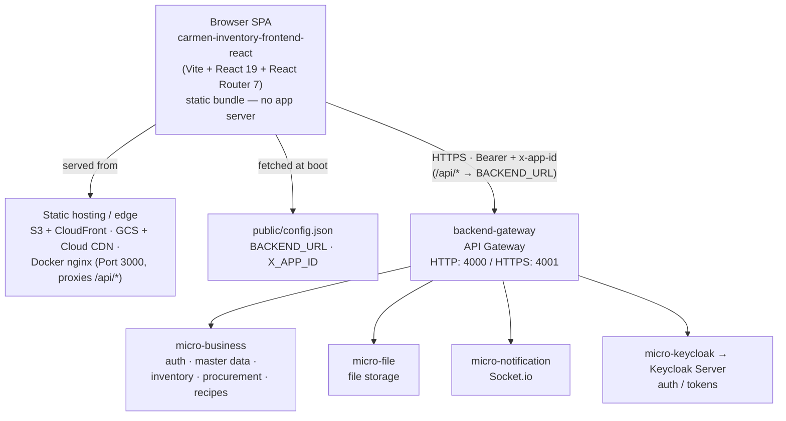

# Architecture

Carmen inventory ERP frontend — a **Vite + React 19 + React Router 7** single-page
app, ported from the Next.js app at `../carmen-inventory-frontend/`. It ships as a
static bundle (S3/CloudFront, GCS/Cloud CDN, or a Docker nginx image); the browser
talks to the backend gateway directly. There is **no application server** of our own.

> This document describes how the app is wired together. For module-by-module detail
> see `docs/modules/`. For the migration spec see
> `docs/superpowers/specs/2026-06-11-carmen-react-ssg-migration-design.md`.

## System context

How this SPA sits in the wider Carmen system. Service names and ports match the
backend's `carmen-turborepo-backend-v2/docs/architecture-system.md`. There is no
frontend application server: the static bundle runs in the browser and calls the
backend gateway directly.



In static-hosting modes (S3/CloudFront, GCS/Cloud CDN) the browser reaches the
gateway directly and the backend **must** send CORS headers; in the Docker nginx
mode the image proxies `/api/*` itself, so no backend CORS is required. See
**Build & deploy** below.

## Boot sequence

`main.tsx` boots in a fixed order before anything renders:

1. **`loadRuntimeConfig()`** — fetches `public/config.json` (`BACKEND_URL`, `X_APP_ID`).
   Backend URLs are never baked into the bundle, so the same artifact deploys to any
   environment by swapping `config.json`.
2. **`refreshTokens()`** — attempts to restore the session from the refresh token in
   `localStorage`. Failure just means "not logged in"; `RequireAuth` redirects to
   `/login`. Doing this *before* first render avoids a login-page flash on reload while
   already authenticated.
3. **render** — mounts `<RouterProvider router={router} />`.

If config loading throws, boot writes a plain-HTML error message into `#root` instead
of rendering a half-initialized app.

## Auth & tokens

The token design has a single, deliberate split (`lib/auth/`):

- **Access token — in memory only** (`token-store.ts`). Never persisted; a page reload
  always re-derives it from the refresh token. This is the security boundary: an XSS
  read of `localStorage` cannot lift the access token.
- **Refresh token — in `localStorage`** (`refresh-token-storage.ts`). This file is the
  single swap point if the app ever moves to a cookie-based refresh model.
- **`auth-api.ts`** — `login()`, `refreshTokens()`, `logout()`. `logout()` clears both
  stores locally *and* posts the refresh token to the backend for server-side
  revocation (whenever either token is present).
- **`RequireAuth`** redirects to `/login` whenever the token store empties. The
  `useLogout` hook routes through `auth-api.logout()` so a logout cannot leave a
  resumable refresh token behind.

## HTTP layer — the proxy rewrite

There is no server to proxy `/api/*`, so `lib/http-client.ts` does it in the browser:

| Request path | Rewritten to |
|---|---|
| `/api/proxy/<rest>` | `${BACKEND_URL}/<rest>` |
| `/api/external/<rest>` | `${BACKEND_URL}/<rest>` (public, unauthenticated) |
| `/api/<rest>` | `${BACKEND_URL}/api/<rest>` (e.g. `/api/auth/*`) |

`httpClient` attaches `Authorization: Bearer <access token>` and `x-app-id` itself, so
`constant/api-endpoints.ts` and every data hook are byte-identical to the source app.

Error handling in `handleClientErrors`:

- **401** → try `refreshTokens()` once; on success the *retried* request is re-run
  through the handler (a second 401 clears the session, 403/429 are normalized) rather
  than returned raw. A `"permission"` message is treated as 403.
- **403** → dispatch a `permission-denied` event + throw `ApiError(FORBIDDEN)`.
- **429** → throw `ApiError(RATE_LIMITED, …, retryable)` with `retryAfter`.
- **`/api/external/*`** → auth interception is **skipped** entirely; the raw response
  reaches the hook so public pages (price-list links) can show "link expired" instead
  of "session expired".

Note: plain `` / `<a href>` do **not** pass through `httpClient`, so any
backend asset URL must be resolved against `BACKEND_URL` (and, if auth-protected,
fetched as a blob) rather than using an `/api/proxy/...` path.

## Routing

`routes/router.tsx` is a React Router 7 data router (`createBrowserRouter`, 125 lazy
routes). Shape:

```
/ (redirect → /dashboard)
├── /login                         (public)
├── /pl/:url_token                 (public price-list)
└── ProtectedShell  (RequireAuth + app chrome)
    ├── dashboard, profile, profile/setting, notifications   (standalone children)
    └── <section>  (ErrorBoundary: RouteErrorBoundaryAdapter)
        ├── index → section landing
        └── <leaf>, <leaf>/new, <leaf>/:id …
```

Sections: `config`, `procurement`, `inventory-management`, `vendor-management`,
`store-operation`, `operation-plan`, `product-management`, `system-admin`, `report`.

Conventions:

- Pages live at `routes/<section>/<leaf>/page.tsx` and **must** `export const Component`.
- Every section parent carries `RouteErrorBoundaryAdapter` so a thrown error degrades to
  a scoped error panel, not a white screen.
- `[id]` directories are detail routes converted to `useParams` (reference:
  `routes/config/department/[id]/page.tsx`).
- `next/dynamic` became `lazy()` + `<Suspense fallback={null}>` (reference:
  `routes/config/currency/_components/currency-component.tsx`).

## Next.js compatibility layer

The migration kept the source code's import surface and shims it:

| Source import | Shimmed to |
|---|---|
| `next/navigation` | `@/lib/compat/navigation` (`useRouter`, `usePathname`, `useParams`…) |
| `next/link` | `@/lib/compat/link` (default export, `href` prop → react-router `to`) |
| `next-intl` | `use-intl` |

ESLint blocks direct `next*` imports. New code should import `react-router` directly.

## i18n

`use-intl` via `components/i18n-provider.tsx`. Messages are per-locale JSON chunks
(`messages/{en,th}.json`) loaded with `import.meta.glob`; the active locale is persisted
in `localStorage` (`carmen.locale`). If a locale chunk fails to load (e.g. a stale chunk
after a redeploy) the provider falls back to the default-locale chunk rather than
rendering a blank screen. `document.documentElement.lang` tracks the active locale.

## Runtime config

`public/config.json` is fetched at boot (`lib/runtime-config.ts`):

```json
{ "BACKEND_URL": "https://gateway.example.com", "X_APP_ID": "carmen-inventory" }
```

`config.sample.json` is the template. The Docker image rewrites `config.json` from
environment variables in its entrypoint. Never hardcode backend URLs in the bundle.

## Build & deploy

- `bun run build` → `tsc` + `vite build` → `dist/`.
- **S3/CloudFront** and **GCS/Cloud CDN**: static hosting; the backend **must** send CORS
  headers (the browser calls it directly). `scripts/deploy-{s3,gcs}.sh`.
- **Docker (nginx)**: `scripts/deploy-docker.sh` builds an image whose nginx proxies
  `/api/*` to the backend itself, so **no backend CORS is required** in this mode. The
  entrypoint also materializes `config.json` from env vars.
- SPA fallback: all unknown paths serve `index.html`. A consequence — a request to a
  non-existent `/api/...` path on static hosting returns `index.html` with HTTP 200, so
  fetches must guard on `Content-Type`/`res.ok` rather than trusting status alone.

See `docs/deploy.md` for the full deploy runbook.

## Testing

Vitest (`bun test:run`). Co-located `__tests__/` and `*.test.ts(x)` files; the suite
covers the http layer, auth, lib utilities, schemas, and selected hooks/components.
`tsc --noEmit` + `bun run lint` (ESLint, including the `next*`-import guard) round out
the gate.

## Known deltas from the source app

- `playground` (dev-only) is intentionally **not** ported; `/` redirects to `/dashboard`.
- `/api/time` (a Next route) → `use-server-time` is stubbed to client time.
- Exchange-rate live rates need a backend endpoint (`GET /api/exchange-rate?base=XXX`);
  the panel degrades gracefully until then.
- `app/` was removed (2026-06-12); `routes/` is the single home for all pages.
