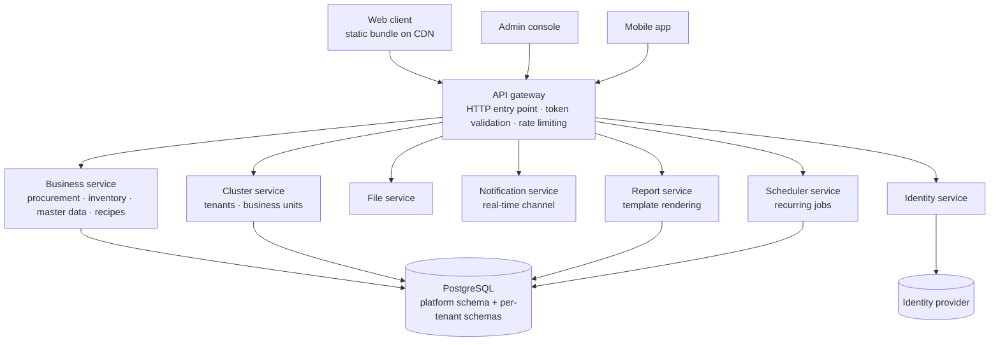

# Carmen — Technology Overview

August 2026 · Prepared for prospective investors

> Thai edition: [`carmen-technology-overview.th.md`](carmen-technology-overview.th.md)
> Both editions carry the same content — a change to one must be made in the other.

---

## 1. Executive summary

Carmen is a supply-chain ERP for hotel and restaurant operations. It covers the full
path from a purchase request raised in a kitchen, through approval and ordering, to
goods received and posted into the stock ledger — across every property in a group.

Five things define the technical position:

- **Multi-tenant by construction.** A shared platform schema holds identity, roles and
  subscriptions. Each business unit's operational data lives in its own database schema,
  so isolation is structural rather than a condition appended to every query.
- **Approval flows are configured, not coded.** A new property is set up in the product:
  stages, approvers, service-level targets, document rules and external-system
  connections are all editable by an administrator.
- **No application server of our own on the web tier.** The web client is a static
  bundle served from a CDN and talks to the API gateway directly, so the tier that every
  user touches has no servers to scale or pay for.
- **Bilingual in the product, not bolted on.** English and Thai are first-class; the
  interface switches language without a redeploy.
- **Deployable as SaaS or inside a customer's own data centre** without forking the
  product — a hard requirement for larger hotel groups.

## 2. Product surface

| Area | What it covers |
| --- | --- |
| Procurement | Purchase requests (and templates), purchase orders, goods received notes, credit notes, an approval inbox |
| Inventory | Physical counts, spot checks, adjustments, the transaction ledger, period end |
| Store operations | Store requisitions, wastage reporting, stock replenishment |
| Vendors | Vendor master, price lists, price-list templates, requests for pricing |
| Products & recipes | Product master with categories, recipes with ingredient breakdown, cuisines, equipment |
| Reporting | Report catalogue, scheduled delivery, run history |
| Administration | Users, roles, workflow designer, running codes, notification templates, print forms, external interfaces, activity monitoring |

Every operational document carries an activity trail recording who did what and when.

## 3. System architecture

| Component | Responsibility |
| --- | --- |
| API gateway | Single HTTP entry point; validates tokens, applies rate limits, translates requests onto an internal message-passing transport, serves the API documentation |
| Business service | The domain: procurement, inventory movement, master data, recipes, activity logging |
| Cluster service | Tenant and business-unit registry, licensing and entitlements |
| File service | Document and image storage |
| Notification service | Real-time push over a persistent socket |
| Identity service | Wraps the identity provider; issues and validates tokens, maps roles |
| Report service | Renders report templates; isolated so heavy rendering never competes with the API tier |
| Scheduler service | Recurring jobs — scheduled reports, notifications, housekeeping |

## 4. Multi-tenancy and the data model

Carmen separates two kinds of data:

- **Platform schema (shared)** — users, clusters, business units, roles, permissions,
  subscriptions. One copy, serving every tenant.
- **Tenant schema (one per business unit)** — products, inventory, procurement
  documents, recipes, vendors, locations.

The hierarchy is *cluster → business unit*. A hotel group is a cluster; each property is
a business unit with its own schema. A user is granted access per business unit, and
permissions are scoped to that boundary.

What the separation buys:

- **Isolation is structural.** Cross-tenant leakage would require a schema-level mistake,
  not a forgotten filter in a query.
- **Per-tenant operations.** A single property can be backed up, restored, migrated or
  moved to different infrastructure without touching anyone else.
- **Group-level reporting without pooling.** Consolidated views read across a cluster's
  schemas under the caller's entitlements.
- **A single-tenant deployment is the same product**, not a fork.

## 5. Identity, authorization and security

- **Identity is delegated.** An identity provider issues tokens; the API gateway validates
  them on every request. Carmen never stores a password.
- **Permissions are scoped to cluster and business unit.** A role grants what a user may
  do; the scope decides where.
- **The access token is held in memory only** in the web client. It is never written to
  disk, so reading browser storage does not yield a usable credential. The long-lived
  refresh token is the only stored credential, and revoking it is a server-side operation
  — signing out invalidates the session for real, not just locally.
- **Integration secrets are encrypted at rest.** Credentials for accounting, POS and
  property-management connections are stored encrypted and are never returned to the
  browser once saved; an administrator can replace a secret but not read it back.
- **Every business document carries an activity trail** — who created, edited, approved,
  rejected, sent back, voided or printed it, and when. The trail is written by the server,
  not the client.

## 6. Technology choices and the reasoning

**TypeScript along the whole path from database to screen.** The API contract, the
services behind it and the web client share one type system. A change to a document shape
surfaces at compile time in every consumer rather than at runtime in front of a user.
For a product whose value lies in getting document handling exactly right, that is the
cheapest place to catch a mistake.

**Go where the work is heavy and bursty.** Report rendering and scheduled jobs run as
separate Go services. Both are CPU-bound and arrive in bursts — a month-end report run
should never slow down a kitchen raising a requisition. Separating them by process, and
by language chosen for throughput, makes that guarantee structural rather than a matter
of tuning.

**A static web client rather than a rendering server.** The interface is an application
the browser runs, not pages a server assembles per request. This removes an entire tier
from the operational and cost picture and makes the same build artefact deployable to a
CDN, a customer's own web server, or a container.

**One entry point, not many.** Every client — web, admin console, mobile — reaches the
system through a single API gateway that validates the token, applies rate limits and
routes onward. Cross-cutting policy lives in one place rather than being reimplemented in
each service.

Two languages, each where it pays for itself. Nothing is in the stack because it is new.

## 7. Scalability and operational posture

- **The web tier does not scale — it is files.** Static assets on a CDN absorb user growth
  without additional servers.
- **The API gateway holds no session state**, so it scales horizontally behind a load
  balancer.
- **Scheduled jobs coordinate through a distributed lock**, so multiple replicas of the
  scheduler can run safely: exactly one instance executes each job.
- **Report generation is isolated** in its own service and can be scaled independently of
  the API tier.
- **Rate limiting and token validation happen at the gateway**, so abusive traffic is
  rejected before it reaches a domain service or the database.
- **Per-tenant schemas give a natural sharding boundary** if a large group ever needs
  dedicated database capacity.

## 8. Deployment models

| Model | What it looks like | What it unlocks |
| --- | --- | --- |
| Multi-tenant SaaS | Shared infrastructure, per-tenant schemas | Lowest cost to serve; the default for independent hotels and small groups |
| Single-tenant server | The same stack on infrastructure dedicated to one customer | Groups with data-residency or procurement rules that forbid shared infrastructure |
| Container image | Self-contained image that proxies API traffic itself | Runs inside a customer's existing orchestration with no cross-origin configuration required |
| Static hosting + CDN | The web client on object storage behind a CDN | Fast global delivery of the interface, independent of where the API runs |

The point is that these are the same product with different configuration. Several large
hotel groups require systems that hold operational data to run inside their own
infrastructure; a vendor that can only offer shared SaaS is excluded from those
conversations before the product is evaluated.

## 9. Engineering practice and quality

- **TypeScript strict mode throughout.** Implicit `any` and unchecked nulls are compile
  errors, not review comments.
- **Features start as a written design document.** The web repository alone carries 41
  design specifications, each written and agreed before implementation began.
- **Every change passes a gate before it merges** — type check, lint, and the test suite.
- **The test suites are substantial**: 875 backend test files and 112 web test files at
  the time of writing.
- **The web application is 1,363 TypeScript files across 132 routes**, organised so that
  each route's components, hooks and tests sit together rather than being scattered by
  technical layer.
- **Changes are reviewed before merge**, and the activity instrumentation in the product
  means production behaviour can be reconstructed rather than guessed at.

These are counts of artefacts, verifiable by inspection. We do not quote pass rates.

## 10. Extensibility and integrations

- **External systems connect through a per-category, per-brand framework.** Accounting,
  point-of-sale and property-management systems are separate categories; each brand within
  a category has its own configuration form, so adding a new brand is a configuration and
  mapping exercise rather than a change to the core.
- **Report templates are data, not code.** Templates are stored as editable definitions
  and rendered by the report service, so a new or amended report does not require a
  deployment.
- **Notification templates are configurable per business unit**, so each property can
  phrase and route its own alerts.
- **Document numbering, print forms and operational defaults are per business unit**,
  which is what makes onboarding a new property a setup task.

## 11. Technical roadmap and known constraints

Stated plainly, because the gaps matter more than the highlights:

- **A dedicated edge tier is designed but not yet deployed.** Today the API gateway
  carries token validation and rate limiting itself. Moving that policy — along with TLS
  termination, cross-origin rules and distributed tracing — out to a separate edge is
  planned; it is the right shape, but it is not in production, and nothing in this
  document depends on it.
- **Cross-origin configuration for public-cloud hosting is being finalised.** The
  container deployment is unaffected because it proxies API traffic itself; the
  static-hosting path needs the API side completed before general availability on public
  cloud.
- **Quantity precision is being aligned end to end.** The storage layer holds fractional
  quantities correctly; the API contract is being brought into line so that fractional
  units are accepted uniformly across every document type.
- **Consolidated group dashboards are being reworked.** Single-property operations are
  complete; the cross-property analytics layer is the current focus.
- **Report rendering is deliberately a separate service.** That isolation is right, but it
  adds an operational component to run and monitor, which is a real cost in
  single-tenant deployments.
- **The mobile application covers a subset of the web surface** — the tasks that happen
  away from a desk, chiefly counting and receiving. Extending it is a roadmap item, not a
  completed one.

## 12. Appendix — stack by layer

| Layer | Technology |
| --- | --- |
| Web client | Vite · React 19 with the React compiler · TypeScript 5 (strict) · React Router 7 with lazy data routes · Tailwind CSS 4 · TanStack Query, Table and Virtual · react-hook-form with Zod validation · node-graph editor for workflow design · Vitest with Testing Library |
| Admin console | React · TypeScript · CodeMirror 6 for report-template editing |
| Mobile | React Native via Expo · secure credential storage · device biometrics · camera capture |
| API and services | NestJS on TypeScript · HTTP entry point translating onto an internal message-passing transport · generated API documentation |
| Report and scheduling | Go · Gin · GORM · template rendering · distributed job scheduling with a lock store |
| Data | PostgreSQL — shared platform schema plus one schema per business unit · Prisma schema management |
| Identity | Keycloak · role-based access scoped to cluster and business unit |
| Build and delivery | Bun · Turborepo · containerised services · object storage and CDN for the web client |
