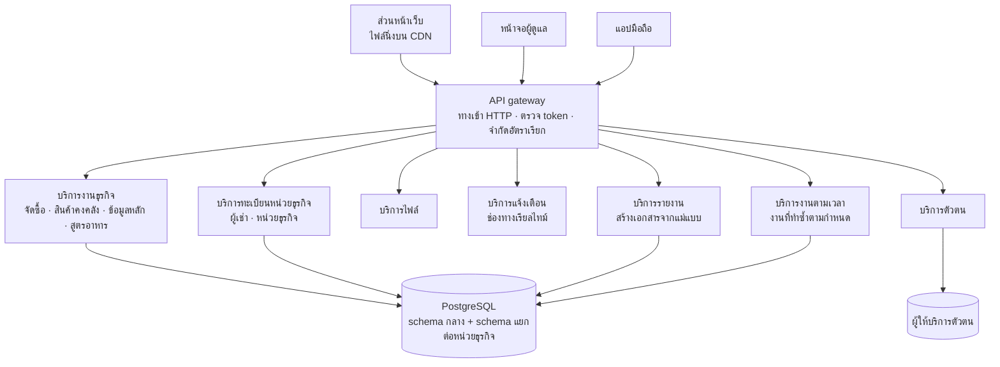

# Carmen — ภาพรวมเทคโนโลยี

สิงหาคม 2569 · จัดทำสำหรับผู้ลงทุน

> ฉบับภาษาอังกฤษ: [`carmen-technology-overview.md`](carmen-technology-overview.md)
> เนื้อหาตรงกันทั้งสองฉบับ แก้ที่ฉบับไหนต้องแก้อีกฉบับด้วยเสมอ

---

## 1. บทสรุปผู้บริหาร

Carmen คือระบบ ERP จัดการซัพพลายเชนสำหรับโรงแรมและร้านอาหาร ครอบคลุมเส้นทางเต็ม
ตั้งแต่ใบขอซื้อที่ตั้งขึ้นในครัว ผ่านการอนุมัติและการสั่งซื้อ จนถึงการรับของและการลงบัญชี
สต๊อก ครบทุกสาขาในเครือ

จุดยืนทางเทคนิคมีห้าข้อ

- **รองรับหลายผู้เช่าตั้งแต่โครงสร้าง** schema กลางเก็บตัวตน บทบาท และการสมัครใช้งาน
  ส่วนข้อมูลปฏิบัติการของแต่ละหน่วยธุรกิจอยู่ใน schema ของตัวเอง การแยกข้อมูลจึงเป็น
  เรื่องของโครงสร้าง ไม่ใช่เงื่อนไขที่ต้องเติมท้ายทุกคำสั่งค้นหา
- **สายอนุมัติเป็นการตั้งค่า ไม่ใช่การเขียนโค้ด** การเปิดสาขาใหม่ทำในตัวโปรแกรม
  ทั้งขั้นตอน ผู้อนุมัติ เวลาที่กำหนด กฎของเอกสาร และการเชื่อมต่อระบบภายนอก
  ผู้ดูแลระบบแก้ได้เอง
- **ชั้นเว็บไม่มีเซิร์ฟเวอร์แอปของเรา** ส่วนหน้าเป็นไฟล์นิ่งที่ส่งจาก CDN
  และคุยกับ API โดยตรง ชั้นที่ผู้ใช้ทุกคนแตะจึงไม่มีเครื่องให้ต้องขยายหรือจ่ายค่าเช่า
- **สองภาษาอยู่ในตัวผลิตภัณฑ์ ไม่ใช่ของที่แปะทีหลัง** ไทยและอังกฤษเป็นพลเมืองชั้นหนึ่ง
  ทั้งคู่ สลับภาษาได้โดยไม่ต้อง deploy ใหม่
- **ลงได้ทั้งแบบ SaaS และในศูนย์ข้อมูลของลูกค้าเอง** โดยไม่ต้องแยกสายผลิตภัณฑ์
  ซึ่งเป็นข้อกำหนดที่เครือโรงแรมขนาดใหญ่หลายรายบังคับ

## 2. ขอบเขตของผลิตภัณฑ์

| ส่วนงาน | ครอบคลุมอะไร |
| --- | --- |
| จัดซื้อจัดจ้าง | ใบขอซื้อและแม่แบบ ใบสั่งซื้อ ใบรับสินค้า ใบลดหนี้ กล่องงานรออนุมัติ |
| สินค้าคงคลัง | การนับสต๊อกเต็มรอบ การสุ่มตรวจ การปรับปรุงยอด บัญชีเคลื่อนไหว การปิดงวด |
| งานร้านค้า | ใบเบิกของ การรายงานของเสีย การเติมสต๊อก |
| ผู้ขาย | ทะเบียนผู้ขาย รายการราคาและแม่แบบ การขอใบเสนอราคา |
| สินค้าและสูตรอาหาร | ทะเบียนสินค้าและหมวดหมู่ สูตรอาหารพร้อมรายการวัตถุดิบ ประเภทอาหาร อุปกรณ์ |
| รายงาน | ทะเบียนรายงาน การส่งตามกำหนดเวลา ประวัติการเรียกใช้ |
| งานผู้ดูแลระบบ | ผู้ใช้ บทบาท ตัวออกแบบสายอนุมัติ รหัสเอกสาร แม่แบบการแจ้งเตือน แบบฟอร์มพิมพ์ การต่อระบบภายนอก การเฝ้าดูกิจกรรม |

เอกสารปฏิบัติการทุกใบมีร่องรอยกิจกรรมว่าใครทำอะไรเมื่อไร

## 3. สถาปัตยกรรมระบบ

| ส่วนประกอบ | หน้าที่ |
| --- | --- |
| API gateway | ทางเข้า HTTP เดียว ตรวจ token จำกัดอัตราเรียก แปลงคำขอลงการสื่อสารภายในแบบส่งข้อความ และให้บริการเอกสาร API |
| บริการงานธุรกิจ | งานหลัก จัดซื้อ การเคลื่อนไหวสินค้า ข้อมูลหลัก สูตรอาหาร การบันทึกกิจกรรม |
| บริการทะเบียนหน่วยธุรกิจ | ทะเบียนผู้เช่าและหน่วยธุรกิจ สิทธิ์การใช้งานตามสัญญา |
| บริการไฟล์ | ที่เก็บเอกสารและรูปภาพ |
| บริการแจ้งเตือน | การแจ้งเตือนแบบเรียลไทม์ผ่านการเชื่อมต่อค้าง |
| บริการตัวตน | ห่อผู้ให้บริการตัวตน ออกและตรวจสอบ token แปลงบทบาท |
| บริการรายงาน | สร้างเอกสารจากแม่แบบ แยกออกมาเพื่อไม่ให้งานหนักไปแย่งทรัพยากรของชั้น API |
| บริการงานตามเวลา | งานที่ทำซ้ำ รายงานตามกำหนด การแจ้งเตือน งานดูแลระบบ |

## 4. การรองรับหลายผู้เช่าและแบบจำลองข้อมูล

Carmen แยกข้อมูลเป็นสองประเภท

- **schema กลาง (ใช้ร่วมกัน)** ผู้ใช้ กลุ่มธุรกิจ หน่วยธุรกิจ บทบาท สิทธิ์ การสมัครใช้งาน
  มีชุดเดียว ให้บริการทุกผู้เช่า
- **schema ของผู้เช่า (หนึ่งชุดต่อหนึ่งหน่วยธุรกิจ)** สินค้า สินค้าคงคลัง เอกสารจัดซื้อ
  สูตรอาหาร ผู้ขาย สถานที่

ลำดับชั้นคือ *กลุ่มธุรกิจ → หน่วยธุรกิจ* เครือโรงแรมหนึ่งเครือคือกลุ่มธุรกิจ แต่ละสาขาคือ
หน่วยธุรกิจที่มี schema ของตัวเอง ผู้ใช้ได้รับสิทธิ์เป็นรายหน่วยธุรกิจ และสิทธิ์ทั้งหมด
ถูกจำกัดอยู่ในขอบเขตนั้น

สิ่งที่การแยกแบบนี้ให้

- **การแยกข้อมูลอยู่ในโครงสร้าง** ข้อมูลจะรั่วข้ามผู้เช่าได้ต้องพลาดถึงระดับ schema
  ไม่ใช่แค่ลืมใส่เงื่อนไขในคำสั่งค้นหา
- **จัดการรายผู้เช่าได้** สาขาเดียวสำรอง กู้คืน ย้าย หรือโยกไปโครงสร้างพื้นฐานอื่นได้
  โดยไม่กระทบใคร
- **รายงานระดับเครือทำได้โดยไม่ต้องกองข้อมูลรวมกัน** มุมมองรวมอ่านข้าม schema ในกลุ่ม
  ธุรกิจตามสิทธิ์ของผู้เรียก
- **การติดตั้งแบบผู้เช่าเดียวคือผลิตภัณฑ์ตัวเดียวกัน** ไม่ใช่การแยกสายพัฒนา

## 5. ตัวตน สิทธิ์ และความปลอดภัย

- **การยืนยันตัวตนมอบให้ผู้ให้บริการเฉพาะทาง** ผู้ให้บริการเป็นคนออก token
  และ API gateway ตรวจสอบทุกคำขอ Carmen ไม่เคยเก็บรหัสผ่านเอง
- **สิทธิ์ผูกกับกลุ่มธุรกิจและหน่วยธุรกิจ** บทบาทกำหนดว่าผู้ใช้ทำอะไรได้
  ขอบเขตกำหนดว่าทำได้ที่ไหน
- **access token อยู่ในหน่วยความจำเท่านั้น** ในส่วนหน้าเว็บ ไม่เคยถูกเขียนลงดิสก์
  การอ่านที่เก็บข้อมูลของเบราว์เซอร์จึงไม่ได้ข้อมูลรับรองที่ใช้ต่อได้
  refresh token ที่อายุยาวกว่าเป็นข้อมูลรับรองชิ้นเดียวที่ถูกเก็บ
  และการเพิกถอนทำที่ฝั่งเซิร์ฟเวอร์ การออกจากระบบจึงจบเซสชันจริง ไม่ใช่แค่ลบฝั่งเครื่อง
- **ความลับของการเชื่อมต่อถูกเข้ารหัสตอนพัก** ข้อมูลรับรองสำหรับต่อระบบบัญชี
  ระบบขายหน้าร้าน และระบบบริหารโรงแรม ถูกเข้ารหัสเก็บไว้ และไม่เคยถูกส่งกลับมาที่
  เบราว์เซอร์อีกหลังบันทึกแล้ว ผู้ดูแลเปลี่ยนค่าใหม่ได้ แต่อ่านค่าเดิมไม่ได้
- **เอกสารธุรกิจทุกใบมีร่องรอยกิจกรรม** ว่าใครสร้าง แก้ไข อนุมัติ ปฏิเสธ ส่งกลับ ยกเลิก
  หรือพิมพ์ และเมื่อไร ร่องรอยนี้ฝั่งเซิร์ฟเวอร์เป็นคนเขียน ไม่ใช่ฝั่งเครื่องผู้ใช้

## 6. เหตุผลเบื้องหลังการเลือกเทคโนโลยี

**TypeScript ตลอดสายตั้งแต่ฐานข้อมูลถึงหน้าจอ** สัญญาของ API บริการที่อยู่หลังมัน
และส่วนหน้าเว็บ ใช้ระบบชนิดข้อมูลชุดเดียวกัน การเปลี่ยนโครงสร้างเอกสารจะแสดงผลตอน
คอมไพล์ในทุกที่ที่ใช้งาน แทนที่จะไปพังตอนรันต่อหน้าผู้ใช้ สำหรับผลิตภัณฑ์ที่คุณค่าอยู่ที่
การจัดการเอกสารให้ถูกต้อง นี่คือจุดที่ดักความผิดพลาดได้ถูกที่สุด

**Go ตรงที่งานหนักและมาเป็นช่วง** การสร้างรายงานและงานตามเวลาแยกเป็นบริการ Go ต่างหาก
ทั้งคู่กินซีพียูและมาเป็นก้อน การรันรายงานปิดงวดต้องไม่ทำให้ครัวที่กำลังตั้งใบเบิกช้าลง
การแยกด้วยกระบวนการ และด้วยภาษาที่เลือกมาเพื่อรับโหลด ทำให้ข้อรับประกันนั้นเป็นเรื่อง
โครงสร้าง ไม่ใช่เรื่องการปรับจูน

**ส่วนหน้าเป็นไฟล์นิ่ง ไม่ใช่เซิร์ฟเวอร์ที่ประกอบหน้า** หน้าจอคือโปรแกรมที่เบราว์เซอร์รัน
ไม่ใช่หน้าที่เซิร์ฟเวอร์ประกอบทีละคำขอ วิธีนี้ตัดทั้งชั้นออกจากภาระการดูแลและต้นทุน
และทำให้ผลลัพธ์ก้อนเดียวกันเอาไปวางได้ทั้งบน CDN บนเว็บเซิร์ฟเวอร์ของลูกค้า
หรือในคอนเทนเนอร์

**ทางเข้าเดียว ไม่ใช่หลายทาง** ทุกฝั่งผู้ใช้ ทั้งเว็บ หน้าจอผู้ดูแล และแอปมือถือ
เข้าระบบผ่าน API gateway ตัวเดียวที่ตรวจ token จำกัดอัตราเรียก และกระจายงานต่อ
นโยบายที่ใช้ร่วมกันจึงอยู่ที่เดียว แทนที่จะต้องเขียนซ้ำในทุกบริการ

สองภาษา แต่ละภาษาอยู่ตรงที่มันคุ้ม ไม่มีอะไรอยู่ในกองนี้เพราะมันใหม่

## 7. การขยายตัวและการดูแลระบบ

- **ชั้นเว็บไม่ต้องขยาย เพราะมันคือไฟล์** ไฟล์นิ่งบน CDN รับผู้ใช้ที่เพิ่มขึ้นได้
  โดยไม่ต้องเพิ่มเครื่อง
- **API gateway ไม่ถือสถานะ** จึงขยายแนวนอนหลังตัวกระจายโหลดได้
- **งานตามเวลาประสานกันผ่านการล็อกแบบกระจาย** จึงรันหลายชุดพร้อมกันได้อย่างปลอดภัย
  งานหนึ่งงานมีเพียงชุดเดียวที่ทำจริง
- **การสร้างรายงานแยกเป็นบริการของตัวเอง** และขยายได้อิสระจากชั้น API
- **การจำกัดอัตราเรียกและการตรวจ token เกิดที่ gateway** ทราฟฟิกที่ผิดปกติจึงถูกปฏิเสธ
  ก่อนจะไปถึงบริการงานธุรกิจหรือฐานข้อมูล
- **schema แยกต่อผู้เช่าเป็นเส้นแบ่งที่พร้อมอยู่แล้ว** ถ้าเครือใหญ่รายไหนต้องการ
  ฐานข้อมูลเฉพาะของตัวเอง

## 8. รูปแบบการติดตั้ง

| รูปแบบ | ลักษณะ | เปิดประตูอะไรให้ |
| --- | --- | --- |
| SaaS หลายผู้เช่า | โครงสร้างพื้นฐานใช้ร่วมกัน แยก schema ต่อผู้เช่า | ต้นทุนให้บริการต่ำที่สุด เป็นค่าตั้งต้นสำหรับโรงแรมเดี่ยวและเครือขนาดเล็ก |
| เซิร์ฟเวอร์ผู้เช่าเดียว | ระบบชุดเดิมบนโครงสร้างที่จัดไว้ให้ลูกค้ารายเดียว | เครือที่มีข้อกำหนดเรื่องที่อยู่ของข้อมูลหรือระเบียบจัดซื้อที่ห้ามใช้โครงสร้างร่วม |
| Docker image | ทำงานได้ในตัว มี proxy ให้ทราฟฟิก API เอง | รันในระบบจัดการคอนเทนเนอร์ที่ลูกค้ามีอยู่ ไม่ต้องตั้งค่าข้ามโดเมน |
| ไฟล์นิ่งบน CDN | ส่วนหน้าเว็บวางบนที่เก็บไฟล์หลัง CDN | ส่งหน้าจอได้เร็วทั่วโลก ไม่ขึ้นกับว่า API อยู่ที่ไหน |

ประเด็นคือทั้งสี่แบบเป็นผลิตภัณฑ์ตัวเดียวกัน ต่างกันแค่การตั้งค่า เครือโรงแรมขนาดใหญ่
หลายรายกำหนดว่าระบบที่เก็บข้อมูลปฏิบัติการต้องรันในโครงสร้างของตัวเอง ผู้ขายที่เสนอ
ได้แค่ SaaS ใช้ร่วมกัน จะถูกตัดออกตั้งแต่ก่อนได้เข้าไปให้ประเมินตัวโปรแกรม

## 9. วิธีทำงานและคุณภาพงานวิศวกรรม

- **ใช้ TypeScript โหมดเข้มงวดตลอดสาย** ชนิดข้อมูลที่ไม่ระบุและค่าที่อาจเป็นว่าง
  เป็นข้อผิดพลาดตอนคอมไพล์ ไม่ใช่ข้อคิดเห็นตอนรีวิว
- **ทุกฟีเจอร์เริ่มจากเอกสารออกแบบที่เขียนไว้ก่อน** เฉพาะรีโปฝั่งเว็บมีเอกสารออกแบบ
  41 ฉบับ แต่ละฉบับเขียนและตกลงกันก่อนลงมือทำ
- **ทุกการเปลี่ยนแปลงต้องผ่านด่านก่อนรวมเข้าสายหลัก** ทั้งการตรวจชนิดข้อมูล
  การตรวจสไตล์ และชุดทดสอบ
- **ชุดทดสอบมีขนาดจริงจัง** ฝั่งหลังบ้าน 875 ไฟล์ ฝั่งเว็บ 112 ไฟล์ ณ เวลาที่เขียน
- **แอปเว็บมีไฟล์ TypeScript 1,363 ไฟล์ ครอบคลุม 132 เส้นทางหน้าจอ** จัดวางให้
  ส่วนประกอบ hook และไฟล์ทดสอบของแต่ละหน้าอยู่ด้วยกัน แทนที่จะกระจายตามชั้นเทคนิค
- **ทุกการเปลี่ยนแปลงผ่านการรีวิวก่อนรวม** และเครื่องมือบันทึกกิจกรรมในตัวผลิตภัณฑ์
  ทำให้ย้อนดูพฤติกรรมจริงบนระบบได้ แทนที่จะต้องเดา

ตัวเลขเหล่านี้เป็นจำนวนสิ่งที่นับได้และตรวจสอบได้ด้วยการเปิดดู เราไม่อ้างอัตราการผ่าน
การทดสอบ

## 10. การต่อขยายและการเชื่อมต่อระบบภายนอก

- **ระบบภายนอกเชื่อมผ่านโครงที่แยกตามหมวดและยี่ห้อ** ระบบบัญชี ระบบขายหน้าร้าน
  และระบบบริหารโรงแรมเป็นคนละหมวด และแต่ละยี่ห้อในหมวดมีฟอร์มตั้งค่าของตัวเอง
  การเพิ่มยี่ห้อใหม่จึงเป็นงานตั้งค่าและวางแผนที่ ไม่ใช่งานแก้แกนกลาง
- **แม่แบบรายงานเป็นข้อมูล ไม่ใช่โค้ด** เก็บเป็นนิยามที่แก้ไขได้และให้บริการรายงาน
  เป็นตัวสร้างเอกสาร รายงานใหม่หรือรายงานที่แก้ไขจึงไม่ต้อง deploy
- **แม่แบบการแจ้งเตือนตั้งค่าได้ต่อหน่วยธุรกิจ** แต่ละสาขาจึงกำหนดถ้อยคำและปลายทาง
  ของการแจ้งเตือนเองได้
- **รหัสเอกสาร แบบฟอร์มพิมพ์ และค่าตั้งต้นในการทำงานแยกตามหน่วยธุรกิจ**
  ซึ่งเป็นเหตุผลที่ทำให้การเปิดสาขาใหม่เป็นงานตั้งค่า

## 11. แผนงานทางเทคนิคและข้อจำกัดที่รู้อยู่

เขียนตรง ๆ เพราะช่องว่างสำคัญกว่าจุดเด่น

- **ชั้น edge เฉพาะทางออกแบบไว้แล้ว แต่ยังไม่ได้ใช้งานจริง** ตอนนี้ API gateway
  เป็นตัวตรวจ token และจำกัดอัตราเรียกเอง การย้ายนโยบายเหล่านั้น พร้อมกับการจบ TLS
  กฎข้ามโดเมน และการติดตามคำขอแบบกระจาย ออกไปอยู่ที่ชั้น edge ต่างหาก เป็นแผนที่วางไว้
  รูปแบบถูกต้อง แต่ยังไม่ได้อยู่บนระบบจริง และไม่มีข้อความใดในเอกสารนี้ที่ขึ้นอยู่กับมัน
- **การตั้งค่าข้ามโดเมนสำหรับโฮสต์บนคลาวด์สาธารณะกำลังทำให้จบ** การติดตั้งแบบ
  คอนเทนเนอร์ไม่ได้รับผลกระทบเพราะมี proxy ให้ทราฟฟิก API เอง ส่วนเส้นทางที่วางไฟล์นิ่ง
  ต้องรอฝั่ง API เสร็จก่อนจะเปิดใช้ทั่วไปบนคลาวด์สาธารณะ
- **ความละเอียดของหน่วยนับกำลังทำให้ตรงกันตลอดสาย** ชั้นจัดเก็บรองรับจำนวนที่มีทศนิยม
  ได้ถูกต้องแล้ว ส่วนสัญญาของ API กำลังปรับให้รับจำนวนที่มีทศนิยมได้เหมือนกัน
  ในทุกชนิดเอกสาร
- **แดชบอร์ดรวมระดับเครือกำลังทำใหม่** งานระดับสาขาเดียวเสร็จสมบูรณ์แล้ว
  ส่วนชั้นวิเคราะห์ข้ามสาขาเป็นงานที่กำลังทำอยู่
- **การสร้างรายงานแยกเป็นบริการต่างหากโดยตั้งใจ** การแยกนั้นถูกต้อง แต่ก็เพิ่ม
  ส่วนประกอบที่ต้องรันและเฝ้าดู ซึ่งเป็นต้นทุนจริงในการติดตั้งแบบผู้เช่าเดียว
- **แอปมือถือครอบคลุมงานเพียงบางส่วนของฝั่งเว็บ** เน้นงานที่เกิดนอกโต๊ะทำงาน
  โดยเฉพาะการนับสต๊อกและการรับของ การขยายให้ครบเป็นงานในแผน ไม่ใช่งานที่ทำเสร็จแล้ว

## 12. ภาคผนวก — เทคโนโลยีแยกตามชั้น

| ชั้น | เทคโนโลยี |
| --- | --- |
| ส่วนหน้าเว็บ | Vite · React 19 พร้อม React compiler · TypeScript 5 โหมดเข้มงวด · React Router 7 แบบโหลดตามต้องการ · Tailwind CSS 4 · TanStack Query, Table และ Virtual · react-hook-form กับ Zod · ตัวแก้ผังแบบโหนดสำหรับออกแบบสายอนุมัติ · Vitest กับ Testing Library |
| หน้าจอผู้ดูแล | React · TypeScript · CodeMirror 6 สำหรับแก้แม่แบบรายงาน |
| แอปมือถือ | React Native ผ่าน Expo · ที่เก็บข้อมูลรับรองแบบปลอดภัย · การยืนยันตัวตนด้วยชีวมิติ · การถ่ายภาพ |
| API และบริการ | NestJS บน TypeScript · ทางเข้า HTTP เดียวที่ตรวจ token และจำกัดอัตราเรียก · การสื่อสารภายในแบบส่งข้อความ · เอกสาร API ที่สร้างอัตโนมัติ |
| รายงานและงานตามเวลา | Go · Gin · GORM · การสร้างเอกสารจากแม่แบบ · การจัดคิวงานแบบกระจายพร้อมที่เก็บล็อก |
| ข้อมูล | PostgreSQL — schema กลางร่วมกัน บวก schema แยกต่อหน่วยธุรกิจ · จัดการ schema ด้วย Prisma |
| ตัวตน | Keycloak · สิทธิ์ตามบทบาท ผูกกับกลุ่มธุรกิจและหน่วยธุรกิจ |
| การสร้างและส่งมอบ | Bun · Turborepo · บริการแบบคอนเทนเนอร์ · ที่เก็บไฟล์และ CDN สำหรับส่วนหน้าเว็บ |
