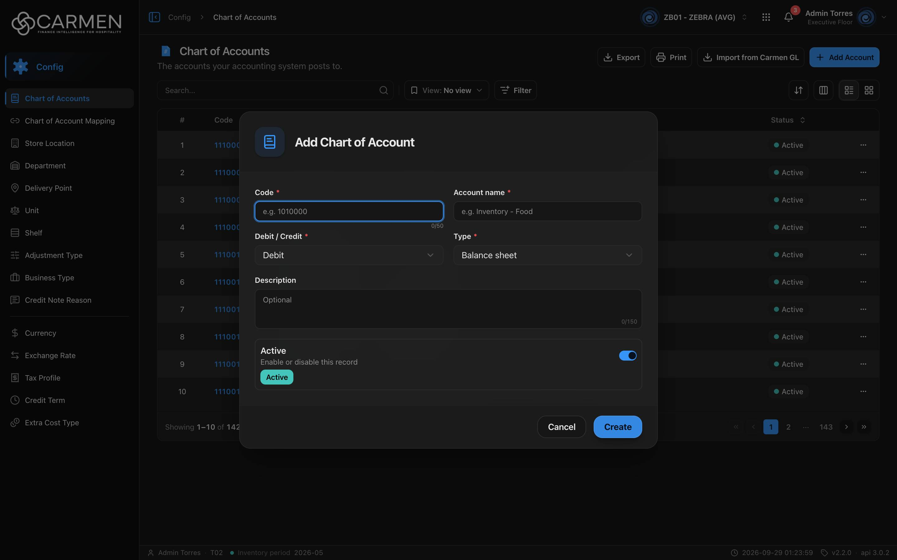

---
**Doc ID:** CB-MODAL-001
**Title:** Add / Edit Chart of Account
**Domain:** All users
**Parent Page(s):** CB-PAGE-002 — Chart of Accounts
**Status:** Draft
**Created:** 2026-09-29
**Last Updated:** 2026-09-29
**Author:** Claude (จากโค้ด + ภาพหน้าจอจริง)
**Parent Flow:** N/A — master data CRUD ไม่มี workflow
---

## 8.2.10.1 Add / Edit Chart of Account

> Dialog ฟอร์มสำหรับสร้างรหัสบัญชีใหม่หรือแก้ไขรหัสบัญชีเดิม เปิดจากหน้า Chart of Accounts (`routes/config/chart-of-accounts/coa-dialog.tsx` ครอบด้วย `ConfigEntityDialog`)

---

### 8.2.10.1.1 Trigger

| Trigger | Source Page | Condition |
|---------|------------|-----------|
| Click **Add Account** | CB-PAGE-002 (Chart of Accounts) | เปิดโหมด Add ถ้า `canWrite = false` จะเด้ง dialog "Subscription Expired" แทน |
| Click ลิงก์ **Code** ของแถว (หรือคลิกการ์ดในโหมด Grid) | CB-PAGE-002 (Chart of Accounts) | เปิดโหมด Edit ถ้า `canWrite = false` จะเปิดเป็น readOnly |

---

### 8.2.10.1.2 Modal Layout



```
[📘 Add Chart of Account]            ← โหมด Edit: "Edit Chart of Account"
────────────────────────────────────────────────
[Code *              ] [Account name *        ]
[e.g. 1010000   0/50 ] [e.g. Inventory - Food ]
[Debit / Credit *  ▾ ] [Type *              ▾ ]
[Debit               ] [Balance sheet         ]
[Description                                   ]
[Optional                               0/150  ]
┌──────────────────────────────────────────────┐
│ Active                                  [●━] │
│ Enable or disable this record                │
│ [Active]                                     │
└──────────────────────────────────────────────┘
────────────────────────────────────────────────
                               [Cancel] [Create]   ← Edit: [Cancel] [Save] / readOnly: [Close]
```

**Modal Size:** Medium — `sm:max-w-2xl` (≈672px) กว้างกว่า dialog config ปกติ (425px) เพราะฟอร์มสองคอลัมน์ บนจอแคบเรียงเป็นคอลัมน์เดียว
**Scrollable:** No — ฟอร์มสั้น ไม่มีส่วนเลื่อน

---

### 8.2.10.1.3 Search & Filter

N/A — dialog ฟอร์ม ไม่มีการค้นหา

---

### 8.2.10.1.4 Content Grid Columns

N/A — ไม่มีตาราง ฟิลด์ของฟอร์มมีดังนี้

| Field | Mandatory | Description | Business Logic / Remark |
|-------|-----------|-------------|--------------------------|
| Code | Y | รหัสบัญชี (`code`) | Cannot be blank (zod `min(1)`) ยาวสุด 50 ตัวอักษร (HTML `maxLength` พร้อมตัวนับ 0/50 ไม่มีใน zod) placeholder "e.g. 1010000" แก้ได้ทั้งในโหมด Add และ Edit ไม่มีการตรวจรหัสซ้ำฝั่ง FE |
| Account name | Y | ชื่อบัญชี (`description_1`) | Cannot be blank ยาวสุด 150 ตัวอักษร (HTML) placeholder "e.g. Inventory - Food" ข้อความ error คือ **"Description is required"** (schema ใช้ชื่อฟิลด์ `description` ไม่ใช่ "Account name" — `coa-form-schema.ts:12-14`) |
| Debit / Credit | Y | ด้านปกติของบัญชี (`nature`) | dropdown: Debit, Credit Default: **Debit** |
| Type | Y | ประเภทบัญชี (`type`) | dropdown: Header (not postable), Balance sheet, Income statement, Statistic Default: **Balance sheet** |
| Description | N | คำอธิบายบรรทัดที่สอง (`description_2`) | textarea 2 แถว ยาวสุด 150 ตัวอักษร placeholder "Optional" ถ้าเว้นว่างจะส่งเป็น `null` |
| Active | N | สถานะ (`is_active`) | สวิตช์ "Enable or disable this record" Default: เปิด (Active) |

**Selection behaviour:** N/A

---

### 8.2.10.1.5 Action Buttons

| Button | Color / Type | Description | Behaviour |
|--------|-------------|-------------|-----------|
| Create (โหมด Add) | Primary (Blue) | สร้างรหัสบัญชี | validate → `POST` สำเร็จ → toast **"Chart of Account created successfully"** ปิด dialog แล้ว list รีเฟรช ระหว่างส่งข้อความเป็น "Creating..." และปุ่มทั้งหมด disabled |
| Save (โหมด Edit) | Primary (Blue) | บันทึกการแก้ไข | validate → `PATCH` พร้อม `doc_version` สำเร็จ → toast **"Chart of Account updated successfully"** ปิด dialog ระหว่างส่งเป็น "Saving..." |
| Cancel | Secondary (White) | ปิดโดยไม่บันทึก | ไม่มีการยืนยัน ค่าที่แก้หายทันที disabled ระหว่างส่ง |
| Close (โหมด readOnly) | Secondary (White) | ปิด | แทน Cancel เมื่อ readOnly และไม่มีปุ่ม Save |

---

### 8.2.10.1.6 Outcomes

| User Action | Modal Result | Parent Page Effect |
|------------|-------------|-------------------|
| กรอกครบ → Create/Save สำเร็จ | ปิด | query `CHART_OF_ACCOUNTS` ถูก invalidate → ตารางโหลดใหม่ แสดงแถวใหม่/ค่าใหม่ |
| Create/Save ล้มเหลว | **ยังเปิดอยู่** ค่าที่กรอกยังอยู่ | toast error ไม่มีการเปลี่ยนแปลง |
| Click Cancel | ปิด | ไม่มีการเปลี่ยนแปลง |
| Close via X / backdrop / Esc | Same as Cancel (ไม่มีปุ่ม X ที่มุม — `showCloseButton={false}`) | ไม่มีการเปลี่ยนแปลง ระหว่างส่งคำขอปิดไม่ได้ |

---

### 8.2.10.1.7 Auto-Population on Selection

| Parent Field | Pre-populated From |
|------------|-------------------|
| (โหมด Edit) ทุกฟิลด์ | ค่าของแถวที่คลิกในตาราง (ไม่ได้ยิง GET by id ใหม่) ฟอร์ม reset ทุกครั้งที่เปิด |
| (โหมด Add) Debit / Credit, Type, Active | ค่าเริ่มต้น Debit / Balance sheet / Active |

Fields NOT pre-populated (user must fill):
- Code (โหมด Add)
- Account name (โหมด Add)

---

### 8.2.10.1.8 Validation & Error States

| # | Scenario | System Behaviour |
|---|----------|-----------------|
| 1 | Code ว่าง → Create | ข้อความใต้ช่อง "Code is required" ไม่ส่งคำขอ |
| 2 | Account name ว่าง → Create | ข้อความใต้ช่อง "Description is required" (ป้ายช่องคือ Account name แต่ข้อความใช้คำว่า Description) |
| 3 | พิมพ์เกิน 50 / 150 ตัวอักษร | ช่องไม่รับเพิ่ม (HTML `maxLength`) ไม่มีข้อความ error |
| 4 | รหัสซ้ำกับที่มีอยู่ | FE ไม่ตรวจ ขึ้นกับ backend → toast error ข้อความตามที่ server ส่ง dialog ยังเปิด |
| 5 | API error อื่น ๆ / network | toast error 5 วินาที (เช่น "No internet connection. Check your network and try again.") dialog ยังเปิด |
| 6 | Session expired | refresh token แล้วยิงซ้ำ ถ้าไม่ผ่าน → ไป `/login` ค่าที่กรอกหาย |
| 7 | Concurrent edit | ส่ง `doc_version` ของแถวตอนที่โหลด list แต่ FE ไม่มีการเตือน conflict ถ้า backend ไม่ตรวจ = last-write-wins |
| 8 | Licence หมดอายุ (`canWrite = false`) | โหมด Edit เปิดแบบ readOnly: ทุกช่อง disabled มีแต่ปุ่ม Close |
| 9 | กด Create ซ้ำ (double submit) | ปุ่ม disabled ระหว่าง `isPending` |

---

### 8.2.10.1.9 API Endpoints

| Method | Endpoint | Purpose |
|--------|----------|---------|
| POST | `/api/config/{bu_code}/chart-of-accounts` | สร้าง body: `{ code, description_1, description_2 \| null, nature, type, is_active }` |
| PATCH | `/api/config/{bu_code}/chart-of-accounts/{id}` | แก้ไข body: ฟิลด์เดียวกัน + `doc_version` |

---

### 8.2.10.1.10 Related Documents

| Doc ID | Title | Relationship |
|--------|-------|-------------|
| CB-PAGE-002 | Chart of Accounts | Opens this modal via **Add Account** / คลิก Code |
| CB-MODAL-002 | Import from Carmen GL | อีกช่องทางในการสร้าง/อัปเดตรหัสบัญชี (ทีละชุด) |
| — | Parent flow | N/A — master data CRUD ไม่มี workflow |
