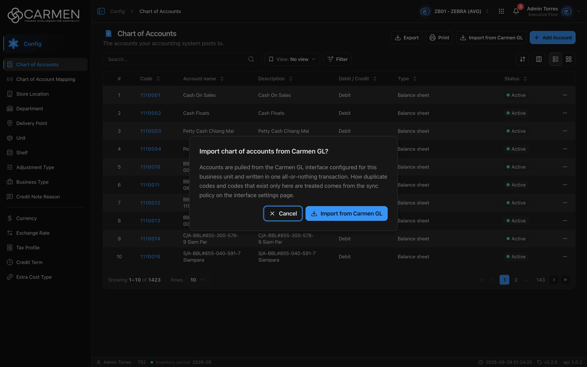

---
**Doc ID:** CB-MODAL-002
**Title:** Import from Carmen GL (Confirm)
**Domain:** All users
**Parent Page(s):** CB-PAGE-002 — Chart of Accounts
**Status:** Draft
**Created:** 2026-09-29
**Last Updated:** 2026-09-29
**Author:** Claude (จากโค้ด + ภาพหน้าจอจริง)
**Parent Flow:** N/A — master data CRUD ไม่มี workflow
---

## 8.2.10.2 Import from Carmen GL

> Dialog ยืนยันก่อนดึงผังบัญชีจาก Carmen GL (Carmen 4) มาเขียนลง Chart of Accounts ของ BU ปัจจุบัน (`routes/config/chart-of-accounts/coa-import-carmen-gl-button.tsx`)

---

### 8.2.10.2.1 Trigger

| Trigger | Source Page | Condition |
|---------|------------|-----------|
| Click **Import from Carmen GL** | CB-PAGE-002 (Chart of Accounts) | ปุ่มแสดงเฉพาะเมื่อ interface entitlement `accounting` / `carmen_gl` = `entitled` **และ** `canWrite = true` ถ้าไม่เข้าเงื่อนไข**ปุ่มไม่แสดงเลย** (ไม่ใช่แค่จาง) รวมถึงกรณี entitlement `expired` FE **ไม่ตรวจ**ว่าตั้งค่า interface เปิดใช้แล้วหรือยัง ให้ backend ตอบ 400 แทน |

---

### 8.2.10.2.2 Modal Layout



```
[Import chart of accounts from Carmen GL?]
────────────────────────────────────────────────
Accounts are pulled from the Carmen GL interface configured for this
business unit and written in one all-or-nothing transaction. How duplicate
codes and codes that exist only here are treated comes from the sync
policy on the interface settings page.
────────────────────────────────────────────────
                       [✕ Cancel] [⬇ Import from Carmen GL]
                                   ↳ ระหว่างทำงาน: [⟳ Importing…]
```

**Modal Size:** Small — `sm:max-w-md` (≈448px) AlertDialog
**Scrollable:** No

---

### 8.2.10.2.3 Search & Filter

N/A — dialog ยืนยัน ไม่มีการค้นหา

---

### 8.2.10.2.4 Content Grid Columns

N/A — ไม่มีตารางหรือช่องกรอก **ไม่มีตัวเลือกใด ๆ ให้ผู้ใช้เลือกโดยตั้งใจ** วิธีจัดการรหัสซ้ำ และรหัสที่มีเฉพาะฝั่ง Carmen Blue (อัปเดต/ข้าม/ลบ) ตัดสินจาก `sync_policy` ในคอนฟิก `interface_accounting_carmen_gl` ของ BU ซึ่งตั้งที่ `/system-admin/interface/accounting/carmen_gl` การกดปุ่มจึงให้ผลเหมือนการรันตามกำหนดเวลา (`use-coa.ts:46-51`)

**Selection behaviour:** N/A

---

### 8.2.10.2.5 Action Buttons

| Button | Color / Type | Description | Behaviour |
|--------|-------------|-------------|-----------|
| Import from Carmen GL | Primary (Blue) | เริ่มนำเข้า | ยิง `POST .../import-from-interface/carmen-gl` (ไม่มี body) ระหว่างรอ: ปุ่มเปลี่ยนเป็น spinner + "Importing…" ปุ่มทั้งสองและปุ่มบนหน้า disabled และปิด dialog ไม่ได้ (Esc/backdrop ไม่มีผล) สำเร็จหรือล้มเหลวก็ปิด dialog แล้วแสดง toast |
| Cancel | Secondary (White) | ยกเลิก | ปิด dialog ไม่มีคำขอ disabled ระหว่างนำเข้า |

---

### 8.2.10.2.6 Outcomes

| User Action | Modal Result | Parent Page Effect |
|------------|-------------|-------------------|
| Confirm → สำเร็จ | ปิด | toast success **"Chart of accounts imported"** พร้อมรายละเอียด **"Created {created}, updated {updated}, skipped {skipped}, deleted {deleted}"** และ list ของ CB-PAGE-002 โหลดใหม่ (invalidate `CHART_OF_ACCOUNTS`) |
| Confirm → ล้มเหลว | ปิด | toast error **"Import failed"** ดูรายละเอียดข้อ 8.2.10.2.8 **ไม่มีข้อมูลใดถูกเขียน** (all-or-nothing) |
| Click Cancel | ปิด | ไม่มีการเปลี่ยนแปลง |
| Close via Esc / backdrop | Same as Cancel (ยกเว้นระหว่างนำเข้าที่ปิดไม่ได้) | ไม่มีการเปลี่ยนแปลง |

---

### 8.2.10.2.7 Auto-Population on Selection

N/A — ไม่มีการเลือกรายการ ผลลัพธ์เขียนตรงลงตาราง `chart-of-accounts` ของ BU ที่ backend ในธุรกรรมเดียว response สำเร็จมีรูป:

| Field | Description |
|------------|-------------------|
| `summary.total_rows / created / updated / skipped / deleted / errors` | ตัวนับ (toast แสดงเฉพาะ created/updated/skipped/deleted) |
| `errors[]` | `{ row, column?, message }` ของแถวที่ผิด |
| `deleted_codes[]` | รหัสที่ถูกลบตาม sync policy (FE ไม่แสดง) |

---

### 8.2.10.2.8 Validation & Error States

| # | Scenario | System Behaviour |
|---|----------|-----------------|
| 1 | ข้อมูลจาก Carmen GL มีแถวผิดอย่างน้อยหนึ่งแถว | backend ไม่เขียนอะไรเลย ตอบ 400 พร้อม `errors` → toast "Import failed" รายละเอียดเป็นรายการแถว `#{row} ({column}): {message}` แสดงสูงสุด **5 บรรทัด** และตามด้วย `… +N` ถ้ามีมากกว่านั้น |
| 2 | เรียก Carmen 4 ไม่สำเร็จ (backend ตอบ 502 code `CHART_OF_ACCOUNTS_INTERFACE_REQUEST_FAILED`) | toast "Import failed" รายละเอียดเป็นข้อความจาก server ตรง ๆ (ข้อยกเว้นเฉพาะ code นี้ เพื่อบอกผู้ใช้ให้ไปแก้ token/คอนฟิก interface) 5xx อื่นจะไม่เปิดข้อความ server |
| 3 | ยังไม่ได้ตั้งค่า/ยังไม่เปิดใช้ interface Carmen GL | backend ตอบ 400 พร้อมข้อความ → toast "Import failed" + ข้อความจาก server |
| 4 | error อื่นที่ไม่มีข้อความให้แสดง | toast "Import failed" รายละเอียด **"Could not import the chart of accounts. Nothing was changed."** |
| 5 | Session expired | refresh token แล้วยิงซ้ำ ถ้าไม่ผ่าน → ไป `/login` (toast กลางปิดไว้ด้วย `skipGlobalErrorToast` ปุ่มนี้แสดง error เอง) |
| 6 | Slow network / loading state | spinner + "Importing…" ปิด dialog ไม่ได้จนกว่าจะเสร็จ timeout ของ `http-client` ทำให้ได้ error ตามข้อ 4 หรือข้อความ timeout |
| 7 | กดยืนยันซ้ำ (double submit) | ปุ่ม disabled ระหว่าง `isPending` |
| 8 | Concurrent: มีคนแก้ผังบัญชีระหว่างนำเข้า / นำเข้าซ้อนกันสองคน | FE ไม่มีการป้องกัน ขึ้นกับธุรกรรมฝั่ง backend |
| 9 | Licence หมดอายุ / BU ไม่มี entitlement | ปุ่มไม่แสดง จึงเปิด dialog ไม่ได้ |

---

### 8.2.10.2.9 API Endpoints

| Method | Endpoint | Purpose |
|--------|----------|---------|
| POST | `/api/config/{bu_code}/chart-of-accounts/import-from-interface/carmen-gl` | ดึงผังบัญชีจาก Carmen GL ตามคอนฟิก `interface_accounting_carmen_gl` ไม่มี body ไม่มี query param |
| GET | `/api/license` | (ทางอ้อม) `useInterfaceEntitlement()` ใช้ตัดสินว่าจะแสดงปุ่มหรือไม่ ใช้แคชร่วมกับ `useLicense()` |

---

### 8.2.10.2.10 Related Documents

| Doc ID | Title | Relationship |
|--------|-------|-------------|
| CB-PAGE-002 | Chart of Accounts | Opens this modal via **Import from Carmen GL** |
| CB-MODAL-001 | Add / Edit Chart of Account | ทางแก้รหัสบัญชีทีละรายการ |
| — | Interfaces config (`/system-admin/interface/accounting/carmen_gl`) | ที่ตั้ง `sync_policy` และ token ของ Carmen GL (ยังไม่มีเอกสาร UI) |
| — | Parent flow | N/A — master data CRUD ไม่มี workflow |
