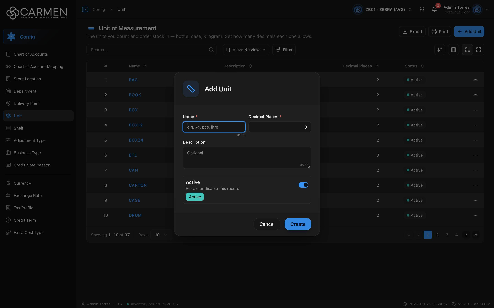

---
**Doc ID:** CB-MODAL-003
**Title:** Unit Dialog (Add / Edit Unit)
**Domain:** All users
**Parent Page(s):** CB-PAGE-004 — Unit
**Status:** Draft
**Created:** 2026-09-29
**Last Updated:** 2026-09-29
**Author:** Claude (จากโค้ด + ภาพหน้าจอจริง)
**Parent Flow:** N/A — master data CRUD ไม่มี workflow
---

## 8.4.10.1 Unit Dialog

> Dialog สร้าง/แก้ไขหน่วยนับ (Name, Decimal Places, Description, Active) — เปิดจากหน้า Unit หรือจาก lookup หน่วยในฟอร์มอื่นเพื่อสร้างหน่วยใหม่แบบ inline

โค้ด: `components/share/unit-dialog.tsx` (ของกลาง ไม่ได้อยู่ใต้ `routes/config/unit/`) ห่อด้วย template `ConfigEntityDialog` (`components/templates/config-entity-dialog.tsx`)

---

### 8.4.10.1.1 Trigger

| Trigger | Source Page | Condition |
|---------|------------|-----------|
| Click **Add Unit** | CB-PAGE-004 (Unit) | ต้องผ่าน license (`canWrite`) และ `product_management.unit.create` (หรือเป็น admin) ไม่งั้นเด้ง Permission Denied dialog แทน |
| Click ชื่อหน่วย (ลิงก์ในคอลัมน์ Name / การ์ด) | CB-PAGE-004 (Unit) | เปิดเสมอ — ถ้าไม่มี `product_management.unit.update` หรือ license เขียนไม่ได้ → เปิดแบบ read-only |
| ปุ่มสร้างหน่วยใหม่ใน `LookupUnit` | ฟอร์มอื่นที่มีช่องเลือกหน่วย (ไม่มี page doc) | โหมดสร้างเท่านั้น · สร้างสำเร็จแล้วส่ง `id` กลับให้ lookup เลือกทันที (`onCreated` → `onSuccess(id)`) |

---

### 8.4.10.1.2 Modal Layout



```
[📏 icon]  "Add Unit" / "Edit Unit"
────────────────────────────────────
Name *                    | Decimal Places *
[e.g. kg, pcs, litre    ] | [            0]
                   0/100  |
Description
[Optional                              ]
                                  0/256
┌──────────────────────────────────────┐
│ Active                          [●━] │
│ Enable or disable this record        │
│ [Active]                             │
└──────────────────────────────────────┘
────────────────────────────────────
                     [Cancel]  [Create / Save]
```

**Modal Size:** Small (`sm:max-w-[425px]`)
**Scrollable:** No — ฟอร์มสั้น ไม่มีส่วนเลื่อน

---

### 8.4.10.1.3 Search & Filter

N/A — dialog ฟอร์ม ไม่มีการค้นหา

**Form fields:**

| Field | Mandatory | Description | Business Logic / Remark |
|-------|-----------|-------------|--------------------------|
| Name | Y | ชื่อหน่วย | placeholder "e.g. kg, pcs, litre" · `maxLength=100` (ตัวนับ 0/100) · zod `min(1)` → "Name is required" |
| Decimal Places | Y (มีดอกจัน) | จำนวนทศนิยมที่ยอมให้กรอก qty ในหน่วยนี้ | `type=number`, `min=0`, `max=5`, `step=1` (ชิดขวา) · Default: 0 · zod `coerce.number().int().min(0).max(5).catch(0)` — **ช่องว่างไม่ error แต่กลายเป็น 0** |
| Description | N | คำอธิบาย | textarea placeholder "Optional" · `maxLength=256` |
| Active | N | สถานะใช้งาน | `StatusSwitch` · Default: on (`is_active = true`) |

**Search trigger:** N/A

---

### 8.4.10.1.4 Content Grid Columns

N/A — ไม่มีตาราง

---

### 8.4.10.1.5 Action Buttons

| Button | Color / Type | Description | Behaviour |
|--------|-------------|-------------|-----------|
| Create (โหมดสร้าง) | Primary (Blue) | สร้างหน่วย | validate zod → `POST` · ระหว่างส่งเปลี่ยนเป็น "Creating..." และ disable ทุกช่อง · สำเร็จ → toast "Unit created successfully" ปิด dialog, list refetch |
| Save (โหมดแก้ไข) | Primary (Blue) | บันทึกการแก้ไข | `PUT` พร้อม `doc_version` · ระหว่างส่ง "Saving..." · สำเร็จ → toast "Unit updated successfully" ปิด dialog |
| Cancel | Secondary (White) | ปิดโดยไม่บันทึก | disabled ระหว่าง pending · โหมด read-only แสดงเป็น **Close** และไม่มีปุ่ม Save |

---

### 8.4.10.1.6 Outcomes

| User Action | Modal Result | Parent Page Effect |
|------------|-------------|-------------------|
| กรอกครบ → Create/Save สำเร็จ | ปิด | list ถูก invalidate แล้วโหลดใหม่ แถวใหม่/ที่แก้ปรากฏตาม sort ปัจจุบัน |
| Create/Save ล้มเหลว | **ยังเปิดอยู่** ค่าที่กรอกคงไว้ | toast error กลาง |
| Click Cancel / Close | ปิด | ไม่เปลี่ยนแปลง |
| กด Esc / คลิก backdrop | เหมือน Cancel (ถูกปิดกั้นระหว่าง pending) | ไม่เปลี่ยนแปลง |

---

### 8.4.10.1.7 Auto-Population on Selection

N/A — ไม่มีการเลือก item · ค่าเริ่มต้นโหมดสร้าง: Name "", Description "", Decimal Places 0, Active on · โหมดแก้ไขเติมจากแถว (`decimal_place ?? 0`) ทุกครั้งที่เปิด (`form.reset` ตอน `open`)

---

### 8.4.10.1.8 Validation & Error States

| # | Scenario | System Behaviour |
|---|----------|-----------------|
| 1 | Name ว่าง → Create | inline error "Name is required" ใต้ช่อง ไม่ส่ง API |
| 2 | Decimal Places ว่าง | ไม่ error — zod `.catch(0)` แปลง NaN เป็น 0 แล้วบันทึกเป็น 0 |
| 3 | Decimal Places > 5, < 0 หรือมีทศนิยม | browser native validation (`min`/`max`/`step`) บล็อก submit พร้อม tooltip ของ browser ก่อนถึง zod (ถ้าหลุดมาถึง zod ก็จะถูก `.catch(0)` กลืนเป็น 0 เงียบ ๆ) |
| 4 | Name ซ้ำ / backend ปฏิเสธ | toast error กลาง (ข้อความตาม catalog code ถ้ามี ไม่งั้น "Some fields aren't filled in correctly. Check them and try again.") dialog ยังเปิด |
| 5 | Session expired | 401 → refresh + retry อัตโนมัติ · ไม่สำเร็จ → redirect `/login` ค่าที่กรอกหาย |
| 6 | Concurrent edit | ส่ง `doc_version` เดิม · backend ตอบ 409 → toast "Someone else changed this document. Refresh the page and try again." · FE ไม่มีการตรวจเอง ถ้า backend ไม่บังคับ = last-write-wins |
| 7 | ไม่มีสิทธิ์ update / license หมดอายุ | ทุกช่อง disabled, ปุ่ม Close, ไม่มี Save |
| 8 | Double submit | ปุ่มและช่อง disabled ระหว่าง `isPending` · dialog ปิดไม่ได้ระหว่างส่ง |
| 9 | เปิดจาก `LookupUnit` ภายในฟอร์มอื่น | `stopPropagationOnSubmit` กันไม่ให้ submit ทะลุไป submit ฟอร์มแม่ |

---

### 8.4.10.1.9 API Endpoints

| Method | Endpoint | Purpose |
|--------|----------|---------|
| POST | `/api/config/{bu_code}/units` | สร้าง — body `{ name, description, decimal_place, is_active }` |
| PUT | `/api/config/{bu_code}/units/{id}` | แก้ไข — body `{ doc_version, name, description, decimal_place, is_active }` |

---

### 8.4.10.1.10 Related Documents

| Doc ID | Title | Relationship |
|--------|-------|-------------|
| CB-PAGE-004 | Unit | Opens this modal via **Add Unit** / คลิกชื่อหน่วย |
| N/A | Parent flow | master data CRUD ไม่มี workflow |
