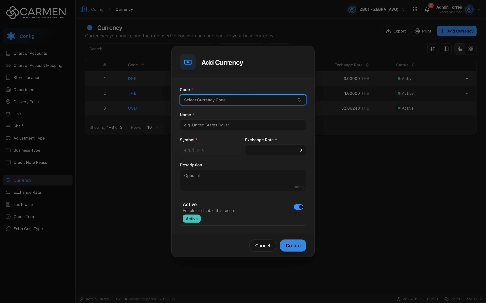

---
**Doc ID:** CB-MODAL-004
**Title:** Currency Dialog (Add / Edit Currency)
**Domain:** All users
**Parent Page(s):** CB-PAGE-005 — Currency
**Status:** Draft
**Created:** 2026-09-29
**Last Updated:** 2026-09-29
**Author:** Claude (จากโค้ด + ภาพหน้าจอจริง)
**Parent Flow:** N/A — master data CRUD ไม่มี workflow
---

## 8.5.10.1 Currency Dialog

> Dialog สร้าง/แก้ไขสกุลเงิน — เลือกรหัส ISO จากรายการแล้วระบบเติมชื่อ สัญลักษณ์ และคำอธิบายให้ ผู้ใช้กรอกอัตราแลกเปลี่ยนเอง

โค้ด: `routes/config/currency/currency-dialog.tsx` (โหลดแบบ `React.lazy`), schema `currency-form-schema.ts`, lookup `components/lookup/lookup-currency-iso.tsx`, template `ConfigEntityDialog`

---

### 8.5.10.1.1 Trigger

| Trigger | Source Page | Condition |
|---------|------------|-----------|
| Click **Add Currency** | CB-PAGE-005 (Currency) | ต้องผ่าน license และ `configuration.currency.create` (หรือ admin) ไม่งั้นเด้ง Permission Denied dialog |
| Click รหัสสกุลเงิน (คอลัมน์ Code / การ์ด) | CB-PAGE-005 (Currency) | เปิดเสมอ · read-only ถ้าไม่มี `configuration.currency.update` หรือ license เขียนไม่ได้ |

---

### 8.5.10.1.2 Modal Layout



```
[💵 icon]  "Add Currency" / "Edit Currency"
────────────────────────────────────
Code *
[Select Currency Code              ⇕]
Name *
[e.g. United States Dollar          ]
Symbol *              | Exchange Rate *
[e.g. $, ฿, €] (เทา)  | [                0]
Description
[Optional                           ]
                               0/256
┌───────────────────────────────────┐
│ Active                       [●━] │
│ Enable or disable this record     │
│ [Active]                          │
└───────────────────────────────────┘
────────────────────────────────────
                  [Cancel]  [Create / Save]
```

**Modal Size:** Small (`sm:max-w-[425px]`)
**Scrollable:** No · รายการ Code เปิดเป็น popover (combobox) แยกซ้อนบน dialog

---

### 8.5.10.1.3 Search & Filter

ช่อง **Code** เป็น combobox ค้นหาได้ (ไม่ใช่ช่องพิมพ์อิสระ):

| Filter | Type | Description | Default |
|--------|------|-------------|---------|
| Code (combobox) | Searchable dropdown | รายการ ISO 46 สกุลที่ฝังในโค้ด (`constant/currencies-iso.ts`: AED, AUD, … THB, USD, VND, ZAR) แสดงเป็น "USD — US Dollar" · ค้นด้วย code, name หรือ country · placeholder "Select Currency Code" · ช่องค้น "Search Currency..." | ว่าง |

**Search trigger:** Real-time (กรองรายการในเครื่องขณะพิมพ์ — ไม่เรียก API)

**Form fields:**

| Field | Mandatory | Description | Business Logic / Remark |
|-------|-----------|-------------|--------------------------|
| Code | Y | รหัส ISO 4217 | เลือกจาก combobox เท่านั้น · zod "Code is required" · **โหมดแก้ไข disabled** · ไม่มีการเช็กซ้ำฝั่ง FE |
| Name | Y | ชื่อสกุลเงิน | auto-fill จาก ISO เมื่อเลือก Code (แก้ต่อได้) · `maxLength=100` · "Name is required" |
| Symbol | Y | สัญลักษณ์ | **disabled เสมอ** (ทั้งสร้างและแก้ไข) — ได้ค่าจากการเลือก Code เท่านั้น · zod min 1, max 5 → "Symbol is required" / "Symbol max 5 characters" |
| Exchange Rate | Y | จำนวน base currency ต่อ 1 หน่วยสกุลนี้ | `type=number`, `step=any` · Default **0** ซึ่งตก `.positive()` → "Exchange Rate must be greater than 0" จึงบังคับให้กรอก · ไม่มีเพดาน |
| Description | N | คำอธิบาย | auto-fill เป็น "{Name} ({Country})" เมื่อเลือก Code (เขียนทับค่าที่พิมพ์ไว้) · `maxLength=256` |
| Active | N | สถานะ | Default on |
| (Decimal Places) | — | จำนวนทศนิยมของสกุลเงิน | **ไม่มีช่องใน UI** แต่อยู่ใน schema/payload · สร้างใหม่ = 2 · แก้ไข = คงค่าเดิม (`?? 2`) · schema int 0–8 |

---

### 8.5.10.1.4 Content Grid Columns

N/A — ไม่มีตาราง

---

### 8.5.10.1.5 Action Buttons

| Button | Color / Type | Description | Behaviour |
|--------|-------------|-------------|-----------|
| Create | Primary (Blue) | สร้างสกุลเงิน | validate → `POST` · "Creating..." ระหว่างส่ง · สำเร็จ → toast "Currency created successfully" ปิด dialog |
| Save | Primary (Blue) | บันทึกการแก้ไข | `PATCH` พร้อม `doc_version` · "Saving..." · สำเร็จ → "Currency updated successfully" |
| Cancel | Secondary (White) | ปิดโดยไม่บันทึก | read-only → แสดง **Close** ไม่มี Save |

---

### 8.5.10.1.6 Outcomes

| User Action | Modal Result | Parent Page Effect |
|------------|-------------|-------------------|
| เลือก Code → กรอก Exchange Rate → Create | ปิด | list โหลดใหม่ (sort Code asc) |
| Save ล้มเหลว | ยังเปิด ค่าคงอยู่ | toast error กลาง |
| Cancel / Esc / backdrop | ปิด | ไม่เปลี่ยน (ปิดไม่ได้ระหว่างส่ง) |

---

### 8.5.10.1.7 Auto-Population on Selection

ทำงาน **เฉพาะโหมดสร้าง** (`isEdit = false`) ทุกครั้งที่ค่า Code เปลี่ยน (`currency-dialog.tsx:59-72`):

| Parent Field | Pre-populated From |
|------------|-------------------|
| Name | `currenciesIso[].name` |
| Symbol | `currenciesIso[].symbol` |
| Description | `"{name} ({country})"` |
| Exchange Rate | `1 / rate` จาก `GET /api/exchange-rate?base={base}` **เฉพาะเมื่อได้อัตราจริง > 0** — ปัจจุบัน endpoint ไม่มี (ดู CLAUDE.md, Known open items) จึง **ไม่เคยเติม** ช่องคงเป็น 0 (มีเทสต์ `currency-dialog.test.tsx` ยืนยันว่าไม่ยัดค่าหลอก) |

base currency = `defaultCurrencyCode` จาก profile, ถ้าว่างใช้ "THB"

Fields NOT pre-populated (user must fill):
- Exchange Rate (ในสภาพปัจจุบัน)

---

### 8.5.10.1.8 Validation & Error States

| # | Scenario | System Behaviour |
|---|----------|-----------------|
| 1 | ไม่เลือก Code → Create | "Code is required" ใต้ combobox (และ Name/Symbol ว่าง → "Name is required", "Symbol is required") |
| 2 | Exchange Rate = 0 หรือว่าง | "Exchange Rate must be greater than 0" (ว่าง → NaN ก็ไม่ผ่าน `number()`) |
| 3 | เลือกรหัสที่ BU มีอยู่แล้ว | FE ไม่กันไว้ — ส่งไป backend แล้ว error แสดงเป็น toast กลาง dialog ยังเปิด |
| 4 | Live-rate endpoint ใช้ไม่ได้ | query ล้มเหลวเงียบ ๆ (retry 3 ครั้งแบบ backoff, ไม่มี toast) บน static hosting ได้ `index.html` กลับมา → ตรวจ Content-Type แล้วโยน error — ผู้ใช้กรอกอัตราเอง |
| 5 | Session expired | 401 → refresh + retry · ล้มเหลว → `/login` ค่าที่กรอกหาย |
| 6 | Concurrent edit | PATCH ส่ง `doc_version` · 409 → toast "Someone else changed this document. Refresh the page and try again." |
| 7 | ไม่มีสิทธิ์ update / license หมดอายุ | ทุกช่อง disabled ปุ่ม Close |
| 8 | แก้ไขแถวที่ Symbol ว่าง/ยาวเกิน 5 ในฐานข้อมูล | Symbol แก้ไม่ได้ (disabled) แต่ zod ยังตรวจ → Save ไม่ผ่านโดยผู้ใช้แก้ไม่ได้ในหน้านี้ |
| 9 | Double submit | ปุ่ม/ช่อง disabled ระหว่าง pending |

---

### 8.5.10.1.9 API Endpoints

| Method | Endpoint | Purpose |
|--------|----------|---------|
| POST | `/api/config/{bu_code}/currencies` | สร้าง — body `{ code, name, symbol, exchange_rate, description, decimal_places, is_active }` |
| PATCH | `/api/config/{bu_code}/currencies/{id}` | แก้ไข — body เดียวกัน + `doc_version` |
| GET | `/api/exchange-rate?base={base}` | อัตราสดสำหรับ auto-fill — **ยังไม่มี endpoint** (relative URL, ไม่แนบ token) |

---

### 8.5.10.1.10 Related Documents

| Doc ID | Title | Relationship |
|--------|-------|-------------|
| CB-PAGE-005 | Currency | Opens this modal via **Add Currency** / คลิก Code |
| N/A | Parent flow | master data CRUD ไม่มี workflow |
