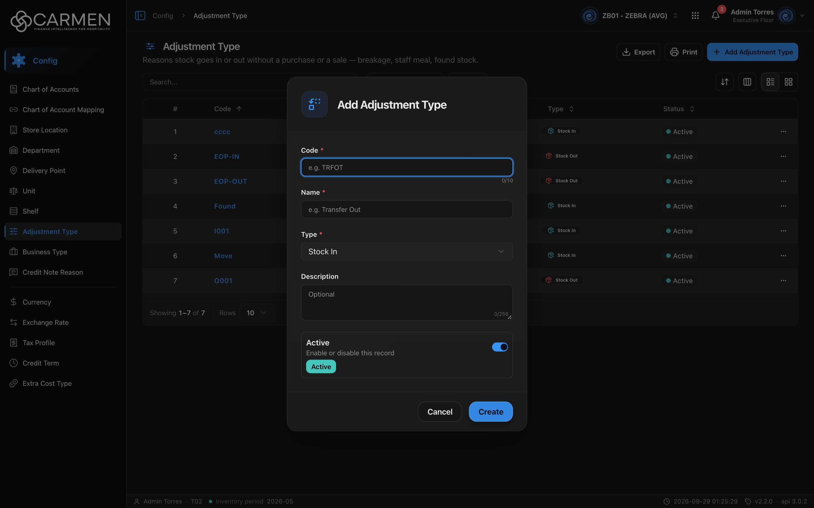

---
**Doc ID:** CB-MODAL-005
**Title:** Adjustment Type Dialog (Add / Edit Adjustment Type)
**Domain:** All users
**Parent Page(s):** CB-PAGE-006 — Adjustment Type
**Status:** Draft
**Created:** 2026-09-29
**Last Updated:** 2026-09-29
**Author:** Claude (จากโค้ด + ภาพหน้าจอจริง)
**Parent Flow:** N/A — master data CRUD ไม่มี workflow
---

## 8.6.10.1 Adjustment Type Dialog

> Dialog สร้าง/แก้ไขประเภทการปรับสต็อก (Code, Name, Type = Stock In/Stock Out, Description, Active)

โค้ด: `routes/config/adjustment-type/adjustment-type-dialog.tsx`, schema `adjustmentTypeSchema` ใน `types/adjustment-type.ts`, template `ConfigEntityDialog`

---

### 8.6.10.1.1 Trigger

| Trigger | Source Page | Condition |
|---------|------------|-----------|
| Click **Add Adjustment Type** | CB-PAGE-006 (Adjustment Type) | ต้องผ่าน license และ `configuration.adjustment_type.create` (หรือ admin) |
| Click Code ในแถว / การ์ด | CB-PAGE-006 (Adjustment Type) | เปิดเสมอ · read-only ถ้าไม่มี `configuration.adjustment_type.update` หรือ license เขียนไม่ได้ |

---

### 8.6.10.1.2 Modal Layout



```
[⇄ icon]  "Add Adjustment Type" / "Edit Adjustment Type"
────────────────────────────────────
Code *
[e.g. TRFOT                        ]
                               0/10
Name *
[e.g. Transfer Out                 ]
Type *
[Stock In                         ▾]
Description
[Optional                          ]
                              0/256
┌──────────────────────────────────┐
│ Active                      [●━] │
│ Enable or disable this record    │
│ [Active]                         │
└──────────────────────────────────┘
────────────────────────────────────
                 [Cancel]  [Create / Save]
```

**Modal Size:** Small (`sm:max-w-[425px]`)
**Scrollable:** No

---

### 8.6.10.1.3 Search & Filter

N/A — dialog ฟอร์ม

**Form fields:**

| Field | Mandatory | Description | Business Logic / Remark |
|-------|-----------|-------------|--------------------------|
| Code | Y | รหัสประเภท | placeholder "e.g. TRFOT" · `maxLength=10` (ตัวนับ 0/10 — จำกัดที่ input เท่านั้น zod ไม่มี max) · "Code is required" · **แก้ได้ทั้งโหมดสร้างและแก้ไข** · ไม่มีการเช็กซ้ำฝั่ง FE |
| Name | Y | ชื่อประเภท | placeholder "e.g. Transfer Out" · `maxLength=100` (ไม่มีตัวนับในภาพ) · "Name is required" |
| Type | Y | ทิศทางสต็อก | select 2 ค่า: **Stock In** (`stock_in`) / **Stock Out** (`stock_out`) · Default: Stock In · "Type is required" · ป้ายตัวเลือก hard-code ภาษาอังกฤษใน `ADJUSTMENT_TYPE_OPTIONS` (ไม่ผ่าน i18n) |
| Description | N | คำอธิบาย | textarea "Optional" · `maxLength=256` |
| Active | N | สถานะ | Default on |
| (Note) | — | หมายเหตุ | **ไม่มีช่องใน UI** แต่อยู่ใน schema/payload · สร้างใหม่ส่ง "" · แก้ไขส่งค่าเดิมกลับ (ปรากฏใน Export ของหน้า list) |

ข้อความ validation ของ dialog นี้ **hard-code เป็นภาษาอังกฤษ** ใน schema (`types/adjustment-type.ts:17-24`) — `buildSchema={() => adjustmentTypeSchema}` ไม่ใช้ตัวแปล จึงไม่เปลี่ยนตามภาษา UI ต่างจาก dialog config อื่น

---

### 8.6.10.1.4 Content Grid Columns

N/A — ไม่มีตาราง

---

### 8.6.10.1.5 Action Buttons

| Button | Color / Type | Description | Behaviour |
|--------|-------------|-------------|-----------|
| Create | Primary (Blue) | สร้าง | validate → `POST` · "Creating..." · สำเร็จ → toast "Adjustment Type created successfully" ปิด dialog |
| Save | Primary (Blue) | บันทึก | `PUT` + `doc_version` · "Saving..." · สำเร็จ → "Adjustment Type updated successfully" |
| Cancel | Secondary (White) | ปิด | read-only → **Close** ไม่มี Save |

---

### 8.6.10.1.6 Outcomes

| User Action | Modal Result | Parent Page Effect |
|------------|-------------|-------------------|
| กรอกครบ → Create/Save สำเร็จ | ปิด | list โหลดใหม่ (sort Code, Name asc) |
| ล้มเหลว | ยังเปิด | toast error กลาง |
| Cancel / Esc / backdrop | ปิด | ไม่เปลี่ยน |

---

### 8.6.10.1.7 Auto-Population on Selection

N/A — ไม่มี auto-fill ระหว่างช่อง · Default โหมดสร้าง: Code "", Name "", Type Stock In, Description "", Note "", Active on · โหมดแก้ไขเติมจากแถวทุกครั้งที่เปิด

Fields NOT pre-populated (user must fill):
- Code
- Name

---

### 8.6.10.1.8 Validation & Error States

| # | Scenario | System Behaviour |
|---|----------|-----------------|
| 1 | Code ว่าง | "Code is required" ไม่ส่ง API |
| 2 | Name ว่าง | "Name is required" |
| 3 | Type ไม่ตรง enum (แถวเก่าที่ค่าไม่ใช่ `stock_in`/`stock_out`) | select แสดง placeholder "Select type" · Save → "Type is required" จนกว่าจะเลือกใหม่ · backend รับแค่ lowercase (ส่งตัวใหญ่ → 400 ตาม comment ใน type) |
| 4 | Code ซ้ำ / backend ปฏิเสธ | toast error กลาง dialog ยังเปิด |
| 5 | Session expired | 401 → refresh + retry · ล้มเหลว → `/login` ค่าที่กรอกหาย |
| 6 | Concurrent edit | PUT ส่ง `doc_version` · 409 → toast "Someone else changed this document. Refresh the page and try again." |
| 7 | ไม่มีสิทธิ์ update / license | ทุกช่อง disabled ปุ่ม Close |
| 8 | Double submit | ปุ่ม/ช่อง disabled ระหว่าง pending |

---

### 8.6.10.1.9 API Endpoints

| Method | Endpoint | Purpose |
|--------|----------|---------|
| POST | `/api/config/{bu_code}/adjustment-types` | สร้าง — body `{ code, name, type, description, note, is_active }` |
| PUT | `/api/config/{bu_code}/adjustment-types/{id}` | แก้ไข — body เดียวกัน + `doc_version` |

---

### 8.6.10.1.10 Related Documents

| Doc ID | Title | Relationship |
|--------|-------|-------------|
| CB-PAGE-006 | Adjustment Type | Opens this modal via **Add Adjustment Type** / คลิก Code |
| N/A | Parent flow | master data CRUD ไม่มี workflow |
