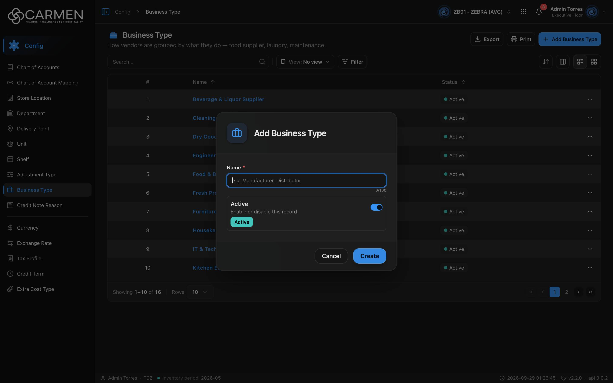

---
**Doc ID:** CB-MODAL-006
**Title:** Business Type Dialog (Add / Edit Business Type)
**Domain:** All users
**Parent Page(s):** CB-PAGE-007 — Business Type
**Status:** Draft
**Created:** 2026-09-29
**Last Updated:** 2026-09-29
**Author:** Claude (จากโค้ด + ภาพหน้าจอจริง)
**Parent Flow:** N/A — master data CRUD ไม่มี workflow
---

## 8.7.10.1 Business Type Dialog

> Dialog สร้าง/แก้ไขประเภทธุรกิจของ vendor — มีแค่ Name กับสวิตช์ Active

โค้ด: `routes/config/business-type/business-type-dialog.tsx` (lazy), schema `business-type-form-schema.ts`, template `ConfigEntityDialog`

---

### 8.7.10.1.1 Trigger

| Trigger | Source Page | Condition |
|---------|------------|-----------|
| Click **Add Business Type** | CB-PAGE-007 (Business Type) | ต้องผ่าน license และ `configuration.business_type.create` (หรือ admin) |
| Click Name ในแถว / การ์ด | CB-PAGE-007 (Business Type) | เปิดเสมอ · read-only ถ้าไม่มี `configuration.business_type.update` หรือ license เขียนไม่ได้ |

---

### 8.7.10.1.2 Modal Layout



```
[💼 icon]  "Add Business Type" / "Edit Business Type"
────────────────────────────────────
Name *
[e.g. Manufacturer, Distributor    ]
                              0/100
┌──────────────────────────────────┐
│ Active                      [●━] │
│ Enable or disable this record    │
│ [Active]                         │
└──────────────────────────────────┘
────────────────────────────────────
                 [Cancel]  [Create / Save]
```

**Modal Size:** Small (`sm:max-w-[425px]`)
**Scrollable:** No

---

### 8.7.10.1.3 Search & Filter

N/A — dialog ฟอร์ม

**Form fields:**

| Field | Mandatory | Description | Business Logic / Remark |
|-------|-----------|-------------|--------------------------|
| Name | Y | ชื่อประเภทธุรกิจ | placeholder "e.g. Manufacturer, Distributor" · `maxLength=100` (ตัวนับ 0/100) · zod "Name is required" · ไม่มีการเช็กซ้ำฝั่ง FE |
| Active | N | สถานะ | `StatusSwitch` · Default on |

---

### 8.7.10.1.4 Content Grid Columns

N/A — ไม่มีตาราง

---

### 8.7.10.1.5 Action Buttons

| Button | Color / Type | Description | Behaviour |
|--------|-------------|-------------|-----------|
| Create | Primary (Blue) | สร้าง | validate → `POST` · "Creating..." · สำเร็จ → toast "Business Type created successfully" ปิด dialog |
| Save | Primary (Blue) | บันทึก | `PATCH` + `doc_version` · "Saving..." · สำเร็จ → "Business Type updated successfully" |
| Cancel | Secondary (White) | ปิด | read-only → **Close** ไม่มี Save |

---

### 8.7.10.1.6 Outcomes

| User Action | Modal Result | Parent Page Effect |
|------------|-------------|-------------------|
| กรอก Name → Create/Save สำเร็จ | ปิด | list โหลดใหม่ (sort Name asc) |
| ล้มเหลว | ยังเปิด | toast error กลาง |
| Cancel / Esc / backdrop | ปิด | ไม่เปลี่ยน |

---

### 8.7.10.1.7 Auto-Population on Selection

N/A — ไม่มี auto-fill · Default โหมดสร้าง: Name "", Active on (`EMPTY_FORM`) · โหมดแก้ไขเติมจากแถวทุกครั้งที่เปิด

Fields NOT pre-populated (user must fill):
- Name

---

### 8.7.10.1.8 Validation & Error States

| # | Scenario | System Behaviour |
|---|----------|-----------------|
| 1 | Name ว่าง | "Name is required" ไม่ส่ง API (ช่องว่างล้วน " " ผ่าน zod เพราะไม่ trim) |
| 2 | Name ซ้ำ / backend ปฏิเสธ | toast error กลาง dialog ยังเปิด |
| 3 | Session expired | 401 → refresh + retry · ล้มเหลว → `/login` |
| 4 | Concurrent edit | PATCH ส่ง `doc_version` · 409 → toast "Someone else changed this document. Refresh the page and try again." |
| 5 | ไม่มีสิทธิ์ update / license | ช่อง disabled ปุ่ม Close |
| 6 | Double submit | ปุ่ม/ช่อง disabled ระหว่าง pending · ปิด dialog ไม่ได้ระหว่างส่ง |

---

### 8.7.10.1.9 API Endpoints

| Method | Endpoint | Purpose |
|--------|----------|---------|
| POST | `/api/config/{bu_code}/vendor-business-types` | สร้าง — body `{ name, is_active }` |
| PATCH | `/api/config/{bu_code}/vendor-business-types/{id}` | แก้ไข — body `{ doc_version, name, is_active }` |

---

### 8.7.10.1.10 Related Documents

| Doc ID | Title | Relationship |
|--------|-------|-------------|
| CB-PAGE-007 | Business Type | Opens this modal via **Add Business Type** / คลิก Name |
| N/A | Parent flow | master data CRUD ไม่มี workflow |
