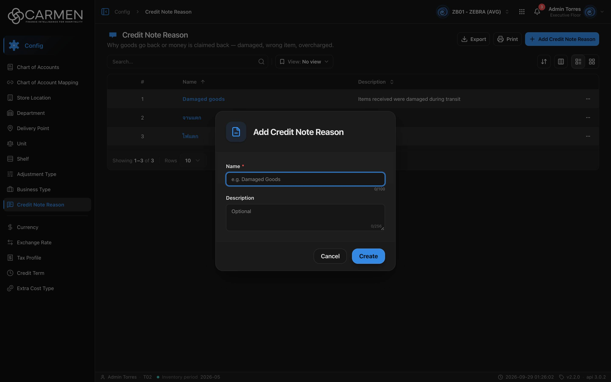

---
**Doc ID:** CB-MODAL-007
**Title:** Credit Note Reason Dialog (Add / Edit Credit Note Reason)
**Domain:** All users
**Parent Page(s):** CB-PAGE-008 — Credit Note Reason
**Status:** Draft
**Created:** 2026-09-29
**Last Updated:** 2026-09-29
**Author:** Claude (จากโค้ด + ภาพหน้าจอจริง)
**Parent Flow:** N/A — master data CRUD ไม่มี workflow
---

## 8.8.10.1 Credit Note Reason Dialog

> Dialog สร้าง/แก้ไขเหตุผลของ Credit Note — มีแค่ Name และ Description **ไม่มีสวิตช์ Active**

โค้ด: `routes/config/credit-note-reason/credit-note-reason-dialog.tsx`, schema `credit-note-reason-form-schema.ts`, hooks `use-cn-reason-config.ts`, template `ConfigEntityDialog`

เหตุที่ไม่มีสวิตช์ Active: dialog นี้ไม่ได้ render `StatusSwitch` และทั้ง schema (`createCnReasonSchema`: `name`, `description`) กับ payload type (`CnReasonPayload = { name, description }`) ไม่มี `is_active` — `CreateCnReasonDto` ใน `types/cn-reason.ts` ก็ไม่มีฟิลด์นี้ ทั้งที่ entity `CnReason` มี `is_active` · จึงเป็นการออกแบบให้ไม่ส่งสถานะเลย ไม่ใช่การซ่อน UI

---

### 8.8.10.1.1 Trigger

| Trigger | Source Page | Condition |
|---------|------------|-----------|
| Click **Add Credit Note Reason** | CB-PAGE-008 (Credit Note Reason) | ต้องผ่าน license และ `configuration.create` (คีย์ที่ derive จาก route — non-admin ไม่มีทางผ่าน ดู CB-PAGE-008 §8.8.2) |
| Click Name ในแถว / การ์ด | CB-PAGE-008 (Credit Note Reason) | เปิดเสมอ · read-only ถ้าไม่มี `configuration.update` หรือ license เขียนไม่ได้ |

---

### 8.8.10.1.2 Modal Layout



```
[📄 icon]  "Add Credit Note Reason" / "Edit Credit Note Reason"
────────────────────────────────────
Name *
[e.g. Damaged Goods                ]
                              0/100
Description
[Optional                          ]
                              0/256
────────────────────────────────────
                 [Cancel]  [Create / Save]
```

**Modal Size:** Small (`sm:max-w-[425px]`)
**Scrollable:** No

---

### 8.8.10.1.3 Search & Filter

N/A — dialog ฟอร์ม

**Form fields:**

| Field | Mandatory | Description | Business Logic / Remark |
|-------|-----------|-------------|--------------------------|
| Name | Y | ชื่อเหตุผล | placeholder "e.g. Damaged Goods" · `maxLength=100` (ตัวนับ 0/100) · zod "Name is required" · ไม่มีการเช็กซ้ำฝั่ง FE |
| Description | N | คำอธิบาย | textarea "Optional" · `maxLength=256` · ตั้ง `className="h-8"` แต่ภาพจริงยังสูงหลายบรรทัด |

---

### 8.8.10.1.4 Content Grid Columns

N/A — ไม่มีตาราง

---

### 8.8.10.1.5 Action Buttons

| Button | Color / Type | Description | Behaviour |
|--------|-------------|-------------|-----------|
| Create | Primary (Blue) | สร้าง | validate → `POST` · "Creating..." · สำเร็จ → toast "Credit Note Reason created successfully" ปิด dialog |
| Save | Primary (Blue) | บันทึก | `PUT` + `doc_version` · "Saving..." · สำเร็จ → "Credit Note Reason updated successfully" |
| Cancel | Secondary (White) | ปิด | read-only → **Close** ไม่มี Save |

---

### 8.8.10.1.6 Outcomes

| User Action | Modal Result | Parent Page Effect |
|------------|-------------|-------------------|
| กรอก Name → Create/Save สำเร็จ | ปิด | list โหลดใหม่ (sort Name asc) |
| ล้มเหลว | ยังเปิด | toast error กลาง |
| Cancel / Esc / backdrop | ปิด | ไม่เปลี่ยน |

---

### 8.8.10.1.7 Auto-Population on Selection

N/A — ไม่มี auto-fill · Default โหมดสร้าง: Name "", Description "" · โหมดแก้ไขเติมจากแถวทุกครั้งที่เปิด · `is_active` ของรายการใหม่เป็นค่า default ของ backend

Fields NOT pre-populated (user must fill):
- Name

---

### 8.8.10.1.8 Validation & Error States

| # | Scenario | System Behaviour |
|---|----------|-----------------|
| 1 | Name ว่าง | "Name is required" ไม่ส่ง API |
| 2 | Name ซ้ำ / backend ปฏิเสธ | toast error กลาง dialog ยังเปิด |
| 3 | Session expired | 401 → refresh + retry · ล้มเหลว → `/login` ค่าที่กรอกหาย |
| 4 | Concurrent edit | PUT ส่ง `doc_version` · 409 → toast "Someone else changed this document. Refresh the page and try again." |
| 5 | ไม่มีสิทธิ์ update / license | ช่อง disabled ปุ่ม Close (non-admin ตกกรณีนี้เสมอ) |
| 6 | Double submit | ปุ่ม/ช่อง disabled ระหว่าง pending |
| 7 | ต้องการเปลี่ยนสถานะ Active/Inactive | ทำไม่ได้ใน dialog นี้ — payload ไม่มี `is_active` (PUT ไม่ส่ง จึงขึ้นกับ backend ว่าจะคงค่าเดิมหรือไม่) |

---

### 8.8.10.1.9 API Endpoints

| Method | Endpoint | Purpose |
|--------|----------|---------|
| POST | `/api/config/{bu_code}/credit-note-reasons` | สร้าง — body `{ name, description }` |
| PUT | `/api/config/{bu_code}/credit-note-reasons/{id}` | แก้ไข — body `{ doc_version, name, description }` |

---

### 8.8.10.1.10 Related Documents

| Doc ID | Title | Relationship |
|--------|-------|-------------|
| CB-PAGE-008 | Credit Note Reason | Opens this modal via **Add Credit Note Reason** / คลิก Name |
| N/A | Parent flow | master data CRUD ไม่มี workflow |
