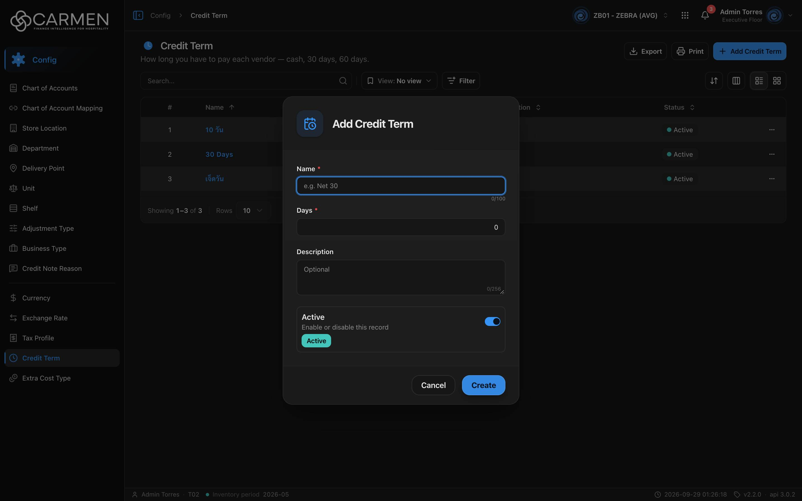

---
**Doc ID:** CB-MODAL-008
**Title:** Credit Term Dialog
**Domain:** All users
**Parent Page(s):** CB-PAGE-009 — Credit Term
**Status:** Draft
**Created:** 2026-09-29
**Last Updated:** 2026-09-29
**Author:** Claude (จากโค้ด + ภาพหน้าจอจริง)
**Parent Flow:** N/A — master data CRUD ไม่มี workflow
---

## 8.9.10.1 Credit Term Dialog

> Dialog สร้าง/แก้ไข Credit Term (ชื่อ, จำนวนวัน, คำอธิบาย, สถานะ) — เปิดจากปุ่ม Add หรือคลิกชื่อในรายการ

---

### 8.9.10.1.1 Trigger

| Trigger | Source Page | Condition |
|---------|------------|-----------|
| Click **+ Add Credit Term** | CB-PAGE-009 (Credit Term) | เปิดโหมด Create — ต้องมี license เขียนได้ และ (admin หรือมี `configuration.create`) |
| Click ชื่อในคอลัมน์ **Name** | CB-PAGE-009 (Credit Term) | เปิดโหมด Edit เสมอ — ถ้าไม่มี `configuration.update` หรือ `!canWrite` จะเป็นโหมด readOnly |
| แตะการ์ด (โหมด grid / มือถือ) | CB-PAGE-009 | เหมือนคลิกชื่อ |

---

### 8.9.10.1.2 Modal Layout



```
[🗓 icon]  Add Credit Term            (Edit: "Edit Credit Term")
────────────────────────────────────
Name *
[e.g. Net 30                      ]  0/100
Days *
[                                0 ]
Description
[Optional                         ]  0/256
┌──────────────────────────────────┐
│ Active                     [●━]  │
│ Enable or disable this record    │
│ [Active]                         │
└──────────────────────────────────┘
────────────────────────────────────
                    [Cancel] [Create]   (Edit: [Cancel] [Save]; readOnly: [Close])
```

**Modal Size:** Small (max-width 425px) — template `ConfigEntityDialog`
**Scrollable:** No — ไม่มีปุ่ม X มุมขวาบน (`showCloseButton={false}`)

---

### 8.9.10.1.3 Search & Filter

N/A — เป็นฟอร์ม ไม่มีการค้นหา

| Field | Mandatory | Description | Business Logic / Remark |
|-------|-----------|-------------|--------------------------|
| Name | Y | ชื่อ credit term | `min(1)` → "Name is required"; `maxLength=100` (HTML เท่านั้น, ไม่มีใน zod) พร้อมตัวนับ 0/100; placeholder "e.g. Net 30"; ไม่ trim ช่องว่าง |
| Days | Y | จำนวนวันเครดิต (`value`) | `z.coerce.number().min(1)` → "Days must be at least 1"; default **0** (ต้องแก้ก่อนบันทึกเสมอ); `inputMode="decimal"` และไม่มีการบังคับจำนวนเต็ม/ค่าสูงสุด — ทศนิยม เช่น 1.5 ผ่าน FE; placeholder "e.g. 30" |
| Description | N | คำอธิบาย | textarea, `maxLength=256`, placeholder "Optional"; ส่ง `""` เมื่อว่าง |
| Active | N | สวิตช์ `is_active` | default เปิด (Active) ในโหมด Create |

---

### 8.9.10.1.4 Content Grid Columns

N/A — ไม่มีตารางใน dialog

---

### 8.9.10.1.5 Action Buttons

| Button | Color / Type | Description | Behaviour |
|--------|-------------|-------------|-----------|
| Create | Primary (Blue) | บันทึกรายการใหม่ (โหมด Create) | validate → POST; ระหว่างส่งแสดง "Creating..." และปุ่มทั้งหมด disabled; สำเร็จ → toast "Credit Term created successfully" + ปิด dialog |
| Save | Primary (Blue) | บันทึกการแก้ไข (โหมด Edit) | validate → PATCH พร้อม `doc_version`; ระหว่างส่ง "Saving..."; สำเร็จ → toast "Credit Term updated successfully" + ปิด |
| Cancel | Secondary (White) | ปิดโดยไม่บันทึก | disabled ระหว่างส่ง |
| Close | Secondary (White) | แทน Cancel ในโหมด readOnly | ไม่มีปุ่ม Save/Create |

---

### 8.9.10.1.6 Outcomes

| User Action | Modal Result | Parent Page Effect |
|------------|-------------|-------------------|
| กรอกครบ → Create / Save สำเร็จ | ปิด | invalidate `CREDIT_TERMS` → ตาราง refetch |
| Click Cancel / Close | ปิด | ไม่เปลี่ยน |
| Esc / คลิก backdrop | เหมือน Cancel (ถูกบล็อกระหว่างกำลังส่ง) | ไม่เปลี่ยน |
| บันทึกล้มเหลว | dialog ค้างอยู่พร้อมค่าที่กรอก | toast error กลาง |

---

### 8.9.10.1.7 Auto-Population on Selection

| Parent Field | Pre-populated From |
|------------|-------------------|
| Name, Days, Description, Active (โหมด Edit) | แถวที่คลิกจากตาราง (ข้อมูลจาก list ไม่ได้ GET by id ใหม่) |
| Name "", Days 0, Description "", Active = true | ค่าเริ่มต้นโหมด Create |

Fields NOT pre-populated (user must fill):
- Name
- Days (ต้อง ≥ 1)

---

### 8.9.10.1.8 Validation & Error States

| # | Scenario | System Behaviour |
|---|----------|-----------------|
| 1 | Name ว่าง | inline error "Name is required" ใต้ช่อง; ไม่ submit |
| 2 | Days = 0 (ค่า default) หรือติดลบ | error "Days must be at least 1" (ช่อง Days ไม่มีการแสดง error inline — ใช้ `Input` ธรรมดา ไม่ได้ส่ง `error` prop; ฟอร์มจึงไม่ submit แต่ข้อความอาจไม่ปรากฏ) |
| 3 | Session expired | 401 → refresh token + retry; ไม่สำเร็จ → redirect `/login` ข้อมูลในฟอร์มหาย |
| 4 | API error ตอนบันทึก | toast จาก `ApiErrorToaster` (ข้อความกลางตาม status เช่น "Some fields aren't filled in correctly…"); dialog ไม่ปิด |
| 5 | Concurrent edit | ส่ง `doc_version` ไปกับ PATCH — ถ้า backend ตอบ 409 → toast "Someone else changed this document. Refresh the page and try again." |
| 6 | ไม่มีสิทธิ์ update / license หมดอายุ | dialog เป็น readOnly: ทุกช่อง disabled, ปุ่มเหลือ Close |
| 7 | Double-submit | ปุ่มทั้งหมด disabled ระหว่าง `isPending` และปิด dialog ด้วย Esc ไม่ได้ |
| 8 | ชื่อซ้ำ | FE ไม่ตรวจ — ขึ้นกับ backend (error → toast) |

---

### 8.9.10.1.9 API Endpoints

| Method | Endpoint | Purpose |
|--------|----------|---------|
| POST | `/api/config/{bu_code}/credit-terms` | สร้าง — body `{ name, value, description, is_active }` |
| PATCH | `/api/config/{bu_code}/credit-terms/{id}` | แก้ไข — body `{ doc_version, name, value, description, is_active }` |

---

### 8.9.10.1.10 Related Documents

| Doc ID | Title | Relationship |
|--------|-------|-------------|
| CB-PAGE-009 | Credit Term | Opens this modal via Add / คลิกชื่อ |
| N/A | — | ไม่มี parent flow |
