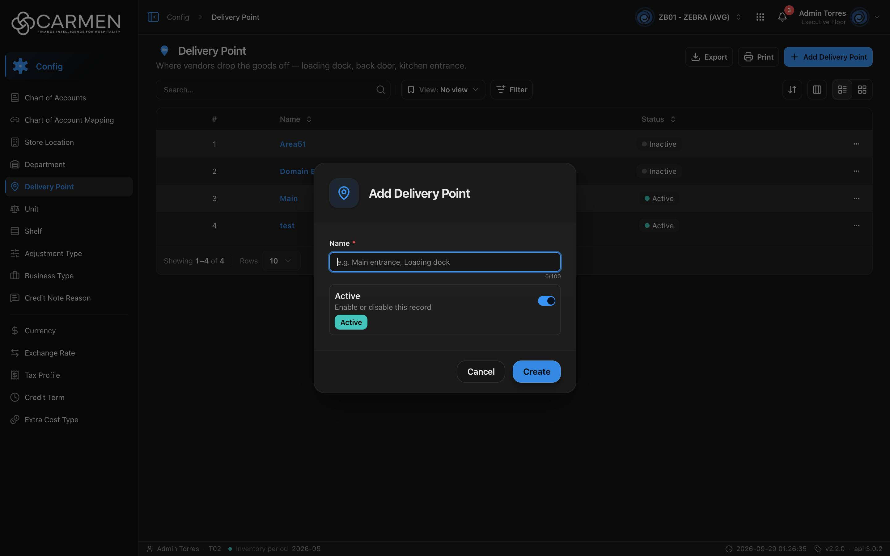

---
**Doc ID:** CB-MODAL-009
**Title:** Delivery Point Dialog
**Domain:** All users
**Parent Page(s):** CB-PAGE-010 — Delivery Point
**Status:** Draft
**Created:** 2026-09-29
**Last Updated:** 2026-09-29
**Author:** Claude (จากโค้ด + ภาพหน้าจอจริง)
**Parent Flow:** N/A — master data CRUD ไม่มี workflow
---

## 8.10.10.1 Delivery Point Dialog

> Dialog สร้าง/แก้ไข Delivery Point (ชื่อ + สถานะ) — โค้ดอยู่ที่ `components/share/delivery-point-dialog.tsx` (ไม่ใช่ในโฟลเดอร์ route)

---

### 8.10.10.1.1 Trigger

| Trigger | Source Page | Condition |
|---------|------------|-----------|
| Click **+ Add Delivery Point** | CB-PAGE-010 (Delivery Point) | โหมด Create — ต้อง `canWrite` และ (admin หรือ `configuration.delivery_point.create`) |
| Click ชื่อในคอลัมน์ **Name** / แตะการ์ด | CB-PAGE-010 | โหมด Edit — readOnly ถ้าไม่มี `.update` หรือ `!canWrite` |

---

### 8.10.10.1.2 Modal Layout



```
[📍 icon]  Add Delivery Point          (Edit: "Edit Delivery Point")
────────────────────────────────────
Name *
[e.g. Main entrance, Loading dock ]  0/100
┌──────────────────────────────────┐
│ Active                     [●━]  │
│ Enable or disable this record    │
│ [Active]                         │
└──────────────────────────────────┘
────────────────────────────────────
                    [Cancel] [Create]
```

**Modal Size:** Small (max-width 425px) — `ConfigEntityDialog`
**Scrollable:** No — ไม่มีปุ่ม X

---

### 8.10.10.1.3 Search & Filter

N/A — ฟอร์ม

| Field | Mandatory | Description | Business Logic / Remark |
|-------|-----------|-------------|--------------------------|
| Name | Y | ชื่อจุดส่งของ | `z.string().trim().min(1)` → "Name is required"; `maxLength=100` (HTML); placeholder "e.g. Main entrance, Loading dock" |
| Active | N | สวิตช์ `is_active` | default เปิดในโหมด Create |

---

### 8.10.10.1.4 Content Grid Columns

N/A — ไม่มีตาราง

---

### 8.10.10.1.5 Action Buttons

| Button | Color / Type | Description | Behaviour |
|--------|-------------|-------------|-----------|
| Create | Primary (Blue) | สร้าง | POST → toast "Delivery Point created successfully" → ปิด; ระหว่างส่ง "Creating..." |
| Save | Primary (Blue) | บันทึกการแก้ไข | PUT พร้อม `doc_version` → toast "Delivery Point updated successfully" → ปิด; ระหว่างส่ง "Saving..." |
| Cancel | Secondary (White) | ปิด | disabled ระหว่างส่ง |
| Close | Secondary (White) | แทน Cancel ในโหมด readOnly | ไม่มีปุ่มบันทึก |

---

### 8.10.10.1.6 Outcomes

| User Action | Modal Result | Parent Page Effect |
|------------|-------------|-------------------|
| Create/Save สำเร็จ | ปิด | invalidate `DELIVERY_POINTS` → ตาราง refetch |
| Cancel / Close / Esc / backdrop | ปิด | ไม่เปลี่ยน |
| บันทึกล้มเหลว | ค้างอยู่ | toast error |

---

### 8.10.10.1.7 Auto-Population on Selection

| Parent Field | Pre-populated From |
|------------|-------------------|
| Name, Active (Edit) | แถวที่คลิกในตาราง |
| Name "", Active = true | ค่าเริ่มต้น Create |

Fields NOT pre-populated (user must fill):
- Name

---

### 8.10.10.1.8 Validation & Error States

| # | Scenario | System Behaviour |
|---|----------|-----------------|
| 1 | Name ว่าง / มีแต่ช่องว่าง | inline "Name is required"; ไม่ submit |
| 2 | Session expired | refresh token + retry; ไม่สำเร็จ → `/login` |
| 3 | API error | toast กลาง (`ApiErrorToaster`); dialog ไม่ปิด |
| 4 | Concurrent edit | PUT ส่ง `doc_version` — 409 → "Someone else changed this document. Refresh the page and try again." |
| 5 | ไม่มีสิทธิ์ / license หมดอายุ | readOnly: ช่อง disabled, ปุ่ม Close อย่างเดียว |
| 6 | Double-submit | ปุ่ม disabled + Esc ปิดไม่ได้ระหว่าง pending |
| 7 | ชื่อซ้ำ | FE ไม่ตรวจ — ขึ้นกับ backend |

---

### 8.10.10.1.9 API Endpoints

| Method | Endpoint | Purpose |
|--------|----------|---------|
| POST | `/api/config/{bu_code}/delivery-points` | สร้าง — `{ name, is_active }` |
| PUT | `/api/config/{bu_code}/delivery-points/{id}` | แก้ไข — `{ doc_version, name, is_active }` |

---

### 8.10.10.1.10 Related Documents

| Doc ID | Title | Relationship |
|--------|-------|-------------|
| CB-PAGE-010 | Delivery Point | Opens this modal via Add / คลิกชื่อ |
| N/A | — | ไม่มี parent flow |
