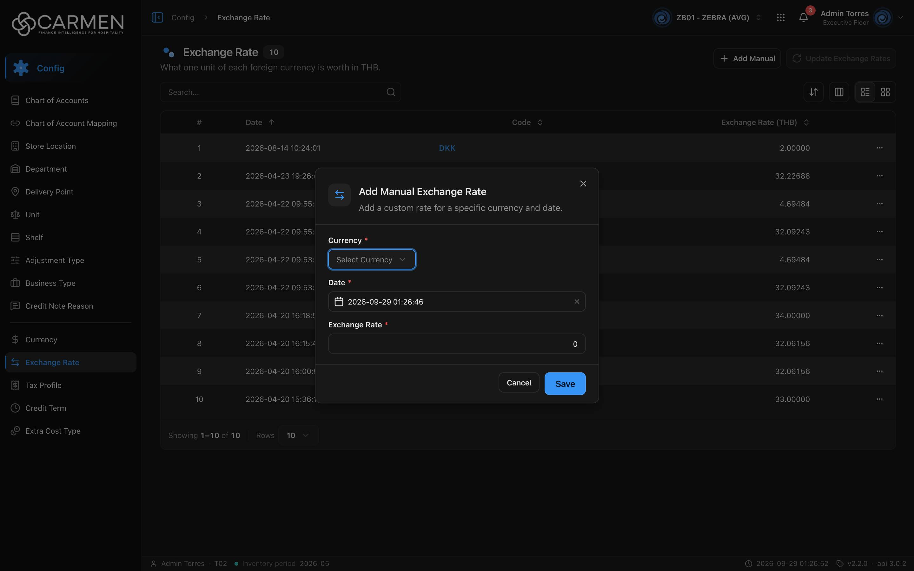

---
**Doc ID:** CB-MODAL-010
**Title:** Exchange Rate Dialog (Add Manual / Edit)
**Domain:** All users
**Parent Page(s):** CB-PAGE-011 — Exchange Rate
**Status:** Draft
**Created:** 2026-09-29
**Last Updated:** 2026-09-29
**Author:** Claude (จากโค้ด + ภาพหน้าจอจริง)
**Parent Flow:** N/A — master data CRUD ไม่มี workflow
---

## 8.11.10.1 Exchange Rate Dialog (Add Manual / Edit)

> Dialog เดียว (`ExchangeRateDialog`, `routes/config/exchange-rate/exchange-rate-dialog.tsx`) มีสองโหมด: **Create** = เพิ่มอัตราแลกเปลี่ยนด้วยมือสำหรับสกุลเงิน + วันที่, **Edit** = แก้ค่าอัตราของรายการที่มีอยู่

---

### 8.11.10.1.1 Trigger

| Trigger | Source Page | Condition |
|---------|------------|-----------|
| Click **+ Add Manual** | CB-PAGE-011 (Exchange Rate) | เปิดโหมด Create — ไม่มีเงื่อนไข permission/license ฝั่ง FE |
| Click **Code** ในแถว / แตะการ์ด | CB-PAGE-011 | เปิดโหมด Edit — ไม่มีโหมด readOnly |

---

### 8.11.10.1.2 Modal Layout



**โหมด Create**
```
[⇄ icon] Add Manual Exchange Rate                    [X]
         Add a custom rate for a specific currency and date.
────────────────────────────────────
Currency *
[Select Currency ▾]
Date *
[📅 2026-09-29 01:26:46              ✕]
Exchange Rate *
[                                  0 ]
────────────────────────────────────
                         [Cancel] [Save]
```

**โหมด Edit** (จากโค้ด — ไม่มีภาพหน้าจอ)
```
[⇄ icon] Edit Exchange Rate                          [X]
         Update the exchange rate for the selected record.
────────────────────────────────────
[USD] | 📅 {at_date} | 🕘 {audit.updated.at}
────────────────────────────────────
┌ CURRENCY CODE · CURRENT ┐
│        32.22688          │
└──────────────────────────┘
            ↓
Exchange Rate · New
[                         32.22688 ]
┌──────────────────────────────────┐
│ ▲ INCREASE / ▼ DECREASE / — NO CHANGE      +0.10000 │
│ vs current rate                              +0.31% │
└──────────────────────────────────┘
────────────────────────────────────
                         [Cancel] [Save]
```

**Modal Size:** Medium (`sm:max-w-md`, ~448px)
**Scrollable:** No — มีปุ่ม X มุมขวาบน (default ของ `DialogContent`)

---

### 8.11.10.1.3 Search & Filter

| Filter | Type | Description | Default |
|--------|------|-------------|---------|
| Currency | Dropdown (`LookupCurrency`) | รายการรหัสสกุลเงิน | ว่าง — placeholder "Select Currency" |

**Search trigger:** N/A — dropdown ไม่มีช่องค้นหา; แสดงเฉพาะสกุลเงินที่ `is_active` จาก `GET currencies?perpage=30` และตัดสกุลเงินหลักของผู้ใช้ (`defaultCurrencyId`) ออก

**ฟิลด์ของฟอร์ม:**

| Field | Mandatory | Description | Business Logic / Remark |
|-------|-----------|-------------|--------------------------|
| Currency (Create) | Y | สกุลเงินต่างประเทศ | "Currency is required"; โหลดแค่ 30 รายการแรก |
| Date (Create) | Y | `at_date` วันที่-เวลาที่อัตรามีผล | date-time picker (`includeTime`); default = เวลาปัจจุบันตอนเปิด; ปุ่ม ✕ ล้างค่าได้ → "Date is required" |
| Exchange Rate (Create) | Y | 1 หน่วยต่างประเทศ = x base | `z.coerce.number().min(0)` → "Exchange Rate must be 0 or more"; default 0 — **ค่า 0 ผ่าน validation**; step 0.0001, placeholder "1.0000" |
| Exchange Rate · New (Edit) | Y | อัตราใหม่ | `min(0)`; ปุ่ม Save disabled จนกว่าค่าจะต่างจากเดิม (> 1e-6) |
| Current (Edit) | — | อัตราเดิม (read-only) | แสดงอย่างเดียว |
| Delta (Edit) | — | ส่วนต่าง + % เทียบอัตราเดิม | Increase (ไอคอนเขียว) / Decrease (แดง) / No change (เทา) |

---

### 8.11.10.1.4 Content Grid Columns

N/A — ไม่มีตาราง

---

### 8.11.10.1.5 Action Buttons

| Button | Color / Type | Description | Behaviour |
|--------|-------------|-------------|-----------|
| Save (Create) | Primary (Blue) | บันทึกอัตราใหม่ | POST array 1 ตัว → toast "Exchange Rate created successfully" → reset ฟอร์ม + ปิด; ระหว่างส่ง "Saving..." |
| Save (Edit) | Primary (Blue) | บันทึกอัตราที่แก้ | disabled ถ้าไม่มีการเปลี่ยนค่า; PATCH `{ doc_version, exchange_rate }` → toast "Exchange Rate updated successfully" → ปิด |
| Cancel | Secondary (White) | ปิดโดยไม่บันทึก | disabled ระหว่างส่ง |
| X | Icon | ปิด | ระหว่างส่งปิดไม่ได้ (`onOpenChange` ถูกตัด) |

---

### 8.11.10.1.6 Outcomes

| User Action | Modal Result | Parent Page Effect |
|------------|-------------|-------------------|
| Create สำเร็จ | ปิด | invalidate `EXCHANGE_RATES` + `CURRENCIES` → รายการ refetch, อัตราในหน้า Currency อัปเดต |
| Edit สำเร็จ | ปิด | เหมือนข้างบน |
| Cancel / X / Esc / backdrop | ปิด | ไม่เปลี่ยน |
| บันทึกล้มเหลว | ค้างอยู่ | toast error |

---

### 8.11.10.1.7 Auto-Population on Selection

| Parent Field | Pre-populated From |
|------------|-------------------|
| Date (Create) | เวลาปัจจุบัน (`new Date().toISOString()`) |
| Exchange Rate (Create) | 0 |
| Currency code / Date / Updated at / Current / New (Edit) | แถวที่คลิกจากรายการ |

Fields NOT pre-populated (user must fill):
- Currency (Create)
- Exchange Rate (Create)

---

### 8.11.10.1.8 Validation & Error States

| # | Scenario | System Behaviour |
|---|----------|-----------------|
| 1 | ไม่เลือก Currency / ล้าง Date | inline "Currency is required" / "Date is required" |
| 2 | Exchange Rate ติดลบ | "Exchange Rate must be 0 or more" — แต่ **ค่า 0 บันทึกได้** (ไม่มี `> 0`) |
| 3 | Session expired | refresh token + retry; ไม่สำเร็จ → `/login`, ค่าในฟอร์มหาย |
| 4 | API error | toast กลาง; dialog ไม่ปิด |
| 5 | Concurrent edit (Edit) | ส่ง `doc_version` (คอมเมนต์ในโค้ดระบุว่า backend ต้องใช้เพื่อ OCC) — 409 → "Someone else changed this document. Refresh the page and try again." |
| 6 | ไม่มีสิทธิ์ / license หมดอายุ | FE ไม่กัน — dialog เปิดและกรอกได้ปกติ, ถูกปฏิเสธที่ backend ตอนกด Save (403 → Permission denied dialog) |
| 7 | สกุลเงิน + วันที่ซ้ำกับที่มีอยู่ | FE ไม่ตรวจ — ขึ้นกับ backend |
| 8 | สกุลเงินที่ต้องการอยู่เกินลำดับที่ 30 | ไม่ปรากฏใน dropdown |
| 9 | Double-submit | ปุ่ม disabled ระหว่าง pending |

---

### 8.11.10.1.9 API Endpoints

| Method | Endpoint | Purpose |
|--------|----------|---------|
| GET | `/api/config/{bu_code}/currencies?perpage=30` | โหลดตัวเลือก Currency |
| POST | `/api/config/{bu_code}/exchange-rates` | Create — body `[{ currency_id, at_date, exchange_rate }]` (array แม้มีตัวเดียว เพราะใช้ endpoint เดียวกับ bulk update) |
| PATCH | `/api/config/{bu_code}/exchange-rates/{id}` | Edit — body `{ doc_version, exchange_rate }` |

---

### 8.11.10.1.10 Related Documents

| Doc ID | Title | Relationship |
|--------|-------|-------------|
| CB-PAGE-011 | Exchange Rate | Opens this modal via Add Manual / คลิก Code |
| N/A | — | ไม่มี parent flow |
