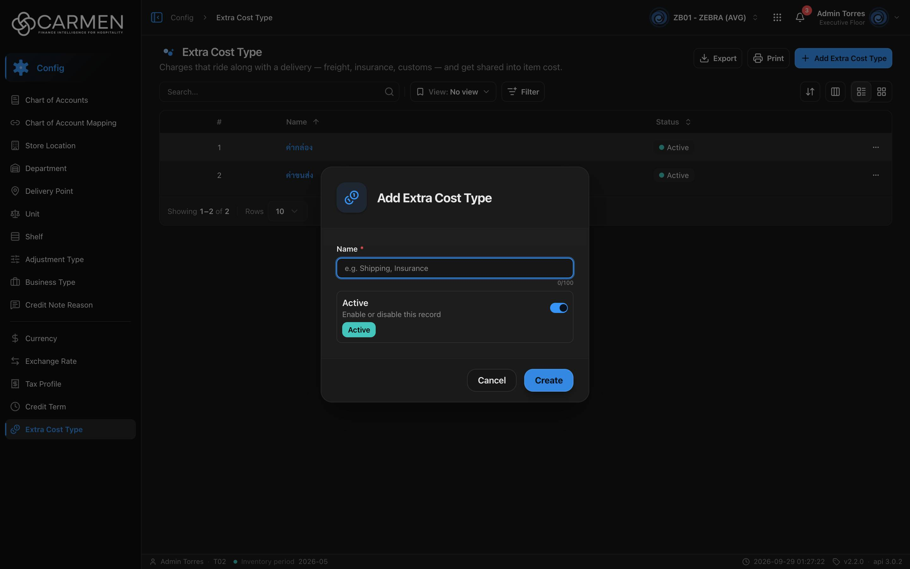

---
**Doc ID:** CB-MODAL-011
**Title:** Extra Cost Type Dialog
**Domain:** All users
**Parent Page(s):** CB-PAGE-012 — Extra Cost Type
**Status:** Draft
**Created:** 2026-09-29
**Last Updated:** 2026-09-29
**Author:** Claude (จากโค้ด + ภาพหน้าจอจริง)
**Parent Flow:** N/A — master data CRUD ไม่มี workflow
---

## 8.12.10.1 Extra Cost Type Dialog

> Dialog สร้าง/แก้ไข Extra Cost Type (ชื่อ + สถานะ) — `routes/config/extra-cost/extra-cost-dialog.tsx` บน template `ConfigEntityDialog` (lazy-load ตอนเปิดครั้งแรก)

---

### 8.12.10.1.1 Trigger

| Trigger | Source Page | Condition |
|---------|------------|-----------|
| Click **+ Add Extra Cost Type** | CB-PAGE-012 (Extra Cost Type) | โหมด Create — `canWrite` และ (admin หรือ `configuration.extra_cost.create`) |
| Click ชื่อในคอลัมน์ **Name** / แตะการ์ด | CB-PAGE-012 | โหมด Edit — readOnly ถ้าไม่มี `configuration.extra_cost.update` หรือ `!canWrite` |

---

### 8.12.10.1.2 Modal Layout



```
[🪙 icon]  Add Extra Cost Type         (Edit: "Edit Extra Cost Type")
────────────────────────────────────
Name *
[e.g. Shipping, Insurance         ]  0/100
┌──────────────────────────────────┐
│ Active                     [●━]  │
│ Enable or disable this record    │
│ [Active]                         │
└──────────────────────────────────┘
────────────────────────────────────
                    [Cancel] [Create]
```

**Modal Size:** Small (max-width 425px)
**Scrollable:** No — ไม่มีปุ่ม X

---

### 8.12.10.1.3 Search & Filter

N/A — ฟอร์ม

| Field | Mandatory | Description | Business Logic / Remark |
|-------|-----------|-------------|--------------------------|
| Name | Y | ชื่อประเภทค่าใช้จ่าย | `min(1)` → "Name is required" (ไม่ trim — ช่องว่างล้วนผ่าน FE); `maxLength=100` (HTML); placeholder "e.g. Shipping, Insurance" |
| Active | N | สวิตช์ `is_active` | default เปิดในโหมด Create |

---

### 8.12.10.1.4 Content Grid Columns

N/A — ไม่มีตาราง

---

### 8.12.10.1.5 Action Buttons

| Button | Color / Type | Description | Behaviour |
|--------|-------------|-------------|-----------|
| Create | Primary (Blue) | สร้าง | POST → toast "Extra Cost Type created successfully" → ปิด; "Creating..." ระหว่างส่ง |
| Save | Primary (Blue) | บันทึกการแก้ไข | PATCH + `doc_version` → toast "Extra Cost Type updated successfully" → ปิด; "Saving..." |
| Cancel | Secondary (White) | ปิด | disabled ระหว่างส่ง |
| Close | Secondary (White) | แทน Cancel ในโหมด readOnly | — |

---

### 8.12.10.1.6 Outcomes

| User Action | Modal Result | Parent Page Effect |
|------------|-------------|-------------------|
| Create/Save สำเร็จ | ปิด | invalidate `EXTRA_COSTS` → ตาราง refetch |
| Cancel / Close / Esc / backdrop | ปิด | ไม่เปลี่ยน |
| บันทึกล้มเหลว | ค้างอยู่ | toast error |

---

### 8.12.10.1.7 Auto-Population on Selection

| Parent Field | Pre-populated From |
|------------|-------------------|
| Name, Active (Edit) | แถวที่คลิก |
| Name "", Active = true | `EMPTY_FORM` (Create) |

Fields NOT pre-populated (user must fill):
- Name

---

### 8.12.10.1.8 Validation & Error States

| # | Scenario | System Behaviour |
|---|----------|-----------------|
| 1 | Name ว่าง | inline "Name is required" |
| 2 | Session expired | refresh token + retry; ไม่สำเร็จ → `/login` |
| 3 | API error | toast กลาง; dialog ไม่ปิด |
| 4 | Concurrent edit | PATCH ส่ง `doc_version` — 409 → "Someone else changed this document. Refresh the page and try again." |
| 5 | ไม่มีสิทธิ์ / license หมดอายุ | readOnly (ปุ่ม Close อย่างเดียว) — สิทธิ์ที่ตรวจคือ `configuration.extra_cost.update` (ดู CB-PAGE-012 §8.12.14 #7) |
| 6 | Double-submit | ปุ่ม disabled + Esc ใช้ไม่ได้ระหว่าง pending |
| 7 | ชื่อซ้ำ | FE ไม่ตรวจ — ขึ้นกับ backend |

---

### 8.12.10.1.9 API Endpoints

| Method | Endpoint | Purpose |
|--------|----------|---------|
| POST | `/api/config/{bu_code}/extra-cost-types` | สร้าง — `{ name, is_active }` |
| PATCH | `/api/config/{bu_code}/extra-cost-types/{id}` | แก้ไข — `{ doc_version, name, is_active }` |

---

### 8.12.10.1.10 Related Documents

| Doc ID | Title | Relationship |
|--------|-------|-------------|
| CB-PAGE-012 | Extra Cost Type | Opens this modal via Add / คลิกชื่อ |
| N/A | — | ไม่มี parent flow |
