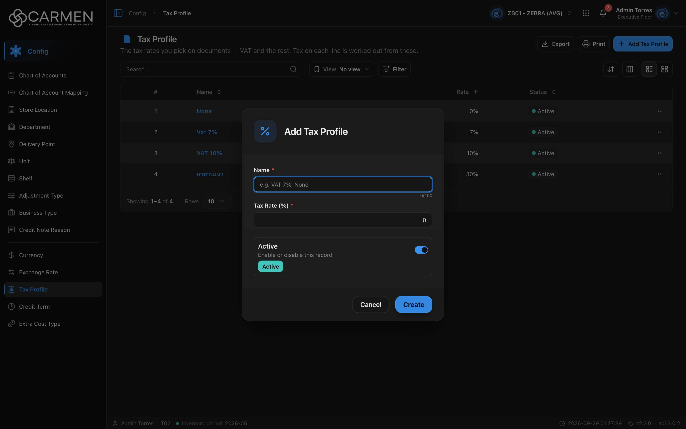

---
**Doc ID:** CB-MODAL-012
**Title:** Tax Profile Dialog
**Domain:** All users
**Parent Page(s):** CB-PAGE-013 — Tax Profile
**Status:** Draft
**Created:** 2026-09-29
**Last Updated:** 2026-09-29
**Author:** Claude (จากโค้ด + ภาพหน้าจอจริง)
**Parent Flow:** N/A — master data CRUD ไม่มี workflow
---

## 8.13.10.1 Tax Profile Dialog

> Dialog สร้าง/แก้ไข Tax Profile (ชื่อ, อัตราภาษี %, สถานะ) — `routes/config/tax-profile/tax-profile-dialog.tsx` บน `ConfigEntityDialog`

---

### 8.13.10.1.1 Trigger

| Trigger | Source Page | Condition |
|---------|------------|-----------|
| Click **+ Add Tax Profile** | CB-PAGE-013 (Tax Profile) | โหมด Create — `canWrite` และ (admin หรือ `configuration.tax_profile.create`) |
| Click ชื่อในคอลัมน์ **Name** / แตะการ์ด | CB-PAGE-013 | โหมด Edit — readOnly ถ้าไม่มี `.update` หรือ `!canWrite` |

---

### 8.13.10.1.2 Modal Layout



```
[% icon]  Add Tax Profile              (Edit: "Edit Tax Profile")
────────────────────────────────────
Name *
[e.g. VAT 7%, None                ]  0/100
Tax Rate (%) *
[                                0 ]
┌──────────────────────────────────┐
│ Active                     [●━]  │
│ Enable or disable this record    │
│ [Active]                         │
└──────────────────────────────────┘
────────────────────────────────────
                    [Cancel] [Create]
```

**Modal Size:** Small (max-width 425px)
**Scrollable:** No — ไม่มีปุ่ม X

---

### 8.13.10.1.3 Search & Filter

N/A — ฟอร์ม

| Field | Mandatory | Description | Business Logic / Remark |
|-------|-----------|-------------|--------------------------|
| Name | Y | ชื่อ tax profile | `min(1)` → "Name is required"; `maxLength=100` (HTML); placeholder "e.g. VAT 7%, None" |
| Tax Rate (%) | Y | อัตราภาษีเป็นเปอร์เซ็นต์ | `z.number().min(0)` → "Tax rate must be positive" (แต่ **0 ผ่าน** — ใช้กับโปรไฟล์ "None"); **ไม่มีเพดาน** (เช่น 150 ผ่าน FE); `step="any"` รับทศนิยม; default 0 |
| Active | N | สวิตช์ `is_active` | default เปิดในโหมด Create |

---

### 8.13.10.1.4 Content Grid Columns

N/A — ไม่มีตาราง

---

### 8.13.10.1.5 Action Buttons

| Button | Color / Type | Description | Behaviour |
|--------|-------------|-------------|-----------|
| Create | Primary (Blue) | สร้าง | POST → toast "Tax Profile created successfully" → ปิด; "Creating..." |
| Save | Primary (Blue) | บันทึกการแก้ไข | PATCH + `doc_version` → toast "Tax Profile updated successfully" → ปิด; "Saving..." |
| Cancel | Secondary (White) | ปิด | disabled ระหว่างส่ง |
| Close | Secondary (White) | แทน Cancel ในโหมด readOnly | — |

---

### 8.13.10.1.6 Outcomes

| User Action | Modal Result | Parent Page Effect |
|------------|-------------|-------------------|
| Create/Save สำเร็จ | ปิด | invalidate `TAX_PROFILES` → ตาราง refetch |
| Cancel / Close / Esc / backdrop | ปิด | ไม่เปลี่ยน |
| บันทึกล้มเหลว | ค้างอยู่ | toast error |

---

### 8.13.10.1.7 Auto-Population on Selection

| Parent Field | Pre-populated From |
|------------|-------------------|
| Name, Tax Rate (%), Active (Edit) | แถวที่คลิก |
| Name "", Tax Rate 0, Active = true | `EMPTY_FORM` (Create) |

Fields NOT pre-populated (user must fill):
- Name
- Tax Rate (%) (ถ้าไม่ใช่ 0)

---

### 8.13.10.1.8 Validation & Error States

| # | Scenario | System Behaviour |
|---|----------|-----------------|
| 1 | Name ว่าง | inline "Name is required" |
| 2 | Tax Rate ติดลบ | inline "Tax rate must be positive" |
| 3 | Tax Rate ว่าง | `valueAsNumber` ได้ NaN → zod ขึ้นข้อความ default (ไม่ผ่าน i18n) |
| 4 | Session expired | refresh token + retry; ไม่สำเร็จ → `/login` |
| 5 | API error | toast กลาง; dialog ไม่ปิด |
| 6 | Concurrent edit | PATCH ส่ง `doc_version` (backend บังคับ — ไม่ส่งได้ 400) — 409 → "Someone else changed this document. Refresh the page and try again." |
| 7 | ไม่มีสิทธิ์ / license หมดอายุ | readOnly (ปุ่ม Close อย่างเดียว) |
| 8 | Double-submit | ปุ่ม disabled + Esc ใช้ไม่ได้ระหว่าง pending |

---

### 8.13.10.1.9 API Endpoints

| Method | Endpoint | Purpose |
|--------|----------|---------|
| POST | `/api/config/{bu_code}/tax-profiles` | สร้าง — `{ name, tax_rate, is_active }` |
| PATCH | `/api/config/{bu_code}/tax-profiles/{id}` | แก้ไข — `{ doc_version, name, tax_rate, is_active }` |

---

### 8.13.10.1.10 Related Documents

| Doc ID | Title | Relationship |
|--------|-------|-------------|
| CB-PAGE-013 | Tax Profile | Opens this modal via Add / คลิกชื่อ |
| N/A | — | ไม่มี parent flow |
