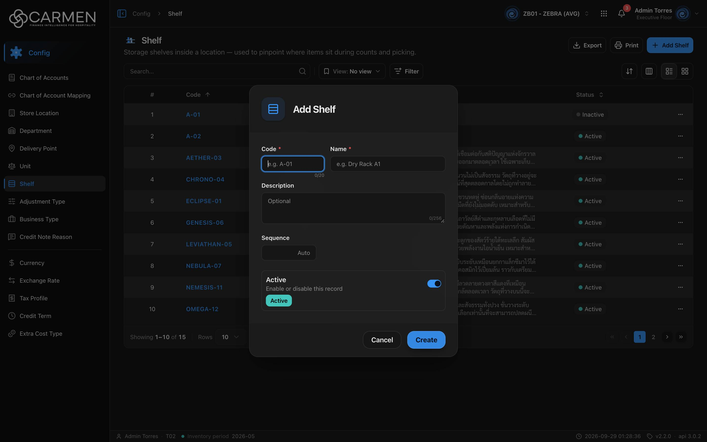

---
**Doc ID:** CB-MODAL-013
**Title:** Shelf Dialog (Add / Edit)
**Domain:** All users
**Parent Page(s):** CB-PAGE-018 — Shelf
**Status:** Draft
**Created:** 2026-09-29
**Last Updated:** 2026-09-29
**Author:** Claude (จากโค้ด + ภาพหน้าจอจริง)
**Parent Flow:** N/A — master data CRUD ไม่มี workflow
---

## 8.18.10.1 Shelf Dialog

> Dialog สร้าง / แก้ไขชั้นวาง บนหน้า Shelf (CB-PAGE-018) — สร้างจาก template กลาง `ConfigEntityDialog` (`components/templates/config-entity-dialog.tsx`), ฟิลด์อยู่ใน `routes/config/shelf/shelf-dialog.tsx`

---

### 8.18.10.1.1 Trigger

| Trigger | Source Page | Condition |
|---------|------------|-----------|
| Click **+ Add Shelf** | CB-PAGE-018 (Shelf) | โหมด Add — ต้องผ่านเช็คสิทธิ์ create (โค้ดเช็คคีย์ `configuration.shelf.create` ซึ่งไม่มีจริง — ดู CB-PAGE-018 §8.18.2) และ license active |
| คลิก **Code** ในแถว / เปิดการ์ด (โหมด Grid) | CB-PAGE-018 (Shelf) | โหมด Edit — เปิดได้เสมอ แต่เป็น **readOnly** เมื่อไม่มีสิทธิ์ update หรือ license หมดอายุ |

---

### 8.18.10.1.2 Modal Layout



```
[Icon ▤]  Add Shelf            (Edit: "Edit Shelf")
────────────────────────────────────────────
Code *            Name *
[e.g. A-01] 0/20  [e.g. Dry Rack A1        ]
Description
[Optional                            0/256]
Sequence
[      Auto]
┌ Active                          (●──) ┐
│ Enable or disable this record          │
│ [Active]                               │
└────────────────────────────────────────┘
────────────────────────────────────────────
                         [Cancel] [Create]   (Edit: [Cancel] [Save]; readOnly: [Close])
```

**Modal Size:** Small (`sm:max-w-[425px]`)
**Scrollable:** No — เนื้อหาสั้น แสดงครบในหน้าต่างเดียว (ไม่มีปุ่ม X มุมขวาบน — `showCloseButton={false}`)

---

### 8.18.10.1.3 Search & Filter

N/A — dialog ฟอร์ม ไม่มีการค้นหา

**Search trigger:** N/A

---

### 8.18.10.1.4 Content Grid Columns

N/A — ไม่มีตาราง; ฟิลด์ของฟอร์มมีดังนี้

| Field | Mandatory | Description | Business Logic / Remark |
|-------|-----------|-------------|--------------------------|
| Code | Y | รหัสชั้นวาง | Placeholder "e.g. A-01"; maxLength **20** + ตัวนับ "0/20"; ว่าง → "Code is required" |
| Name | Y | ชื่อชั้นวาง | Placeholder "e.g. Dry Rack A1"; maxLength **100**; ว่าง → "Name is required" |
| Description | N | คำอธิบาย | Textarea; maxLength **256** + ตัวนับ; ว่าง → ไม่ส่ง (`undefined`) |
| Sequence | N | ลำดับการเรียง | input ตัวเลข ชิดขวา placeholder "Auto"; **ว่าง = ไม่ส่ง ให้ backend จัดลำดับเอง**; ต้องเป็นจำนวนเต็ม ≥ 1 ไม่งั้น "Sequence must be at least 1" |
| Active | N | สวิตช์สถานะ ("Enable or disable this record") | Default: เปิด ในโหมด Add |

**Selection behaviour:** N/A

---

### 8.18.10.1.5 Action Buttons

| Button | Color / Type | Description | Behaviour |
|--------|-------------|-------------|-----------|
| Create | Primary (Blue) | สร้างชั้นวาง (โหมด Add) | validate → POST; ระหว่างส่ง "Creating..."; สำเร็จ → toast "Shelf created successfully" + ปิด dialog |
| Save | Primary (Blue) | บันทึก (โหมด Edit) | PATCH พร้อม `doc_version`; ระหว่างส่ง "Saving..."; สำเร็จ → toast "Shelf updated successfully" + ปิด dialog |
| Cancel | Secondary (White) | ปิดโดยไม่บันทึก | ไม่มี Discard confirmation แม้แก้ค่าแล้ว; disabled ระหว่าง pending |
| Close | Secondary (White) | แทน Cancel เมื่อ readOnly | ไม่มีปุ่ม Save/Create; ทุกช่อง disabled |

---

### 8.18.10.1.6 Outcomes

| User Action | Modal Result | Parent Page Effect |
|------------|-------------|-------------------|
| กรอกครบ → Create | Modal closes | list refetch (invalidate `shelves`) แถวใหม่ปรากฏตาม sort ปัจจุบัน |
| แก้ไข → Save | Modal closes | แถวในตารางอัปเดต |
| Click Cancel / Close | Modal closes | No change — ค่าที่พิมพ์ทิ้งไป (เปิดใหม่ `form.reset` จากข้อมูลแถว) |
| Esc / คลิก backdrop | Same as Cancel (ยกเว้นระหว่าง pending ปิดไม่ได้) | No change |
| Save ล้มเหลว | Modal ค้างเปิด ค่ายังอยู่ | toast error กลาง |

---

### 8.18.10.1.7 Auto-Population on Selection

โหมด Edit เติมค่าจากแถวที่คลิก (`getDefaultValues(shelf)`):

| Parent Field | Pre-populated From |
|------------|-------------------|
| Code | `shelf.code` |
| Name | `shelf.name` |
| Description | `shelf.description` (null → "") |
| Sequence | `shelf.sequence_no` (null → ว่าง) |
| Active | `shelf.is_active` |

Fields NOT pre-populated (user must fill):
- โหมด Add: Code, Name (บังคับ); Description / Sequence ปล่อยว่างได้

---

### 8.18.10.1.8 Validation & Error States

| # | Scenario | System Behaviour |
|---|----------|-----------------|
| 1 | Code / Name ว่าง → Create | inline error "Code is required" / "Name is required"; ไม่ยิง API |
| 2 | Sequence = 0, ติดลบ หรือทศนิยม | inline error "Sequence must be at least 1" |
| 3 | Code ซ้ำ / backend ปฏิเสธ | toast error กลางจากข้อความ backend; dialog ค้างเปิด |
| 4 | Concurrent edit | `doc_version` ไม่ตรง → 409 → toast "Someone else changed this document. Refresh the page and try again." |
| 5 | Session expired | 401 → refresh token + retry อัตโนมัติ; ล้มเหลว → redirect `/login` ค่าใน dialog หาย |
| 6 | Double submit / slow network | ปุ่ม submit และ Cancel disabled ระหว่าง pending; ปิดด้วย Esc/backdrop ไม่ได้ |
| 7 | ไม่มีสิทธิ์ update / license หมด | เปิดเป็น readOnly — ฟิลด์ disabled, มีแค่ปุ่ม Close |

---

### 8.18.10.1.9 API Endpoints

| Method | Endpoint | Purpose |
|--------|----------|---------|
| POST | `/api/config/{bu_code}/shelves` | สร้าง — body `{ code, name, description?, sequence_no?, is_active }` |
| PATCH | `/api/config/{bu_code}/shelves/{id}` | แก้ไข — body เดียวกัน + `doc_version` |

---

### 8.18.10.1.10 Related Documents

| Doc ID | Title | Relationship |
|--------|-------|-------------|
| CB-PAGE-018 | Shelf | Opens this modal via **+ Add Shelf** / คลิก Code |
| CB-MODAL-014 | Delete Confirmation | dialog ลบของหน้าเดียวกัน |
