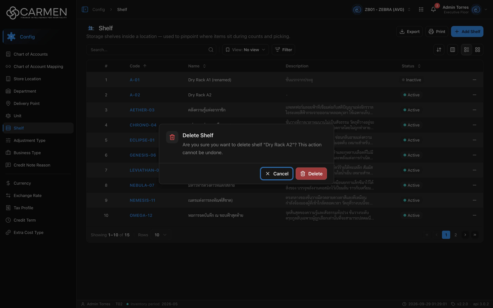

---
**Doc ID:** CB-MODAL-014
**Title:** Delete Confirmation (shared)
**Domain:** All users
**Parent Page(s):** CB-PAGE-018 — Shelf (primary) · CB-PAGE-002 — Chart of Accounts · CB-PAGE-004 — Unit · CB-PAGE-005 — Currency · CB-PAGE-006 — Adjustment Type · CB-PAGE-007 — Business Type · CB-PAGE-008 — Credit Note Reason · CB-PAGE-009 — Credit Term · CB-PAGE-010 — Delivery Point · CB-PAGE-011 — Exchange Rate · CB-PAGE-012 — Extra Cost Type · CB-PAGE-013 — Tax Profile · CB-PAGE-014 — Department · CB-PAGE-015 — Department Form · CB-PAGE-016 — Store Location · CB-PAGE-017 — Store Location Form
**Status:** Draft
**Created:** 2026-09-29
**Last Updated:** 2026-09-29
**Author:** Claude (จากโค้ด + ภาพหน้าจอจริง)
**Parent Flow:** N/A — master data CRUD ไม่มี workflow
---

## 8.18.10.2 Delete Confirmation

> Alert dialog ยืนยันการลบรายการ master data หนึ่งรายการ — component กลาง `DeleteDialog` (`components/ui/delete-dialog.tsx`) ที่ทุกหน้า config list ใช้ผ่าน `ConfigListTemplate` (row action **Delete** / ปุ่มลบบนการ์ด) และหน้าฟอร์มเต็มหน้าใช้ตรง ๆ

---

### 8.18.10.2.1 Trigger

| Trigger | Source Page | Condition |
|---------|------------|-----------|
| ⋯ → **Delete** ในแถว (หรือปุ่มลบบนการ์ดในโหมด Grid) | CB-PAGE-018 (Shelf) และทุกหน้า config list ในตารางด้านล่าง | ต้องมีสิทธิ์ `{prefix}.delete` (ไม่มี → Permission Denied dialog แทน ไม่เปิด modal นี้) และ license active (หมดอายุ → เมนู Delete disabled) |
| ปุ่ม **Delete** ใน toolbar ฟอร์ม | CB-PAGE-015 (Department Form), CB-PAGE-017 (Store Location Form) | โหมด View/Edit เท่านั้น; สิทธิ์/license เช็คโดย `FormToolbar` |

**หน้าที่ใช้ modal นี้ (ตรวจจากโค้ดแล้วทุกหน้า):**

| Parent Page | ใช้ผ่าน | Title | Body (`{name}` มาจากฟิลด์) |
|-------------|---------|-------|---------------------------|
| CB-PAGE-002 Chart of Accounts | `ConfigListTemplate` | Delete Account | `Are you sure you want to delete account "{name}"? …` — `{name}` = **code** |
| CB-PAGE-004 Unit | `ConfigListTemplate` | Delete Unit | `… delete unit "{name}"? …` — name |
| CB-PAGE-005 Currency | `ConfigListTemplate` | Delete Currency | `… delete currency "{name}"? …` — `{name}` = **code** |
| CB-PAGE-006 Adjustment Type | `ConfigListTemplate` | Delete Adjustment Type | `… delete adjustment type "{name}"? …` |
| CB-PAGE-007 Business Type | `ConfigListTemplate` | Delete Business Type | `… delete business type "{name}"? …` |
| CB-PAGE-008 Credit Note Reason | `ConfigListTemplate` | Delete Credit Note Reason | `… delete credit note reason "{name}"? …` |
| CB-PAGE-009 Credit Term | `ConfigListTemplate` | Delete Credit Term | `… delete credit term "{name}"? …` |
| CB-PAGE-010 Delivery Point | `ConfigListTemplate` | Delete Delivery Point | `… delete delivery point "{name}"? …` |
| CB-PAGE-011 Exchange Rate | **`DeleteDialog` ตรง ๆ** (หน้านี้ไม่ใช้ `ConfigListTemplate`) | "Exchange Rate" (ใช้ `entity` เป็น title) | `{currency code} — {at_date ตามรูปแบบวันที่}` (ไม่มีประโยค "This action cannot be undone.") |
| CB-PAGE-012 Extra Cost Type | `ConfigListTemplate` | Delete Extra Cost Type | `… delete extra cost type "{name}"? …` |
| CB-PAGE-013 Tax Profile | `ConfigListTemplate` | Delete Tax Profile | `… delete tax profile "{name}"? …` |
| CB-PAGE-014 Department | `ConfigListTemplate` | Delete Department | `… delete department "{name}"? …` |
| CB-PAGE-015 Department Form | `DeleteDialog` ตรง ๆ ในฟอร์ม | Delete Department | ข้อความเดียวกับ list |
| CB-PAGE-016 Store Location | `ConfigListTemplate` | Delete Store Location | `… delete location "{name}"? …` |
| CB-PAGE-017 Store Location Form | `DeleteDialog` ตรง ๆ ในฟอร์ม | Delete Store Location | ข้อความเดียวกับ list |
| CB-PAGE-018 Shelf | `ConfigListTemplate` | Delete Shelf | `Are you sure you want to delete shelf "{name}"? This action cannot be undone.` |

> ทุกหน้าในรายการที่ได้รับมอบหมายใช้ component นี้จริง — ไม่มีหน้าที่ต้องตัดออก ไม่มีหน้าใดส่ง `renderDeleteDialog` แทน dialog มาตรฐาน
> ถ้า title/description ว่าง component จะ fallback เป็น "Delete" / "Are you sure? This action cannot be undone."

---

### 8.18.10.2.2 Modal Layout



```
┌───────────────────────────────────────────────────────────┐
│ [🗑]  Delete Shelf                                         │
│       Are you sure you want to delete shelf "Dry Rack A2"? │
│       This action cannot be undone.                        │
├───────────────────────────────────────────────────────────┤
│                                 [✕ Cancel] [🗑 Delete]     │
└───────────────────────────────────────────────────────────┘
```

**Modal Size:** Small (`sm:max-w-md`, ~448px)
**Scrollable:** No

---

### 8.18.10.2.3 Search & Filter

N/A — dialog ยืนยัน ไม่มีการค้นหา

**Search trigger:** N/A

---

### 8.18.10.2.4 Content Grid Columns

N/A — ไม่มีตาราง; เนื้อหาคือไอคอนถังขยะสีแดง + Title + Description

**Selection behaviour:** N/A — ลบทีละ 1 รายการ (ไม่มี bulk delete บนหน้า config)

---

### 8.18.10.2.5 Action Buttons

| Button | Color / Type | Description | Behaviour |
|--------|-------------|-------------|-----------|
| Cancel | Secondary (White, ไอคอน ✕) | ยกเลิก | ปิด dialog ไม่มีการเปลี่ยนแปลง; ได้ focus ตั้งต้น (ภาพหน้าจอ); disabled ระหว่างลบ |
| Delete | Danger (Red, ไอคอน 🗑) | ยืนยันลบ | เรียก DELETE ของ entity; ระหว่างส่งข้อความเปลี่ยนเป็น "Deleting..." และ disabled; dialog **ไม่ปิดเอง** จนกว่าจะสำเร็จ |

---

### 8.18.10.2.6 Outcomes

| User Action | Modal Result | Parent Page Effect |
|------------|-------------|-------------------|
| Delete → สำเร็จ (หน้า list) | Modal closes | toast "{Entity} deleted successfully" (เช่น "Shelf deleted successfully"); list refetch (invalidate query key ของ entity); อยู่หน้าเดิม |
| Delete → สำเร็จ (CB-PAGE-015 / 017) | Modal closes | toast สำเร็จ แล้วกลับหน้า list พร้อม filter/sort/page เดิม |
| Delete → ล้มเหลว | Modal ค้างเปิด | toast error กลาง (`ApiErrorToaster`) — ผู้ใช้กด Cancel เองได้ |
| Click Cancel | Modal closes | No change |
| Esc / คลิก backdrop | Same as Cancel — **ยกเว้นระหว่างลบ** (`onOpenChange` ถูกบล็อกเมื่อ `isPending`) | No change |

---

### 8.18.10.2.7 Auto-Population on Selection

| Parent Field | Pre-populated From |
|------------|-------------------|
| Title | `config.{entity}.deleteTitle` ของหน้าแม่ |
| `{name}` ใน Description | ฟิลด์ `entityNameField` ของแถวที่เลือก (`name` เป็นส่วนใหญ่, `code` สำหรับ Chart of Accounts และ Currency) |

Fields NOT pre-populated (user must fill):
- ไม่มี — ผู้ใช้กดยืนยันอย่างเดียว

---

### 8.18.10.2.8 Validation & Error States

| # | Scenario | System Behaviour |
|---|----------|-----------------|
| 1 | กด Delete ซ้ำ (double click) | ปุ่ม disabled ทันทีที่ `isPending` — ยิงครั้งเดียว |
| 2 | รายการถูกลบไปแล้วโดยคนอื่น | backend ตอบ error (เช่น 404) → toast "We couldn't find what you were looking for." dialog ค้าง |
| 3 | รายการยังถูกอ้างอิง / backend ปฏิเสธ | toast ข้อความจาก backend ผ่าน toast กลาง; ไม่มี inline message ใน dialog |
| 4 | API / network error | toast "No internet connection. Check your network and try again." หรือข้อความ error ที่ map ได้; dialog ค้าง |
| 5 | Session expired | 401 → refresh token แล้ว retry อัตโนมัติ; ล้มเหลว → redirect `/login` (ไม่มี toast ซ้ำ) |
| 6 | ไม่มีสิทธิ์ delete | modal นี้ไม่เปิด — แสดง Permission Denied dialog แทน; license หมดอายุ → เมนู/ปุ่ม Delete disabled + tooltip "Disabled — your subscription is expired or inactive. Contact your administrator to renew." |
| 7 | Concurrent edit | DELETE ไม่ส่ง `doc_version` — ไม่มี OCC บนการลบ (ลบได้แม้อีกคนเพิ่งแก้ไข = last-write-wins) |

---

### 8.18.10.2.9 API Endpoints

| Method | Endpoint | Purpose |
|--------|----------|---------|
| DELETE | `/api/config/{bu_code}/shelves/{id}` | Shelf (primary parent) |
| DELETE | `/api/config/{bu_code}/{resource}/{id}` | หน้าอื่น — `resource` = `chart-of-accounts`, `units`, `currencies`, `adjustment-types`, `vendor-business-types`, `credit-note-reasons`, `credit-terms`, `delivery-points`, `exchange-rates`, `extra-cost-types`, `tax-profiles`, `departments`, `locations` |

> ทุก path เรียกผ่าน `/api/proxy/...` และ `http-client` rewrite ไป `BACKEND_URL` พร้อม Bearer token + `x-app-id`

---

### 8.18.10.2.10 Related Documents

| Doc ID | Title | Relationship |
|--------|-------|-------------|
| CB-PAGE-018 | Shelf | Primary parent — opens via ⋯ → Delete |
| CB-PAGE-002, 004–014, 016 | Config list pages | Open via ⋯ → Delete / ปุ่มลบบนการ์ด |
| CB-PAGE-015 | Department Form | Opens via toolbar Delete |
| CB-PAGE-017 | Store Location Form | Opens via toolbar Delete |
| CB-MODAL-013 | Shelf Dialog | dialog ข้างเคียงบนหน้า Shelf |
