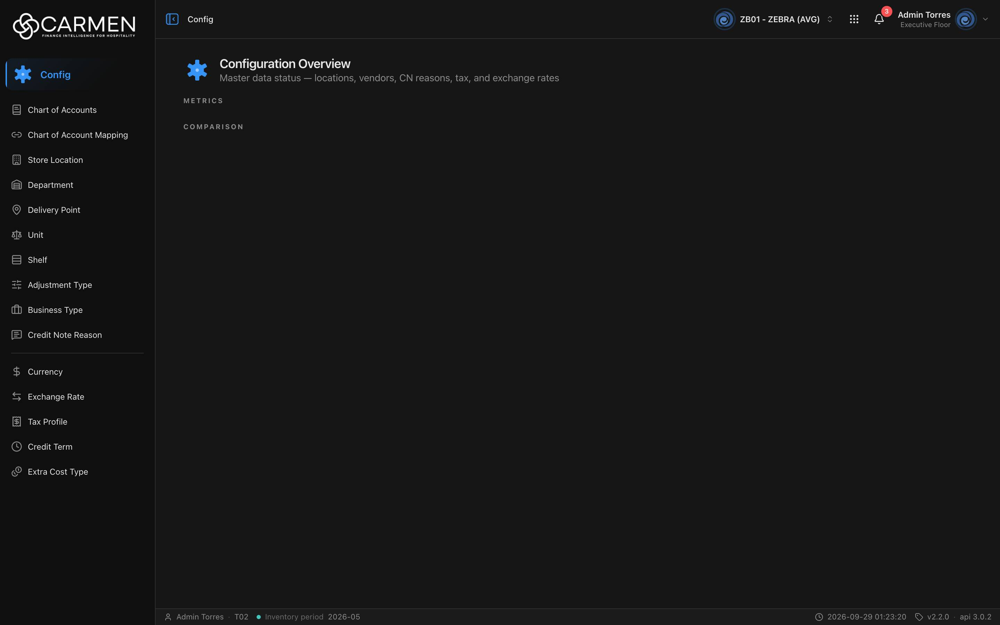

---
**Doc ID:** CB-PAGE-001
**Title:** Configuration Overview (Config Dashboard)
**Domain:** All users
**Route:** /config
**Status:** Draft
**Created:** 2026-09-29
**Last Updated:** 2026-09-29
**Author:** Claude (จากโค้ด + ภาพหน้าจอจริง)
**Parent Flow:** N/A — master data CRUD ไม่มี workflow
---

## 8.1 Configuration Overview

> หน้าแรกของโมดูล Config: แดชบอร์ดอ่านอย่างเดียว แสดงตัวเลขสรุปของ master data (location, vendor, CN reason, tax, exchange rate) เป็น widget ผู้ใช้ทุกคนที่เข้าเมนู Config ได้จะเห็นหน้านี้

> **ข้อสังเกตจากภาพหน้าจอจริง (2026-09-29, BU ZB01):** หน้าแสดงแค่หัวข้อ "Configuration Overview" กับหัวข้อ section **METRICS** และ **COMPARISON** แต่ไม่มีการ์ดใด ๆ อยู่ใต้หัวข้อเลย และไม่มีกล่อง error สาเหตุตามโค้ดมีดังนี้
> 1. หัวข้อ section จะแสดงก็ต่อเมื่อ endpoint config ของ widget ตอบรายการ widget ชนิด `kpi`/`gauge` (METRICS) และ `bar` (COMPARISON) กลับมาแล้ว (`config-dashboard.tsx:44-49, 85, 106`) แปลว่า **ขั้นแรก (รายชื่อ widget) สำเร็จ** และไม่มี widget ชนิด `pie` (หัวข้อ DISTRIBUTION จึงไม่ขึ้น)
> 2. ค่าของ widget แต่ละใบถูกยิงแยกผ่าน `GET /api/{bu}/datasets/{dataset_id}` ตอนการ์ดเลื่อนเข้าจอ (`LazyWidget`, `components/dashboard-widget/dashboard-widget-grid.tsx:261-294`) ถ้าคำขอนั้น error **`LazyWidget` คืน `null` ทั้งใบแบบเงียบ ๆ** (บรรทัด 281: `if (isError) return null;`) ไม่มี toast ไม่มีกล่อง error และถ้าข้อมูลกลับมาแต่รูปทรงไม่ตรง `KpiCard`/`BarCard` ก็คืน `null` เช่นกัน (บรรทัด 435, 645-646)
> 3. ภาพจึงตรงกับกรณี "config list สำเร็จ แต่ dataset ทุกตัวล้มเหลวหรือคืนข้อมูลรูปทรงผิด" แยกจากภาพอย่างเดียวไม่ได้ว่าเป็นกรณีไหน ต้องดู network tab
> 4. **ไม่ใช่บั๊ก `dashboard-widgets` 500 ที่ `routes/dashboard/CLAUDE.md` บันทึกไว้** ตัวนั้นคือ `GET /api/me/dashboard-widgets` ของหน้า Dashboard หลัก ถ้า endpoint config ของหน้านี้ล้ม จะเห็นกล่องแดง "Failed to load widgets: …" แทนหัวข้อ section

---

### 8.1.1 Purpose

ให้ผู้ดูแล master data เห็นภาพรวมสถานะของข้อมูลตั้งค่าได้ในหน้าเดียว เช่น จำนวน location ที่ active, vendor แยกตาม business type, CN แยกตาม reason, tax profile แยกตาม rate และ exchange rate ล่าสุด (dataset ที่โค้ดรู้จักอยู่ใน `DATASET_TO_SUB_TILE`, `config-dashboard.tsx:17-23`) รายการ widget จริงกำหนดที่ gateway (hardcode) ไม่ได้กำหนดในโค้ดฝั่งนี้ หน้านี้ไม่มีการแก้ไขข้อมูลใด ๆ

---

### 8.1.2 Screen Overview

**Access Path:**
- คลิกเมนู **Config** (หัวเมนูในแถบซ้าย) → เปิด `/config`
- Direct URL: `/config`

**Permissions Required:**

| Role | Permission | Scope | Notes |
|------|-----------|-------|-------|
| ทุกบทบาท | ไม่มี | All | leaf `/config` ใน `constant/module-list.ts:480` ไม่มีทั้ง `permission` และ `licenseFeature` → `RouteGuard` ไม่ล็อกหน้านี้ ข้อมูลที่เห็นขึ้นกับสิทธิ์ของ endpoint dataset ที่ backend |

---

### 8.1.3 Screen Layout



```
[⚙ Configuration Overview]
[  Master data status — locations, vendors, CN reasons, tax, and exchange rates]
─────────────────────────────────────────────────
[กล่องแดง error — เฉพาะเมื่อโหลดรายชื่อ widget ไม่สำเร็จ]
[Skeleton 4 ช่อง — ระหว่างโหลด]
[กล่องเส้นประ "No widget data" — เมื่อไม่มี widget เลย]
─────────────────────────────────────────────────
METRICS        [KPI card] [KPI card] ...      ← widget_type kpi / gauge
─────────────────────────────────────────────────
COMPARISON     [Bar card] [Bar card] ...      ← widget_type bar
─────────────────────────────────────────────────
DISTRIBUTION   [Pie card] ...                 ← widget_type pie (ไม่ปรากฏในภาพจริง)
```

ในภาพจริง: มีแค่หัวข้อ METRICS และ COMPARISON โดยไม่มีการ์ดข้างใต้ (ดูหมายเหตุด้านบน)

---

### 8.1.4 Header Information

| Field | Mandatory | Description | Business Logic / Remark |
|-------|-----------|-------------|--------------------------|
| Configuration Overview | — | หัวเรื่องหน้า | ข้อความจาก `config.dashboard.title` |
| Master data status — locations, vendors, CN reasons, tax, and exchange rates | — | คำอธิบายใต้หัวเรื่อง | `config.dashboard.description` |
| ไอคอนโมดูล | — | `AppTile name="config"` ขนาด 40 | ตกแต่งเท่านั้น |

**Read-only fields:** ทุกอย่างในหน้าเป็นแบบอ่านอย่างเดียว

---

### 8.1.5 Summary Information

| Field | Description | Calculation Formula |
|-------|-------------|---------------------|
| METRICS (KPI / Gauge cards) | ค่าเดี่ยวพร้อม delta เทียบช่วงก่อน | คำนวณที่ backend (dataset) FE แค่แสดง ถ้าข้อมูลไม่ใช่รูป scalar-delta การ์ดจะไม่ render |
| COMPARISON (Bar cards) | ค่าแยกหมวด หรือ time series | คำนวณที่ backend ถ้าข้อมูลไม่ใช่ categorical/time-series การ์ดจะไม่ render |
| DISTRIBUTION (Pie cards) | สัดส่วนแยกหมวด | คำนวณที่ backend |

ลำดับการ์ดเรียงตาม `order_index` จาก config ของ widget (`config-dashboard.tsx:38-42`) ส่วน `HIDDEN_DATASETS` ใช้ซ่อน dataset บางตัว ปัจจุบันเป็นเซตว่าง

---

### 8.1.6 Detail / Grid Information

N/A — หน้านี้เป็นแดชบอร์ด ไม่มีตารางรายการ

---

### 8.1.7 Action Buttons

N/A — ไม่มีปุ่มกระทำการ การ์ด widget ไม่มีลิงก์ไปหน้าอื่น

---

### 8.1.8 Document Status

N/A — แดชบอร์ดไม่มีสถานะเอกสาร

---

### 8.1.9 Workflow History (if applicable)

N/A

---

### 8.1.10 Modals Triggered from This Page

N/A — ไม่มี modal

---

### 8.1.11 Navigation

| Action | Destination |
|--------|------------|
| คลิกเมนูย่อยในแถบซ้าย เช่น Chart of Accounts | → CB-PAGE-002 (Chart of Accounts) |
| คลิกเมนู Chart of Account Mapping | → CB-PAGE-003 (Chart of Account Mapping) |
| คลิกเมนูย่อยอื่นของ Config | → หน้า list ของ master data นั้น (CB-PAGE-004 ขึ้นไป) |

---

### 8.1.12 Pagination (for list screens)

N/A — ไม่ใช่หน้า list

---

### 8.1.13 API Endpoints

| Method | Endpoint | Purpose |
|--------|----------|---------|
| GET | `/api/{bu_code}/dashboard-widgets/config/config` | รายชื่อ widget ของโมดูล `config` (config อย่างเดียว ไม่ exec dataset) `API_ENDPOINTS.DASHBOARD_WIDGET_CONFIGS` แคช `CACHE_STATIC` |
| GET | `/api/{bu_code}/dashboard-widgets/config` | ใช้สำรองเมื่อ endpoint แรกตอบ **404** (gateway รุ่นเก่า) ซึ่งเป็น endpoint รวมที่ exec dataset ทุกตัวในคำขอเดียว (`hooks/use-dashboard-widgets.ts:52`) |
| GET | `/api/{bu_code}/datasets/{dataset_id}` | ค่าของ widget ทีละใบ ยิงเมื่อการ์ดเลื่อนเข้าจอ (`hooks/use-dashboard-dataset.ts:93`) แคช `CACHE_DYNAMIC` ไม่ยิงถ้า config ที่ได้มามี `meta` + `data` ติดมาแล้ว |

path จริงในเบราว์เซอร์คือ `${BACKEND_URL}/api/...` (`http-client` แปลง prefix `/api/proxy`) ไม่มี query parameter

---

### 8.1.14 Edge Cases & Error States

| # | Scenario | System Behaviour |
|---|----------|-----------------|
| 1 | Mandatory field left blank | N/A — ไม่มีฟอร์ม |
| 2 | Session expired | `http-client` เจอ 401 → เรียก `refreshTokens()` แล้วยิงซ้ำหนึ่งครั้ง ถ้ายัง 401 → ล้าง token store → `RequireAuth` พาไป `/login` |
| 3 | ไม่มี widget เลย | กล่องเส้นประข้อความ **"No widget data"** |
| 4 | โหลดรายชื่อ widget ไม่สำเร็จ (non-404) | กล่องแดง `role="alert"`: **"Failed to load widgets: {message}"** ไม่มีปุ่ม retry |
| 5 | โหลด dataset ของ widget ใบใดใบหนึ่งไม่สำเร็จ | **การ์ดใบนั้นหายไปเงียบ ๆ** (`LazyWidget` คืน `null`) ไม่มี toast/ข้อความ หัวข้อ section ยังอยู่ → ถ้าล้มทุกใบจะเห็นหัวข้อว่าง ๆ ตรงกับภาพหน้าจอจริง |
| 6 | dataset ตอบข้อมูลรูปทรงไม่ตรงชนิด widget | การ์ดคืน `null` เหมือนข้อ 5 |
| 7 | กำลังโหลด | skeleton 4 ช่อง (`aria-busy`) ระหว่างรอรายชื่อ ส่วนการ์ดที่ยังไม่เลื่อนเข้าจอ/ยังรอ dataset แสดง `WidgetSkeleton` ตามชนิด |
| 8 | Concurrent edit | N/A — อ่านอย่างเดียว |
| 9 | Permission / license | หน้าไม่ถูกล็อก แต่ถ้า backend ตอบ 403 ให้ dataset ใด การ์ดนั้นจะหายตามข้อ 5 (403 ของ license อาจเด้ง dialog จาก `http-client`) |
| 10 | ยังไม่ได้เลือก BU (`buCode` ว่าง) | query ถูกปิด (`enabled: !!buCode`) หน้าไม่แสดงอะไรใต้หัวเรื่อง |

---

### 8.1.15 Differences: Create vs. Edit Mode (if applicable)

N/A — ไม่มีโหมดสร้าง/แก้ไข

---

### 8.1.16 Related Documents

| Doc ID | Title | Relationship |
|--------|-------|-------------|
| CB-PAGE-002 | Chart of Accounts | เมนูย่อยของโมดูล Config |
| CB-PAGE-003 | Chart of Account Mapping | เมนูย่อยของโมดูล Config |
