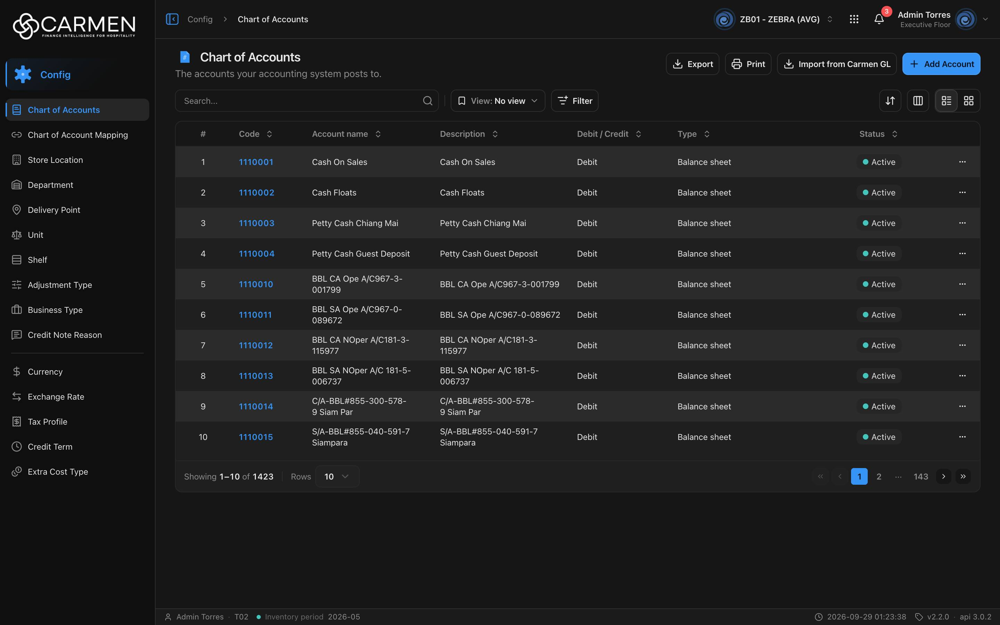

---
**Doc ID:** CB-PAGE-002
**Title:** Chart of Accounts
**Domain:** All users
**Route:** /config/chart-of-accounts
**Status:** Draft
**Created:** 2026-09-29
**Last Updated:** 2026-09-29
**Author:** Claude (จากโค้ด + ภาพหน้าจอจริง)
**Parent Flow:** N/A — master data CRUD ไม่มี workflow
---

## 8.2 Chart of Accounts

> หน้า list ของผังบัญชี (รหัสบัญชีที่ระบบบัญชีใช้ลงรายการ) ของ BU ปัจจุบัน ใช้เพิ่ม แก้ไข ลบ ค้นหา กรอง export และดึงผังบัญชีจาก Carmen GL สำหรับผู้ดูแลบัญชีหรือ master data

---

### 8.2.1 Purpose

ดูแลรายการรหัสบัญชี (Code, Account name, Description, Debit / Credit, Type, Status) ที่ใช้เป็นปลายทางของการลงบัญชี เช่นใน CB-PAGE-003 (Chart of Account Mapping) หน้าใช้ `ConfigListTemplate` ร่วมกับหน้า config อื่น (`routes/config/chart-of-accounts/coa-component.tsx`) การเพิ่มและแก้ไขทำใน dialog (CB-MODAL-001) ไม่มีหน้า detail แยก

---

### 8.2.2 Screen Overview

**Access Path:**
- จาก CB-PAGE-001 (Configuration Overview) หรือแถบซ้าย → **Config** → **Chart of Accounts**
- Direct URL: `/config/chart-of-accounts`

**Permissions Required:**

| Role | Permission | Scope | Notes |
|------|-----------|-------|-------|
| ทุกบทบาท (ที่ BU มี license) | License feature `configuration.chart_of_accounts` | BU ปัจจุบัน | leaf ใน `constant/module-list.ts:484-489` มีแค่ `licenseFeature` **ไม่มี `permission`** → ฝั่ง FE ไม่ตรวจ RBAC เลย (ไม่มีการเช็ค `create`/`update`/`delete` บนหน้านี้) การบังคับ RBAC อยู่ที่ backend ล้วน ๆ ถ้า BU ไม่มี feature นี้และเปิด `LICENSE_ENFORCEMENT` แล้ว (เปิดทุก env) → `RouteGuard` แสดงกล่อง **"Feature Not Licensed"** และไม่มี admin bypass |
| ทุกบทบาท | `canWrite` ของ license | BU ปัจจุบัน | ถ้าสัญญาหมดอายุหรือถูกระงับ ปุ่ม Add Account จาง (กดแล้วเด้ง dialog แจ้ง), dialog แก้ไขเปิดแบบ readOnly, เมนู Delete ของแถว disabled และปุ่ม Import from Carmen GL หายไป |
| ทุกบทบาท | Interface entitlement `accounting` / `carmen_gl` = `entitled` | BU ปัจจุบัน | เงื่อนไขการเห็นปุ่ม **Import from Carmen GL** (`coa-import-carmen-gl-button.tsx:53`) ไม่ผูกกับสวิตช์ `LICENSE_ENFORCEMENT` |

---

### 8.2.3 Screen Layout



```
[📄 Chart of Accounts]                   [Export] [Print] [Import from Carmen GL] [+ Add Account]
[  The accounts your accounting system posts to.]
─────────────────────────────────────────────────────────────────────────────
[Search...  🔍] | [View: No view ▾] [Filter]             [⇅ Sort] [▥ Columns] [☰|▦ List/Grid]
[Active filter chips … Clear all]   ← เมื่อมีตัวกรอง
─────────────────────────────────────────────────────────────────────────────
 # | Code ⇅ | Account name ⇅ | Description ⇅ | Debit / Credit ⇅ | Type ⇅ | Status ⇅ | ⋯
 1 | 1110001| Cash On Sales  | Cash On Sales | Debit            | Balance sheet | ● Active | ⋯
 …
─────────────────────────────────────────────────────────────────────────────
Showing 1–10 of 1423 | Rows [10 ▾]                    [«] [‹] [1] [2] … [143] [›] [»]
```

มือถือหรือโหมด Grid: แสดงเป็นการ์ด (`coa-card.tsx`) และโหลดเพิ่มด้วย infinite scroll แทน pagination

---

### 8.2.4 Header Information

| Field | Mandatory | Description | Business Logic / Remark |
|-------|-----------|-------------|--------------------------|
| Chart of Accounts | — | หัวเรื่องหน้า | `config.chartOfAccounts.title` |
| The accounts your accounting system posts to. | — | คำอธิบาย | `config.chartOfAccounts.desc` |
| Search | N | ค้นข้อความอิสระ | placeholder "Search..." ค้นเมื่อกด **Enter** (ไม่ debounce) ค่าเก็บใน URL param `search` ส่งให้ backend ตรง ๆ |
| View | N | Saved view (ชุดตัวกรอง + sort ที่บันทึกไว้) | ค่าเริ่มต้น "No view" มีทั้ง scope ของ BU และของผู้ใช้ (`pageKey = LIST_PAGE_KEYS.CHART_OF_ACCOUNT`) |
| Filter → Status | N | Active / Inactive | ส่งเป็น `is_active|bool:true` หรือ `is_active|bool:false` |
| Filter → Debit / Credit | N | multi-select: Debit, Credit | `nature|string:debit` / `nature|string:credit` ถ้าเลือกครบทุกตัวถือเป็นไม่กรอง |
| Filter → Type | N | multi-select: Header (not postable), Balance sheet, Income statement, Statistic | `type|string:header` ฯลฯ |

**Read-only fields:** N/A — ส่วนหัวไม่มีฟิลด์ข้อมูล

---

### 8.2.5 Summary Information

N/A — หน้า list ของ master data ไม่มียอดสรุป มีเพียง "Showing x–y of N" ที่ส่วน pagination

---

### 8.2.6 Detail / Grid Information

| Column | Mandatory | Description | Business Logic / Remark |
|--------|-----------|-------------|--------------------------|
| # | — | ลำดับแถว | คำนวณจาก `(page-1) × perpage + index + 1` |
| Code | Y | รหัสบัญชี (`code`) | เป็นลิงก์: คลิกแล้วเปิด CB-MODAL-001 ในโหมด Edit ถ้าค่าว่างแสดง "..." |
| Account name | Y | ชื่อบัญชี (`description_1`) | — |
| Description | N | คำอธิบายบรรทัดที่สอง (`description_2`) | — |
| Debit / Credit | Y | ด้านปกติของบัญชี (`nature`) | แสดง "Debit" / "Credit" |
| Type | Y | ประเภทบัญชี (`type`) | "Header (not postable)", "Balance sheet", "Income statement", "Statistic" |
| Status | Y | `is_active` | badge ดู 8.2.8 |
| Created | — | เวลาและผู้สร้าง (`audit.created`) | **ซ่อนไว้ตั้งต้น** เปิดได้จากปุ่ม Columns |
| Updated | — | เวลาและผู้แก้ล่าสุด (`audit.updated`) | ซ่อนไว้ตั้งต้น |
| ⋯ (Row actions) | — | เมนูของแถว | มีเมนูเดียวคือ **Delete** ไม่มี Edit ในเมนู (แก้ไขผ่านการคลิก Code) และไม่มีเมนู Activity เพราะ backend ยังไม่มี entity นี้ในทะเบียน activity (`use-coa-table.tsx:101-103`) |

คอลัมน์ checkbox มีอยู่ในโค้ด (`selectColumn`) แต่ตารางไม่แสดง เพราะไม่ได้เปิด `showCheckbox`

**Grid Actions:**

| Button | Description | Business Logic |
|--------|-------------|----------------|
| คลิก Code | เปิด CB-MODAL-001 (Edit Chart of Account) | ถ้า `canWrite = false` dialog เปิดแบบ readOnly |
| ⋯ → Delete | เปิด CB-MODAL-014 (Delete confirmation) | disabled เมื่อ `canWrite = false` พร้อม tooltip "Disabled — your subscription is expired or inactive. Contact your administrator to renew." |
| Sort (⇅ ที่หัวคอลัมน์ / ปุ่ม Sort) | เรียงตามคอลัมน์ | ส่ง `sort=field:asc|desc` ไป backend เปลี่ยน sort แล้วกลับหน้า 1 |
| Columns | ซ่อน/แสดงคอลัมน์ | ซ่อนเฉพาะฝั่ง client |
| List / Grid | สลับตารางกับการ์ด | โหมด Grid ใช้ infinite scroll |

---

### 8.2.7 Action Buttons

| Button | Color / Type | Description | Business Logic / Validation |
|--------|-------------|-------------|------------------------------|
| Export | Secondary (White) | ส่งออก Excel (.xlsx) | ส่งออก**เฉพาะแถวที่โหลดอยู่ในหน้าปัจจุบัน** (ไม่ใช่ทั้ง 1,423 แถว) คอลัมน์: Code, Account name, Description, Debit / Credit, Type, Status ถ้าไม่มีแถว → toast "No data to export" สำเร็จ → "Exported {count} records" |
| Print | Secondary (White) | `window.print()` ของเบราว์เซอร์ | พิมพ์หน้าจอตามที่เห็น |
| Import from Carmen GL | Secondary (White) | เปิด CB-MODAL-002 | แสดงเฉพาะ BU ที่ entitlement `accounting/carmen_gl` = `entitled` **และ** `canWrite = true` ไม่เช่นนั้นปุ่มไม่แสดงเลย ระหว่างนำเข้าปุ่มเป็น spinner และ disabled |
| Add Account | Primary (Blue) | เปิด CB-MODAL-001 ในโหมด Add | เมื่อ `canWrite = false` ปุ่มจาง (`aria-disabled` แต่ยังกดได้) กดแล้วเด้ง dialog "Subscription Expired" แทนการเปิดฟอร์ม (ไม่มีการเช็ค permission `create` เพราะ leaf ไม่มี permission prefix) |

บนมือถือ Export/Print ยุบอยู่ในเมนู ⋯

---

### 8.2.8 Document Status

| Status | Badge Colour | Description |
|--------|-------------|-------------|
| active (`is_active = true`) | Green (dot badge tone `success`) ข้อความ "Active" | บัญชีใช้งานได้ |
| inactive (`is_active = false`) | Gray (dot badge tone `neutral`) ข้อความ "Inactive" | ปิดใช้งาน |

**Status Transition Rules:**

| From Status | Action | To Status | Who Can Perform |
|-------------|--------|-----------|-----------------|
| active | ปิดสวิตช์ Active ใน CB-MODAL-001 → Save | inactive | ผู้ใช้ที่ `canWrite = true` (RBAC ตรวจที่ backend) |
| inactive | เปิดสวิตช์ Active → Save | active | เช่นเดียวกัน |
| (ใหม่) | Create | active (ค่าเริ่มต้น) | เช่นเดียวกัน |

---

### 8.2.9 Workflow History (if applicable)

N/A — master data ไม่มี workflow และหน้านี้ยังไม่เปิด Activity sheet

---

### 8.2.10 Modals Triggered from This Page

| Modal ID | Modal Name | Trigger |
|----------|-----------|---------|
| CB-MODAL-001 | Add / Edit Chart of Account | คลิก **Add Account** หรือคลิก Code ของแถว |
| CB-MODAL-002 | Import from Carmen GL (confirm) | คลิก **Import from Carmen GL** |
| CB-MODAL-014 | Delete confirmation | ⋯ → **Delete** (หรือปุ่มลบบนการ์ด) |
| (ยังไม่มีเอกสาร) | Filter sheet (`ListFilter`) | คลิก **Filter** |
| (ยังไม่มีเอกสาร) | Save view dialog (`SaveViewDialog`) | ปุ่มบันทึก view ใน Filter sheet |
| (ยังไม่มีเอกสาร) | View selector dropdown (`ViewSelector`) | คลิก **View: No view** |
| (ยังไม่มีเอกสาร) | Permission denied / Subscription expired dialog | กด Add Account ตอน `canWrite = false` |

---

### 8.2.11 Navigation

| Action | Destination |
|--------|------------|
| Add Account | → เปิด CB-MODAL-001 (อยู่หน้าเดิม) |
| คลิก Code | → เปิด CB-MODAL-001 โหมด Edit (อยู่หน้าเดิม) |
| ⋯ → Delete | → เปิด CB-MODAL-014 (Delete confirmation) |
| Import from Carmen GL | → เปิด CB-MODAL-002 |
| Save/Delete/Import สำเร็จ | → อยู่ CB-PAGE-002 และ list รีเฟรชเอง (invalidate query `CHART_OF_ACCOUNTS`) |
| Breadcrumb "Config" | → CB-PAGE-001 (Configuration Overview) |

---

### 8.2.12 Pagination (for list screens)

- Rows per page: ค่าเริ่มต้น **10** ตัวเลือก 5 / 10 / 25 / 50 / 100 (เก็บใน URL param `perpage`)
- Navigation: First («), Previous (‹), เลขหน้า (มี … ย่อ), Next (›), Last (») และข้อความ "Showing 1–10 of N"
- Default sort: **ไม่ส่ง sort** — ตั้งใจไม่ใส่ `defaultSort` เพราะยังไม่ยืนยันว่า backend รับ sort field ไหน (`coa-component.tsx:28-30`) จึงเรียงตาม default ของ backend (ภาพจริงเรียงตาม Code จากน้อยไปมาก)
- โหมด Grid/มือถือ: infinite scroll

---

### 8.2.13 API Endpoints

| Method | Endpoint | Purpose |
|--------|----------|---------|
| GET | `/api/config/{bu_code}/chart-of-accounts` | โหลด list (แคช `CACHE_STATIC`) |
| POST | `/api/config/{bu_code}/chart-of-accounts` | สร้าง (CB-MODAL-001) |
| PATCH | `/api/config/{bu_code}/chart-of-accounts/{id}` | แก้ไข (CB-MODAL-001) body มี `doc_version` ของแถวเดิม |
| DELETE | `/api/config/{bu_code}/chart-of-accounts/{id}` | ลบ (CB-MODAL-014) |
| POST | `/api/config/{bu_code}/chart-of-accounts/import-from-interface/carmen-gl` | ดึงผังบัญชีจาก Carmen GL (CB-MODAL-002) ไม่มี body |

ทุก path เรียกผ่าน `/api/proxy/...` ที่ `http-client` แปลงเป็น `${BACKEND_URL}/...` และแนบ `Authorization: Bearer` กับ `x-app-id`

**Query parameter syntax (for list endpoints):**
- `page=1&perpage=10`
- `search=cash`
- `sort=code:asc` (เมื่อผู้ใช้กดเรียง)
- Single filter: `filter=is_active|bool:true`
- Multi-value ในฟิลด์เดียว: `filter=nature|string:debit` / `filter=type|string:header,type|string:statistic`
- หลายฟิลด์: คั่นด้วย `;` เช่น `filter=is_active|bool:true;type|string:balance_sheet`

---

### 8.2.14 Edge Cases & Error States

| # | Scenario | System Behaviour |
|---|----------|-----------------|
| 1 | Mandatory field left blank (ใน dialog) | ข้อความใต้ช่อง เช่น "Code is required" ฟอร์มไม่ส่ง ดู CB-MODAL-001 |
| 2 | Session expired | 401 → `http-client` refresh token แล้วยิงซ้ำหนึ่งครั้ง ถ้ายังไม่ผ่าน → ล้าง token → ไป `/login` ข้อมูลใน dialog ที่ยังไม่บันทึกหาย |
| 3 | ไม่มีข้อมูล / ค้นไม่เจอ | ตารางแสดง illustration พร้อมข้อความ **"No data found"** |
| 4 | API error ตอนโหลด list | ทั้งหน้าถูกแทนด้วย `ErrorState`: "Something went wrong" + ปุ่ม **Try again** (refetch) และรหัส error ให้คัดลอก |
| 5 | API error ตอน create/update/delete | toast error จาก handler กลาง (5 วินาที) dialog ยังเปิดอยู่ (ยกเว้น 401/403 ที่มี UI ของตัวเอง) |
| 6 | Concurrent edit | FE ส่ง `doc_version` ไปกับ PATCH แต่**ไม่มีการจัดการ conflict ฝั่ง FE** (ไม่มีข้อความเตือนข้อมูลเก่า) ถ้า backend ไม่ตรวจ `doc_version` = last-write-wins ถ้าตรวจและตอบ error จะเห็นแค่ toast error ทั่วไป |
| 7 | Licence หมดอายุ (`canWrite = false`) | Add Account จาง (กดแล้วเด้ง "Subscription Expired"), dialog แก้ไข readOnly (ปุ่มเป็น "Close"), Delete disabled พร้อม tooltip, ปุ่ม Import from Carmen GL หายไป |
| 8 | BU ไม่มี feature `configuration.chart_of_accounts` | `RouteGuard` แสดงกล่อง "Feature Not Licensed" แทนหน้า และปุ่มพาไปหน้าที่เข้าได้ |
| 9 | ผู้ใช้ไม่มีสิทธิ์ RBAC | FE ไม่กันอะไร (leaf ไม่มี permission) → ปุ่มกดได้แล้วได้ 403 จาก backend → PermissionDeniedDialog |
| 10 | Export ตอนไม่มีแถว | toast warning "No data to export" |

---

### 8.2.15 Differences: Create vs. Edit Mode (if applicable)

N/A ในระดับหน้า — ความต่างของโหมด Add/Edit อยู่ใน dialog ดู CB-MODAL-001 §8.2.10.1

---

### 8.2.16 Related Documents

| Doc ID | Title | Relationship |
|--------|-------|-------------|
| CB-PAGE-001 | Configuration Overview | หน้าแม่ของโมดูล Config |
| CB-MODAL-001 | Add / Edit Chart of Account | Opened from this page |
| CB-MODAL-002 | Import from Carmen GL | Opened from this page |
| CB-MODAL-014 | Delete confirmation | Opened from this page (row action) |
| CB-PAGE-003 | Chart of Account Mapping | ใช้รหัสบัญชีจากหน้านี้เป็นปลายทางการผูกบัญชี (ปัจจุบันยังเป็น mock) |
