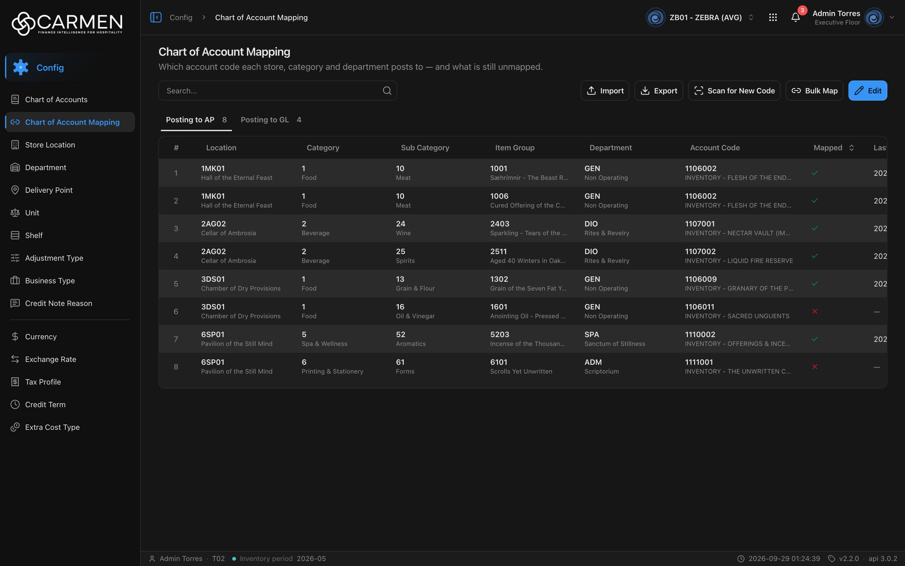

---
**Doc ID:** CB-PAGE-003
**Title:** Chart of Account Mapping
**Domain:** All users
**Route:** /config/chart-of-account-mapping (legacy: /config/account-mapping → redirect)
**Status:** Draft
**Created:** 2026-09-29
**Last Updated:** 2026-09-29
**Author:** Claude (จากโค้ด + ภาพหน้าจอจริง)
**Parent Flow:** N/A — master data CRUD ไม่มี workflow
---

## 8.3 Chart of Account Mapping

> ⚠️ **หน้านี้แสดงข้อมูลจำลอง (MOCK) ทั้งหมด — ไม่ได้เรียก API ใด ๆ**
> ตารางอ่านจากค่าคงที่ `COAM_MOCK_ROWS` ใน `routes/config/chart-of-account-mapping/coam-mock.ts` ตรง ๆ (`coam-component.tsx:16, 70-73`) ไฟล์ mock เขียนไว้ว่า "ข้อมูลตัวอย่างระหว่างรอ backend … ลบไฟล์นี้ทิ้งเมื่อ endpoint พร้อม" มี 12 แถว (AP 8 / GL 4) ของ BU สมมติ (VALHALLA, OLYMPUS, AVALON, BABYLON, SHANGRI, THEBES) ข้อมูลจึง**เหมือนกันทุก BU** ไม่เปลี่ยนเมื่อสลับ BU และ**ไม่ใช่ข้อมูลจริงของ ZB01** แม้ภาพหน้าจอจะถ่ายจาก BU นั้น
> ปุ่ม **Import, Export, Scan for New Code, Bulk Map, Edit** และปุ่มดินสอของแต่ละแถว **ยังไม่ผูก handler — กดแล้วไม่มีอะไรเกิดขึ้น** (`coam-component.tsx:91`, `use-coam-table.tsx:160`) ใน `constant/api-endpoints.ts` ยังไม่มี endpoint ของหน้านี้

> หน้าแสดงว่าแต่ละชุด Location × Category × Sub Category × Item Group × Department ลงบัญชีไปที่รหัสบัญชีใด แยกเป็นแท็บ Posting to AP / Posting to GL และบอกว่ารายการใดยังไม่ได้ผูกบัญชี (ตั้งใจให้ผู้ดูแลบัญชีใช้ แต่ตอนนี้เป็น UI ต้นแบบ)

---

### 8.3.1 Purpose

(ตามการออกแบบ) ให้ฝ่ายบัญชีตรวจและผูกรหัสบัญชีจาก CB-PAGE-002 (Chart of Accounts) เข้ากับมิติของสินค้าและสถานที่ เพื่อให้เอกสารคลัง/จัดซื้อลงบัญชี AP และ GL ได้ถูกรหัส และหารายการที่ยังไม่ได้ผูก (Mapped = ✗) **สถานะปัจจุบัน:** เป็นหน้าอ่านอย่างเดียวที่แสดง mock ทำได้แค่ค้นหาและสลับแท็บ

---

### 8.3.2 Screen Overview

**Access Path:**
- แถบซ้าย → **Config** → **Chart of Account Mapping**
- Direct URL: `/config/chart-of-account-mapping`
- URL เดิม `/config/account-mapping` → redirect (`replace`) มาที่ `/config/chart-of-account-mapping` (`routes/router.tsx:104-108` คงไว้ให้ bookmark เก่าไม่ 404)

**Permissions Required:**

| Role | Permission | Scope | Notes |
|------|-----------|-------|-------|
| ทุกบทบาท (ที่ BU มี license) | License feature `configuration.chart_of_account_mapping` | BU ปัจจุบัน | leaf ไม่มี `permission` (RBAC) มีแค่ `licenseFeature` (`constant/module-list.ts:490-498`) คีย์นี้มาจาก `LICENSE_ONLY_RESOURCES` ของ backend **ล็อกที่ FE เท่านั้น** (ไม่มี endpoint ให้ `LicenseInterceptor` บังคับ) BU ที่ไม่มี feature → กล่อง "Feature Not Licensed" |
| — | `canWrite` | — | ไม่มีผล หน้านี้ไม่อ่าน `canWrite` เลย (ปุ่มไม่ได้ทำงานอยู่แล้ว) |

---

### 8.3.3 Screen Layout



```
[Chart of Account Mapping]
[  Which account code each store, category and department posts to — and what is still unmapped.]
─────────────────────────────────────────────────────────────────────────────
[Search...  🔍]          [⬆ Import] [⬇ Export] [⌗ Scan for New Code] [🔗 Bulk Map] [✎ Edit]
─────────────────────────────────────────────────────────────────────────────
[Posting to AP 8] [Posting to GL 4]
─────────────────────────────────────────────────────────────────────────────
 # | Location | Category | Sub Category | Item Group | Department | Account Code | Mapped ⇅ | Last Scanned ⇅ | ✎
 1 | 1MK01    | 1        | 10           | 1001       | GEN        | 1106002      |   ✓      | 2026-07-01 …   | ✎
   | Hall of… | Food     | Meat         | Sæhrímnir… | Non Oper…  | INVENTORY -… |          |                |
 …                                                    (ตารางกว้าง เลื่อนแนวนอน)
```

---

### 8.3.4 Header Information

| Field | Mandatory | Description | Business Logic / Remark |
|-------|-----------|-------------|--------------------------|
| Chart of Account Mapping | — | หัวเรื่อง | `config.chartOfAccountMapping.title` |
| Which account code each store, category and department posts to — and what is still unmapped. | — | คำอธิบาย | `config.chartOfAccountMapping.desc` |
| Search | N | ค้นข้อความ | ค้น**ฝั่ง client บน mock** เมื่อกด Enter ไม่แยกตัวพิมพ์ใหญ่เล็ก จับคู่กับ code และ name ของ Location, Category, Sub Category, Item Group, Department, Account Code รวมถึง `business_unit` และ `mapping_type` (ที่ไม่มีคอลัมน์แสดง) ค่าไม่เก็บใน URL |
| Tab: Posting to AP / Posting to GL | — | แยกแถวตาม `mapping_type` | ตัวเลขข้างชื่อแท็บ = จำนวนแถวหลังค้นหาของแต่ละแท็บ (อัปเดตทั้งสองแท็บพร้อมกัน) ค่าเริ่มต้นแท็บ AP ไม่เก็บใน URL |

**Read-only fields:** ทั้งตารางอ่านอย่างเดียว

---

### 8.3.5 Summary Information

| Field | Description | Calculation Formula |
|-------|-------------|---------------------|
| จำนวนบนแท็บ Posting to AP | จำนวนแถว AP | count(rows ที่ `mapping_type = "AP"` และผ่านการค้นหา) — mock: 8 |
| จำนวนบนแท็บ Posting to GL | จำนวนแถว GL | count(rows ที่ `mapping_type = "GL"` และผ่านการค้นหา) — mock: 4 |

---

### 8.3.6 Detail / Grid Information

| Column | Mandatory | Description | Business Logic / Remark |
|--------|-----------|-------------|--------------------------|
| # | — | ลำดับแถว | index + 1 ภายในแท็บ |
| Location | — | `store_location` (code บน / name ล่าง) | ถ้าไม่มีทั้ง code และ name แสดง "—" |
| Category | — | `category` | เช่นเดียวกัน |
| Sub Category | — | `sub_category` | เช่นเดียวกัน |
| Item Group | — | `item_group` | ชื่อยาวถูกตัดด้วย … |
| Department | — | `department` | — |
| Account Code | — | `account_code` (รหัส + ชื่อบัญชี) | ใน mock แม้แถวที่ Mapped = ✗ ก็ยังมีรหัสบัญชีแสดงอยู่ |
| Mapped | — | `is_mapped` | ✓ สีเขียว (`--status-approved`) = ผูกแล้ว / ✗ สีแดง (`--status-rejected`) = ยังไม่ผูก มีไอคอน sort ที่หัวคอลัมน์ แต่ตารางไม่ได้ตั้ง `getSortedRowModel` จึง**คาดว่ากดแล้วลำดับไม่เปลี่ยน** (อ่านจากโค้ด ยังไม่ได้ลองกด) |
| Last Scanned | — | `last_scanned_at` | รูปแบบวันเวลาตาม profile ผู้ใช้ ถ้าเป็น null แสดง "—" หัวคอลัมน์มีไอคอน sort แบบเดียวกับ Mapped |
| ✎ (action) | — | ปุ่มดินสอของแถว | **ยังไม่ผูก handler** กดแล้วไม่มีอะไรเกิดขึ้น |

ปรับความกว้างคอลัมน์ได้ (`columnsResizable`) หัวตาราง sticky

**Grid Actions:**

| Button | Description | Business Logic |
|--------|-------------|----------------|
| ✎ (รายแถว) | (ตั้งใจ) แก้การผูกบัญชีของแถว | ไม่ทำงาน — UI placeholder |

---

### 8.3.7 Action Buttons

| Button | Color / Type | Description | Business Logic / Validation |
|--------|-------------|-------------|------------------------------|
| Import | Secondary (White) | (ตั้งใจ) นำเข้าการผูกบัญชี | **ไม่ทำงาน** ไม่มี `onClick` |
| Export | Secondary (White) | (ตั้งใจ) ส่งออก | **ไม่ทำงาน** |
| Scan for New Code | Secondary (White) | (ตั้งใจ) สแกนหาชุดมิติใหม่ที่ยังไม่มีแถว | **ไม่ทำงาน** |
| Bulk Map | Secondary (White) | (ตั้งใจ) ผูกบัญชีหลายแถวพร้อมกัน | **ไม่ทำงาน** |
| Edit | Primary (Blue) | (ตั้งใจ) เข้าโหมดแก้ไข | **ไม่ทำงาน** |

ปุ่มทั้งหมดแสดงเสมอ ไม่มีการตรวจสิทธิ์หรือ `canWrite`

---

### 8.3.8 Document Status

| Status | Badge Colour | Description |
|--------|-------------|-------------|
| mapped (`is_mapped = true`) | Green ✓ | รายการนี้ผูกรหัสบัญชีแล้ว |
| not_mapped (`is_mapped = false`) | Red ✗ | ยังไม่ผูก |

**Status Transition Rules:**

| From Status | Action | To Status | Who Can Perform |
|-------------|--------|-----------|-----------------|
| not_mapped | (ตั้งใจ) Edit / Bulk Map | mapped | TBD — ยังไม่มีการทำงานจริง |

หน้านี้ไม่มีสถานะ active/inactive

---

### 8.3.9 Workflow History (if applicable)

N/A

---

### 8.3.10 Modals Triggered from This Page

N/A — ปุ่มทุกปุ่มยังไม่เปิด dialog ใด ๆ (ไม่มี dialog ของ Import / Bulk Map / Edit ในโค้ด) ไม่มีการลบแถว จึงไม่ใช้ CB-MODAL-014

---

### 8.3.11 Navigation

| Action | Destination |
|--------|------------|
| เปิด `/config/account-mapping` | → redirect ไป CB-PAGE-003 (`/config/chart-of-account-mapping`) |
| Breadcrumb "Config" | → CB-PAGE-001 (Configuration Overview) |
| ปุ่มทุกปุ่มบนหน้า | ไม่เปลี่ยนหน้า (ยังไม่ทำงาน) |

---

### 8.3.12 Pagination (for list screens)

- Rows per page: **ไม่มี pagination** แสดงทุกแถวของแท็บในตารางเดียว (mock มี 12 แถว)
- Navigation: N/A
- Default sort: ตามลำดับใน `coam-mock.ts` (ไม่มีการเรียง)

---

### 8.3.13 API Endpoints

| Method | Endpoint | Purpose |
|--------|----------|---------|
| — | TBD | **ยังไม่มี endpoint** หน้าอ่าน mock (`COAM_MOCK_ROWS`) ไม่มีการเรียก API ใดเพื่อข้อมูลของหน้า |

**Query parameter syntax (for list endpoints):** N/A — การค้นหาทำฝั่ง client

---

### 8.3.14 Edge Cases & Error States

| # | Scenario | System Behaviour |
|---|----------|-----------------|
| 1 | Mandatory field left blank | N/A — ไม่มีฟอร์ม |
| 2 | Session expired | หน้านี้ไม่ยิง API เอง จึงไม่เด้งทันที จะไป `/login` เมื่อคำขออื่นของ shell (เช่น profile/notification) ได้ 401 และ refresh ไม่สำเร็จ |
| 3 | ค้นหาแล้วไม่พบ | ตารางแสดง illustration + **"No data found"** ตัวเลขบนแท็บเป็น 0 |
| 4 | API error | N/A — ไม่มี API ไม่มีสถานะ loading หรือ error |
| 5 | Concurrent edit | N/A — ไม่มีการเขียนข้อมูล |
| 6 | BU ไม่มี license `configuration.chart_of_account_mapping` | `RouteGuard` แสดงกล่อง "Feature Not Licensed" (ไม่มี admin bypass) |
| 7 | ผู้ใช้กดปุ่ม Import / Export / Scan / Bulk Map / Edit / ✎ | ไม่มีอะไรเกิดขึ้น ไม่มี feedback |
| 8 | สลับ BU | ข้อมูลเหมือนเดิม (mock ไม่ขึ้นกับ BU) |
| 9 | กดไอคอน sort ที่ Mapped / Last Scanned | คาดว่าลำดับแถวไม่เปลี่ยน (ไม่มี sorted row model) |

---

### 8.3.15 Differences: Create vs. Edit Mode (if applicable)

N/A — ยังไม่มีโหมดสร้าง/แก้ไข

---

### 8.3.16 Related Documents

| Doc ID | Title | Relationship |
|--------|-------|-------------|
| CB-PAGE-001 | Configuration Overview | หน้าแม่ของโมดูล Config |
| CB-PAGE-002 | Chart of Accounts | แหล่งรหัสบัญชีที่ใช้ผูก (เมื่อหน้านี้ต่อ API จริง) |
