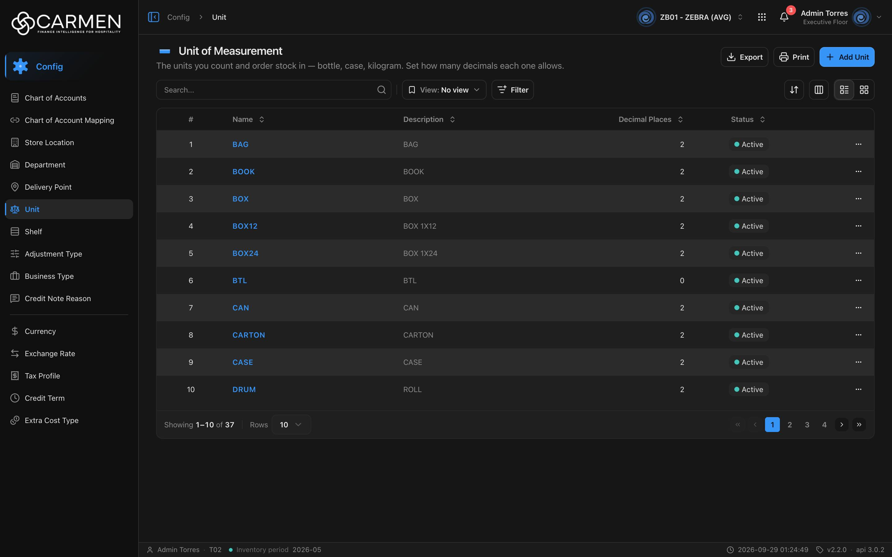

---
**Doc ID:** CB-PAGE-004
**Title:** Unit of Measurement (List)
**Domain:** All users
**Route:** /config/unit
**Status:** Draft
**Created:** 2026-09-29
**Last Updated:** 2026-09-29
**Author:** Claude (จากโค้ด + ภาพหน้าจอจริง)
**Parent Flow:** N/A — master data CRUD ไม่มี workflow
---

## 8.4 Unit

> หน้ารายการหน่วยนับ (bottle, case, kilogram ฯลฯ) ของ BU ปัจจุบัน — ผู้ดูแล master data ใช้เพิ่ม/แก้/ลบหน่วยและกำหนดจำนวนทศนิยมที่แต่ละหน่วยยอมให้กรอก

---

### 8.4.1 Purpose

ดูแล master data ของหน่วยนับที่ใช้ทั้งระบบ (สินค้า, PR/PO, GRN, การนับสต็อก) ผู้ใช้ค้นหา/กรองรายการ, เปิด dialog เพิ่มหรือแก้ไขหน่วย (CB-MODAL-003), ลบหน่วย (CB-MODAL-014), ดูประวัติการแก้ไข (Activity), และ export เป็น Excel

ค่า **Decimal Places** ของหน่วยคุมจำนวนทศนิยมที่ช่องจำนวน (qty) ในเอกสารอื่นยอมรับ — สูงสุด 5 ตำแหน่ง (`QTY_MAX_DECIMALS = 5`, `components/ui/input/qty-decimals.ts:11`)

หน้านี้ประกอบจาก template กลาง `ConfigListTemplate` (`components/templates/config-list-template.tsx`) — โค้ดเฉพาะหน้าอยู่ที่ `routes/config/unit/` (`unit-component.tsx`, `use-unit-table.tsx`, `unit-filter-fields.ts`, `unit-card.tsx`) ส่วน dialog **ไม่ได้อยู่ในโฟลเดอร์ route** แต่เป็นของกลาง `components/share/unit-dialog.tsx` (เพราะ `LookupUnit` ใช้ dialog เดียวกันสร้างหน่วยแบบ inline)

---

### 8.4.2 Screen Overview

**Access Path:**
- Sidebar → **Config** → **Unit**
- หน้า Config dashboard (`/config`) → การ์ด Unit
- Direct URL: `/config/unit`

**Permissions Required:**

| Role | Permission | Scope | Notes |
|------|-----------|-------|-------|
| ทุกบทบาท | `configuration.unit.view` | BU ปัจจุบัน | สิทธิ์เข้าหน้า (leaf ใน `constant/module-list.ts:518-523`) ไม่มี → `RouteGuard` แสดงบล็อก "Permission Denied" |
| ทุกบทบาท | license feature `configuration.unit` | BU ปัจจุบัน | ระบุตรงใน leaf (`licenseFeature`) BU ที่ไม่มี feature → บล็อก "Feature Not Licensed" (`LICENSE_ENFORCEMENT` เปิดทุก env) |
| ผู้เพิ่ม | `product_management.unit.create` | BU ปัจจุบัน | ⚠️ คีย์นี้มาจาก `permissionPrefix="product_management.unit"` (`unit-component.tsx:21`) ซึ่ง **ไม่มีใน `PERMISSIONS`** (`constant/permissions.ts:45` ใช้ `configuration.unit`) — ผู้ใช้ที่ไม่ใช่ admin จะกด **Add Unit** ไม่ได้เสมอ |
| ผู้แก้ไข | `product_management.unit.update` | BU ปัจจุบัน | ⚠️ เหตุผลเดียวกัน — non-admin เปิด dialog แก้ไขได้แต่เป็น read-only เสมอ |
| ผู้ลบ | `configuration.unit.delete` | BU ปัจจุบัน | ปุ่มลบในแถวใช้ prefix ที่ derive จาก route (`useConfigTable` → `useDeleteGate` ไม่ได้รับ `permissionPrefix` จาก `useUnitTable`) จึงเป็นคนละ prefix กับ Add/Edit |
| Admin | — | — | `isAdmin` bypass permission ทั้งหมด แต่ **ไม่** bypass license |

---

### 8.4.3 Screen Layout



```
[Breadcrumb: Config > Unit]                         [BU switcher] [apps] [🔔] [user]
──────────────────────────────────────────────────────────────────────────────────
▬ Unit of Measurement                                   [Export] [Print] [+ Add Unit]
The units you count and order stock in — bottle, case, kilogram. Set how many ...
──────────────────────────────────────────────────────────────────────────────────
[Search...            🔍] | [View: No view ▾] [Filter]      [⇅ Sort] [▥ Columns] [☰|▦]
[Active filter badges (เมื่อมี filter)]
──────────────────────────────────────────────────────────────────────────────────
 ☐ | #  | Name ⇕  | Description ⇕ | Decimal Places ⇕ | Status ⇕ | (Created) (Updated) | ⋯
 ☐ | 1  | BAG     | BAG           |                2 | ● Active |                     | ⋯
 ...
──────────────────────────────────────────────────────────────────────────────────
Showing 1–10 of 37 | Rows [10 ▾]                          [«] [‹] [1] [2] [3] [4] [›] [»]
```

> คอลัมน์ checkbox (select) มีอยู่ในโค้ดแต่ภาพจริงไม่เห็นกล่อง — ไม่มี bulk action ใดใช้ selection บนหน้านี้

---

### 8.4.4 Header Information

หน้า list ไม่มีฟอร์มหัวเอกสาร — ส่วนนี้บันทึกแถบหัวหน้าและ toolbar แทน

| Field | Mandatory | Description | Business Logic / Remark |
|-------|-----------|-------------|--------------------------|
| Title "Unit of Measurement" | — | ชื่อหน้า | `config.unit.title` |
| Description | — | "The units you count and order stock in — bottle, case, kilogram. Set how many decimals each one allows." | `config.unit.desc` |
| Search | N | ค้นหาข้อความอิสระ | ส่งเป็น `search=` เมื่อกด Enter หรือคลิกไอคอน 🔍 (ไม่ debounce) · ปุ่ม ✕ ล้างค่า · ฟิลด์ที่ค้นขึ้นกับ backend · ค่าเก็บใน URL |
| View | N | Saved view (bu/user scope) | `ViewSelector` — default "No view" |
| Filter | N | ตัวกรอง Status | ตัวเลือก **Active** / **Inactive** → `filter=is_active\|bool:true` หรือ `is_active\|bool:false` (`unit-filter-fields.ts`) · desktop = popover menu, mobile = bottom sheet |

**Read-only fields:** N/A

---

### 8.4.5 Summary Information

N/A — master data ไม่มีตัวเลขสรุป (มีเพียง "Showing x–y of N" ใน pagination)

---

### 8.4.6 Detail / Grid Information

| Column | Mandatory | Description | Business Logic / Remark |
|--------|-----------|-------------|--------------------------|
| (checkbox) | — | เลือกแถว | ไม่มี bulk action ใช้งาน · ซ่อนตอนพิมพ์ |
| # | — | ลำดับแถว | `(page − 1) × perpage + index + 1` · sort ไม่ได้ |
| Name | Y | ชื่อหน่วย | ลิงก์สีน้ำเงิน — คลิกเปิด CB-MODAL-003 (Edit) · ว่าง = แสดง "..." · sort ได้ |
| Description | N | คำอธิบาย | ว่าง = "-" · sort ได้ |
| Decimal Places | Y | จำนวนทศนิยม | ชิดขวา, `null` แสดง 0 · sort ได้ |
| Status | — | Active / Inactive | badge จาก `is_active` · sort ได้ |
| Created | — | เวลาสร้าง + ผู้สร้าง | **ซ่อนเป็นค่าเริ่มต้น** เปิดได้จากปุ่ม Columns · อ่านจาก `audit.created` |
| Updated | — | เวลาแก้ล่าสุด + ผู้แก้ | ซ่อนเป็นค่าเริ่มต้น · `audit.updated` |
| ⋯ | — | เมนูแถว | **Activity** (เปิด activity sheet) และ **Delete** — เมนูไม่มี Edit (แก้ผ่านการคลิกชื่อ) |

**Grid Actions:**

| Button | Description | Business Logic |
|--------|-------------|----------------|
| คลิก Name | เปิด CB-MODAL-003 โหมดแก้ไข | ถ้าไม่มีสิทธิ์ update หรือ license เขียนไม่ได้ → dialog เปิดแบบ read-only |
| ⋯ → Activity | เปิด activity sheet (ประวัติ "ใครแก้อะไร") ของแถว | ใช้ `openActivity(id, name)` ของกลาง |
| ⋯ → Delete | เปิด CB-MODAL-014 | license เขียนไม่ได้ → เมนู disabled พร้อม tooltip "Disabled — your subscription is expired or inactive. Contact your administrator to renew." · ไม่มีสิทธิ์ `configuration.unit.delete` → กดแล้วเด้ง Permission Denied dialog |
| Grid view (มือถือ/โหมดการ์ด) | แสดงเป็นการ์ด: Name, Status, Description, Decimal Places, Created/Updated | โหลดแบบ infinite scroll แทน pagination · pull-to-refresh บนมือถือ |

---

### 8.4.7 Action Buttons

| Button | Color / Type | Description | Business Logic / Validation |
|--------|-------------|-------------|------------------------------|
| Export | Secondary (White) | ดาวน์โหลด .xlsx | Export **เฉพาะแถวที่โหลดอยู่** (หน้าปัจจุบัน) คอลัมน์ Name, Description, Decimal Places, Status · ไม่มีข้อมูล → toast "No data to export" · สำเร็จ → "Exported {count} records" · ชื่อไฟล์ขึ้นต้น `unit` |
| Print | Secondary (White) | เรียก `window.print()` | พิมพ์หน้าจอปัจจุบัน (คอลัมน์ checkbox/⋯ ถูกซ่อนด้วย `print:hidden`) |
| Add Unit | Primary (Blue) | เปิด CB-MODAL-003 โหมดสร้าง | license เขียนไม่ได้ → dialog "Subscription Expired" · ไม่มีสิทธิ์ `product_management.unit.create` → dialog "Permission Denied" · ปุ่มจาง (opacity 50%) เมื่อถูกบล็อก |
| ⇅ Sort | Secondary (icon) | เมนูเลือก sort | desktop เท่านั้น |
| ▥ Columns | Secondary (icon) | ซ่อน/แสดงคอลัมน์ | เฉพาะโหมดตาราง |
| ☰ / ▦ | Toggle | สลับ list / grid | desktop; มือถือเป็นการ์ดเสมอ |

---

### 8.4.8 Document Status

| Status | Badge Colour | Description |
|--------|-------------|-------------|
| active (`is_active = true`) | Green dot (tone `success`) "Active" | ใช้งานได้ |
| inactive (`is_active = false`) | Gray dot (tone `neutral`) "Inactive" | ปิดใช้งาน |

**Status Transition Rules:**

| From Status | Action | To Status | Who Can Perform |
|-------------|--------|-----------|-----------------|
| active | ปิดสวิตช์ **Active** ใน CB-MODAL-003 แล้ว Save | inactive | ผู้มีสิทธิ์ update (ดู 8.4.2) |
| inactive | เปิดสวิตช์ **Active** แล้ว Save | active | ผู้มีสิทธิ์ update |

---

### 8.4.9 Workflow History (if applicable)

N/A — ไม่มี approval workflow · ประวัติการแก้ไขดูได้จาก ⋯ → **Activity** (activity sheet กลาง)

---

### 8.4.10 Modals Triggered from This Page

| Modal ID | Modal Name | Trigger |
|----------|-----------|---------|
| CB-MODAL-003 | Unit Dialog (Add / Edit Unit) | คลิก **Add Unit** หรือคลิกชื่อหน่วยในแถว/การ์ด |
| CB-MODAL-014 | Delete Confirmation | ⋯ → **Delete** (หรือปุ่มลบบนการ์ด) |
| (ยังไม่มีเอกสาร) | Activity Sheet | ⋯ → **Activity** |
| (ยังไม่มีเอกสาร) | List Filter menu / sheet | ปุ่ม **Filter** |
| (ยังไม่มีเอกสาร) | Save View Dialog | "Save view" ในเมนู Filter / View |
| (ยังไม่มีเอกสาร) | Permission Denied Dialog | กด Add/Delete โดยไม่มีสิทธิ์หรือ license หมดอายุ |

---

### 8.4.11 Navigation

| Action | Destination |
|--------|------------|
| Add Unit | → เปิด CB-MODAL-003 (Add) — อยู่หน้าเดิม |
| คลิก Name | → เปิด CB-MODAL-003 (Edit) — อยู่หน้าเดิม |
| ⋯ → Delete | → เปิด CB-MODAL-014 — อยู่หน้าเดิม |
| Breadcrumb "Config" | → `/config` (Config dashboard) |
| ไม่มีสิทธิ์/ license | → บล็อก Access Denied พร้อมปุ่มไปหน้าที่เข้าได้ (landing path) |

---

### 8.4.12 Pagination (for list screens)

- Rows per page: ค่าเริ่มต้น **10** · ตัวเลือก 5, 10, 25, 50, 100
- Navigation: First, Previous, เลขหน้า, Next, Last · แสดง "Showing 1–10 of N"
- Default sort: **ไม่กำหนด** (ไม่ส่ง `sort=`) — ลำดับเป็นไปตาม backend (ภาพจริงเรียงตามชื่อ A→Z) · คลิกหัวคอลัมน์เพื่อสลับ asc/desc
- page / perpage / sort / search / filter เก็บใน URL query (share ลิงก์ได้)

---

### 8.4.13 API Endpoints

`lib/http-client.ts` แปลง `/api/proxy/<rest>` → `${BACKEND_URL}/<rest>` และแนบ `Authorization: Bearer` + `x-app-id`

| Method | Endpoint | Purpose |
|--------|----------|---------|
| GET | `/api/config/{bu_code}/units` | โหลดรายการ (paginated `data[]` + `paginate.total`) |
| POST | `/api/config/{bu_code}/units` | สร้าง (จาก CB-MODAL-003) |
| PUT | `/api/config/{bu_code}/units/{id}` | แก้ไข (ส่ง `doc_version`) |
| DELETE | `/api/config/{bu_code}/units/{id}` | ลบ (จาก CB-MODAL-014) |

**Query parameter syntax (for list endpoints):**
- `?page=1&perpage=10&search=box&sort=name:asc&filter=is_active|bool:true`
- ค่าถูก `encodeURIComponent` (space → `%20`) · พารามิเตอร์ว่างไม่ถูกส่ง
- หลาย filter ต่อกันด้วย `;` (หน้านี้มีแค่ Status)
- Cache: `CACHE_STATIC` (30 นาที) แยก key ต่อ BU + params · create/update/delete invalidate list

---

### 8.4.14 Edge Cases & Error States

| # | Scenario | System Behaviour |
|---|----------|-----------------|
| 1 | Mandatory field left blank | ตรวจใน CB-MODAL-003 — "Name is required" ใต้ช่อง ฟอร์มไม่ส่ง |
| 2 | Session expired | `http-client` ได้ 401 → refresh token แล้ว retry อัตโนมัติ · refresh ไม่ได้ → ล้าง token store → `RequireAuth` redirect `/login` (ไม่มี toast ซ้ำ) · ข้อมูลที่ยังไม่บันทึกหาย |
| 3 | No results / empty state | ตารางแสดงภาพโฟลเดอร์ + "No data found" (ทั้งกรณีไม่มีข้อมูลและค้นไม่เจอ) |
| 4 | API error on load | ทั้งหน้าแทนที่ด้วย `ErrorState` พร้อมปุ่ม "Try again" (refetch) |
| 5 | Concurrent edit | Update ส่ง `doc_version` ของแถวที่โหลดไว้ · ถ้า backend ตอบ 409 → toast "Someone else changed this document. Refresh the page and try again." · FE ไม่ refetch ให้เอง — ต้องรีเฟรชเอง · การบังคับจริงขึ้นกับ backend |
| 6 | Permission / license | ไม่มี view → บล็อก "Permission Denied" · ไม่มี license feature → "Feature Not Licensed" · license หมดอายุ → Add/Delete ถูกบล็อก, dialog แก้ไขเป็น read-only (ปุ่ม Close แทน Cancel, ไม่มี Save) · ⚠️ non-admin ติด ghost key `product_management.unit.*` บน Add/Edit แม้มี `configuration.unit.create/update` |
| 7 | Export ขณะไม่มีแถว | toast warning "No data to export" |
| 8 | ลบหน่วยที่ถูกใช้งานอยู่ | ขึ้นกับ backend — error แสดงเป็น toast กลาง (ข้อความตาม catalog code หรือ "Some fields aren't filled in correctly. Check them and try again.") |

---

### 8.4.15 Differences: Create vs. Edit Mode (if applicable)

ดู CB-MODAL-003 — หน้านี้เป็น list เท่านั้น

| Behaviour | Create Mode | Edit Mode |
|-----------|------------|-----------|
| Dialog title | "Add Unit" | "Edit Unit" |
| All fields | ค่าว่าง, Decimal Places = 0, Active = on | ค่าจากแถว |
| Availability | ต้องผ่าน `product_management.unit.create` + license | read-only ถ้าไม่ผ่าน `product_management.unit.update` หรือ license |

---

### 8.4.16 Related Documents

| Doc ID | Title | Relationship |
|--------|-------|-------------|
| CB-MODAL-003 | Unit Dialog | Opened from this page (Add / Edit) |
| CB-MODAL-014 | Delete Confirmation | Opened from row action Delete |
| N/A | Parent flow | master data CRUD ไม่มี workflow |
