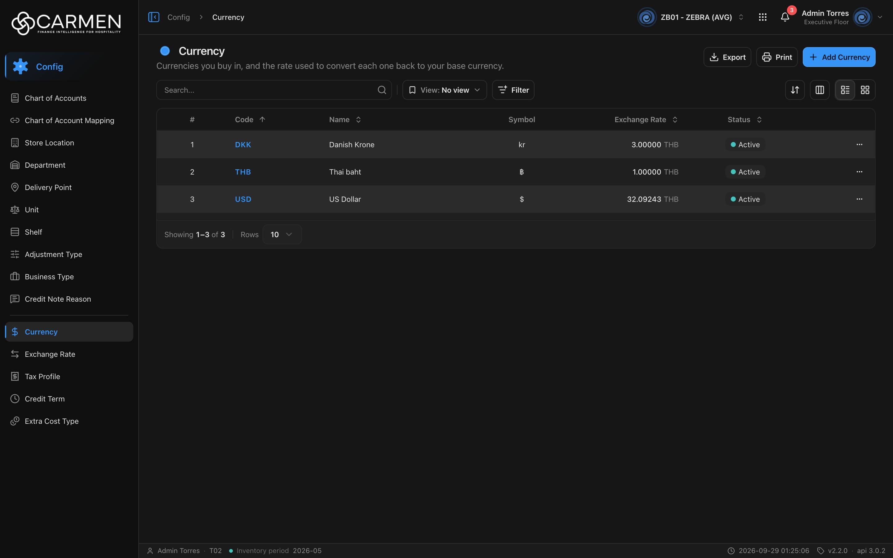

---
**Doc ID:** CB-PAGE-005
**Title:** Currency (List)
**Domain:** All users
**Route:** /config/currency
**Status:** Draft
**Created:** 2026-09-29
**Last Updated:** 2026-09-29
**Author:** Claude (จากโค้ด + ภาพหน้าจอจริง)
**Parent Flow:** N/A — master data CRUD ไม่มี workflow
---

## 8.5 Currency

> หน้ารายการสกุลเงินที่ BU ใช้ซื้อ พร้อมอัตราแลกเปลี่ยนกลับเป็นสกุลเงินหลัก (base currency) ของ BU — ผู้ดูแล master data ใช้เพิ่ม/แก้/ลบสกุลเงิน

---

### 8.5.1 Purpose

ดูแลรายการสกุลเงินของ BU (เลือกจากรายการ ISO 46 สกุลที่ฝังในโค้ด `constant/currencies-iso.ts`) และอัตราแลกเปลี่ยนที่ใช้แปลงกลับเป็น base currency ผู้ใช้ค้นหา/กรอง, เพิ่มหรือแก้ไขผ่าน CB-MODAL-004, ลบผ่าน CB-MODAL-014, ดู Activity และ export Excel

คอลัมน์ Exchange Rate แสดงหน่วยเป็น base currency ของ BU (`defaultCurrencyCode` จาก profile) ต่อท้ายตัวเลข เช่น `32.09243 THB` = 1 USD เท่ากับ 32.09243 THB

โค้ด: `routes/config/currency/` (`currency-component.tsx`, `use-currency-table.tsx`, `currency-filter-fields.ts`, `currency-card.tsx`, `currency-dialog.tsx` โหลดแบบ lazy) บน template `ConfigListTemplate`

---

### 8.5.2 Screen Overview

**Access Path:**
- Sidebar → **Config** → **Currency** (อยู่ใต้เส้นคั่น กลุ่มเดียวกับ Exchange Rate)
- หน้า Config dashboard (`/config`)
- Direct URL: `/config/currency`

**Permissions Required:**

| Role | Permission | Scope | Notes |
|------|-----------|-------|-------|
| ทุกบทบาท | `configuration.currency.view` | BU ปัจจุบัน | สิทธิ์เข้าหน้า (`constant/module-list.ts:551-556`) |
| ทุกบทบาท | license feature `configuration.currency` | BU ปัจจุบัน | leaf ไม่ระบุ `licenseFeature` → คำนวณจาก permission (ตัด `.view`) |
| ผู้เพิ่ม | `configuration.currency.create` | BU ปัจจุบัน | ปุ่ม **Add Currency** |
| ผู้แก้ไข | `configuration.currency.update` | BU ปัจจุบัน | ไม่มี → dialog แก้ไขเป็น read-only |
| ผู้ลบ | `configuration.currency.delete` | BU ปัจจุบัน | เมนู ⋯ → Delete |
| Admin | — | — | bypass permission ทั้งหมด แต่ไม่ bypass license |

---

### 8.5.3 Screen Layout



```
[Breadcrumb: Config > Currency]                    [BU switcher] [apps] [🔔] [user]
──────────────────────────────────────────────────────────────────────────────────
● Currency                                          [Export] [Print] [+ Add Currency]
Currencies you buy in, and the rate used to convert each one back to your base ...
──────────────────────────────────────────────────────────────────────────────────
[Search...            🔍] | [View: No view ▾] [Filter]      [⇅ Sort] [▥ Columns] [☰|▦]
──────────────────────────────────────────────────────────────────────────────────
 ☐ | # | Code ↑ | Name ⇕       | Symbol | Exchange Rate ⇕ | Status ⇕ | (Created)(Updated) | ⋯
 ☐ | 1 | DKK    | Danish Krone | kr     |     3.00000 THB | ● Active |                    | ⋯
 ☐ | 2 | THB    | Thai baht    | ฿      |     1.00000 THB | ● Active |                    | ⋯
 ☐ | 3 | USD    | US Dollar    | $      |    32.09243 THB | ● Active |                    | ⋯
──────────────────────────────────────────────────────────────────────────────────
Showing 1–3 of 3 | Rows [10 ▾]
```

---

### 8.5.4 Header Information

หน้า list ไม่มีฟอร์มหัวเอกสาร — บันทึกแถบหัวหน้าและ toolbar แทน

| Field | Mandatory | Description | Business Logic / Remark |
|-------|-----------|-------------|--------------------------|
| Title "Currency" | — | ชื่อหน้า | `config.currency.title` |
| Description | — | "Currencies you buy in, and the rate used to convert each one back to your base currency." | `config.currency.desc` |
| Search | N | ค้นหาข้อความอิสระ | ส่ง `search=` เมื่อกด Enter หรือคลิก 🔍 · ✕ ล้างค่า · ฟิลด์ที่ค้นขึ้นกับ backend |
| View | N | Saved view | default "No view" |
| Filter | N | Status | **Active** / **Inactive** → `filter=is_active\|bool:true` / `is_active\|bool:false` |

**Read-only fields:** N/A

---

### 8.5.5 Summary Information

N/A — ไม่มีตัวเลขสรุป

---

### 8.5.6 Detail / Grid Information

| Column | Mandatory | Description | Business Logic / Remark |
|--------|-----------|-------------|--------------------------|
| (checkbox) | — | เลือกแถว | ไม่มี bulk action |
| # | — | ลำดับแถว | ต่อเนื่องข้ามหน้า |
| Code | Y | รหัส ISO 4217 (3 ตัวอักษร) | ลิงก์ — คลิกเปิด CB-MODAL-004 (Edit) · sort ได้ · **default sort** |
| Name | Y | ชื่อสกุลเงิน | sort ได้ |
| Symbol | Y | สัญลักษณ์ | กึ่งกลาง · **sort ไม่ได้** (header เป็นข้อความธรรมดา) |
| Exchange Rate | Y | อัตราเทียบ base currency | ทศนิยม 5 ตำแหน่ง (`EXCHANGE_RATE_DECIMALS = 5`) + code ของ base currency ตัวเล็กสีจาง · ค่า 0/ว่าง แสดง "-" · sort ได้ |
| Status | — | Active / Inactive | sort ได้ |
| Created / Updated | — | เวลา + ผู้ทำ | ซ่อนเป็นค่าเริ่มต้น เปิดจาก Columns |
| ⋯ | — | เมนูแถว | **Activity**, **Delete** |

**Grid Actions:**

| Button | Description | Business Logic |
|--------|-------------|----------------|
| คลิก Code | เปิด CB-MODAL-004 โหมดแก้ไข | read-only ถ้าไม่มี `configuration.currency.update` หรือ license เขียนไม่ได้ |
| ⋯ → Activity | เปิด activity sheet (label = Code) | — |
| ⋯ → Delete | เปิด CB-MODAL-014 ข้อความ "Are you sure you want to delete currency "{code}"? This action cannot be undone." | license หมดอายุ → disabled · ไม่มีสิทธิ์ → Permission Denied dialog |
| Grid view | การ์ดแสดง Name, Status, Code, Symbol, Created/Updated | infinite scroll |

---

### 8.5.7 Action Buttons

| Button | Color / Type | Description | Business Logic / Validation |
|--------|-------------|-------------|------------------------------|
| Export | Secondary (White) | .xlsx ของแถวที่โหลดอยู่ | คอลัมน์ Code, Name, Symbol, Exchange Rate, Decimal Places, Description, Status (Decimal Places กับ Description ไม่มีในตารางแต่มีใน export) · ไม่มีข้อมูล → "No data to export" |
| Print | Secondary (White) | `window.print()` | — |
| Add Currency | Primary (Blue) | เปิด CB-MODAL-004 โหมดสร้าง | license → "Subscription Expired" dialog · ไม่มี create → "Permission Denied" dialog |
| ⇅ Sort / ▥ Columns / ☰▦ | Secondary (icon) | sort, ซ่อนคอลัมน์, สลับ list/grid | desktop เท่านั้น |

---

### 8.5.8 Document Status

| Status | Badge Colour | Description |
|--------|-------------|-------------|
| active (`is_active = true`) | Green dot "Active" | ใช้งานได้ |
| inactive (`is_active = false`) | Gray dot "Inactive" | ปิดใช้งาน |

**Status Transition Rules:**

| From Status | Action | To Status | Who Can Perform |
|-------------|--------|-----------|-----------------|
| active | ปิดสวิตช์ Active ใน CB-MODAL-004 → Save | inactive | ผู้มี `configuration.currency.update` |
| inactive | เปิดสวิตช์ Active → Save | active | ผู้มี `configuration.currency.update` |

---

### 8.5.9 Workflow History (if applicable)

N/A — ไม่มี workflow · ประวัติการแก้ไขอยู่ใน ⋯ → **Activity**

---

### 8.5.10 Modals Triggered from This Page

| Modal ID | Modal Name | Trigger |
|----------|-----------|---------|
| CB-MODAL-004 | Currency Dialog (Add / Edit Currency) | **Add Currency** หรือคลิก Code |
| CB-MODAL-014 | Delete Confirmation | ⋯ → **Delete** |
| (ยังไม่มีเอกสาร) | Activity Sheet | ⋯ → **Activity** |
| (ยังไม่มีเอกสาร) | List Filter menu / sheet | ปุ่ม **Filter** |
| (ยังไม่มีเอกสาร) | Save View Dialog | Save view |
| (ยังไม่มีเอกสาร) | Permission Denied Dialog | กด Add/Delete โดยไม่มีสิทธิ์/license |

---

### 8.5.11 Navigation

| Action | Destination |
|--------|------------|
| Add Currency / คลิก Code | → เปิด CB-MODAL-004 — อยู่หน้าเดิม |
| ⋯ → Delete | → เปิด CB-MODAL-014 — อยู่หน้าเดิม |
| Breadcrumb "Config" | → `/config` |
| Sidebar "Exchange Rate" | → `/config/exchange-rate` (หน้าจัดการอัตราแลกเปลี่ยน — การแก้อัตราที่นั่น invalidate cache ของหน้านี้ด้วย) |

---

### 8.5.12 Pagination (for list screens)

- Rows per page: ค่าเริ่มต้น **10** · ตัวเลือก 5, 10, 25, 50, 100
- Navigation: First, Previous, เลขหน้า, Next, Last (ภาพจริงมีหน้าเดียวจึงไม่แสดงปุ่ม)
- Default sort: **Code, ascending** (`defaultSort="code:asc"`) · คลิกหัวคอลัมน์ครั้งที่ 3 จะพลิกทิศแทนการยกเลิก sort

---

### 8.5.13 API Endpoints

| Method | Endpoint | Purpose |
|--------|----------|---------|
| GET | `/api/config/{bu_code}/currencies` | โหลดรายการ |
| POST | `/api/config/{bu_code}/currencies` | สร้าง |
| PATCH | `/api/config/{bu_code}/currencies/{id}` | แก้ไข (hook ตั้ง `updateMethod: "PATCH"` · ส่ง `doc_version`) |
| DELETE | `/api/config/{bu_code}/currencies/{id}` | ลบ |
| GET | `/api/exchange-rate?base={base}` | อัตราสด (ใช้ใน dialog) — ⚠️ **endpoint ไม่มีจริง** (เดิมเป็น Next route) เรียกแบบ relative ไม่ผ่าน `BACKEND_URL` |

**Query parameter syntax (for list endpoints):**
- `?page=1&perpage=10&sort=code:asc&search=usd&filter=is_active|bool:true`

---

### 8.5.14 Edge Cases & Error States

| # | Scenario | System Behaviour |
|---|----------|-----------------|
| 1 | Mandatory field left blank | ตรวจใน CB-MODAL-004 ("Code is required", "Exchange Rate must be greater than 0" ฯลฯ) |
| 2 | Session expired | 401 → refresh + retry · ล้มเหลว → redirect `/login` ไม่มี toast |
| 3 | No results / empty state | "No data found" พร้อมภาพโฟลเดอร์ |
| 4 | API error on load | `ErrorState` ทั้งหน้า + "Try again" |
| 5 | Concurrent edit | PATCH ส่ง `doc_version` (comment ใน `types/currency.ts` ระบุว่าไม่ส่ง → 400) · 409 → toast "Someone else changed this document. Refresh the page and try again." |
| 6 | Permission / license | ไม่มี view → "Permission Denied" · ไม่มี feature → "Feature Not Licensed" · license หมดอายุ → Add/Delete บล็อก, dialog read-only |
| 7 | base currency ใน profile ว่าง | คอลัมน์ Exchange Rate แสดงตัวเลขโดยไม่มี code ต่อท้าย · dialog ใช้ "THB" เป็น base ในการขออัตราสด |
| 8 | Exchange rate = 0 / null | แสดง "-" |

---

### 8.5.15 Differences: Create vs. Edit Mode (if applicable)

| Behaviour | Create Mode | Edit Mode |
|-----------|------------|-----------|
| Code | เลือกจาก "Select Currency Code" | แสดงค่าเดิม, disabled |
| Name / Symbol / Description | auto-fill จากรายการ ISO เมื่อเลือก Code | ค่าจากแถว ไม่ auto-fill |
| Availability | ต้องมี create + license | read-only ถ้าไม่มี update / license |

---

### 8.5.16 Related Documents

| Doc ID | Title | Relationship |
|--------|-------|-------------|
| CB-MODAL-004 | Currency Dialog | Opened from this page |
| CB-MODAL-014 | Delete Confirmation | Opened from row action Delete |
| N/A | Parent flow | master data CRUD ไม่มี workflow |
