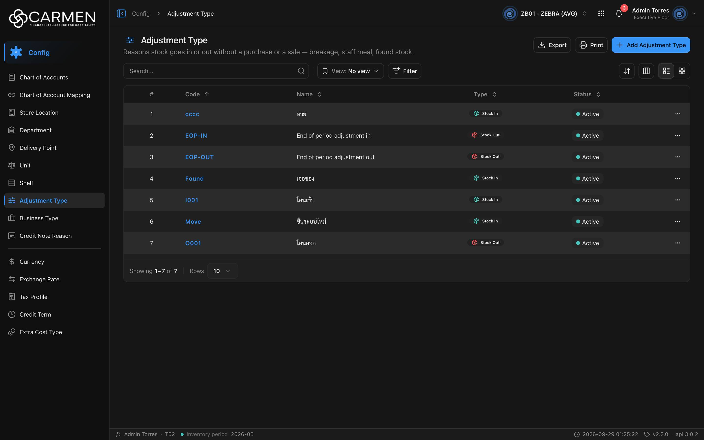

---
**Doc ID:** CB-PAGE-006
**Title:** Adjustment Type (List)
**Domain:** All users
**Route:** /config/adjustment-type
**Status:** Draft
**Created:** 2026-09-29
**Last Updated:** 2026-09-29
**Author:** Claude (จากโค้ด + ภาพหน้าจอจริง)
**Parent Flow:** N/A — master data CRUD ไม่มี workflow
---

## 8.6 Adjustment Type

> หน้ารายการประเภทการปรับสต็อก (เหตุผลที่ของเข้า/ออกโดยไม่ใช่การซื้อหรือขาย เช่น แตกเสีย, staff meal, เจอของ) — แต่ละรายการผูกทิศทาง Stock In หรือ Stock Out

---

### 8.6.1 Purpose

ดูแล master data ของ adjustment type ที่ใช้ในเอกสาร Inventory Adjustment ผู้ใช้ค้นหา/กรองตามสถานะและทิศทาง (Stock In/Out), เพิ่มหรือแก้ไขผ่าน CB-MODAL-005, ลบผ่าน CB-MODAL-014, ดู Activity และ export Excel

โค้ด: `routes/config/adjustment-type/` (`adjustment-type-component.tsx` ซึ่งประกาศ filter fields ไว้ในไฟล์เอง — มี import ของไฟล์ `adjustment-type-filter-fields` ที่ถูก comment ทิ้งไว้, `use-adjustment-type-table.tsx`, `adjustment-type-card.tsx`, `adjustment-type-dialog.tsx`) บน `ConfigListTemplate` · type/schema อยู่ที่ `types/adjustment-type.ts`

---

### 8.6.2 Screen Overview

**Access Path:**
- Sidebar → **Config** → **Adjustment Type**
- หน้า Config dashboard (`/config`)
- Direct URL: `/config/adjustment-type`

**Permissions Required:**

| Role | Permission | Scope | Notes |
|------|-----------|-------|-------|
| ทุกบทบาท | `configuration.adjustment_type.view` | BU ปัจจุบัน | สิทธิ์เข้าหน้า (`constant/module-list.ts:532-536`) |
| ทุกบทบาท | license feature `configuration.adjustment_type` | BU ปัจจุบัน | คำนวณจาก permission (leaf ไม่ระบุ `licenseFeature`) |
| ผู้เพิ่ม | `configuration.adjustment_type.create` | BU ปัจจุบัน | ปุ่ม **Add Adjustment Type** |
| ผู้แก้ไข | `configuration.adjustment_type.update` | BU ปัจจุบัน | ไม่มี → dialog read-only |
| ผู้ลบ | `configuration.adjustment_type.delete` | BU ปัจจุบัน | ⋯ → Delete |
| Admin | — | — | bypass permission ไม่ bypass license |

---

### 8.6.3 Screen Layout



```
[Breadcrumb: Config > Adjustment Type]             [BU switcher] [apps] [🔔] [user]
──────────────────────────────────────────────────────────────────────────────────
☰ Adjustment Type                            [Export] [Print] [+ Add Adjustment Type]
Reasons stock goes in or out without a purchase or a sale — breakage, staff meal, ...
──────────────────────────────────────────────────────────────────────────────────
[Search...            🔍] | [View: No view ▾] [Filter]      [⇅ Sort] [▥ Columns] [☰|▦]
──────────────────────────────────────────────────────────────────────────────────
 ☐ | # | Code ↑  | Name ⇕                     | Type ⇕        | Status ⇕ | (Created)(Updated) | ⋯
 ☐ | 1 | cccc    | หาย                        | [⬡ Stock In]  | ● Active |                    | ⋯
 ☐ | 2 | EOP-IN  | End of period adjustment in| [⬡ Stock Out] | ● Active |                    | ⋯
 ☐ | 3 | EOP-OUT | End of period adjustment out| [⬡ Stock Out]| ● Active |                    | ⋯
 ...
──────────────────────────────────────────────────────────────────────────────────
Showing 1–7 of 7 | Rows [10 ▾]
```

---

### 8.6.4 Header Information

หน้า list ไม่มีฟอร์มหัวเอกสาร — บันทึกแถบหัวหน้าและ toolbar แทน

| Field | Mandatory | Description | Business Logic / Remark |
|-------|-----------|-------------|--------------------------|
| Title "Adjustment Type" | — | ชื่อหน้า | `config.adjustmentType.title` |
| Description | — | "Reasons stock goes in or out without a purchase or a sale — breakage, staff meal, found stock." | `config.adjustmentType.desc` |
| Search | N | ค้นหาข้อความอิสระ | `search=` เมื่อ Enter / คลิก 🔍 |
| View | N | Saved view | default "No view" |
| Filter → Status | N | Active / Inactive | `is_active\|bool:true` / `is_active\|bool:false` |
| Filter → Type | N | multi-select **Stock In**, **Stock Out** | เลือกหนึ่งค่า → `type\|string:stock_in` หรือ `type\|string:stock_out` · เลือกครบทั้งสองค่า = ล้าง filter (เท่ากับไม่กรอง) · ต่อกับ Status ด้วย `;` |

**Read-only fields:** N/A

---

### 8.6.5 Summary Information

N/A — ไม่มีตัวเลขสรุป

---

### 8.6.6 Detail / Grid Information

| Column | Mandatory | Description | Business Logic / Remark |
|--------|-----------|-------------|--------------------------|
| (checkbox) | — | เลือกแถว | ไม่มี bulk action |
| # | — | ลำดับ | ต่อเนื่องข้ามหน้า |
| Code | Y | รหัสประเภท | ลิงก์ — คลิกเปิด CB-MODAL-005 (Edit) · sort ได้ |
| Name | Y | ชื่อ | sort ได้ |
| Type | Y | ทิศทาง | badge กึ่งกลางพร้อมไอคอน: **Stock In** (สีเขียวอมฟ้า) / **Stock Out** (สีแดง) · sort ได้ · ⚠️ โค้ดแสดง "Stock In" เฉพาะเมื่อค่าเท่ากับ `stock_in` ตรงตัว — **ค่าอื่นทุกค่าแสดงเป็น "Stock Out"** (`use-adjustment-type-table.tsx:73-83`) |
| Status | — | Active / Inactive | sort ได้ |
| Created / Updated | — | เวลา + ผู้ทำ | ซ่อนเป็นค่าเริ่มต้น |
| ⋯ | — | เมนูแถว | **Activity** (label = Code), **Delete** |

> ข้อสังเกตข้อมูลจริง (ZB01, 2026-09-29): แถว Code `EOP-IN` ชื่อ "End of period adjustment in" แสดง Type เป็น **Stock Out** — ชื่อกับประเภทดูขัดกัน โค้ดหน้านี้ไม่ได้แก้หรือตรวจความสอดคล้องระหว่างชื่อกับประเภท ต้องตรวจค่า `type` จริงจาก API/ฐานข้อมูล

Description และ Note **ไม่มีในตาราง** แต่มีใน Export และการ์ด (การ์ดแสดง Description)

**Grid Actions:**

| Button | Description | Business Logic |
|--------|-------------|----------------|
| คลิก Code | เปิด CB-MODAL-005 โหมดแก้ไข | read-only ถ้าไม่มี update / license |
| ⋯ → Activity | เปิด activity sheet | — |
| ⋯ → Delete | เปิด CB-MODAL-014 "Are you sure you want to delete adjustment type "{name}"? ..." | license หมดอายุ → disabled · ไม่มีสิทธิ์ → Permission Denied |
| Grid view | การ์ดแสดง Name, Status, Code, Type, Description, Created/Updated | infinite scroll |

---

### 8.6.7 Action Buttons

| Button | Color / Type | Description | Business Logic / Validation |
|--------|-------------|-------------|------------------------------|
| Export | Secondary (White) | .xlsx ของแถวที่โหลดอยู่ | คอลัมน์ Code, Name, Type (ค่าดิบ `stock_in`/`stock_out`), Description, Note, Status |
| Print | Secondary (White) | `window.print()` | — |
| Add Adjustment Type | Primary (Blue) | เปิด CB-MODAL-005 โหมดสร้าง | license → "Subscription Expired" · ไม่มี create → "Permission Denied" |
| ⇅ Sort / ▥ Columns / ☰▦ | Secondary (icon) | sort, คอลัมน์, list/grid | desktop |

---

### 8.6.8 Document Status

| Status | Badge Colour | Description |
|--------|-------------|-------------|
| active (`is_active = true`) | Green dot "Active" | ใช้งานได้ |
| inactive (`is_active = false`) | Gray dot "Inactive" | ปิดใช้งาน |

**Status Transition Rules:**

| From Status | Action | To Status | Who Can Perform |
|-------------|--------|-----------|-----------------|
| active | ปิดสวิตช์ Active ใน CB-MODAL-005 → Save | inactive | ผู้มี `configuration.adjustment_type.update` |
| inactive | เปิดสวิตช์ Active → Save | active | ผู้มี `configuration.adjustment_type.update` |

---

### 8.6.9 Workflow History (if applicable)

N/A — ไม่มี workflow · ประวัติการแก้ไขอยู่ใน ⋯ → **Activity**

---

### 8.6.10 Modals Triggered from This Page

| Modal ID | Modal Name | Trigger |
|----------|-----------|---------|
| CB-MODAL-005 | Adjustment Type Dialog (Add / Edit) | **Add Adjustment Type** หรือคลิก Code |
| CB-MODAL-014 | Delete Confirmation | ⋯ → **Delete** |
| (ยังไม่มีเอกสาร) | Activity Sheet | ⋯ → **Activity** |
| (ยังไม่มีเอกสาร) | List Filter menu / sheet | ปุ่ม **Filter** |
| (ยังไม่มีเอกสาร) | Save View Dialog | Save view |
| (ยังไม่มีเอกสาร) | Permission Denied Dialog | Add/Delete โดยไม่มีสิทธิ์/license |

---

### 8.6.11 Navigation

| Action | Destination |
|--------|------------|
| Add / คลิก Code | → เปิด CB-MODAL-005 — อยู่หน้าเดิม |
| ⋯ → Delete | → เปิด CB-MODAL-014 — อยู่หน้าเดิม |
| Breadcrumb "Config" | → `/config` |

---

### 8.6.12 Pagination (for list screens)

- Rows per page: ค่าเริ่มต้น **10** · ตัวเลือก 5, 10, 25, 50, 100
- Navigation: First, Previous, เลขหน้า, Next, Last
- Default sort: **Code ascending แล้ว Name ascending** (`defaultSort="code:asc,name:asc"` ส่งไป backend ทั้งสตริง) · หัวตารางแสดงลูกศรที่ Code

---

### 8.6.13 API Endpoints

| Method | Endpoint | Purpose |
|--------|----------|---------|
| GET | `/api/config/{bu_code}/adjustment-types` | โหลดรายการ |
| POST | `/api/config/{bu_code}/adjustment-types` | สร้าง |
| PUT | `/api/config/{bu_code}/adjustment-types/{id}` | แก้ไข (ส่ง `doc_version`) |
| DELETE | `/api/config/{bu_code}/adjustment-types/{id}` | ลบ |

**Query parameter syntax (for list endpoints):**
- `?page=1&perpage=10&sort=code:asc,name:asc&filter=is_active|bool:true;type|string:stock_out`

---

### 8.6.14 Edge Cases & Error States

| # | Scenario | System Behaviour |
|---|----------|-----------------|
| 1 | Mandatory field left blank | ตรวจใน CB-MODAL-005 ("Code is required", "Name is required") |
| 2 | Session expired | 401 → refresh + retry · ล้มเหลว → `/login` |
| 3 | No results / empty state | "No data found" |
| 4 | API error on load | `ErrorState` ทั้งหน้า + "Try again" |
| 5 | Concurrent edit | PUT ส่ง `doc_version` (comment ใน `types/adjustment-type.ts` ระบุว่า backend บังคับตอน update) · 409 → toast "Someone else changed this document. Refresh the page and try again." |
| 6 | Permission / license | ไม่มี view → "Permission Denied" · ไม่มี feature → "Feature Not Licensed" · license หมดอายุ → Add/Delete บล็อก dialog read-only |
| 7 | ค่า `type` ไม่ใช่ `stock_in`/`stock_out` (เช่นตัวพิมพ์ใหญ่) | ตารางแสดง "Stock Out" · เปิดแก้ไขแล้ว Save จะไม่ผ่าน zod enum ("Type is required") จนกว่าจะเลือก Type ใหม่ |
| 8 | ลบประเภทที่เอกสารใช้อยู่ | ขึ้นกับ backend — error เป็น toast กลาง |

---

### 8.6.15 Differences: Create vs. Edit Mode (if applicable)

| Behaviour | Create Mode | Edit Mode |
|-----------|------------|-----------|
| Code | ว่าง แก้ได้ | ค่าเดิม **แก้ได้** (ไม่ล็อก) |
| Type | Default Stock In | ค่าเดิม |
| Availability | ต้องมี create + license | read-only ถ้าไม่มี update / license |

---

### 8.6.16 Related Documents

| Doc ID | Title | Relationship |
|--------|-------|-------------|
| CB-MODAL-005 | Adjustment Type Dialog | Opened from this page |
| CB-MODAL-014 | Delete Confirmation | Opened from row action Delete |
| N/A | Parent flow | master data CRUD ไม่มี workflow |
