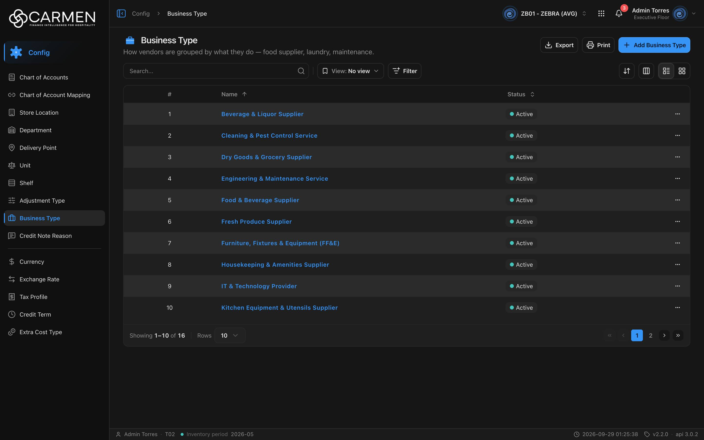

---
**Doc ID:** CB-PAGE-007
**Title:** Business Type (List)
**Domain:** All users
**Route:** /config/business-type
**Status:** Draft
**Created:** 2026-09-29
**Last Updated:** 2026-09-29
**Author:** Claude (จากโค้ด + ภาพหน้าจอจริง)
**Parent Flow:** N/A — master data CRUD ไม่มี workflow
---

## 8.7 Business Type

> หน้ารายการประเภทธุรกิจของผู้ขาย (vendor) ใช้จัดกลุ่ม vendor ตามสิ่งที่ทำ เช่น food supplier, laundry, maintenance

---

### 8.7.1 Purpose

ดูแล master data "business type" ที่ผูกกับ vendor (endpoint ฝั่ง backend คือ `vendor-business-types`) — มีเพียงชื่อกับสถานะ ผู้ใช้ค้นหา/กรอง, เพิ่มหรือแก้ไขผ่าน CB-MODAL-006, ลบผ่าน CB-MODAL-014, ดู Activity และ export Excel

โค้ด: `routes/config/business-type/` (`business-type-component.tsx`, `use-business-type-table.tsx`, `business-type-filter-fields.ts`, `business-type-card.tsx`, `business-type-dialog.tsx` โหลดแบบ lazy, `business-type-form-schema.ts`) บน `ConfigListTemplate` · hook `hooks/use-business-type.ts`

---

### 8.7.2 Screen Overview

**Access Path:**
- Sidebar → **Config** → **Business Type**
- หน้า Config dashboard (`/config`) — การ์ด `config.vendor-by-business-type` ก็ชี้มาหน้านี้
- Direct URL: `/config/business-type`

**Permissions Required:**

| Role | Permission | Scope | Notes |
|------|-----------|-------|-------|
| ทุกบทบาท | `configuration.business_type.view` | BU ปัจจุบัน | สิทธิ์เข้าหน้า (`constant/module-list.ts:538-542`) |
| ทุกบทบาท | license feature `configuration.business_type` | BU ปัจจุบัน | คำนวณจาก permission |
| ผู้เพิ่ม | `configuration.business_type.create` | BU ปัจจุบัน | ปุ่ม **Add Business Type** |
| ผู้แก้ไข | `configuration.business_type.update` | BU ปัจจุบัน | ไม่มี → dialog read-only |
| ผู้ลบ | `configuration.business_type.delete` | BU ปัจจุบัน | ⋯ → Delete |
| Admin | — | — | bypass permission ไม่ bypass license |

---

### 8.7.3 Screen Layout



```
[Breadcrumb: Config > Business Type]               [BU switcher] [apps] [🔔] [user]
──────────────────────────────────────────────────────────────────────────────────
💼 Business Type                             [Export] [Print] [+ Add Business Type]
How vendors are grouped by what they do — food supplier, laundry, maintenance.
──────────────────────────────────────────────────────────────────────────────────
[Search...            🔍] | [View: No view ▾] [Filter]      [⇅ Sort] [▥ Columns] [☰|▦]
──────────────────────────────────────────────────────────────────────────────────
 ☐ | #  | Name ↑                              | Status ⇕ | (Created) (Updated) | ⋯
 ☐ | 1  | Beverage & Liquor Supplier          | ● Active |                     | ⋯
 ☐ | 2  | Cleaning & Pest Control Service     | ● Active |                     | ⋯
 ...
──────────────────────────────────────────────────────────────────────────────────
Showing 1–10 of 16 | Rows [10 ▾]                                  [«] [‹] [1] [2] [›] [»]
```

---

### 8.7.4 Header Information

หน้า list ไม่มีฟอร์มหัวเอกสาร — บันทึกแถบหัวหน้าและ toolbar แทน

| Field | Mandatory | Description | Business Logic / Remark |
|-------|-----------|-------------|--------------------------|
| Title "Business Type" | — | ชื่อหน้า | `config.businessType.title` |
| Description | — | "How vendors are grouped by what they do — food supplier, laundry, maintenance." | `config.businessType.desc` |
| Search | N | ค้นหาข้อความอิสระ | `search=` เมื่อ Enter / คลิก 🔍 |
| View | N | Saved view | default "No view" |
| Filter | N | Status | **Active** / **Inactive** → `is_active\|bool:true` / `is_active\|bool:false` |

**Read-only fields:** N/A

---

### 8.7.5 Summary Information

N/A — ไม่มีตัวเลขสรุป

---

### 8.7.6 Detail / Grid Information

| Column | Mandatory | Description | Business Logic / Remark |
|--------|-----------|-------------|--------------------------|
| (checkbox) | — | เลือกแถว | ไม่มี bulk action |
| # | — | ลำดับ | ต่อเนื่องข้ามหน้า |
| Name | Y | ชื่อประเภทธุรกิจ | ลิงก์ — คลิกเปิด CB-MODAL-006 (Edit) · ว่าง = "..." · sort ได้ (default) |
| Status | — | Active / Inactive | sort ได้ |
| Created / Updated | — | เวลา + ผู้ทำ | ซ่อนเป็นค่าเริ่มต้น |
| ⋯ | — | เมนูแถว | **Activity** (label = Name), **Delete** |

**Grid Actions:**

| Button | Description | Business Logic |
|--------|-------------|----------------|
| คลิก Name | เปิด CB-MODAL-006 โหมดแก้ไข | read-only ถ้าไม่มี update / license |
| ⋯ → Activity | เปิด activity sheet | — |
| ⋯ → Delete | เปิด CB-MODAL-014 "Are you sure you want to delete business type "{name}"? This action cannot be undone." | license หมดอายุ → disabled · ไม่มีสิทธิ์ → Permission Denied |
| Grid view | การ์ดแสดง Name, Status, Created/Updated | infinite scroll |

---

### 8.7.7 Action Buttons

| Button | Color / Type | Description | Business Logic / Validation |
|--------|-------------|-------------|------------------------------|
| Export | Secondary (White) | .xlsx ของแถวที่โหลดอยู่ | คอลัมน์ Name, Status · ไม่มีข้อมูล → "No data to export" |
| Print | Secondary (White) | `window.print()` | — |
| Add Business Type | Primary (Blue) | เปิด CB-MODAL-006 โหมดสร้าง | license → "Subscription Expired" · ไม่มี create → "Permission Denied" |
| ⇅ Sort / ▥ Columns / ☰▦ | Secondary (icon) | sort, คอลัมน์, list/grid | desktop |

---

### 8.7.8 Document Status

| Status | Badge Colour | Description |
|--------|-------------|-------------|
| active (`is_active = true`) | Green dot "Active" | ใช้งานได้ |
| inactive (`is_active = false`) | Gray dot "Inactive" | ปิดใช้งาน |

**Status Transition Rules:**

| From Status | Action | To Status | Who Can Perform |
|-------------|--------|-----------|-----------------|
| active | ปิดสวิตช์ Active ใน CB-MODAL-006 → Save | inactive | ผู้มี `configuration.business_type.update` |
| inactive | เปิดสวิตช์ Active → Save | active | ผู้มี `configuration.business_type.update` |

---

### 8.7.9 Workflow History (if applicable)

N/A — ไม่มี workflow · ประวัติการแก้ไขอยู่ใน ⋯ → **Activity**

---

### 8.7.10 Modals Triggered from This Page

| Modal ID | Modal Name | Trigger |
|----------|-----------|---------|
| CB-MODAL-006 | Business Type Dialog (Add / Edit) | **Add Business Type** หรือคลิก Name |
| CB-MODAL-014 | Delete Confirmation | ⋯ → **Delete** |
| (ยังไม่มีเอกสาร) | Activity Sheet | ⋯ → **Activity** |
| (ยังไม่มีเอกสาร) | List Filter menu / sheet | ปุ่ม **Filter** |
| (ยังไม่มีเอกสาร) | Save View Dialog | Save view |
| (ยังไม่มีเอกสาร) | Permission Denied Dialog | Add/Delete โดยไม่มีสิทธิ์/license |

---

### 8.7.11 Navigation

| Action | Destination |
|--------|------------|
| Add / คลิก Name | → เปิด CB-MODAL-006 — อยู่หน้าเดิม |
| ⋯ → Delete | → เปิด CB-MODAL-014 — อยู่หน้าเดิม |
| Breadcrumb "Config" | → `/config` |

---

### 8.7.12 Pagination (for list screens)

- Rows per page: ค่าเริ่มต้น **10** · ตัวเลือก 5, 10, 25, 50, 100
- Navigation: First, Previous, เลขหน้า, Next, Last
- Default sort: **Name ascending** (`defaultSort="name:asc"`)

---

### 8.7.13 API Endpoints

| Method | Endpoint | Purpose |
|--------|----------|---------|
| GET | `/api/config/{bu_code}/vendor-business-types` | โหลดรายการ |
| POST | `/api/config/{bu_code}/vendor-business-types` | สร้าง |
| PATCH | `/api/config/{bu_code}/vendor-business-types/{id}` | แก้ไข (`updateMethod: "PATCH"`, ส่ง `doc_version`) |
| DELETE | `/api/config/{bu_code}/vendor-business-types/{id}` | ลบ |

**Query parameter syntax (for list endpoints):**
- `?page=1&perpage=10&sort=name:asc&search=supplier&filter=is_active|bool:false`

---

### 8.7.14 Edge Cases & Error States

| # | Scenario | System Behaviour |
|---|----------|-----------------|
| 1 | Mandatory field left blank | ตรวจใน CB-MODAL-006 — "Name is required" |
| 2 | Session expired | 401 → refresh + retry · ล้มเหลว → `/login` |
| 3 | No results / empty state | "No data found" |
| 4 | API error on load | `ErrorState` ทั้งหน้า + "Try again" |
| 5 | Concurrent edit | PATCH ส่ง `doc_version` · 409 → toast "Someone else changed this document. Refresh the page and try again." · การบังคับขึ้นกับ backend |
| 6 | Permission / license | ไม่มี view → "Permission Denied" · ไม่มี feature → "Feature Not Licensed" · license หมดอายุ → Add/Delete บล็อก dialog read-only |
| 7 | ลบประเภทที่ vendor ใช้อยู่ | ขึ้นกับ backend — error เป็น toast กลาง |
| 8 | Export ไม่มีแถว | "No data to export" |

---

### 8.7.15 Differences: Create vs. Edit Mode (if applicable)

| Behaviour | Create Mode | Edit Mode |
|-----------|------------|-----------|
| Name | ว่าง | ค่าเดิม แก้ได้ |
| Active | on | ค่าเดิม |
| Availability | ต้องมี create + license | read-only ถ้าไม่มี update / license |

---

### 8.7.16 Related Documents

| Doc ID | Title | Relationship |
|--------|-------|-------------|
| CB-MODAL-006 | Business Type Dialog | Opened from this page |
| CB-MODAL-014 | Delete Confirmation | Opened from row action Delete |
| N/A | Parent flow | master data CRUD ไม่มี workflow |
