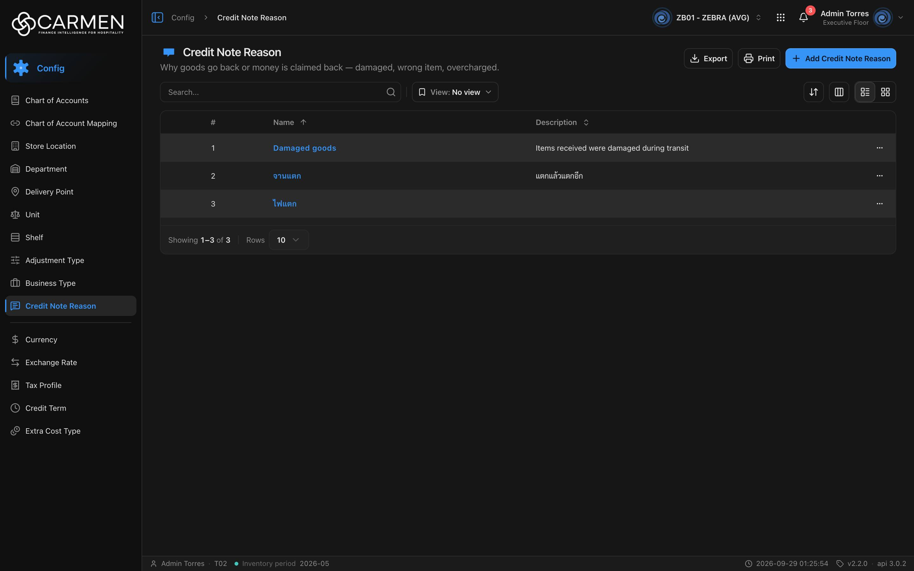

---
**Doc ID:** CB-PAGE-008
**Title:** Credit Note Reason (List)
**Domain:** All users
**Route:** /config/credit-note-reason
**Status:** Draft
**Created:** 2026-09-29
**Last Updated:** 2026-09-29
**Author:** Claude (จากโค้ด + ภาพหน้าจอจริง)
**Parent Flow:** N/A — master data CRUD ไม่มี workflow
---

## 8.8 Credit Note Reason

> หน้ารายการเหตุผลของ Credit Note (ส่งของคืนหรือเรียกเงินคืน เช่น สินค้าเสียหาย, ส่งผิดรายการ, คิดราคาเกิน) — มีแค่ชื่อกับคำอธิบาย

---

### 8.8.1 Purpose

ดูแลรายการเหตุผลที่ผู้ใช้เลือกในเอกสาร Credit Note ผู้ใช้ค้นหา, เพิ่มหรือแก้ไขผ่าน CB-MODAL-007, ลบผ่าน CB-MODAL-014, ดู Activity และ export Excel

หน้านี้ **ต่างจาก config list อื่นในกลุ่มเดียวกัน** สามจุด (ตรงกับที่เห็นบนหน้าจริง):
1. **ไม่มีปุ่ม Filter** — `CREDIT_NOTE_REASON_FILTER_FIELDS` เป็น array ว่าง (`credit-note-reason-filter-fields.ts:3`) และ `ListFilter` คืน `null` เมื่อไม่มี field ให้กรอง (`components/list-filter/list-filter.tsx:74-80`, comment ระบุ credit-note-reason ตรง ๆ) · ปุ่ม View (saved views) ยังอยู่
2. **ไม่มีคอลัมน์ Status** — `useCreditNoteReasonTable` ไม่ใส่ `statusColumn` และส่ง `hideStatus: true`
3. **ไม่มีสวิตช์ Active ใน dialog** — schema/payload มีแค่ `name`, `description` (ดู CB-MODAL-007) แม้ entity จะมี `is_active` และการ์ด/Export ยังอ่านค่านี้อยู่

โค้ด: `routes/config/credit-note-reason/` — hook CRUD อยู่ในโฟลเดอร์ route เอง (`use-cn-reason-config.ts`) ไม่ได้อยู่ใน `hooks/` · ไม่ส่ง `permissionPrefix` ให้ `ConfigListTemplate`

---

### 8.8.2 Screen Overview

**Access Path:**
- Sidebar → **Config** → **Credit Note Reason**
- หน้า Config dashboard (`/config`)
- Direct URL: `/config/credit-note-reason`

**Permissions Required:**

| Role | Permission | Scope | Notes |
|------|-----------|-------|-------|
| ทุกบทบาท | `configuration.view` | BU ปัจจุบัน | leaf ผูก permission ระดับโมดูล ไม่ใช่ระดับ resource (`constant/module-list.ts:544-549`) |
| ทุกบทบาท | license feature `configuration.credit_note_reason` | BU ปัจจุบัน | ระบุตรงใน leaf (`licenseFeature`) |
| ผู้เพิ่ม | `configuration.create` | BU ปัจจุบัน | ⚠️ prefix derive จาก route = `configuration` (ตัด `.view`) → คีย์ `configuration.create` **ไม่มีใน `PERMISSIONS`** — non-admin กด **Add Credit Note Reason** ไม่ได้ |
| ผู้แก้ไข | `configuration.update` | BU ปัจจุบัน | ⚠️ เหตุผลเดียวกัน — non-admin เปิด dialog แก้ไขได้แต่ read-only |
| ผู้ลบ | `configuration.delete` | BU ปัจจุบัน | ⚠️ เหตุผลเดียวกัน — non-admin กด Delete แล้วเด้ง Permission Denied |
| Admin | — | — | bypass permission ทั้งหมด (จึงไม่เห็นปัญหาข้างบน) ไม่ bypass license |

---

### 8.8.3 Screen Layout



```
[Breadcrumb: Config > Credit Note Reason]          [BU switcher] [apps] [🔔] [user]
──────────────────────────────────────────────────────────────────────────────────
💬 Credit Note Reason                   [Export] [Print] [+ Add Credit Note Reason]
Why goods go back or money is claimed back — damaged, wrong item, overcharged.
──────────────────────────────────────────────────────────────────────────────────
[Search...            🔍] | [View: No view ▾]   (ไม่มี Filter)  [⇅ Sort] [▥ Columns] [☰|▦]
──────────────────────────────────────────────────────────────────────────────────
 ☐ | # | Name ↑          | Description ⇕                              | (Created)(Updated) | ⋯
 ☐ | 1 | Damaged goods   | Items received were damaged during transit |                    | ⋯
 ☐ | 2 | จานแตก          | แตกแล้วแตกอีก                               |                    | ⋯
 ☐ | 3 | ไฟแตก           |                                            |                    | ⋯
──────────────────────────────────────────────────────────────────────────────────
Showing 1–3 of 3 | Rows [10 ▾]
```

---

### 8.8.4 Header Information

หน้า list ไม่มีฟอร์มหัวเอกสาร — บันทึกแถบหัวหน้าและ toolbar แทน

| Field | Mandatory | Description | Business Logic / Remark |
|-------|-----------|-------------|--------------------------|
| Title "Credit Note Reason" | — | ชื่อหน้า | `config.creditNoteReason.title` |
| Description | — | "Why goods go back or money is claimed back — damaged, wrong item, overcharged." | `config.creditNoteReason.desc` |
| Search | N | ค้นหาข้อความอิสระ | `search=` เมื่อ Enter / คลิก 🔍 |
| View | N | Saved view | default "No view" · บันทึกได้เฉพาะ sort (ไม่มี filter ให้เก็บ) |
| Filter | — | — | **ไม่แสดง** (ไม่มี filter field) · ไม่ส่ง `filter=` |

**Read-only fields:** N/A

---

### 8.8.5 Summary Information

N/A — ไม่มีตัวเลขสรุป

---

### 8.8.6 Detail / Grid Information

| Column | Mandatory | Description | Business Logic / Remark |
|--------|-----------|-------------|--------------------------|
| (checkbox) | — | เลือกแถว | ไม่มี bulk action |
| # | — | ลำดับ | ต่อเนื่องข้ามหน้า |
| Name | Y | ชื่อเหตุผล | ลิงก์ — คลิกเปิด CB-MODAL-007 (Edit) · ว่าง = "..." · sort ได้ (default) |
| Description | N | คำอธิบาย | ว่างแสดงเป็นช่องว่าง (ไม่มี "-" ต่างจากหน้า Unit) · sort ได้ |
| Created / Updated | — | เวลา + ผู้ทำ | ซ่อนเป็นค่าเริ่มต้น |
| ⋯ | — | เมนูแถว | **Activity** (label = Name), **Delete** |

ไม่มีคอลัมน์ Status (ดู 8.8.1)

**Grid Actions:**

| Button | Description | Business Logic |
|--------|-------------|----------------|
| คลิก Name | เปิด CB-MODAL-007 โหมดแก้ไข | read-only ถ้าไม่มี `configuration.update` หรือ license |
| ⋯ → Activity | เปิด activity sheet | — |
| ⋯ → Delete | เปิด CB-MODAL-014 "Are you sure you want to delete credit note reason "{name}"? This action cannot be undone." | license หมดอายุ → disabled · ไม่มี `configuration.delete` → Permission Denied |
| Grid view | การ์ดแสดง Name, **Status (Active/Inactive)**, Description, Created/Updated | การ์ดยังแสดงสถานะ (`ListCardActiveRow`) ทั้งที่ตารางไม่มี |

---

### 8.8.7 Action Buttons

| Button | Color / Type | Description | Business Logic / Validation |
|--------|-------------|-------------|------------------------------|
| Export | Secondary (White) | .xlsx ของแถวที่โหลดอยู่ | คอลัมน์ Name, Description, **Status** (อ่าน `is_active` จาก backend) · ไม่มีข้อมูล → "No data to export" |
| Print | Secondary (White) | `window.print()` | — |
| Add Credit Note Reason | Primary (Blue) | เปิด CB-MODAL-007 โหมดสร้าง | license → "Subscription Expired" · ไม่มี `configuration.create` → "Permission Denied" |
| ⇅ Sort / ▥ Columns / ☰▦ | Secondary (icon) | sort, คอลัมน์, list/grid | desktop |

---

### 8.8.8 Document Status

Entity มี `is_active` แต่หน้านี้ **ไม่มีทางเปลี่ยนค่า** และไม่แสดงในตาราง — เห็นได้แค่ในการ์ด (grid/mobile) และไฟล์ Export

| Status | Badge Colour | Description |
|--------|-------------|-------------|
| active (`is_active = true`) | Green dot "Active" (เฉพาะการ์ด) | ค่าที่ backend กำหนด |
| inactive (`is_active = false`) | Gray dot "Inactive" (เฉพาะการ์ด) | ค่าที่ backend กำหนด |

**Status Transition Rules:**

| From Status | Action | To Status | Who Can Perform |
|-------------|--------|-----------|-----------------|
| — | ไม่มี action ใน UI | — | N/A — payload create/update ไม่มี `is_active` ค่าเริ่มต้นของรายการใหม่ขึ้นกับ backend |

---

### 8.8.9 Workflow History (if applicable)

N/A — ไม่มี workflow · ประวัติการแก้ไขอยู่ใน ⋯ → **Activity**

---

### 8.8.10 Modals Triggered from This Page

| Modal ID | Modal Name | Trigger |
|----------|-----------|---------|
| CB-MODAL-007 | Credit Note Reason Dialog (Add / Edit) | **Add Credit Note Reason** หรือคลิก Name |
| CB-MODAL-014 | Delete Confirmation | ⋯ → **Delete** |
| (ยังไม่มีเอกสาร) | Activity Sheet | ⋯ → **Activity** |
| (ยังไม่มีเอกสาร) | Save View Dialog | Save view (จากเมนู View) |
| (ยังไม่มีเอกสาร) | Permission Denied Dialog | Add/Delete โดยไม่มีสิทธิ์/license |

---

### 8.8.11 Navigation

| Action | Destination |
|--------|------------|
| Add / คลิก Name | → เปิด CB-MODAL-007 — อยู่หน้าเดิม |
| ⋯ → Delete | → เปิด CB-MODAL-014 — อยู่หน้าเดิม |
| Breadcrumb "Config" | → `/config` |

---

### 8.8.12 Pagination (for list screens)

- Rows per page: ค่าเริ่มต้น **10** · ตัวเลือก 5, 10, 25, 50, 100
- Navigation: First, Previous, เลขหน้า, Next, Last
- Default sort: **Name ascending** (`defaultSort="name:asc"`)

---

### 8.8.13 API Endpoints

| Method | Endpoint | Purpose |
|--------|----------|---------|
| GET | `/api/config/{bu_code}/credit-note-reasons` | โหลดรายการ |
| POST | `/api/config/{bu_code}/credit-note-reasons` | สร้าง |
| PUT | `/api/config/{bu_code}/credit-note-reasons/{id}` | แก้ไข (ค่า default ของ `createConfigCrud` · ส่ง `doc_version`) |
| DELETE | `/api/config/{bu_code}/credit-note-reasons/{id}` | ลบ |

**Query parameter syntax (for list endpoints):**
- `?page=1&perpage=10&sort=name:asc&search=damaged` — ไม่มี `filter=`

---

### 8.8.14 Edge Cases & Error States

| # | Scenario | System Behaviour |
|---|----------|-----------------|
| 1 | Mandatory field left blank | ตรวจใน CB-MODAL-007 — "Name is required" |
| 2 | Session expired | 401 → refresh + retry · ล้มเหลว → `/login` |
| 3 | No results / empty state | "No data found" |
| 4 | API error on load | `ErrorState` ทั้งหน้า + "Try again" |
| 5 | Concurrent edit | PUT ส่ง `doc_version` · 409 → toast "Someone else changed this document. Refresh the page and try again." · การบังคับขึ้นกับ backend |
| 6 | Permission / license | ไม่มี `configuration.view` → "Permission Denied" · ไม่มี feature → "Feature Not Licensed" · license หมดอายุ → Add/Delete บล็อก dialog read-only · ⚠️ non-admin เขียนไม่ได้เลยเพราะคีย์ `configuration.create/update/delete` ไม่มีจริง |
| 7 | ต้องการปิดใช้เหตุผล (inactive) | ทำไม่ได้จากหน้านี้ — ทางเลือกเดียวคือลบ |
| 8 | Export ไม่มีแถว | "No data to export" |

---

### 8.8.15 Differences: Create vs. Edit Mode (if applicable)

| Behaviour | Create Mode | Edit Mode |
|-----------|------------|-----------|
| Name / Description | ว่าง | ค่าเดิม แก้ได้ |
| Active | ไม่มีช่อง | ไม่มีช่อง |
| Availability | ต้องมี `configuration.create` + license | read-only ถ้าไม่มี `configuration.update` / license |

---

### 8.8.16 Related Documents

| Doc ID | Title | Relationship |
|--------|-------|-------------|
| CB-MODAL-007 | Credit Note Reason Dialog | Opened from this page |
| CB-MODAL-014 | Delete Confirmation | Opened from row action Delete |
| N/A | Parent flow | master data CRUD ไม่มี workflow |
