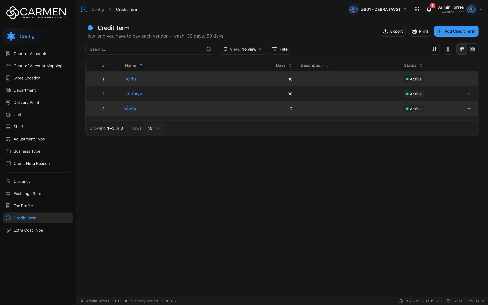

---
**Doc ID:** CB-PAGE-009
**Title:** Credit Term
**Domain:** All users
**Route:** /config/credit-term
**Status:** Draft
**Created:** 2026-09-29
**Last Updated:** 2026-09-29
**Author:** Claude (จากโค้ด + ภาพหน้าจอจริง)
**Parent Flow:** N/A — master data CRUD ไม่มี workflow
---

## 8.9 Credit Term

> หน้ารายการ master data "เงื่อนไขการชำระเงิน" (จำนวนวันเครดิตที่ให้กับ vendor) ของ BU ปัจจุบัน — ใช้โดยผู้ดูแลระบบ/ฝ่ายบัญชีที่ตั้งค่า config

---

### 8.9.1 Purpose

ให้ผู้ใช้ค้นหา ดู เพิ่ม แก้ไข เปิด/ปิดใช้งาน และลบ Credit Term (ชื่อ + จำนวนวัน + คำอธิบาย) ซึ่งถูกเลือกใช้ในเอกสารฝั่ง vendor/procurement
หน้านี้สร้างจาก `ConfigListTemplate` (`components/templates/config-list-template.tsx`) — การเพิ่ม/แก้ไขทำใน dialog (CB-MODAL-008) ไม่มีหน้า detail แยก

---

### 8.9.2 Screen Overview

**Access Path:**
- Sidebar: **Config → Credit Term**
- Direct URL: `/config/credit-term`

**Permissions Required:**

| Role | Permission | Scope | Notes |
|------|-----------|-------|-------|
| All users | `configuration.view` | BU ปัจจุบัน | เมนูผูกกับ `PERMISSIONS.configuration.view` (`constant/module-list.ts:574`) ไม่ใช่คีย์ระดับ resource |
| All users | `configuration.create` | BU ปัจจุบัน | prefix ถูก derive จาก leaf (`configuration.view` → `configuration`) จึงได้คีย์ `configuration.create` ซึ่ง **ไม่อยู่ใน `PERMISSIONS` catalog** — non-admin น่าจะกด Add ไม่ได้ (admin bypass) |
| All users | `configuration.update` | BU ปัจจุบัน | เหมือนข้างบน — ถ้าไม่มี dialog เปิดแบบ readOnly |
| All users | `configuration.delete` | BU ปัจจุบัน | เหมือนข้างบน — เมนู Delete จะเด้ง Permission denied dialog |
| License | `configuration.credit_term` | BU | `licenseFeature` ของ leaf; `LICENSE_ENFORCEMENT` เปิดทุก env — ไม่มี feature = หน้าล็อก, license หมดอายุ (`canWrite=false`) = เขียนไม่ได้ทั้งหน้า |

---

### 8.9.3 Screen Layout



```
[Breadcrumb: Config > Credit Term]
[Icon] Credit Term                                [Export] [Print] [+ Add Credit Term]
How long you have to pay each vendor — cash, 30 days, 60 days.
────────────────────────────────────────────────────────────────────────────────
[Search...  🔍] | [View: No view ▾] [Filter]          [⇅ Sort] [▥ Columns] [☰|▦]
────────────────────────────────────────────────────────────────────────────────
 ☐ | #  | Name ↑        | Days | Description | Status     | (Created) | (Updated) | …
   | 1  | 10 วัน         |   10 |             | ● Active   |           |           | …
   | 2  | 30 Days       |   30 |             | ● Active   |           |           | …
────────────────────────────────────────────────────────────────────────────────
Showing 1–3 of 3 | Rows [10 ▾]                                   [pagination]
```

---

### 8.9.4 Header Information

N/A — หน้า list ไม่มีฟิลด์ header ให้กรอก (หัวหน้าแสดงเฉพาะ title `Credit Term` + คำอธิบาย `config.creditTerm.desc`)

**Read-only fields:** N/A

---

### 8.9.5 Summary Information

N/A — master data ไม่มียอดสรุป

---

### 8.9.6 Detail / Grid Information

| Column | Mandatory | Description | Business Logic / Remark |
|--------|-----------|-------------|--------------------------|
| ☐ (select) | — | checkbox เลือกแถว | มาจาก `useConfigTable` → `selectColumn`; ไม่มี bulk action ใดใช้ค่าที่เลือก, ซ่อนตอนพิมพ์ |
| # | — | ลำดับแถว | `row.index + 1 + (page−1) × perpage`; sort ไม่ได้ |
| Name | Y | ชื่อ credit term | ลิงก์สีฟ้า (`CellAction`) — คลิกเปิด CB-MODAL-008 โหมด Edit; ถ้าชื่อว่างแสดง `...`; sort ได้ (default `name:asc`) |
| Days | Y | จำนวนวันเครดิต (`value`) | ชิดขวา; sort ได้ |
| Description | N | คำอธิบาย | sort ได้ |
| Status | — | `is_active` | `StatusBadge`: จุดเขียว + "Active" / จุดเทา + "Inactive"; sort ได้ |
| Created | — | ผู้สร้าง + เวลา (`audit.created`) | ซ่อนเป็นค่าเริ่มต้น — เปิดได้จากปุ่ม Columns |
| Updated | — | ผู้แก้ล่าสุด + เวลา (`audit.updated`) | ซ่อนเป็นค่าเริ่มต้น |
| … (row actions) | — | เมนูแถว | มี **Activity** (เปิด activity sheet ของแถว) และ **Delete** (ไม่มีเมนู Edit — แก้ผ่านการคลิกชื่อ) |

**Grid Actions:**

| Button | Description | Business Logic |
|--------|-------------|----------------|
| Name (link) | เปิด CB-MODAL-008 โหมด Edit | ถ้าไม่มีสิทธิ์ update หรือ license เขียนไม่ได้ → dialog เปิดแบบ readOnly (ปุ่ม Close อย่างเดียว) |
| … → Activity | เปิด Activity sheet ของรายการ | `openActivity(id, name)` (`activity: { id, label }` ใน `use-credit-term-table.tsx:86`) |
| … → Delete | เปิด CB-MODAL-014 (Delete confirmation) | ไม่มีสิทธิ์ delete → Permission denied dialog; license หมดอายุ → เมนู disabled พร้อม tooltip "Disabled — your subscription is expired or inactive. Contact your administrator to renew." |
| Sort (⇅) | เมนูเลือกคอลัมน์ที่จะเรียง | เปลี่ยน sort แล้ว reset ไปหน้า 1 |
| Columns (▥) | เปิด/ปิดการแสดงคอลัมน์ | แสดงเฉพาะโหมด list |
| List / Grid | สลับตาราง ↔ การ์ด | โหมด grid (และบนมือถือ) ใช้ infinite scroll แทน pagination; การ์ดแสดง Active, Credit Term (x Days), Description, audit |

---

### 8.9.7 Action Buttons

| Button | Color / Type | Description | Business Logic / Validation |
|--------|-------------|-------------|------------------------------|
| + Add Credit Term | Primary (Blue) | เปิด CB-MODAL-008 โหมด Create | ถ้า `!canWrite` → Permission denied dialog แบบ "expired"; ถ้าไม่มี `configuration.create` (non-admin) → Permission denied dialog; ปุ่มจาง (`addDisabled`) |
| Export | Secondary (White) | ดาวน์โหลด .xlsx ของแถวที่โหลดอยู่ในหน้าปัจจุบัน | คอลัมน์: Name, Days, Description, Status; ไม่มีข้อมูล → toast "No data to export"; สำเร็จ → "Exported {count} records" |
| Print | Secondary (White) | พิมพ์หน้า (browser print) | คอลัมน์ select/action ถูกซ่อนตอนพิมพ์ |
| View: No view | Secondary | เลือก/จัดการ saved view (filter + sort) | scope bu/user; บันทึกผ่าน Save view dialog |
| Filter | Secondary | เปิด filter sheet | ฟิลด์เดียว: Status (Active → `is_active|bool:true`, Inactive → `is_active|bool:false`) |

---

### 8.9.8 Document Status

| Status | Badge Colour | Description |
|--------|-------------|-------------|
| active | Neutral badge + จุดเขียว | `is_active = true` — เลือกใช้ในเอกสารได้ |
| inactive | Neutral badge + จุดเทา | `is_active = false` — ถูกปิดใช้งาน |

**Status Transition Rules:**

| From Status | Action | To Status | Who Can Perform |
|-------------|--------|-----------|-----------------|
| active | ปิดสวิตช์ Active ใน CB-MODAL-008 → Save | inactive | ผู้มีสิทธิ์ update (`configuration.update`) + license เขียนได้ |
| inactive | เปิดสวิตช์ Active → Save | active | เหมือนข้างบน |

---

### 8.9.9 Workflow History (if applicable)

N/A — ไม่มี workflow; ประวัติการแก้ไขดูได้จาก Activity sheet (เมนู … → Activity)

---

### 8.9.10 Modals Triggered from This Page

| Modal ID | Modal Name | Trigger |
|----------|-----------|---------|
| CB-MODAL-008 | Credit Term Dialog (Add / Edit) | คลิก **+ Add Credit Term** หรือคลิกชื่อในแถว |
| CB-MODAL-014 | Delete Confirmation | เมนู … → **Delete** |
| — | Activity sheet (ยังไม่มีเอกสาร) | เมนู … → **Activity** |
| — | Filter sheet (ยังไม่มีเอกสาร) | ปุ่ม **Filter** |
| — | Save view dialog (ยังไม่มีเอกสาร) | ปุ่ม Save ใน filter sheet |

---

### 8.9.11 Navigation

| Action | Destination |
|--------|------------|
| + Add Credit Term | → เปิด CB-MODAL-008 (Create) บนหน้าเดิม |
| คลิก Name | → เปิด CB-MODAL-008 (Edit) บนหน้าเดิม |
| … → Delete | → เปิด CB-MODAL-014; ยืนยันแล้วอยู่หน้าเดิม + refetch |
| Breadcrumb "Config" | → หน้า landing ของโมดูล Config |

---

### 8.9.12 Pagination (for list screens)

- Rows per page: 5 / 10 / 25 / 50 / 100 (default **10**, `hooks/use-list-page-state.ts:9`)
- Navigation: ปุ่มเปลี่ยนหน้าของ `DataGridPagination` + ข้อความ "Showing 1–3 of 3"
- Default sort: `name`, ascending (`defaultSort="name:asc"`)
- page/perpage/sort/search อยู่ใน URL query จึง refresh/แชร์ลิงก์แล้วคงสถานะ

---

### 8.9.13 API Endpoints

| Method | Endpoint | Purpose |
|--------|----------|---------|
| GET | `/api/config/{bu_code}/credit-terms` | โหลดรายการ (แบ่งหน้า) |
| POST | `/api/config/{bu_code}/credit-terms` | สร้าง (จาก CB-MODAL-008) |
| PATCH | `/api/config/{bu_code}/credit-terms/{id}` | แก้ไข (จาก CB-MODAL-008) — `updateMethod: "PATCH"` |
| DELETE | `/api/config/{bu_code}/credit-terms/{id}` | ลบ (จาก CB-MODAL-014) |

> path ในโค้ดคือ `/api/proxy/api/config/...` — `lib/http-client.ts` เขียนทับ `/api/proxy/` เป็น `${BACKEND_URL}/` และแนบ `Authorization` + `x-app-id` เอง

**Query parameter syntax (for list endpoints):**
- `?page=1&perpage=10&sort=name:asc`
- Search: `&search=30` (กด Enter ในช่อง Search)
- Status filter: `&filter=is_active|bool:true` (หรือ `is_active|bool:false`)
- Cache: `CACHE_STATIC` (stale 30 นาที) — mutation ใด ๆ invalidate query key `CREDIT_TERMS`

---

### 8.9.14 Edge Cases & Error States

| # | Scenario | System Behaviour |
|---|----------|-----------------|
| 1 | Mandatory field left blank | ตรวจใน CB-MODAL-008: "Name is required" / "Days must be at least 1" — ไม่ submit |
| 2 | Session expired mid-edit | `http-client` เจอ 401 → refresh token แล้ว retry อัตโนมัติ; refresh ไม่ได้ → token store ว่าง → `RequireAuth` redirect `/login` (ไม่มี toast ซ้ำ) |
| 3 | No results / empty state | ตารางแสดงภาพโฟลเดอร์ + "No data found" |
| 4 | API error on load | ทั้งหน้าแทนด้วย `ErrorState` พร้อมปุ่ม "Try again" (refetch) |
| 5 | Concurrent edit by another user | Edit ส่ง `doc_version` ของแถวที่โหลดไว้ไปด้วย — ถ้า backend ตรวจ OCC แล้วตอบ 409 → toast "Someone else changed this document. Refresh the page and try again." (FE ไม่ได้ refetch ให้เอง) |
| 6 | User lacks permission | non-admin: ปุ่ม Add จาง + กดแล้วขึ้น Permission denied dialog, ชื่อในแถวเปิด dialog แบบ readOnly, Delete ขึ้น dialog ปฏิเสธ; ไม่มี license feature `configuration.credit_term` → เมนู/หน้า locked |
| 7 | License หมดอายุ (`canWrite=false`) | Add → dialog แบบ expired; Delete disabled + tooltip; dialog แก้ไขเป็น readOnly |
| 8 | Export ตอนไม่มีข้อมูล | toast warning "No data to export" |
| 9 | Delete รายการที่ถูกอ้างอิงอยู่ | backend ตอบ error → toast กลางจาก `ApiErrorToaster`; dialog ยังเปิดค้าง |

---

### 8.9.15 Differences: Create vs. Edit Mode (if applicable)

N/A สำหรับหน้า list — ดู CB-MODAL-008 §8.9.10.1

---

### 8.9.16 Related Documents

| Doc ID | Title | Relationship |
|--------|-------|-------------|
| CB-MODAL-008 | Credit Term Dialog | Opened from this page |
| CB-MODAL-014 | Delete Confirmation | Opened from row action |
| N/A | — | ไม่มี parent flow (master data CRUD) |
