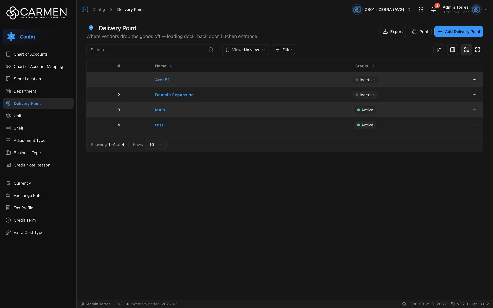

---
**Doc ID:** CB-PAGE-010
**Title:** Delivery Point
**Domain:** All users
**Route:** /config/delivery-point
**Status:** Draft
**Created:** 2026-09-29
**Last Updated:** 2026-09-29
**Author:** Claude (จากโค้ด + ภาพหน้าจอจริง)
**Parent Flow:** N/A — master data CRUD ไม่มี workflow
---

## 8.10 Delivery Point

> หน้ารายการ master data "จุดส่งของ" (ที่ที่ vendor มาส่งสินค้า เช่น loading dock, ประตูหลัง) ของ BU ปัจจุบัน

---

### 8.10.1 Purpose

ให้ผู้ใช้ค้นหา ดู เพิ่ม แก้ไข เปิด/ปิดใช้งาน และลบ Delivery Point ซึ่งใช้อ้างอิงในเอกสารจัดซื้อ (ปลายทางการส่งของ)
หน้าสร้างจาก `ConfigListTemplate`; dialog เพิ่ม/แก้ไข (CB-MODAL-009) **ไม่ได้อยู่ในโฟลเดอร์ route** แต่อยู่ที่ `components/share/delivery-point-dialog.tsx` (ปัจจุบันมีผู้เรียกเพียงหน้านี้หน้าเดียว)

---

### 8.10.2 Screen Overview

**Access Path:**
- Sidebar: **Config → Delivery Point**
- Direct URL: `/config/delivery-point`

**Permissions Required:**

| Role | Permission | Scope | Notes |
|------|-----------|-------|-------|
| All users | `configuration.delivery_point.view` | BU ปัจจุบัน | เปิดเมนู/หน้า |
| All users | `configuration.delivery_point.create` | BU ปัจจุบัน | ปุ่ม Add (`permissionPrefix="configuration.delivery_point"`) |
| All users | `configuration.delivery_point.update` | BU ปัจจุบัน | ไม่มี → dialog เปิดแบบ readOnly |
| All users | `configuration.delivery_point.delete` | BU ปัจจุบัน | เมนู Delete |
| License | `configuration.delivery_point` | BU | ไม่มี `licenseFeature` — คำนวณจาก permission (ตัด `.view`) |

---

### 8.10.3 Screen Layout



```
[Breadcrumb: Config > Delivery Point]
[Icon] Delivery Point                         [Export] [Print] [+ Add Delivery Point]
Where vendors drop the goods off — loading dock, back door, kitchen entrance.
────────────────────────────────────────────────────────────────────────────────
[Search...  🔍] | [View: No view ▾] [Filter]          [⇅ Sort] [▥ Columns] [☰|▦]
────────────────────────────────────────────────────────────────────────────────
 ☐ | #  | Name               | Status       | (Created) | (Updated) | …
   | 1  | Area51             | ● Inactive   |           |           | …
   | 3  | Main               | ● Active     |           |           | …
────────────────────────────────────────────────────────────────────────────────
Showing 1–4 of 4 | Rows [10 ▾]
```

---

### 8.10.4 Header Information

N/A — หน้า list ไม่มีฟิลด์ header

**Read-only fields:** N/A

---

### 8.10.5 Summary Information

N/A — master data ไม่มียอดสรุป

---

### 8.10.6 Detail / Grid Information

| Column | Mandatory | Description | Business Logic / Remark |
|--------|-----------|-------------|--------------------------|
| ☐ (select) | — | checkbox เลือกแถว | จาก `useConfigTable`; ไม่มี bulk action |
| # | — | ลำดับแถว | คำนวณจาก page/perpage |
| Name | Y | ชื่อจุดส่งของ | ลิงก์ — คลิกเปิด CB-MODAL-009 (Edit); sort ได้ |
| Status | — | `is_active` | จุดเขียว "Active" / จุดเทา "Inactive"; sort ได้ |
| Created | — | `audit.created` | ซ่อนเป็นค่าเริ่มต้น |
| Updated | — | `audit.updated` | ซ่อนเป็นค่าเริ่มต้น |
| … | — | เมนูแถว | **Activity** + **Delete** (ไม่มี Edit ในเมนู) |

**Grid Actions:**

| Button | Description | Business Logic |
|--------|-------------|----------------|
| Name (link) | เปิด CB-MODAL-009 โหมด Edit | readOnly ถ้าไม่มีสิทธิ์ update หรือ license เขียนไม่ได้ |
| … → Activity | เปิด Activity sheet | label = ชื่อ |
| … → Delete | เปิด CB-MODAL-014 | ไม่มีสิทธิ์ → Permission denied dialog; license หมดอายุ → disabled + tooltip |
| Sort / Columns / List-Grid | เหมือนหน้า config อื่น | grid/มือถือใช้ infinite scroll |

---

### 8.10.7 Action Buttons

| Button | Color / Type | Description | Business Logic / Validation |
|--------|-------------|-------------|------------------------------|
| + Add Delivery Point | Primary (Blue) | เปิด CB-MODAL-009 โหมด Create | `!canWrite` → Permission denied (expired); ไม่มี create permission → Permission denied |
| Export | Secondary (White) | .xlsx ของแถวในหน้าปัจจุบัน | คอลัมน์ Name, Status; ไม่มีข้อมูล → "No data to export" |
| Print | Secondary (White) | browser print | — |
| View: No view | Secondary | saved views | — |
| Filter | Secondary | filter sheet | Status: Active / Inactive (`is_active|bool:true/false`) |

---

### 8.10.8 Document Status

| Status | Badge Colour | Description |
|--------|-------------|-------------|
| active | Neutral badge + จุดเขียว | ใช้งานได้ |
| inactive | Neutral badge + จุดเทา | ปิดใช้งาน |

**Status Transition Rules:**

| From Status | Action | To Status | Who Can Perform |
|-------------|--------|-----------|-----------------|
| active | ปิดสวิตช์ Active ใน CB-MODAL-009 → Save | inactive | มี `configuration.delivery_point.update` + license เขียนได้ |
| inactive | เปิดสวิตช์ Active → Save | active | เหมือนข้างบน |

---

### 8.10.9 Workflow History (if applicable)

N/A — ใช้ Activity sheet แทน

---

### 8.10.10 Modals Triggered from This Page

| Modal ID | Modal Name | Trigger |
|----------|-----------|---------|
| CB-MODAL-009 | Delivery Point Dialog (Add / Edit) | **+ Add Delivery Point** หรือคลิกชื่อ |
| CB-MODAL-014 | Delete Confirmation | … → **Delete** |
| — | Activity sheet (ยังไม่มีเอกสาร) | … → **Activity** |
| — | Filter sheet (ยังไม่มีเอกสาร) | **Filter** |
| — | Save view dialog (ยังไม่มีเอกสาร) | Save ใน filter sheet |

---

### 8.10.11 Navigation

| Action | Destination |
|--------|------------|
| + Add Delivery Point / คลิกชื่อ | → เปิด CB-MODAL-009 บนหน้าเดิม |
| … → Delete | → เปิด CB-MODAL-014; สำเร็จแล้วอยู่หน้าเดิม |
| Breadcrumb "Config" | → landing ของโมดูล Config |

---

### 8.10.12 Pagination (for list screens)

- Rows per page: 5 / 10 / 25 / 50 / 100 (default **10**)
- Navigation: `DataGridPagination` + "Showing x–y of n"
- Default sort: **ไม่ได้กำหนด** (component ไม่ส่ง `defaultSort`) — ไม่ส่ง `sort` ไป backend จึงเรียงตามค่า default ของ backend และหัวคอลัมน์ไม่มีลูกศร

---

### 8.10.13 API Endpoints

| Method | Endpoint | Purpose |
|--------|----------|---------|
| GET | `/api/config/{bu_code}/delivery-points` | โหลดรายการ |
| POST | `/api/config/{bu_code}/delivery-points` | สร้าง |
| PUT | `/api/config/{bu_code}/delivery-points/{id}` | แก้ไข — hook ใช้ `updateMethod` default = **PUT** (ต่างจาก credit term / extra cost / tax profile ที่ใช้ PATCH) |
| DELETE | `/api/config/{bu_code}/delivery-points/{id}` | ลบ |

**Query parameter syntax (for list endpoints):**
- `?page=1&perpage=10`
- `&search=main`
- `&filter=is_active|bool:false`

---

### 8.10.14 Edge Cases & Error States

| # | Scenario | System Behaviour |
|---|----------|-----------------|
| 1 | Mandatory field left blank | ใน CB-MODAL-009: "Name is required" (trim ก่อนตรวจ — ช่องว่างล้วนไม่ผ่าน) |
| 2 | Session expired | 401 → refresh + retry; ไม่สำเร็จ → redirect `/login` |
| 3 | No results / empty state | "No data found" พร้อมภาพโฟลเดอร์ |
| 4 | API error on load | `ErrorState` แทนทั้งหน้า + "Try again" |
| 5 | Concurrent edit | PUT ส่ง `doc_version` ของแถวที่โหลดไว้ — 409 จาก backend → toast "Someone else changed this document. Refresh the page and try again." |
| 6 | User lacks permission | Add จาง/ขึ้น Permission denied; dialog readOnly; Delete ขึ้น Permission denied |
| 7 | License หมดอายุ | Add ขึ้น dialog expired, Delete disabled + tooltip, dialog readOnly |
| 8 | Delete รายการที่ถูกใช้อยู่ในเอกสาร | ขึ้นกับ backend — error → toast กลาง |

---

### 8.10.15 Differences: Create vs. Edit Mode (if applicable)

N/A — ดู CB-MODAL-009

---

### 8.10.16 Related Documents

| Doc ID | Title | Relationship |
|--------|-------|-------------|
| CB-MODAL-009 | Delivery Point Dialog | Opened from this page |
| CB-MODAL-014 | Delete Confirmation | Opened from row action |
| N/A | — | ไม่มี parent flow |
