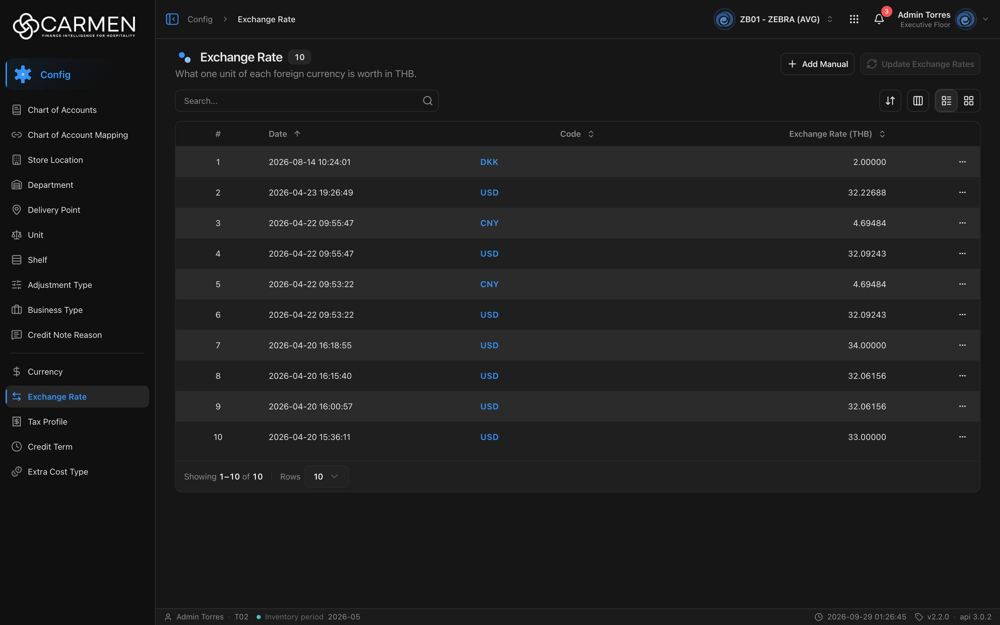

---
**Doc ID:** CB-PAGE-011
**Title:** Exchange Rate
**Domain:** All users
**Route:** /config/exchange-rate
**Status:** Draft
**Created:** 2026-09-29
**Last Updated:** 2026-09-29
**Author:** Claude (จากโค้ด + ภาพหน้าจอจริง)
**Parent Flow:** N/A — master data CRUD ไม่มี workflow
---

## 8.11 Exchange Rate

> หน้าประวัติอัตราแลกเปลี่ยนของ BU — "1 หน่วยสกุลเงินต่างประเทศ = กี่หน่วยของสกุลเงินหลัก (base)" ใช้เพิ่มอัตราด้วยมือ แก้ไข และลบรายการ

---

### 8.11.1 Purpose

แสดงรายการอัตราแลกเปลี่ยนตามวันที่ (หลายรายการต่อสกุลเงิน) ให้ผู้ใช้เพิ่มอัตราแบบ manual (CB-MODAL-010), แก้ค่าอัตราของรายการเดิม และลบรายการ
หน้านี้ **ไม่ได้ใช้ `ConfigListTemplate`** เหมือนหน้า config อื่น — เขียน layout เองใน `routes/config/exchange-rate/exchange-rate-component.tsx` จึงไม่มี Export / Print / Filter / Saved view และไม่มีการตรวจสิทธิ์ที่ปุ่ม Add
มีปุ่ม **Update Exchange Rates** สำหรับดึงอัตราสดจากผู้ให้บริการภายนอก แต่ **ใช้งานไม่ได้ในแอปปัจจุบัน** (disabled ถาวร — ดู §8.11.7)

---

### 8.11.2 Screen Overview

**Access Path:**
- Sidebar: **Config → Exchange Rate**
- Direct URL: `/config/exchange-rate`

**Permissions Required:**

| Role | Permission | Scope | Notes |
|------|-----------|-------|-------|
| All users | `configuration.exchange_rate.view` | BU ปัจจุบัน | เปิดเมนู/หน้า |
| All users | `configuration.exchange_rate.delete` | BU ปัจจุบัน | ตรวจเฉพาะเมนู Delete (ผ่าน `useDeleteGate`, `use-exchange-rate-table.tsx:43`) |
| All users | `configuration.exchange_rate.create` / `.update` | — | **FE ไม่ได้ตรวจ** — ปุ่ม Add Manual, การคลิก Code เพื่อแก้ และ Update Exchange Rates ไม่มีการเช็ค permission หรือ `canWrite` เลย; ถ้าไม่มีสิทธิ์จะไปเด้ง 403 ที่ backend ตอนบันทึก |
| License | `configuration.exchange_rate` | BU | คำนวณจาก permission ของ leaf (ไม่มี `licenseFeature`) |

---

### 8.11.3 Screen Layout



```
[Breadcrumb: Config > Exchange Rate]
[Icon] Exchange Rate [10]                   [+ Add Manual] [⟳ Update Exchange Rates (disabled)]
What one unit of each foreign currency is worth in THB.
────────────────────────────────────────────────────────────────────────────────
[Search...  🔍]                                       [⇅ Sort] [▥ Columns] [☰|▦]
────────────────────────────────────────────────────────────────────────────────
 #  | Date ↑               | Code | Exchange Rate (THB) | (Created) | (Updated) | …
 1  | 2026-08-14 10:24:01  | DKK  |             2.00000 |           |           | …
 2  | 2026-04-23 19:26:49  | USD  |            32.22688 |           |           | …
────────────────────────────────────────────────────────────────────────────────
Showing 1–10 of 10 | Rows [10 ▾]
```

> ตัวเลขข้าง title คือจำนวนรายการทั้งหมด (`count={totalRecords}`) — ไม่มีในหน้า config อื่น

---

### 8.11.4 Header Information

N/A — หน้า list ไม่มีฟิลด์ header; คำอธิบายหัวหน้าแทรกสกุลเงินหลักของผู้ใช้ (`defaultCurrencyCode` จาก profile, fallback `THB`)

**Read-only fields:** N/A

---

### 8.11.5 Summary Information

N/A

---

### 8.11.6 Detail / Grid Information

| Column | Mandatory | Description | Business Logic / Remark |
|--------|-----------|-------------|--------------------------|
| # | — | ลำดับแถว | ไม่มีคอลัมน์ checkbox (ต่างจากหน้า config อื่น) |
| Date | Y | `at_date` วันที่-เวลาที่อัตรามีผล | แสดงตาม `dateTimeFormat` ของ profile; sort ได้ |
| Code | Y | รหัสสกุลเงิน (`currency.code`) | ลิงก์ — คลิกเปิด CB-MODAL-010 โหมด **Edit**; sort key `currency_code` |
| Exchange Rate ({base}) | Y | อัตรา 1 หน่วยต่างประเทศ = x base | ชิดขวา, `formatExchangeRate`; หัวคอลัมน์ต่อท้ายรหัส base เช่น "(THB)" |
| Created | — | `audit.created` | ซ่อนเป็นค่าเริ่มต้น |
| Updated | — | `audit.updated` | ซ่อนเป็นค่าเริ่มต้น |
| … | — | เมนูแถว | มี **Delete เพียงเมนูเดียว** — ไม่มี Edit และไม่มี Activity (ไม่ได้ส่ง `activity` ให้ `actionColumn`) |

ไม่มีคอลัมน์ Status — อัตราแลกเปลี่ยนไม่มี `is_active`

**Grid Actions:**

| Button | Description | Business Logic |
|--------|-------------|----------------|
| Code (link) | เปิด CB-MODAL-010 โหมด Edit (แก้ได้เฉพาะค่าอัตรา) | ไม่มีโหมด readOnly — เปิดแก้ได้ทุกคน |
| … → Delete | เปิด CB-MODAL-014 | title "Exchange Rate", description "`{code} — {date}`" (ไม่ใช้ข้อความ deleteConfirm แบบหน้าอื่น); ไม่มีสิทธิ์ → Permission denied; license หมดอายุ → disabled + tooltip |
| Sort / Columns | เลือกคอลัมน์เรียง / แสดงคอลัมน์ | Columns แสดงเฉพาะโหมด list |
| List / Grid | สลับตาราง ↔ การ์ด | ปุ่มสลับซ่อนบนมือถือ (มือถือเป็น grid เสมอ); grid ใช้ infinite scroll |

---

### 8.11.7 Action Buttons

| Button | Color / Type | Description | Business Logic / Validation |
|--------|-------------|-------------|------------------------------|
| + Add Manual | Secondary (White, outline) | เปิด CB-MODAL-010 โหมด Create | ไม่มีการตรวจ permission/license |
| Update Exchange Rates | Primary (Blue) | ดึงอัตราสดจากภายนอกแล้วบันทึกทุกสกุลเงินพร้อมกัน | **Disabled ในแอปจริง** — ดูเหตุผลด้านล่าง; ถ้าเปิดได้จะเปิด confirm dialog "Update Exchange Rates" แสดงรายการ `{code} → {base}` อัตราเก่า → ใหม่ พร้อม diff/%, ข้อความ "Update {count} currencies with the latest rates from external source? This will affect all future transactions." ปุ่ม Cancel / Confirm → POST array ของทุกสกุลเงิน (ยกเว้น base) `at_date = now` → toast "Exchange Rate updated successfully" |

**ทำไม Update Exchange Rates ถูก disable (ยืนยันจากโค้ด):**
- ปุ่ม disabled เมื่อ `isLoadingCurrencies || isRefetching || bulkMutation.isPending || currencyWithDiff.length === 0` (`exchange-rate-component.tsx:204-209`)
- `currencyWithDiff` จะว่างเสมอเมื่อ `externalRates` ไม่มีค่า (`:119-121`)
- `externalRates` มาจาก `useExternalExchangeRates` (`routes/config/shared/use-exchange-rate.ts:99-126`) ที่เรียก `fetch("/api/exchange-rate?base=THB")` แบบ **raw fetch ไปที่ origin ของ frontend เอง** (ไม่ผ่าน `httpClient` / BACKEND_URL) — endpoint นี้เคยเป็น Next API route (ถือ API key ของผู้ให้บริการไว้ฝั่ง server) ซึ่งไม่ได้ถูก port มา (TODO ที่ `:103`)
- บน static hosting คำขอนี้ได้ 404 หรือ SPA fallback คืน `index.html` (status 200, content-type html) → hook throw "Exchange rate endpoint is not available" หลัง retry 3 ครั้ง (exponential backoff) → ไม่มีข้อมูล → ปุ่ม disabled ถาวร ไม่มีข้อความแจ้งผู้ใช้ (degrade แบบเงียบ)
- ต้องมี backend endpoint `GET /api/exchange-rate?base=XXX` (shape เดิม: `{ result, base_code, conversion_rates, time_last_update_utc }`) ก่อนปุ่มนี้จะใช้งานได้ — ตรงกับ Known open items ใน `CLAUDE.md`
- หมายเหตุการคำนวณ (ถ้าใช้งานได้): API ภายนอกคืน "foreign ต่อ 1 base" จึงกลับค่า `newRate = 1 / external[code]`; สกุลที่ไม่มีในผลลัพธ์ใช้อัตราเดิม — แต่ยังถูกส่งไปบันทึกเป็นแถวใหม่ด้วย

**ไม่มีในหน้านี้ (ต่างจากหน้า config อื่น):** Export, Print, Filter, View (saved views), Active filter bar, pull-to-refresh

---

### 8.11.8 Document Status

N/A — อัตราแลกเปลี่ยนไม่มีสถานะ active/inactive หรือ workflow (ทุกแถวคือบันทึกอัตรา ณ วันที่หนึ่ง)

**Status Transition Rules:** N/A

---

### 8.11.9 Workflow History (if applicable)

N/A — และหน้านี้ไม่ได้เปิดเมนู Activity

---

### 8.11.10 Modals Triggered from This Page

| Modal ID | Modal Name | Trigger |
|----------|-----------|---------|
| CB-MODAL-010 | Exchange Rate Dialog (Add Manual / Edit) | **+ Add Manual** (Create) หรือคลิก **Code** ในแถว (Edit) |
| CB-MODAL-014 | Delete Confirmation | … → **Delete** |
| — | Update Exchange Rates confirm dialog (ยังไม่มีเอกสาร) | **Update Exchange Rates** (ปัจจุบัน disabled) |

---

### 8.11.11 Navigation

| Action | Destination |
|--------|------------|
| + Add Manual / คลิก Code | → เปิด CB-MODAL-010 บนหน้าเดิม |
| … → Delete | → เปิด CB-MODAL-014; สำเร็จ → toast "Exchange Rate deleted successfully" อยู่หน้าเดิม |
| Breadcrumb "Config" | → landing ของโมดูล Config |

---

### 8.11.12 Pagination (for list screens)

- Rows per page: 5 / 10 / 25 / 50 / 100 (default **10**)
- Navigation: `DataGridPagination` + "Showing x–y of n"
- Default sort: `at_date` descending แล้ว `currency_code` ascending (`defaultSort: "at_date:desc,currency_code:asc"`)
- **ข้อสังเกต (UI bug):** `useDataGridState` แยก sort ด้วย `split(":")` จึงอ่านทิศได้เป็น `"desc,currency_code"` ≠ `"desc"` → หัวคอลัมน์ Date แสดงลูกศร **ขึ้น (asc)** ทั้งที่ข้อมูลเรียงล่าสุดก่อน (เห็นได้ในภาพหน้าจอ) — `hooks/use-data-grid-state.ts:43-44`

---

### 8.11.13 API Endpoints

| Method | Endpoint | Purpose |
|--------|----------|---------|
| GET | `/api/config/{bu_code}/exchange-rates` | โหลดรายการ (cache `CACHE_NORMAL` 5 นาที) |
| GET | `/api/config/{bu_code}/currencies?perpage=-1` | โหลดสกุลเงินทั้งหมดเพื่อคำนวณ diff ของ Update Exchange Rates |
| GET | `/api/exchange-rate?base={base}` (origin ของ FE) | อัตราสดจากภายนอก — **ไม่มีอยู่จริง** (TBD ฝั่ง backend) |
| POST | `/api/config/{bu_code}/exchange-rates` | Bulk update — body เป็น array `[{ currency_id, at_date, exchange_rate }, …]` |
| POST | `/api/config/{bu_code}/exchange-rates` | Add Manual (CB-MODAL-010) — method/path เดียวกัน แต่ body เป็น array 1 ตัว `[{ … }]` |
| PATCH | `/api/config/{bu_code}/exchange-rates/{id}` | แก้อัตรา (CB-MODAL-010 Edit) — `{ doc_version, exchange_rate }` |
| DELETE | `/api/config/{bu_code}/exchange-rates/{id}` | ลบ |

ทุก mutation invalidate ทั้ง `EXCHANGE_RATES` และ `CURRENCIES` (อัตราที่แสดงในหน้า Currency เปลี่ยนตาม)

**Query parameter syntax (for list endpoints):**
- `?page=1&perpage=10&sort=at_date:desc,currency_code:asc`
- `&search=USD` (กด Enter)
- ไม่มี `filter` — หน้านี้ไม่มี filter sheet

---

### 8.11.14 Edge Cases & Error States

| # | Scenario | System Behaviour |
|---|----------|-----------------|
| 1 | Mandatory field left blank | ใน CB-MODAL-010: "Currency is required" / "Date is required" |
| 2 | Session expired | 401 → refresh + retry; ไม่สำเร็จ → redirect `/login` |
| 3 | No results / empty state | "No data found" (ทั้งโหมดตารางและการ์ด) |
| 4 | API error on load | `ErrorState` แทนทั้งหน้า + "Try again" (ข้อความ fallback "Failed to fetch exchange rates") |
| 5 | Concurrent edit | Edit ส่ง `doc_version` — 409 → toast "Someone else changed this document. Refresh the page and try again." |
| 6 | User lacks permission | เฉพาะ Delete ที่ถูกกัน (Permission denied dialog); Add Manual/Edit/Update เปิดได้ แล้วไปเจอ 403 ตอนบันทึก (ไม่มี toast สำหรับ 403 — ใช้ PermissionDeniedDialog) |
| 7 | License หมดอายุ | Delete disabled + tooltip; Add Manual / Edit **ยังกดได้** (หน้านี้ไม่อ่าน `canWrite`) → backend `LicenseInterceptor` ปฏิเสธ |
| 8 | External rate endpoint ไม่มี | ปุ่ม Update Exchange Rates disabled เงียบ ๆ ไม่มีข้อความ |
| 9 | สกุลเงินเกิน 30 รายการ | dropdown Currency ใน CB-MODAL-010 โหลดแค่ `perpage: 30` — สกุลที่เกินจะเลือกไม่ได้ |

---

### 8.11.15 Differences: Create vs. Edit Mode (if applicable)

N/A สำหรับหน้า list — ดู CB-MODAL-010 (โหมด Create ให้เลือกสกุล/วันที่/อัตรา; โหมด Edit แก้ได้แค่อัตรา)

---

### 8.11.16 Related Documents

| Doc ID | Title | Relationship |
|--------|-------|-------------|
| CB-MODAL-010 | Exchange Rate Dialog (Manual / Edit) | Opened from this page |
| CB-MODAL-014 | Delete Confirmation | Opened from row action |
| N/A | — | ไม่มี parent flow |
