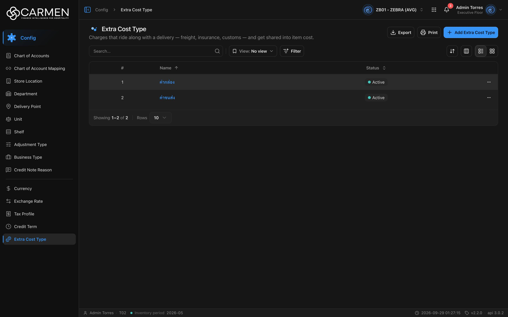

---
**Doc ID:** CB-PAGE-012
**Title:** Extra Cost Type
**Domain:** All users
**Route:** /config/extra-cost
**Status:** Draft
**Created:** 2026-09-29
**Last Updated:** 2026-09-29
**Author:** Claude (จากโค้ด + ภาพหน้าจอจริง)
**Parent Flow:** N/A — master data CRUD ไม่มี workflow
---

## 8.12 Extra Cost Type

> หน้ารายการ master data "ประเภทค่าใช้จ่ายเพิ่มเติม" ที่มากับการส่งของ (ค่าขนส่ง ประกัน ภาษีนำเข้า) และถูกปันส่วนเข้าต้นทุนสินค้า

---

### 8.12.1 Purpose

ให้ผู้ใช้ค้นหา ดู เพิ่ม แก้ไข เปิด/ปิดใช้งาน และลบ Extra Cost Type ซึ่งถูกเลือกใช้ตอนบันทึก extra cost ในเอกสารรับสินค้า
UI ใช้ชื่อ "Extra Cost Type" แต่ route / โค้ดใช้ `extra-cost` (`routes/config/extra-cost/`) — สร้างจาก `ConfigListTemplate`; dialog (CB-MODAL-011) ถูก lazy-load (`React.lazy`)

---

### 8.12.2 Screen Overview

**Access Path:**
- Sidebar: **Config → Extra Cost Type**
- Direct URL: `/config/extra-cost`

**Permissions Required:**

| Role | Permission | Scope | Notes |
|------|-----------|-------|-------|
| All users | `configuration.extra_cost_type.view` | BU ปัจจุบัน | เปิดเมนู/หน้า (`constant/module-list.ts:581`) |
| All users | `configuration.extra_cost.create` | BU ปัจจุบัน | **คีย์ที่ FE ใช้จริงสำหรับปุ่ม Add** — component ส่ง `permissionPrefix="configuration.extra_cost"` (`extra-cost-component.tsx:28`) ซึ่งตาม `constant/permissions.ts:37-39` เป็นคีย์ของโมดูล Procurement คนละตัวกับ `configuration.extra_cost_type` — ดู §8.12.14 #7 |
| All users | `configuration.extra_cost.update` | BU ปัจจุบัน | ใช้ตัดสิน readOnly ของ dialog (คีย์เดียวกับปัญหาข้างบน) |
| All users | `configuration.extra_cost_type.delete` | BU ปัจจุบัน | เมนู Delete — `useExtraCostTable` ไม่ส่ง `permissionPrefix` ต่อให้ `useConfigTable` จึง derive จาก route ได้คีย์ที่ถูกต้อง (การ์ดใน grid mode ก็ derive แบบเดียวกัน) |
| License | `configuration.extra_cost_type` | BU | `licenseFeature` ของ leaf (`config:extra-cost-types`) |

> หมายเหตุ: ตาราง "delete" ใน `useConfigTable` คิด prefix จาก route (`configuration.extra_cost_type`) ส่วนปุ่ม Add / readOnly ใช้ prefix ที่ส่งมา (`configuration.extra_cost`) — หน้าเดียวกันจึงตรวจสิทธิ์สองคีย์คนละ resource

---

### 8.12.3 Screen Layout



```
[Breadcrumb: Config > Extra Cost Type]
[Icon] Extra Cost Type                       [Export] [Print] [+ Add Extra Cost Type]
Charges that ride along with a delivery — freight, insurance, customs — and get shared into item cost.
────────────────────────────────────────────────────────────────────────────────
[Search...  🔍] | [View: No view ▾] [Filter]          [⇅ Sort] [▥ Columns] [☰|▦]
────────────────────────────────────────────────────────────────────────────────
 ☐ | #  | Name ↑        | Status     | (Created) | (Updated) | …
   | 1  | ค่ากล่อง        | ● Active   |           |           | …
   | 2  | ค่าขนส่ง        | ● Active   |           |           | …
────────────────────────────────────────────────────────────────────────────────
Showing 1–2 of 2 | Rows [10 ▾]
```

---

### 8.12.4 Header Information

N/A — หน้า list ไม่มีฟิลด์ header

**Read-only fields:** N/A

---

### 8.12.5 Summary Information

N/A

---

### 8.12.6 Detail / Grid Information

| Column | Mandatory | Description | Business Logic / Remark |
|--------|-----------|-------------|--------------------------|
| ☐ (select) | — | checkbox | ไม่มี bulk action |
| # | — | ลำดับแถว | — |
| Name | Y | ชื่อประเภทค่าใช้จ่าย | ลิงก์ → CB-MODAL-011 (Edit); sort ได้ (default asc) |
| Status | — | `is_active` | จุดเขียว "Active" / จุดเทา "Inactive" |
| Created | — | `audit.created` | ซ่อนเป็นค่าเริ่มต้น |
| Updated | — | `audit.updated` | ซ่อนเป็นค่าเริ่มต้น |
| … | — | เมนูแถว | **Activity** + **Delete** |

**Grid Actions:**

| Button | Description | Business Logic |
|--------|-------------|----------------|
| Name (link) | เปิด CB-MODAL-011 โหมด Edit | readOnly ถ้า non-admin ไม่มี `configuration.extra_cost.update` หรือ `!canWrite` |
| … → Activity | เปิด Activity sheet | label = ชื่อ |
| … → Delete | เปิด CB-MODAL-014 | ไม่มี `configuration.extra_cost_type.delete` → Permission denied; license หมดอายุ → disabled + tooltip |
| Sort / Columns / List-Grid | มาตรฐาน `ConfigListTemplate` | grid/มือถือ = infinite scroll |

---

### 8.12.7 Action Buttons

| Button | Color / Type | Description | Business Logic / Validation |
|--------|-------------|-------------|------------------------------|
| + Add Extra Cost Type | Primary (Blue) | เปิด CB-MODAL-011 โหมด Create | `!canWrite` → Permission denied (expired); non-admin ไม่มี `configuration.extra_cost.create` → Permission denied |
| Export | Secondary (White) | .xlsx ของแถวในหน้าปัจจุบัน | คอลัมน์ Name, Status; ชื่อไฟล์ขึ้นต้น `extraCost` |
| Print | Secondary (White) | browser print | — |
| View: No view | Secondary | saved views | — |
| Filter | Secondary | filter sheet | Status: Active / Inactive |

---

### 8.12.8 Document Status

| Status | Badge Colour | Description |
|--------|-------------|-------------|
| active | Neutral badge + จุดเขียว | ใช้งานได้ |
| inactive | Neutral badge + จุดเทา | ปิดใช้งาน |

**Status Transition Rules:**

| From Status | Action | To Status | Who Can Perform |
|-------------|--------|-----------|-----------------|
| active | ปิดสวิตช์ Active ใน CB-MODAL-011 → Save | inactive | admin หรือผู้มี `configuration.extra_cost.update` (ตามที่ FE ตรวจ) + license เขียนได้ |
| inactive | เปิดสวิตช์ Active → Save | active | เหมือนข้างบน |

---

### 8.12.9 Workflow History (if applicable)

N/A — ใช้ Activity sheet

---

### 8.12.10 Modals Triggered from This Page

| Modal ID | Modal Name | Trigger |
|----------|-----------|---------|
| CB-MODAL-011 | Extra Cost Type Dialog (Add / Edit) | **+ Add Extra Cost Type** หรือคลิกชื่อ |
| CB-MODAL-014 | Delete Confirmation | … → **Delete** |
| — | Activity sheet (ยังไม่มีเอกสาร) | … → **Activity** |
| — | Filter sheet (ยังไม่มีเอกสาร) | **Filter** |
| — | Save view dialog (ยังไม่มีเอกสาร) | Save ใน filter sheet |

---

### 8.12.11 Navigation

| Action | Destination |
|--------|------------|
| + Add / คลิกชื่อ | → เปิด CB-MODAL-011 บนหน้าเดิม |
| … → Delete | → เปิด CB-MODAL-014; สำเร็จ → toast "Extra Cost Type deleted successfully" |
| Breadcrumb "Config" | → landing ของโมดูล Config |

---

### 8.12.12 Pagination (for list screens)

- Rows per page: 5 / 10 / 25 / 50 / 100 (default **10**)
- Navigation: `DataGridPagination` + "Showing x–y of n"
- Default sort: `name`, ascending

---

### 8.12.13 API Endpoints

| Method | Endpoint | Purpose |
|--------|----------|---------|
| GET | `/api/config/{bu_code}/extra-cost-types` | โหลดรายการ |
| POST | `/api/config/{bu_code}/extra-cost-types` | สร้าง |
| PATCH | `/api/config/{bu_code}/extra-cost-types/{id}` | แก้ไข |
| DELETE | `/api/config/{bu_code}/extra-cost-types/{id}` | ลบ |

**Query parameter syntax (for list endpoints):**
- `?page=1&perpage=10&sort=name:asc`
- `&search=ขนส่ง`
- `&filter=is_active|bool:true`

---

### 8.12.14 Edge Cases & Error States

| # | Scenario | System Behaviour |
|---|----------|-----------------|
| 1 | Mandatory field left blank | CB-MODAL-011: "Name is required" |
| 2 | Session expired | 401 → refresh + retry; ไม่สำเร็จ → `/login` |
| 3 | No results / empty state | "No data found" |
| 4 | API error on load | `ErrorState` + "Try again" |
| 5 | Concurrent edit | PATCH ส่ง `doc_version` — 409 → "Someone else changed this document. Refresh the page and try again." |
| 6 | User lacks permission | Add ขึ้น Permission denied, dialog readOnly, Delete ขึ้น Permission denied |
| 7 | Permission key ผิด resource | non-admin ที่ได้สิทธิ์ `configuration.extra_cost_type.create/update` ครบ แต่ไม่มี `configuration.extra_cost.*` (ของ Procurement) จะกด Add ไม่ได้และ dialog แก้ไขเป็น readOnly; กลับกัน ผู้มีแค่ `configuration.extra_cost.*` จะผ่านด่าน FE แล้วไปเจอ 403 ที่ backend — admin ไม่เห็นปัญหาเพราะ bypass |
| 8 | License หมดอายุ | Add → dialog expired, Delete disabled, dialog readOnly |

---

### 8.12.15 Differences: Create vs. Edit Mode (if applicable)

N/A — ดู CB-MODAL-011

---

### 8.12.16 Related Documents

| Doc ID | Title | Relationship |
|--------|-------|-------------|
| CB-MODAL-011 | Extra Cost Type Dialog | Opened from this page |
| CB-MODAL-014 | Delete Confirmation | Opened from row action |
| N/A | — | ไม่มี parent flow |
