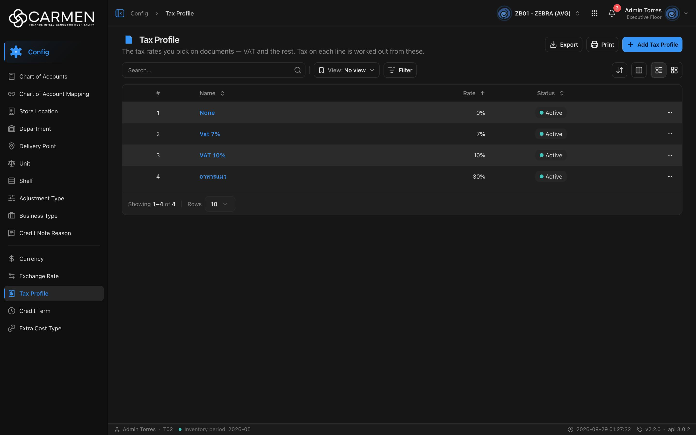

---
**Doc ID:** CB-PAGE-013
**Title:** Tax Profile
**Domain:** All users
**Route:** /config/tax-profile
**Status:** Draft
**Created:** 2026-09-29
**Last Updated:** 2026-09-29
**Author:** Claude (จากโค้ด + ภาพหน้าจอจริง)
**Parent Flow:** N/A — master data CRUD ไม่มี workflow
---

## 8.13 Tax Profile

> หน้ารายการ master data อัตราภาษี (VAT ฯลฯ) ที่ผู้ใช้เลือกในเอกสาร — ภาษีของแต่ละบรรทัดคำนวณจากค่าเหล่านี้

---

### 8.13.1 Purpose

ให้ผู้ใช้ค้นหา ดู เพิ่ม แก้ไข เปิด/ปิดใช้งาน และลบ Tax Profile (ชื่อ + อัตราภาษี %) ของ BU ปัจจุบัน
หน้าสร้างจาก `ConfigListTemplate`; dialog (CB-MODAL-012) lazy-load

---

### 8.13.2 Screen Overview

**Access Path:**
- Sidebar: **Config → Tax Profile**
- Direct URL: `/config/tax-profile`

**Permissions Required:**

| Role | Permission | Scope | Notes |
|------|-----------|-------|-------|
| All users | `configuration.tax_profile.view` | BU ปัจจุบัน | เปิดเมนู/หน้า |
| All users | `configuration.tax_profile.create` | BU ปัจจุบัน | ปุ่ม Add (`permissionPrefix="configuration.tax_profile"`) |
| All users | `configuration.tax_profile.update` | BU ปัจจุบัน | ไม่มี → dialog readOnly |
| All users | `configuration.tax_profile.delete` | BU ปัจจุบัน | เมนู Delete |
| License | `configuration.tax_profile` | BU | คำนวณจาก permission (ไม่มี `licenseFeature`) |

---

### 8.13.3 Screen Layout



```
[Breadcrumb: Config > Tax Profile]
[Icon] Tax Profile                               [Export] [Print] [+ Add Tax Profile]
The tax rates you pick on documents — VAT and the rest. Tax on each line is worked out from these.
────────────────────────────────────────────────────────────────────────────────
[Search...  🔍] | [View: No view ▾] [Filter]          [⇅ Sort] [▥ Columns] [☰|▦]
────────────────────────────────────────────────────────────────────────────────
 ☐ | #  | Name        | Rate ↑ | Status     | (Created) | (Updated) | …
   | 1  | None        |    0%  | ● Active   |           |           | …
   | 2  | Vat 7%      |    7%  | ● Active   |           |           | …
   | 3  | VAT 10%     |   10%  | ● Active   |           |           | …
────────────────────────────────────────────────────────────────────────────────
Showing 1–4 of 4 | Rows [10 ▾]
```

---

### 8.13.4 Header Information

N/A — หน้า list ไม่มีฟิลด์ header

**Read-only fields:** N/A

---

### 8.13.5 Summary Information

N/A

---

### 8.13.6 Detail / Grid Information

| Column | Mandatory | Description | Business Logic / Remark |
|--------|-----------|-------------|--------------------------|
| ☐ (select) | — | checkbox | ไม่มี bulk action |
| # | — | ลำดับแถว | — |
| Name | Y | ชื่อ tax profile | ลิงก์ → CB-MODAL-012 (Edit); sort ได้ |
| Rate | Y | อัตราภาษี (`tax_rate`) | แสดงเป็น `{tax_rate}%` ชิดขวา; sort ได้ (default asc) |
| Status | — | `is_active` | จุดเขียว "Active" / จุดเทา "Inactive" |
| Created | — | `audit.created` | ซ่อนเป็นค่าเริ่มต้น |
| Updated | — | `audit.updated` | ซ่อนเป็นค่าเริ่มต้น |
| … | — | เมนูแถว | **Activity** + **Delete** |

**Grid Actions:**

| Button | Description | Business Logic |
|--------|-------------|----------------|
| Name (link) | เปิด CB-MODAL-012 โหมด Edit | readOnly ถ้าไม่มี `.update` หรือ `!canWrite` |
| … → Activity | เปิด Activity sheet | label = ชื่อ |
| … → Delete | เปิด CB-MODAL-014 | ไม่มี `.delete` → Permission denied; license หมดอายุ → disabled + tooltip |
| Sort / Columns / List-Grid | มาตรฐาน `ConfigListTemplate` | การ์ดแสดง Tax Rate (%) เป็นตัวเลขไม่มี % |

---

### 8.13.7 Action Buttons

| Button | Color / Type | Description | Business Logic / Validation |
|--------|-------------|-------------|------------------------------|
| + Add Tax Profile | Primary (Blue) | เปิด CB-MODAL-012 โหมด Create | `!canWrite` → Permission denied (expired); ไม่มี `.create` → Permission denied |
| Export | Secondary (White) | .xlsx ของแถวในหน้าปัจจุบัน | คอลัมน์ Name, Tax Rate (%), Status |
| Print | Secondary (White) | browser print | — |
| View: No view | Secondary | saved views | — |
| Filter | Secondary | filter sheet | Status: Active / Inactive |

---

### 8.13.8 Document Status

| Status | Badge Colour | Description |
|--------|-------------|-------------|
| active | Neutral badge + จุดเขียว | เลือกใช้ในเอกสารได้ |
| inactive | Neutral badge + จุดเทา | ปิดใช้งาน |

**Status Transition Rules:**

| From Status | Action | To Status | Who Can Perform |
|-------------|--------|-----------|-----------------|
| active | ปิดสวิตช์ Active ใน CB-MODAL-012 → Save | inactive | มี `configuration.tax_profile.update` + license เขียนได้ |
| inactive | เปิดสวิตช์ Active → Save | active | เหมือนข้างบน |

---

### 8.13.9 Workflow History (if applicable)

N/A — ใช้ Activity sheet

---

### 8.13.10 Modals Triggered from This Page

| Modal ID | Modal Name | Trigger |
|----------|-----------|---------|
| CB-MODAL-012 | Tax Profile Dialog (Add / Edit) | **+ Add Tax Profile** หรือคลิกชื่อ |
| CB-MODAL-014 | Delete Confirmation | … → **Delete** |
| — | Activity sheet (ยังไม่มีเอกสาร) | … → **Activity** |
| — | Filter sheet (ยังไม่มีเอกสาร) | **Filter** |
| — | Save view dialog (ยังไม่มีเอกสาร) | Save ใน filter sheet |

---

### 8.13.11 Navigation

| Action | Destination |
|--------|------------|
| + Add / คลิกชื่อ | → เปิด CB-MODAL-012 บนหน้าเดิม |
| … → Delete | → เปิด CB-MODAL-014; สำเร็จ → toast "Tax Profile deleted successfully" |
| Breadcrumb "Config" | → landing ของโมดูล Config |

---

### 8.13.12 Pagination (for list screens)

- Rows per page: 5 / 10 / 25 / 50 / 100 (default **10**)
- Navigation: `DataGridPagination` + "Showing x–y of n"
- Default sort: `tax_rate`, ascending

---

### 8.13.13 API Endpoints

| Method | Endpoint | Purpose |
|--------|----------|---------|
| GET | `/api/config/{bu_code}/tax-profiles` | โหลดรายการ |
| POST | `/api/config/{bu_code}/tax-profiles` | สร้าง |
| PATCH | `/api/config/{bu_code}/tax-profiles/{id}` | แก้ไข (`doc_version` จำเป็น — คอมเมนต์ใน `types/tax-profile.ts` ระบุว่าไม่ส่ง = 400) |
| DELETE | `/api/config/{bu_code}/tax-profiles/{id}` | ลบ |

**Query parameter syntax (for list endpoints):**
- `?page=1&perpage=10&sort=tax_rate:asc`
- `&search=vat`
- `&filter=is_active|bool:true`

---

### 8.13.14 Edge Cases & Error States

| # | Scenario | System Behaviour |
|---|----------|-----------------|
| 1 | Mandatory field left blank | CB-MODAL-012: "Name is required"; Tax Rate ว่าง → error ของ zod (ค่ากลายเป็น NaN) |
| 2 | Session expired | 401 → refresh + retry; ไม่สำเร็จ → `/login` |
| 3 | No results / empty state | "No data found" |
| 4 | API error on load | `ErrorState` + "Try again" |
| 5 | Concurrent edit | PATCH ส่ง `doc_version` — 409 → "Someone else changed this document. Refresh the page and try again." |
| 6 | User lacks permission | Add ขึ้น Permission denied, dialog readOnly, Delete ขึ้น Permission denied |
| 7 | License หมดอายุ | Add → dialog expired, Delete disabled, dialog readOnly |
| 8 | ลบ tax profile ที่ถูกใช้ในเอกสาร | ขึ้นกับ backend — error → toast กลาง |

---

### 8.13.15 Differences: Create vs. Edit Mode (if applicable)

N/A — ดู CB-MODAL-012

---

### 8.13.16 Related Documents

| Doc ID | Title | Relationship |
|--------|-------|-------------|
| CB-MODAL-012 | Tax Profile Dialog | Opened from this page |
| CB-MODAL-014 | Delete Confirmation | Opened from row action |
| N/A | — | ไม่มี parent flow |
