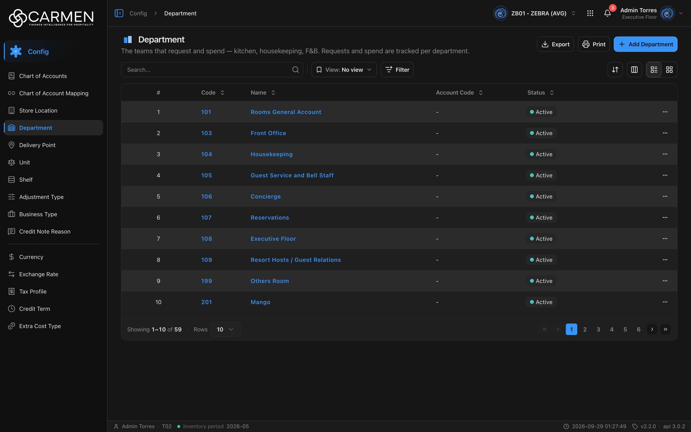

---
**Doc ID:** CB-PAGE-014
**Title:** Department List
**Domain:** All users
**Route:** /config/department
**Status:** Draft
**Created:** 2026-09-29
**Last Updated:** 2026-09-29
**Author:** Claude (จากโค้ด + ภาพหน้าจอจริง)
**Parent Flow:** N/A — master data CRUD ไม่มี workflow
---

## 8.14 Department

> หน้ารายการแผนก (master data ต่อ BU) สำหรับผู้ดูแลระบบ/ฝ่ายบัญชี — ค้นหา กรอง เรียง export และเปิดไปหน้าฟอร์มแผนก (CB-PAGE-015)

---

### 8.14.1 Purpose

แสดงรายการแผนกทั้งหมดของ BU ปัจจุบัน ("The teams that request and spend — kitchen, housekeeping, F&B. Requests and spend are tracked per department.")
ผู้ใช้ใช้หน้านี้เพื่อค้นหาแผนก, เปิดดู/แก้ไขแผนก (ไปหน้าเต็ม CB-PAGE-015), เพิ่มแผนกใหม่, ลบแผนกจาก row action และ export เป็น Excel
หน้านี้สร้างจาก template กลาง `ConfigListTemplate` (`components/templates/config-list-template.tsx`) — พฤติกรรมส่วนใหญ่ (search / filter / saved view / pagination / delete) เหมือนหน้า config list อื่น

---

### 8.14.2 Screen Overview

**Access Path:**
- Sidebar → **Config** → **Department**
- Direct URL: `/config/department`
- กลับมาจาก CB-PAGE-015 ด้วยปุ่ม Back (←) — พก query ของ list (filter/sort/page) กลับมาด้วย (`useListReturn`)

**Permissions Required:**

| Role | Permission | Scope | Notes |
|------|-----------|-------|-------|
| ทุก role ที่เห็นเมนู | `configuration.department.view` | BU ปัจจุบัน | ผูกที่ leaf ใน `constant/module-list.ts` — ไม่มีสิทธิ์ = ไม่เห็นเมนู |
| ผู้เพิ่มข้อมูล | `configuration.department.create` | BU ปัจจุบัน | ไม่มีสิทธิ์ → ปุ่ม **Add Department** จางลง กดแล้วเด้ง Permission Denied dialog |
| ผู้ลบข้อมูล | `configuration.department.delete` | BU ปัจจุบัน | ไม่มีสิทธิ์ → เมนู **Delete** ในแถวจางลง กดแล้วเด้ง Permission Denied dialog (`useDeleteGate`) |
| Admin (god mode) | — | All | `isAdmin` bypass permission ทั้งหมด (แต่ **ไม่** bypass license) |
| License | feature `configuration.department` (คำนวณจาก permission — leaf ไม่ได้ระบุ `licenseFeature`) | BU | `LICENSE_ENFORCEMENT` เปิดทุก env — สัญญาหมดอายุ (`!canWrite`) → Add ถูก disable จริง, Delete ในแถว disabled พร้อม tooltip "Disabled — your subscription is expired or inactive. Contact your administrator to renew." |

---

### 8.14.3 Screen Layout



```
[Breadcrumb: Config > Department]
──────────────────────────────────────────────────────────────────────────────
[Icon] Department                                   [Export] [Print] [+ Add Department]
The teams that request and spend — kitchen, housekeeping, F&B. ...
──────────────────────────────────────────────────────────────────────────────
[Search...          🔍] | [🔖 View: No view ▾] [Filter]      [⇅ Sort] [▥ Columns] [☰ List|▦ Grid]
[Active filter chips ... Clear all]            (แสดงเมื่อมี filter)
──────────────────────────────────────────────────────────────────────────────
 ☐ | #  | Code ⇕ | Name ⇕                 | Account Code ⇕ | Status ⇕ | (Created) (Updated) | ⋯
 ☐ | 1  | 101    | Rooms General Account  | -              | ● Active |                     | ⋯
 ☐ | 2  | 103    | Front Office           | -              | ● Active |                     | ⋯
 ...
──────────────────────────────────────────────────────────────────────────────
Showing 1–10 of 59 | Rows [10 ▾]                    [«] [‹] [1] 2 3 4 5 6 [›] [»]
```

> คอลัมน์ Created / Updated มีอยู่แต่ซ่อนไว้ตั้งต้น (`columnVisibility: { created_at: false, updated_at: false }`) เปิดได้จากปุ่ม Columns
> โหมด Grid (และบนมือถือ) แสดงเป็นการ์ด `DepartmentCard` + infinite scroll แทน pagination

---

### 8.14.4 Header Information

| Field | Mandatory | Description | Business Logic / Remark |
|-------|-----------|-------------|--------------------------|
| Title | — | "Department" | จาก `config.department.title` |
| Description | — | "The teams that request and spend — kitchen, housekeeping, F&B. Requests and spend are tracked per department." | `config.department.desc` |
| Search | N | ค้นหาแบบ free text | ส่งเป็น `search=` ไป backend — ยิงเมื่อกด Enter / คลิกไอคอนแว่นขยาย / กดล้าง (ไม่ใช่ real-time) |
| View | N | Saved view ของหน้า (`pageKey = "department"`) | เลือก view ที่บันทึกไว้ (scope BU / ส่วนตัว) — บันทึก view ใหม่ผ่าน Save View dialog |
| Filter | N | Filter sheet: **Status** = Active / Inactive | ค่า clause `is_active|bool:true` / `is_active|bool:false` (`department-filter-fields.ts`) |

**Read-only fields:** ทั้งหน้าเป็น read-only list — แก้ไขได้ที่ CB-PAGE-015 เท่านั้น

---

### 8.14.5 Summary Information

N/A — หน้า master data ไม่มียอดสรุป (มีเพียง "Showing x–y of N" ในแถบ pagination)

---

### 8.14.6 Detail / Grid Information

| Column | Mandatory | Description | Business Logic / Remark |
|--------|-----------|-------------|--------------------------|
| ☐ (select) | — | checkbox เลือกแถว | ไม่มี bulk action ที่ใช้การเลือกนี้ในหน้านี้ |
| # | — | ลำดับแถว | `index + 1 + (page − 1) × perpage` |
| Code | — | รหัสแผนก | Sortable; เป็นลิงก์ (CellAction) คลิกแล้วไป `/config/department/:id` (CB-PAGE-015) |
| Name | — | ชื่อแผนก | Sortable; เป็นลิงก์เช่นกัน; ชื่อว่างแสดง "..." |
| Account Code | — | รหัสบัญชีของแผนก | Sortable; ว่างแสดง "-" |
| Status | — | สถานะ active/inactive | Sortable (`is_active`); badge ดู 8.14.8 |
| Created | — | เวลา + ผู้สร้าง (`audit.created`) | ซ่อนตั้งต้น; Sortable; รูปแบบวันที่ตาม profile (`dateTimeFormat`) |
| Updated | — | เวลา + ผู้แก้ล่าสุด (`audit.updated`) | ซ่อนตั้งต้น; Sortable |
| ⋯ (Row actions) | — | เมนูแถว | ดู Grid Actions |

**Grid Actions:**

| Button | Description | Business Logic |
|--------|-------------|----------------|
| ⋯ → Activity | เปิด Activity sheet (ประวัติใครแก้อะไร) ของแถว | label = code ของแผนก (`activity: { id, label: r.code }`) |
| ⋯ → Delete | ลบแผนก | เปิด CB-MODAL-014 (Delete confirmation) — title "Delete Department", body `Are you sure you want to delete department "{name}"? This action cannot be undone.` |
| Column header click | เรียงข้อมูล | asc ↔ desc; เปลี่ยน sort แล้ว reset ไปหน้า 1 |

> เมนูแถวไม่มี **Edit** (ไม่ได้ส่ง `onEdit` ให้ `DataGridRowActions`) — การเปิดแก้ไขทำโดยคลิก Code/Name

---

### 8.14.7 Action Buttons

| Button | Color / Type | Description | Business Logic / Validation |
|--------|-------------|-------------|------------------------------|
| Export | Secondary (White) | ดาวน์โหลด Excel (.xlsx) | export **เฉพาะแถวที่โหลดอยู่บนหน้าจอ** (ไม่ใช่ทั้งหมด) คอลัมน์ Code / Name / Description / Status; ไม่มีข้อมูล → toast "No data to export"; สำเร็จ → "Exported {count} records" |
| Print | Secondary (White) | เรียก `window.print()` ของเบราว์เซอร์ | — |
| + Add Department | Primary (Blue) | ไปหน้าสร้างแผนก | → `/config/department/new` (CB-PAGE-015 โหมด Create); ไม่มีสิทธิ์ create → dialog Permission Denied; license หมดอายุ → disabled |
| Sort (⇅) | Secondary icon | เมนูเลือกคอลัมน์เรียง | desktop เท่านั้น |
| Columns (▥) | Secondary icon | เปิด/ปิดคอลัมน์ | ซ่อนในโหมด grid |
| List / Grid | Toggle | สลับตาราง ↔ การ์ด | desktop เท่านั้น |

---

### 8.14.8 Document Status

| Status | Badge Colour | Description |
|--------|-------------|-------------|
| active | เขียว (จุดสีเขียว-teal + "Active") | `is_active = true` — ใช้งานได้ |
| inactive | เทา (จุดเทา + "Inactive") | `is_active = false` — ปิดใช้งาน |

**Status Transition Rules:**

| From Status | Action | To Status | Who Can Perform |
|-------------|--------|-----------|-----------------|
| active | ปิดสวิตช์ Active ในฟอร์ม CB-PAGE-015 แล้ว Save | inactive | ผู้มี `configuration.department.update` |
| inactive | เปิดสวิตช์ Active แล้ว Save | active | ผู้มี `configuration.department.update` |

---

### 8.14.9 Workflow History (if applicable)

N/A — ไม่มี approval workflow ประวัติการแก้ไขดูผ่าน ⋯ → Activity (activity sheet กลาง)

---

### 8.14.10 Modals Triggered from This Page

| Modal ID | Modal Name | Trigger |
|----------|-----------|---------|
| CB-MODAL-014 | Delete Confirmation | ⋯ → **Delete** ในแถว หรือปุ่มลบบนการ์ด (โหมด Grid) |
| (ยังไม่มีเอกสาร) | Activity sheet | ⋯ → **Activity** |
| (ยังไม่มีเอกสาร) | Filter sheet (ListFilter) | ปุ่ม **Filter** |
| (ยังไม่มีเอกสาร) | Save View dialog | ปุ่ม Save ใน Filter sheet |
| (ยังไม่มีเอกสาร) | Permission Denied dialog | กด Add/Delete โดยไม่มีสิทธิ์ |

---

### 8.14.11 Navigation

| Action | Destination |
|--------|------------|
| คลิก Code / Name ในแถว หรือเปิดการ์ด | → CB-PAGE-015 (Department Form) `/config/department/:id` โหมด View |
| + Add Department | → CB-PAGE-015 (Department Form) `/config/department/new` โหมด Create |
| ⋯ → Delete | → เปิด CB-MODAL-014; ลบสำเร็จ → อยู่หน้าเดิม, toast "Department deleted successfully", list refetch |
| Breadcrumb "Config" | → หน้า Config dashboard (`/config`) |

---

### 8.14.12 Pagination (for list screens)

- Rows per page: ตั้งต้น **10**; ตัวเลือก 5 / 10 / 25 / 50 / 100
- Navigation: First («), Previous (‹), เลขหน้า (มี ellipsis), Next (›), Last (»)
- Default sort: **ไม่กำหนด** (ไม่ส่ง `sort` — ใช้ลำดับจาก backend; ภาพหน้าจอเรียงตาม code) — sortable ได้ทุกคอลัมน์ข้อมูล
- page / perpage / sort / search / filter อยู่ใน URL query (แชร์ลิงก์ได้)
- โหมด Grid/มือถือ: infinite scroll แทน pagination

---

### 8.14.13 API Endpoints

| Method | Endpoint | Purpose |
|--------|----------|---------|
| GET | `/api/config/{bu_code}/departments` | โหลดรายการ (paginated) |
| DELETE | `/api/config/{bu_code}/departments/{id}` | ลบแผนก (จาก CB-MODAL-014) |

> ฝั่ง browser เรียกผ่าน `/api/proxy/api/config/{bu_code}/departments` ซึ่ง `lib/http-client.ts` rewrite เป็น `${BACKEND_URL}/api/config/{bu_code}/departments` พร้อมแนบ `Authorization: Bearer` + `x-app-id`

**Query parameter syntax (for list endpoints):**
- ตัวอย่างจริง: `?page=1&perpage=10&sort=code:asc&search=front&filter=is_active|bool:true`
- Sort: `sort={field}:{asc|desc}` (เช่น `name:desc`, `account_code:asc`)
- Status filter: `filter=is_active|bool:true` / `filter=is_active|bool:false`
- หลาย clause ต่อกันด้วย `;`
- ค่าว่างถูกตัดทิ้งจาก query string (`buildQueryString`)

---

### 8.14.14 Edge Cases & Error States

| # | Scenario | System Behaviour |
|---|----------|-----------------|
| 1 | Mandatory field left blank | N/A ในหน้านี้ (ไม่มีฟอร์ม) — ดู CB-PAGE-015 |
| 2 | Session expired | `http-client` ได้ 401 → เรียก refresh token แล้ว retry อัตโนมัติ; refresh ไม่ได้ → ล้าง token store → `RequireAuth` redirect ไป `/login` (ไม่มี toast ซ้ำ) |
| 3 | No results / empty state | ตารางแสดง "No data found" (`EmptyComponent`); แถบ pagination ถูกซ่อนเมื่อ total = 0 |
| 4 | API error on load | ทั้งหน้าถูกแทนด้วย `ErrorState` พร้อมปุ่ม "Try again" (refetch); query ไม่ retry เมื่อได้ 4xx, retry 1 ครั้งเมื่อ 5xx/network |
| 5 | Concurrent edit / delete | หน้า list ไม่มีการตรวจ stale data — ถ้าอีกคนลบแถวไปแล้ว การลบซ้ำจะได้ error จาก backend → toast กลาง (เช่น "We couldn't find what you were looking for."); cache ของ list เก่าได้ถึง 30 นาที (`CACHE_STATIC`) จนกว่าจะมี mutation ใน session นี้ |
| 6 | User lacks permission | ไม่มี `.view` → ไม่เห็นเมนู; ไม่มี `.create`/`.delete` → ปุ่มจาง กดแล้ว Permission Denied dialog; license หมดอายุ → ปุ่มเขียน disabled จริง + tooltip |
| 7 | ลบแผนกที่ยังถูกใช้งานอยู่ | ขึ้นกับ backend — error ถูกแสดงเป็น toast กลาง, dialog ยังเปิดค้าง (ปิดเฉพาะเมื่อสำเร็จ) |
| 8 | Export ตอนไม่มีข้อมูล | toast warning "No data to export" |

---

### 8.14.15 Differences: Create vs. Edit Mode (if applicable)

N/A — หน้า list ไม่มีโหมด Create/Edit (ดู CB-PAGE-015 §8.15.15)

---

### 8.14.16 Related Documents

| Doc ID | Title | Relationship |
|--------|-------|-------------|
| CB-PAGE-015 | Department Form | Navigated to from this page (Add / คลิกแถว) |
| CB-MODAL-014 | Delete Confirmation | Opened from this page (row action Delete) |
| CB-PAGE-001 | Config overview | หน้าแม่ของโมดูล Configuration |
