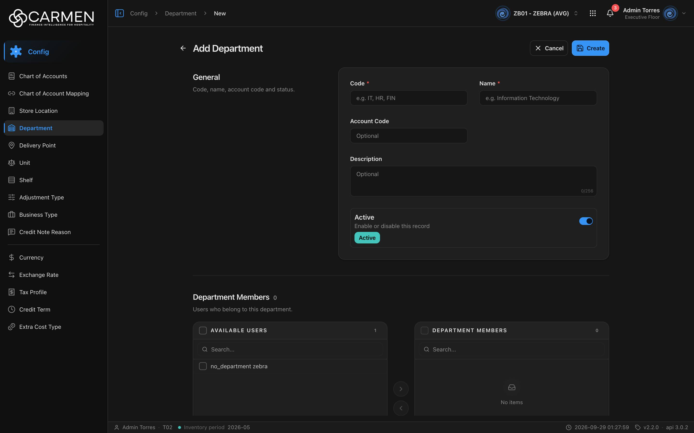
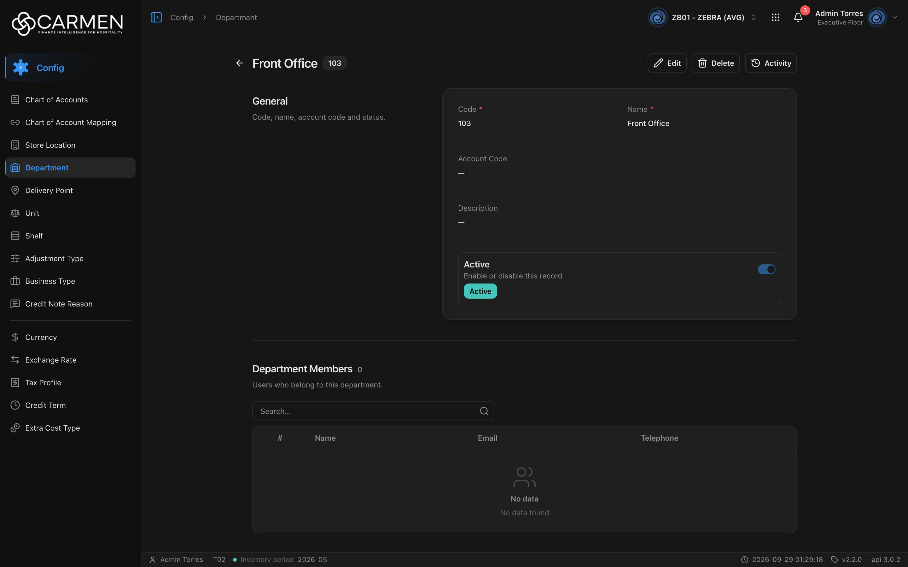

---
**Doc ID:** CB-PAGE-015
**Title:** Department Form
**Domain:** All users
**Route:** /config/department/new · /config/department/:id
**Status:** Draft
**Created:** 2026-09-29
**Last Updated:** 2026-09-29
**Author:** Claude (จากโค้ด + ภาพหน้าจอจริง)
**Parent Flow:** N/A — master data CRUD ไม่มี workflow
---

## 8.15 Department Form

> หน้าฟอร์มเต็มหน้าสำหรับสร้าง / ดู / แก้ไข / ลบแผนก พร้อมกำหนดสมาชิกแผนก (Department Members) และหัวหน้าแผนก (Head of Department)

---

### 8.15.1 Purpose

ใช้สร้างแผนกใหม่ หรือเปิดดูและแก้ไขแผนกเดิม ครอบคลุม 3 ส่วน:
1. **General** — Code, Name, Account Code, Description, Active
2. **Department Members** — ผู้ใช้ที่สังกัดแผนกนี้ (transfer list)
3. **Head of Department** — ผู้ใช้ที่อนุมัติแทนแผนกนี้ (transfer list)

ไฟล์หลัก: `routes/config/department/department-form.tsx`, `department-edit-content.tsx`, `department-new.route.tsx`, `department-edit.route.tsx`, schema `department-form-schema.ts`

---

### 8.15.2 Screen Overview

**Access Path:**
- From CB-PAGE-014 (Department List) → click **+ Add Department** → `/config/department/new` (โหมด Create)
- From CB-PAGE-014 → คลิก Code / Name ของแถว → `/config/department/:id` (โหมด View)
- Direct URL: `/config/department/:id`

**Permissions Required:**

| Role | Permission | Scope | Notes |
|------|-----------|-------|-------|
| ผู้ดู | `configuration.department.view` | BU ปัจจุบัน | เข้าหน้าได้ |
| ผู้สร้าง | `configuration.department.create` | BU ปัจจุบัน | ปุ่ม **Create** — ไม่มีสิทธิ์ → ปุ่มจาง กดแล้ว Permission Denied dialog |
| ผู้แก้ไข | `configuration.department.update` | BU ปัจจุบัน | ปุ่ม **Edit** และ **Save** — ไม่มีสิทธิ์ → ปุ่มจาง กดแล้ว Permission Denied dialog |
| ผู้ลบ | `configuration.department.delete` | BU ปัจจุบัน | ปุ่ม **Delete** — ไม่มีสิทธิ์ → ปุ่มจาง กดแล้ว Permission Denied dialog |
| Admin (god mode) | — | All | bypass permission (ไม่ bypass license) |
| License | `configuration.department` | BU | สัญญาหมดอายุ (`!canWrite`) → Edit / Create / Save / Delete **disabled** จริง + tooltip "Disabled — your subscription is expired or inactive. Contact your administrator to renew." (ปุ่ม Activity ยังใช้ได้) |

> `FormToolbar` ได้ `permissionPrefix="configuration.department"` ตรง ๆ

---

### 8.15.3 Screen Layout

**Create mode** (`/config/department/new`)



**View mode** (`/config/department/:id`)



```
[Breadcrumb: Config > Department > New]
──────────────────────────────────────────────────────────────────────────
[←] Add Department                               [✕ Cancel] [💾 Create]      ← Create
[←] Front Office [103]                  [✎ Edit] [🗑 Delete] [⟲ Activity]   ← View
[←] Front Office [103]   [✕ Cancel] [💾 Save] [🗑 Delete] [⟲ Activity]      ← Edit
──────────────────────────────────────────────────────────────────────────
General                          ┌──────────────────────────────────────┐
Code, name, account code         │ Code *            Name *             │
and status.                      │ [e.g. IT, HR, FIN] [e.g. Information │
                                 │                     Technology]      │
                                 │ Account Code                          │
                                 │ [Optional]                            │
                                 │ Description                           │
                                 │ [Optional                     0/256]  │
                                 │ ┌ Active                     (●──) ┐  │
                                 │ │ Enable or disable this record    │  │
                                 │ │ [Active]                         │  │
                                 │ └──────────────────────────────────┘  │
                                 └──────────────────────────────────────┘
──────────────────────────────────────────────────────────────────────────
Department Members  {count}
Users who belong to this department.
 Create/Edit:  ┌ ☐ AVAILABLE USERS      n ┐  [›]  ┌ ☐ DEPARTMENT MEMBERS  n ┐
               │ [Search...]              │  [‹]  │ [Search...]             │
               │ ☐ no_department zebra    │       │   (No items)            │
               └──────────────────────────┘       └─────────────────────────┘
 View:         [Search...🔍]   # | Name | Email | Telephone   (No data / No data found)
──────────────────────────────────────────────────────────────────────────
Head of Department  {count}
Users who approve on behalf of this department.
 Create/Edit:  ┌ AVAILABLE USERS ┐ [›][‹] ┌ HEAD OF DEPARTMENT ┐
 View:         # | Name | Email | Telephone
```

> ความกว้างหน้าจำกัดที่ `max-w-4xl` จัดกลาง; section General เป็นกล่องการ์ด, สอง section ล่างเป็นแบบ wide/frameless

---

### 8.15.4 Header Information

**Toolbar (FormToolbar)**

| Field | Mandatory | Description | Business Logic / Remark |
|-------|-----------|-------------|--------------------------|
| ← (Go back) | — | ปุ่มย้อนกลับ | กลับหน้า list **เสมอ** (ไม่ใช่ history back) — ถ้าอยู่โหมด Create/Edit และฟอร์ม dirty จะถามยืนยัน "Discard changes?" ก่อน |
| Title | — | ชื่อหน้า | Create: "Add Department" · View: ชื่อแผนก · Edit: ชื่อแผนก (`editTitle = department.name`) |
| Code badge | — | badge รหัสแผนก ข้างชื่อ | แสดงเฉพาะ View/Edit |

**Section: General** — "Code, name, account code and status."

| Field | Mandatory | Description | Business Logic / Remark |
|-------|-----------|-------------|--------------------------|
| Code | Y | รหัสแผนก | Placeholder "e.g. IT, HR, FIN"; maxLength **10** (input จำกัด); ว่าง → "Code is required" |
| Name | Y | ชื่อแผนก | Placeholder "e.g. Information Technology"; maxLength **100**; ว่าง → "Name is required" |
| Account Code | N | รหัสบัญชีของแผนก | Placeholder "Optional"; maxLength **30**; ไม่มี validation อื่น |
| Description | N | คำอธิบาย | Textarea 2 แถว; maxLength **256** พร้อมตัวนับ "0/256"; ส่ง `""` ถ้าว่าง |
| Active | N | สวิตช์สถานะ ("Enable or disable this record") | Default: **เปิด (Active)** ในโหมด Create; แสดง badge Active/Inactive ใต้คำอธิบาย |

**Read-only fields:** ในโหมด View ทุกช่องแสดงเป็นข้อความ (`FieldPlainText`) ค่าว่างแสดง "—"; สวิตช์ Active แสดงแต่ disabled ไม่มีช่องที่ read-only ถาวรในโหมด Edit (รวมถึง Code — แก้ได้)

---

### 8.15.5 Summary Information

N/A — master data ไม่มียอดคำนวณ (มีเพียงตัวนับจำนวนคนข้างหัว section Department Members / Head of Department)

---

### 8.15.6 Detail / Grid Information

**Section: Department Members** — "Users who belong to this department."

| Column | Mandatory | Description | Business Logic / Remark |
|--------|-----------|-------------|--------------------------|
| AVAILABLE USERS (ซ้าย) | N | ผู้ใช้ที่เลือกได้ | แหล่งข้อมูล = ผู้ใช้ทั้ง BU (`GET /api/{bu}/users?perpage=-1`) **กรองเหลือเฉพาะคนที่ยังไม่มีแผนก + คนที่อยู่ในแผนกนี้อยู่แล้ว** — ภาพ Create จึงมีแค่ 1 คน ("no_department zebra"); แสดงชื่อเป็น `firstname lastname` |
| DEPARTMENT MEMBERS (ขวา) | N | สมาชิกที่เลือก | ย้ายด้วยปุ่ม › / ‹ (aria "Move selected to right/left"); แต่ละฝั่งมีช่อง Search และ checkbox เลือกทั้งหมด; ว่างแสดง "No items" |
| ตัวนับข้างหัว section | — | จำนวนสมาชิก | Create/Edit = จำนวนฝั่งขวา; View = `department_users.length` |

**Section: Head of Department** — "Users who approve on behalf of this department."

| Column | Mandatory | Description | Business Logic / Remark |
|--------|-----------|-------------|--------------------------|
| AVAILABLE USERS (ซ้าย) | N | ผู้ใช้ที่เลือกได้ | แหล่งข้อมูล = ผู้ใช้ **ทั้งหมด** ของ BU (ไม่กรองแผนก) |
| HEAD OF DEPARTMENT (ขวา) | N | หัวหน้าแผนกที่เลือก | ไม่บังคับว่าต้องเป็นสมาชิกแผนกด้วย และไม่จำกัดจำนวน |

**โหมด View** — ทั้งสอง section แสดงเป็นตาราง `UserTable` แทน transfer:

| Column | Description |
|--------|-------------|
| # | ลำดับ |
| Name | ชื่อผู้ใช้ |
| Email | เติมจากรายการผู้ใช้ทั้งหมด (map ด้วย user id) — ถ้าหาไม่เจอเป็นค่าว่าง |
| Telephone | เบอร์โทร |

มีช่อง Search เหนือตาราง; ว่างแสดง "No data" / "No data found" (ค้นแล้วไม่เจอ: "No results match your search")

**Grid Actions:**

| Button | Description | Business Logic |
|--------|-------------|----------------|
| › (Move selected to right) | ย้ายผู้ใช้ที่ติ๊กไปฝั่งขวา | บันทึกเป็น `{field}.add[]` (หรือถอนออกจาก `remove[]` ถ้าเคยถูกเอาออก) |
| ‹ (Move selected to left) | ย้ายกลับฝั่งซ้าย | บันทึกเป็น `{field}.remove[]` (หรือถอนออกจาก `add[]`) |

> payload ส่งเป็น diff ไม่ใช่รายชื่อเต็ม: `department_users: { add: [{id}], remove: [{id}] }`, `hod_users: { add: [...], remove: [...] }` (`lib/transfer-handler.ts`)

---

### 8.15.7 Action Buttons

| Button | Color / Type | Description | Business Logic / Validation |
|--------|-------------|-------------|------------------------------|
| Create | Primary (Blue) | สร้างแผนก (โหมด Create) | validate Code/Name (zod); ผิด → inline error + scroll ไปช่องแรกที่ผิด; ระหว่างส่งแสดง "Creating..."; สำเร็จ → toast "Department created successfully" → `navigate('/config/department/{id}', replace)` + โหมด View |
| Save | Primary (Blue) | บันทึกการแก้ไข (โหมด Edit) | PATCH พร้อม `doc_version`; ระหว่างส่ง "Saving..."; สำเร็จ → toast "Department updated successfully" → กลับโหมด View (อยู่หน้าเดิม) |
| Cancel | Secondary (White) | ยกเลิก | ฟอร์ม dirty → "Discard changes?" / "You have unsaved changes that will be lost." [Keep editing] [Discard]; Create → กลับ list; Edit → คืนค่าเดิม (รวม transfer ทั้งสองชุด) แล้วกลับโหมด View; disabled ระหว่าง pending |
| Edit | Secondary (White) | เข้าโหมดแก้ไข (โหมด View) | สลับ state เป็น `edit` ในหน้าเดิม — URL ไม่เปลี่ยน |
| Delete | Secondary (White) | ลบแผนก (View/Edit) | เปิด Delete dialog **component เดียวกับ CB-MODAL-014** (`DeleteDialog`) แต่ถือ state ในฟอร์มเอง — title "Delete Department", body `Are you sure you want to delete department "{name}"? This action cannot be undone.`; สำเร็จ → toast "Department deleted successfully" → กลับ list; ไม่แสดงในโหมด Create |
| Activity | Secondary (White) | เปิด Activity sheet ของแผนกนี้ | View/Edit เท่านั้น; label = ชื่อแผนก |
| ← (Go back) | Link/icon | กลับ list | ดู 8.15.4 |

---

### 8.15.8 Document Status

| Status | Badge Colour | Description |
|--------|-------------|-------------|
| active | เขียว-teal (badge "Active" ใต้สวิตช์) | `is_active = true` |
| inactive | เทา (badge "Inactive") | `is_active = false` |

**Status Transition Rules:**

| From Status | Action | To Status | Who Can Perform |
|-------------|--------|-----------|-----------------|
| (ใหม่) | Create โดยสวิตช์เปิด (default) | active | ผู้มี `.create` |
| (ใหม่) | Create โดยปิดสวิตช์ | inactive | ผู้มี `.create` |
| active | Edit → ปิดสวิตช์ → Save | inactive | ผู้มี `.update` |
| inactive | Edit → เปิดสวิตช์ → Save | active | ผู้มี `.update` |

---

### 8.15.9 Workflow History (if applicable)

N/A — ไม่มี approval workflow; ประวัติการเปลี่ยนแปลงดูผ่านปุ่ม **Activity** (activity sheet กลาง)

---

### 8.15.10 Modals Triggered from This Page

| Modal ID | Modal Name | Trigger |
|----------|-----------|---------|
| CB-MODAL-014 | Delete Confirmation (component เดียวกัน, ถือ state ในฟอร์ม) | ปุ่ม **Delete** ใน toolbar |
| (ยังไม่มีเอกสาร) | Discard changes dialog (`DiscardDialog` variant warning) | Cancel / Back / คลิกลิงก์นอกฟอร์ม / ปุ่ม Back ของเบราว์เซอร์ ขณะฟอร์ม dirty |
| (ยังไม่มีเอกสาร) | Activity sheet | ปุ่ม **Activity** |
| (ยังไม่มีเอกสาร) | Permission Denied dialog | กดปุ่มที่ไม่มีสิทธิ์ |

---

### 8.15.11 Navigation

| Action | Destination |
|--------|------------|
| Create (success) | → CB-PAGE-015 `/config/department/{new id}` โหมด View (replace history — ไม่ย้อนกลับไป /new ด้วยปุ่ม ←) |
| Save (success) | → อยู่ CB-PAGE-015 เดิม โหมด View |
| Delete (success) | → CB-PAGE-014 (Department List) พร้อม filter/sort/page เดิม |
| Cancel (Create) | → CB-PAGE-014 (ผ่าน Discard dialog ถ้า dirty) |
| Cancel (Edit) | → CB-PAGE-015 โหมด View (ค่าเดิม) |
| ← Back | → CB-PAGE-014 (ผ่าน Discard dialog ถ้าอยู่ Create/Edit และ dirty) |
| คลิกเมนู sidebar / ปุ่ม Back เบราว์เซอร์ ขณะ dirty | ถูกดักโดย `useNavigationGuard` → Discard dialog |

---

### 8.15.12 Pagination (for list screens)

N/A — หน้าฟอร์ม (transfer list / UserTable แสดงทั้งหมดในกรอบเลื่อน ไม่แบ่งหน้า)

---

### 8.15.13 API Endpoints

| Method | Endpoint | Purpose |
|--------|----------|---------|
| GET | `/api/config/{bu_code}/departments/{id}` | โหลดแผนก (โหมด View/Edit) — คืน `department_users[]`, `hod_users[]` (มีเฉพาะ detail) |
| GET | `/api/{bu_code}/users?perpage=-1` | รายชื่อผู้ใช้ทั้งหมดสำหรับ transfer + เติม email (cache 5 นาที) |
| POST | `/api/config/{bu_code}/departments` | สร้างแผนก — body: `code, name, description, account_code, is_active, department_users{add,remove}, hod_users{add,remove}` |
| PATCH | `/api/config/{bu_code}/departments/{id}` | แก้ไข — body เดียวกัน + `doc_version` (optimistic concurrency; ไม่ส่ง → 400) |
| DELETE | `/api/config/{bu_code}/departments/{id}` | ลบแผนก |

> ทุก path เรียกผ่าน `/api/proxy/...` แล้ว `http-client` rewrite ไป `BACKEND_URL`; หลัง mutation สำเร็จ invalidate query key `departments` (list + detail)

---

### 8.15.14 Edge Cases & Error States

| # | Scenario | System Behaviour |
|---|----------|-----------------|
| 1 | Code / Name ว่าง | inline error "Code is required" / "Name is required" ใต้ช่อง, scroll ไปช่องแรกที่ผิด, ไม่ยิง API |
| 2 | Session expired mid-edit | 401 → refresh token แล้ว retry อัตโนมัติ (ผู้ใช้ไม่รู้สึก); refresh ไม่ได้ → ล้าง token → redirect `/login` ข้อมูลที่ยังไม่ save หาย |
| 3 | ไม่มีผู้ใช้ให้เลือก / ไม่มีสมาชิก | Transfer ฝั่งที่ว่างแสดง "No items"; โหมด View แสดง "No data" / "No data found" |
| 4 | โหลดแผนกไม่ได้ / id ไม่มีจริง | `ErrorState` แทนฟอร์ม — กรณี not found ใช้ข้อความ "Department not found" พร้อม Try again และปุ่มกลับ `/config/department`; ระหว่างโหลดแสดง `FormSkeleton` |
| 5 | Concurrent edit | ส่ง `doc_version` ของตอนโหลดไปกับ PATCH — ถ้าคนอื่นแก้ก่อน backend ตอบ 409 → toast "Someone else changed this document. Refresh the page and try again." ฟอร์มค้างอยู่โหมด Edit |
| 6 | ไม่มีสิทธิ์ / license หมด | ดู 8.15.2 — ปุ่มจาง+dialog (permission) หรือ disabled+tooltip (license) |
| 7 | Code ซ้ำ / backend validation error | toast กลางจากข้อความ backend (ไม่มี inline mapping ต่อช่อง) ฟอร์มค้างเดิม |
| 8 | Double submit | ปุ่ม Create/Save disabled ระหว่าง `isPending`; Cancel ก็ disabled; dialog ลบปิดไม่ได้ระหว่างลบ |
| 9 | ย้ายผู้ใช้ใน transfer อย่างเดียว (ไม่แตะช่องอื่น) แล้วกด Cancel/Back | `transferHandler` เรียก `form.setValue()` โดย **ไม่ส่ง `shouldDirty`** และฟอร์มไม่ได้ส่ง `extraDirty` → จากการอ่านโค้ด ฟอร์มอาจไม่นับว่า dirty จึง**ไม่ถาม Discard** และ `beforeunload` ไม่เตือน (ยังไม่ได้ทดสอบบนจอจริง) |
| 10 | Save (Edit) สำเร็จแล้วกด Edit ซ้ำ | หลัง PATCH สำเร็จ ฟอร์มนี้ **ไม่เรียก `form.reset()`** (ต่างจาก Location form ที่ reset) — ค่า `department_users.add/remove` ของรอบก่อนยังค้างใน RHF และ target keys ไม่ re-sync กับข้อมูลที่ refetch; จากการอ่านโค้ด การ Save รอบถัดไปอาจส่ง diff ของรอบก่อนซ้ำ (ยังไม่ได้ยืนยันบนจอจริง) |
| 11 | ปุ่ม Back ของเบราว์เซอร์หลัง Create สำเร็จ | `useEntityForm` มี `submit()` ที่ปิด nav guard ระหว่างส่ง แต่ฟอร์มนี้เรียก `createDepartment.mutate` ตรง ๆ ไม่ผ่าน `f.submit` — ตามคอมเมนต์ใน `use-entity-form.ts` อาจเหลือ entry `/new` ค้างใน history (ยังไม่ได้ยืนยัน) |

---

### 8.15.15 Differences: Create vs. Edit Mode (if applicable)

ฟอร์มมี 3 โหมด (`useEntityForm`): **add** (ไม่มี entity), **view** (มี entity — โหมดเริ่มต้นเมื่อเปิด `/:id`), **edit** (กด Edit จาก view — URL เดิม)

| Behaviour | Create Mode (`/new`) | View Mode (`/:id`) | Edit Mode (`/:id` หลังกด Edit) |
|-----------|------------|------------|------------|
| Title | "Add Department" | ชื่อแผนก + badge code | ชื่อแผนก + badge code |
| Toolbar buttons | Cancel · Create | Edit · Delete · Activity | Cancel · Save · Delete · Activity |
| General fields | ว่าง, Active = on | ข้อความอ่านอย่างเดียว ("—" เมื่อว่าง), สวิตช์ disabled | input แก้ได้ทุกช่อง (รวม Code) ค่าเดิมเติมไว้ |
| Members / HOD | Transfer list (ขวาว่าง) | ตาราง UserTable (#, Name, Email, Telephone) + Search | Transfer list (ขวา = สมาชิกเดิม) |
| ตัวนับข้าง section | จำนวนฝั่งขวาปัจจุบัน | จำนวนจากข้อมูลที่โหลด | จำนวนฝั่งขวาปัจจุบัน |
| doc_version | ไม่ส่ง | — | ส่งค่าจากตอนโหลด (OCC) |
| Unsaved-changes guard | เปิด (dirty) — Cancel/Back/sidebar/browser back/ปิดแท็บ | ปิด | เปิด (dirty) |
| Cancel | กลับ list | — | คืนค่าเดิม (รวม transfer ผ่าน `onResetExtra`) → View |
| API on save | POST → redirect `/:id` (replace) | — | PATCH → View หน้าเดิม |
| Availability | ผู้มี `.create` + license active | ผู้มี `.view` | ผู้มี `.update` + license active |

---

### 8.15.16 Related Documents

| Doc ID | Title | Relationship |
|--------|-------|-------------|
| CB-PAGE-014 | Department List | หน้าต้นทาง / ปลายทางหลังลบหรือยกเลิก |
| CB-MODAL-014 | Delete Confirmation | Opened from this page (ปุ่ม Delete — component เดียวกัน) |
| CB-PAGE-017 | Store Location Form | ฟอร์มที่ใช้ pattern เดียวกัน (transfer list ผู้ใช้) |
