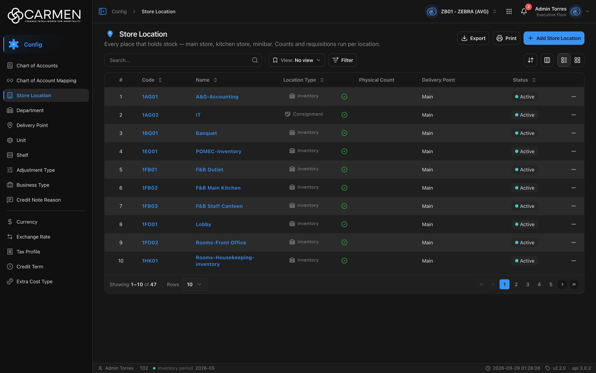

---
**Doc ID:** CB-PAGE-016
**Title:** Store Location List
**Domain:** All users
**Route:** /config/location
**Status:** Draft
**Created:** 2026-09-29
**Last Updated:** 2026-09-29
**Author:** Claude (จากโค้ด + ภาพหน้าจอจริง)
**Parent Flow:** N/A — master data CRUD ไม่มี workflow
---

## 8.16 Store Location

> หน้ารายการคลัง/จุดเก็บสินค้า (Store Location) ของ BU — ค้นหา กรองตามสถานะ/ประเภทคลัง/การตรวจนับ export และเปิดไปฟอร์ม CB-PAGE-017

---

### 8.16.1 Purpose

แสดงทุกจุดที่ถือสต็อก ("Every place that holds stock — main store, kitchen store, minibar. Counts and requisitions run per location.")
ใช้เพื่อค้นหา/เปิดดูคลัง เพิ่มคลังใหม่ ลบคลังจาก row action และ export Excel
ชื่อบน UI คือ **Store Location** (ชื่อเมนู `storeLocation`) แม้ route/โค้ดใช้คำว่า location — สร้างจาก `ConfigListTemplate`

---

### 8.16.2 Screen Overview

**Access Path:**
- Sidebar → **Config** → **Store Location**
- Direct URL: `/config/location`

**Permissions Required:**

| Role | Permission | Scope | Notes |
|------|-----------|-------|-------|
| ทุก role ที่เห็นเมนู | `configuration.location.view` | BU ปัจจุบัน | ผูกที่ leaf ใน `constant/module-list.ts` |
| ผู้เพิ่ม | `configuration.location.create` | BU | ไม่มีสิทธิ์ → ปุ่ม **Add Store Location** จาง กดแล้ว Permission Denied dialog |
| ผู้ลบ | `configuration.location.delete` | BU | ไม่มีสิทธิ์ → เมนู Delete ในแถวจาง กดแล้ว Permission Denied dialog |
| Admin (god mode) | — | All | bypass permission |
| License | `configuration.location` (คำนวณจาก permission) | BU | สัญญาหมดอายุ → Add disabled, Delete ในแถว disabled + tooltip "Disabled — your subscription is expired or inactive. Contact your administrator to renew." |

---

### 8.16.3 Screen Layout



```
[Breadcrumb: Config > Store Location]
─────────────────────────────────────────────────────────────────────────────────────
[📍] Store Location                                [Export] [Print] [+ Add Store Location]
Every place that holds stock — main store, kitchen store, minibar. ...
─────────────────────────────────────────────────────────────────────────────────────
[Search...   🔍] | [🔖 View: No view ▾] [Filter]           [⇅] [▥] [☰|▦]
─────────────────────────────────────────────────────────────────────────────────────
 ☐ | # | Code ⇕ | Name ⇕        | Location Type ⇕ | Physical Count | Delivery Point | Status ⇕ | ⋯
 ☐ | 1 | 1AG01  | A&G-Accounting| 🏢 Inventory     |      ✔         | Main           | ● Active | ⋯
 ☐ | 2 | 1AG02  | IT            | 🤝 Consignment   |      ✔         | Main           | ● Active | ⋯
 ...
─────────────────────────────────────────────────────────────────────────────────────
Showing 1–10 of 47 | Rows [10 ▾]                          [«] [‹] [1] 2 3 4 5 [›] [»]
```

> คอลัมน์ Created / Updated ซ่อนตั้งต้น; โหมด Grid/มือถือใช้การ์ด `LocationCard` (Code, Type, Physical Count Yes/No, Delivery Point, audit)

---

### 8.16.4 Header Information

| Field | Mandatory | Description | Business Logic / Remark |
|-------|-----------|-------------|--------------------------|
| Title | — | "Store Location" | `config.location.title` |
| Description | — | "Every place that holds stock — main store, kitchen store, minibar. Counts and requisitions run per location." | `config.location.desc` |
| Search | N | free text | ส่ง `search=` เมื่อกด Enter / คลิกไอคอน / ล้าง |
| View | N | Saved view (`pageKey = "location"`) | — |
| Filter → Status | N | Active / Inactive | `is_active|bool:true` / `is_active|bool:false` |
| Filter → Location Type | N | multi-select: Inventory / Direct / Consignment | ค่า `location_type|string:inventory` ฯลฯ — เลือกหลายค่าจะต่อกันด้วย `,` ในค่าเดียว (`MultiSelectFilter`); เลือกครบทุกตัว = ล้างค่า |
| Filter → Physical Count | N | multi-select: Yes / No | ค่า `physical_count_type|string:yes` / `...:no` |

**Read-only fields:** ทั้งหน้าเป็น list อ่านอย่างเดียว

---

### 8.16.5 Summary Information

N/A — ไม่มียอดสรุป

---

### 8.16.6 Detail / Grid Information

| Column | Mandatory | Description | Business Logic / Remark |
|--------|-----------|-------------|--------------------------|
| ☐ | — | เลือกแถว | ไม่มี bulk action |
| # | — | ลำดับ | ต่อเนื่องข้ามหน้า |
| Code | — | รหัสคลัง | Sortable; ลิงก์ไป CB-PAGE-017 |
| Name | — | ชื่อคลัง | Sortable; ลิงก์ไป CB-PAGE-017; ว่าง → "..." |
| Location Type | — | ประเภทคลัง | Sortable; ไอคอน + ข้อความ Inventory / Direct / Consignment (`LocationTypeLabel`) |
| Physical Count | — | ต้องตรวจนับหรือไม่ | **ไม่ sortable**; ✔ วงกลมเขียว = yes, ✕ วงกลมเทาจาง = no |
| Delivery Point | — | จุดรับของที่ผูก | **ไม่ sortable**; ไม่มี → "-" |
| Status | — | active/inactive | Sortable; ดู 8.16.8 |
| Created / Updated | — | audit | ซ่อนตั้งต้น; Sortable |
| ⋯ | — | เมนูแถว | Activity · Delete |

**Grid Actions:**

| Button | Description | Business Logic |
|--------|-------------|----------------|
| ⋯ → Activity | เปิด Activity sheet | label = code |
| ⋯ → Delete | ลบคลัง | เปิด CB-MODAL-014 — title "Delete Store Location", body `Are you sure you want to delete location "{name}"? This action cannot be undone.` |
| Column header | เรียง | asc ↔ desc, reset ไปหน้า 1 |

---

### 8.16.7 Action Buttons

| Button | Color / Type | Description | Business Logic / Validation |
|--------|-------------|-------------|------------------------------|
| Export | Secondary (White) | Excel เฉพาะแถวที่โหลดอยู่ | คอลัมน์ Code, Name, Location Type (ค่าดิบ เช่น `inventory`), Physical Count (`yes`/`no`), Delivery Point (อ่านจาก `delivery_point_name` — ดู edge case 8), Description, Status; ไม่มีข้อมูล → "No data to export" |
| Print | Secondary (White) | `window.print()` | — |
| + Add Store Location | Primary (Blue) | สร้างคลังใหม่ | → `/config/location/new` (CB-PAGE-017); สิทธิ์/ license ตาม 8.16.2 |
| Sort / Columns / List-Grid | Secondary icon | เครื่องมือตาราง | desktop เท่านั้น |

---

### 8.16.8 Document Status

| Status | Badge Colour | Description |
|--------|-------------|-------------|
| active | เขียว-teal ("● Active") | `is_active = true` |
| inactive | เทา ("● Inactive") | `is_active = false` |

**Status Transition Rules:**

| From Status | Action | To Status | Who Can Perform |
|-------------|--------|-----------|-----------------|
| active | ปิดสวิตช์ Active ใน CB-PAGE-017 → Save | inactive | ผู้มี `configuration.location.update` |
| inactive | เปิดสวิตช์ → Save | active | ผู้มี `configuration.location.update` |

---

### 8.16.9 Workflow History (if applicable)

N/A — ไม่มี workflow; ประวัติดูผ่าน ⋯ → Activity

---

### 8.16.10 Modals Triggered from This Page

| Modal ID | Modal Name | Trigger |
|----------|-----------|---------|
| CB-MODAL-014 | Delete Confirmation | ⋯ → **Delete** / ปุ่มลบบนการ์ด |
| (ยังไม่มีเอกสาร) | Activity sheet | ⋯ → **Activity** |
| (ยังไม่มีเอกสาร) | Filter sheet (ListFilter) | ปุ่ม **Filter** |
| (ยังไม่มีเอกสาร) | Save View dialog | Save ใน Filter sheet |
| (ยังไม่มีเอกสาร) | Permission Denied dialog | กด Add/Delete โดยไม่มีสิทธิ์ |

---

### 8.16.11 Navigation

| Action | Destination |
|--------|------------|
| คลิก Code / Name / เปิดการ์ด | → CB-PAGE-017 (Store Location Form) `/config/location/:id` โหมด View |
| + Add Store Location | → CB-PAGE-017 `/config/location/new` |
| ⋯ → Delete | → CB-MODAL-014; สำเร็จ → toast "Store Location deleted successfully" อยู่หน้าเดิม |
| Breadcrumb "Config" | → `/config` |

---

### 8.16.12 Pagination (for list screens)

- Rows per page: ตั้งต้น **10**; ตัวเลือก 5 / 10 / 25 / 50 / 100
- Navigation: First, Previous, เลขหน้า, Next, Last
- Default sort: ไม่กำหนด (ลำดับจาก backend — ภาพเรียงตาม code)
- โหมด Grid/มือถือ: infinite scroll

---

### 8.16.13 API Endpoints

| Method | Endpoint | Purpose |
|--------|----------|---------|
| GET | `/api/config/{bu_code}/locations` | โหลดรายการ (paginated) |
| DELETE | `/api/config/{bu_code}/locations/{id}` | ลบคลัง (CB-MODAL-014) |

**Query parameter syntax (for list endpoints):**
- ตัวอย่าง: `?page=1&perpage=10&sort=name:asc&search=kitchen&filter=is_active|bool:true;location_type|string:inventory`
- หลาย field ต่อด้วย `;` — multi-select หลายค่า: `location_type|string:inventory,location_type|string:direct`
- Physical count: `physical_count_type|string:yes`

---

### 8.16.14 Edge Cases & Error States

| # | Scenario | System Behaviour |
|---|----------|-----------------|
| 1 | Mandatory field left blank | N/A (ไม่มีฟอร์มในหน้านี้) — ดู CB-PAGE-017 |
| 2 | Session expired | 401 → refresh + retry; ไม่สำเร็จ → redirect `/login` |
| 3 | ไม่มีผลลัพธ์ | "No data found"; pagination ซ่อน |
| 4 | API error on load | `ErrorState` เต็มพื้นที่ + "Try again" |
| 5 | Concurrent edit/delete | ไม่มีการตรวจ stale บน list; ลบแถวที่ถูกลบไปแล้ว → toast error จาก backend; cache list 30 นาที |
| 6 | ไม่มีสิทธิ์ / license หมด | ปุ่มจาง + Permission Denied / disabled + tooltip |
| 7 | ลบคลังที่มีสต็อกหรือถูกอ้างอิง | ขึ้นกับ backend → toast กลาง, dialog ยังเปิดค้าง |
| 8 | Export คอลัมน์ Delivery Point | export อ่าน `r.delivery_point_name` ขณะที่ตารางอ่าน `r.delivery_point?.name` (`location-component.tsx:41` vs `use-location-table.tsx:110`) — ถ้า list response ไม่มีฟิลด์ flat นี้ คอลัมน์ใน Excel จะว่าง (ยังไม่ได้ตรวจ response จริง) |

---

### 8.16.15 Differences: Create vs. Edit Mode (if applicable)

N/A — ดู CB-PAGE-017 §8.17.15

---

### 8.16.16 Related Documents

| Doc ID | Title | Relationship |
|--------|-------|-------------|
| CB-PAGE-017 | Store Location Form | Navigated to from this page |
| CB-MODAL-014 | Delete Confirmation | Opened from this page |
| CB-PAGE-010 | Delivery Point | master ที่คลังอ้างอิง (คอลัมน์ Delivery Point) |
