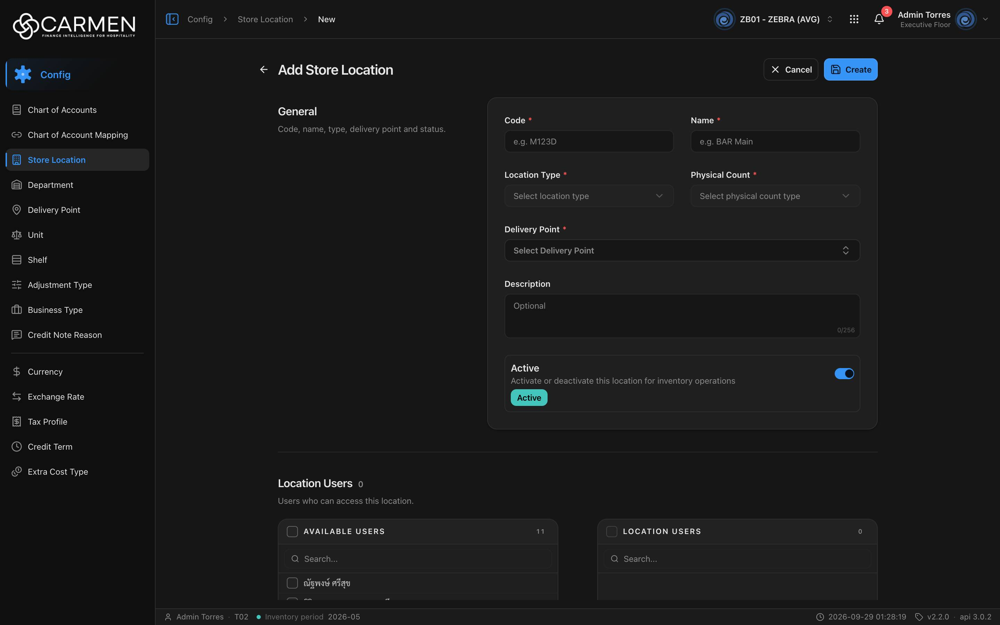

---
**Doc ID:** CB-PAGE-017
**Title:** Store Location Form
**Domain:** All users
**Route:** /config/location/new · /config/location/:id
**Status:** Draft
**Created:** 2026-09-29
**Last Updated:** 2026-09-29
**Author:** Claude (จากโค้ด + ภาพหน้าจอจริง)
**Parent Flow:** N/A — master data CRUD ไม่มี workflow
---

## 8.17 Store Location Form

> หน้าฟอร์มเต็มหน้าสำหรับสร้าง / ดู / แก้ไข / ลบคลังสินค้า พร้อมกำหนดผู้ใช้ที่เข้าถึงคลัง (Location Users) และสินค้าที่เก็บในคลัง (Products)

---

### 8.17.1 Purpose

ใช้สร้างหรือแก้ไขคลัง 3 ส่วน:
1. **General** — Code, Name, Location Type, Physical Count, Delivery Point, Description, Active
2. **Location Users** — ผู้ใช้ที่เข้าถึงคลังนี้ได้ (transfer list)
3. **Products** — สินค้าที่เก็บในคลังนี้ (tree ตามหมวดสินค้า)

ไฟล์หลัก: `routes/config/location/location-form.tsx`, `location-edit-content.tsx`, `location-new.route.tsx`, `location-edit.route.tsx`, schema `location-form-schema.ts`

---

### 8.17.2 Screen Overview

**Access Path:**
- From CB-PAGE-016 (Store Location List) → click **+ Add Store Location** → `/config/location/new`
- From CB-PAGE-016 → คลิก Code / Name → `/config/location/:id` (โหมด View)
- Direct URL: `/config/location/:id`

**Permissions Required:**

| Role | Permission | Scope | Notes |
|------|-----------|-------|-------|
| ผู้ดู | `configuration.location.view` | BU | เข้าหน้าได้ |
| ผู้สร้าง | `configuration.location.create` | BU | ปุ่ม Create — ไม่มีสิทธิ์ → จาง + Permission Denied |
| ผู้แก้ไข | `configuration.location.update` | BU | ปุ่ม Edit / Save |
| ผู้ลบ | `configuration.location.delete` | BU | ปุ่ม Delete |
| Admin (god mode) | — | All | bypass permission |
| License | `configuration.location` | BU | สัญญาหมดอายุ → Edit/Create/Save/Delete disabled + tooltip "Disabled — your subscription is expired or inactive. Contact your administrator to renew." |

---

### 8.17.3 Screen Layout



```
[Breadcrumb: Config > Store Location > New]
──────────────────────────────────────────────────────────────────────────
[←] Add Store Location                              [✕ Cancel] [💾 Create]   ← Create
[←] {Name} [{code}]                     [✎ Edit] [🗑 Delete] [⟲ Activity]  ← View
[←] Edit {Name} [{code}]  [✕ Cancel] [💾 Save] [🗑 Delete] [⟲ Activity]    ← Edit
──────────────────────────────────────────────────────────────────────────
General                        ┌───────────────────────────────────────────┐
Code, name, type, delivery     │ Code *               Name *               │
point and status.              │ [e.g. M123D]         [e.g. BAR Main]      │
                               │ Location Type *      Physical Count *     │
                               │ [Select location ▾]  [Select physical ▾]  │
                               │ Delivery Point *                          │
                               │ [Select Delivery Point            ⇕]      │
                               │ Description  [Optional          0/256]    │
                               │ ┌ Active                         (●──) ┐ │
                               │ │ Activate or deactivate this location │ │
                               │ │ for inventory operations  [Active]   │ │
                               └───────────────────────────────────────────┘
──────────────────────────────────────────────────────────────────────────
Location Users {n}   Users who can access this location.
  ┌ ☐ AVAILABLE USERS   11 ┐ [›] ┌ ☐ LOCATION USERS  0 ┐
  │ [Search...]            │ [‹] │ [Search...]         │
  │ ☐ ณัฐพงษ์ ศรีสุข ...    │     │                     │
  (View: # | Name | Email | Telephone)
──────────────────────────────────────────────────────────────────────────
Products {n}   Products stocked at this location.
  ┌ Product Catalog                               0/2595 ┐
  │ [🔍 Search by code or name...]                       │
  │ ☐ ▾ 📁 Category                                      │
  │     ☐ ▾ ▤ Sub category                               │
  │         ☐ ▾ ▢ Item group                             │
  │             ☐ Product                                │
  └──────────────────────────────────────────────────────┘
  (View: # | Code | Name | Local Name | Inventory Unit)
```

> ภาพ create แสดงถึงช่วง Location Users; section Products อยู่ถัดลงไป (ตัวนับ "0/2595" = เลือกแล้ว / สินค้าทั้งหมดของ BU)

---

### 8.17.4 Header Information

**Toolbar:** ← Go back · Title (Create: "Add Store Location"; View: ชื่อคลัง; Edit: "Edit {ชื่อคลัง}" — ฟอร์มนี้ไม่ส่ง `editTitle` จึงใช้รูปแบบ `form.editTitle`) · badge code (View/Edit)

**Section: General** — "Code, name, type, delivery point and status."

| Field | Mandatory | Description | Business Logic / Remark |
|-------|-----------|-------------|--------------------------|
| Code | Y | รหัสคลัง | Placeholder "e.g. M123D"; maxLength **10**; ว่าง → "Code is required" |
| Name | Y | ชื่อคลัง | Placeholder "e.g. BAR Main"; maxLength **100**; ว่าง → "Name is required" |
| Location Type | Y | ประเภทคลัง | Select: **Inventory / Direct / Consignment** (ค่า `inventory`/`direct`/`consignment`); placeholder "Select location type"; ไม่เลือก → "Location Type is required"; View แสดงไอคอน+ชื่อ |
| Physical Count | Y | ต้องตรวจนับหรือไม่ | Select: **Yes / No** (ค่า `yes`/`no`); placeholder "Select physical count type"; ไม่เลือก → "Physical Count is required" |
| Delivery Point | Y | จุดรับของ | Lookup combobox (ค้นหาได้, โหลดทีละ 30 แบบ lazy เมื่อเปิดครั้งแรก, **แสดงเฉพาะ delivery point ที่ active**); placeholder "Select Delivery Point"; ไม่เลือก → "Delivery Point is required"; เลือกแล้วเก็บทั้ง id และ name |
| Description | N | คำอธิบาย | Textarea; maxLength **256** + ตัวนับ |
| Active | N | สวิตช์ "Activate or deactivate this location for inventory operations" | Default: **เปิด** ในโหมด Create |

**Read-only fields:** โหมด View ทุกช่องเป็นข้อความ; ไม่มีช่อง read-only ถาวรในโหมด Edit (Code แก้ได้)

---

### 8.17.5 Summary Information

N/A — ไม่มียอดคำนวณ (มีตัวนับข้างหัว section และ "{selected}/{total}" ใน Product Catalog)

---

### 8.17.6 Detail / Grid Information

**Section: Location Users** — "Users who can access this location."

| Column | Mandatory | Description | Business Logic / Remark |
|--------|-----------|-------------|--------------------------|
| AVAILABLE USERS | N | ผู้ใช้ทั้งหมดของ BU | `GET /api/{bu}/users?perpage=-1` **ไม่กรอง** (ต่างจาก Department ที่กรองคนมีแผนกออก); ชื่อ = `firstname lastname` |
| LOCATION USERS | N | ผู้ใช้ที่ผูกกับคลัง | ย้ายด้วย › / ‹; payload `users: { add: [{id}], remove: [{id}] }` |

**Section: Products** — "Products stocked at this location."

| Column | Mandatory | Description | Business Logic / Remark |
|--------|-----------|-------------|--------------------------|
| Product Catalog (tree) | N | สินค้าทั้งหมดของ BU จัดกลุ่ม Category → Sub category → Item group → Product | `GET /api/config/{bu}/products?perpage=-1`; ทุกกลุ่มขยายไว้ตั้งต้น; checkbox กลุ่มเป็นแบบ tri-state (ติ๊กทั้งกลุ่ม / ไม่ติ๊ก / บางส่วน) |
| {selected}/{total} | — | ตัวนับมุมขวาบน | เช่น "0/2595" |
| Search | N | "Search by code or name..." | กรองในเครื่อง (real-time) และบังคับขยายทุกกลุ่มที่ match |
| Payload | — | diff เทียบกับชุดเดิมตอนโหลด | `products: { add: [{id}], remove: [{id}] }` |

ข้อความใน tree เป็นภาษาอังกฤษ hardcode (ไม่ผ่าน i18n): "Product Catalog", "Loading...", "No products match your search.", "No products available."

**โหมด View:**
- Location Users → `UserTable`: #, Name, Email (เติมจากรายชื่อผู้ใช้), Telephone + Search (ตัดแถวซ้ำด้วย id)
- Products → `ProductTable`: #, Code, Name, Local Name, Inventory Unit (Local Name/Inventory Unit เติมจากรายการสินค้าทั้งหมด) + Search

**Grid Actions:**

| Button | Description | Business Logic |
|--------|-------------|----------------|
| › / ‹ (Location Users) | ย้ายผู้ใช้ | บันทึกเป็น add/remove diff |
| ☐ หมวด / สินค้า (Products) | เลือก/เลิกเลือก | เลือกทั้งกลุ่มได้ในคลิกเดียว |
| ▾ (expand) | ยุบ/ขยายกลุ่ม | — |

---

### 8.17.7 Action Buttons

| Button | Color / Type | Description | Business Logic / Validation |
|--------|-------------|-------------|------------------------------|
| Create | Primary (Blue) | สร้างคลัง | validate 6 ช่องบังคับ; ผิด → inline error + scroll; ส่ง "Creating..."; สำเร็จ → toast "Store Location created successfully" → replace ไป `/config/location/{id}` โหมด View |
| Save | Primary (Blue) | บันทึก (Edit) | PATCH + `doc_version`; สำเร็จ → toast "Store Location updated successfully", `form.reset()` ค่าใหม่ (ล้าง diff users/products), กลับโหมด View และย้าย focus ไปที่ container |
| Cancel | Secondary (White) | ยกเลิก | dirty → Discard dialog; Create → list; Edit → คืนค่าเดิม (รวม users/products ผ่าน `onResetExtra`) → View |
| Edit | Secondary (White) | เข้าโหมดแก้ไข | URL ไม่เปลี่ยน |
| Delete | Secondary (White) | ลบคลัง | `DeleteDialog` (component เดียวกับ CB-MODAL-014) — "Delete Store Location" / `Are you sure you want to delete location "{name}"? This action cannot be undone.`; สำเร็จ → toast "Store Location deleted successfully" → list |
| Activity | Secondary (White) | Activity sheet | View/Edit; label = ชื่อคลัง |
| ← Go back | Link/icon | กลับ list | ถาม Discard ถ้า dirty |

---

### 8.17.8 Document Status

| Status | Badge Colour | Description |
|--------|-------------|-------------|
| active | เขียว-teal ("Active") | `is_active = true` |
| inactive | เทา ("Inactive") | `is_active = false` |

**Status Transition Rules:**

| From Status | Action | To Status | Who Can Perform |
|-------------|--------|-----------|-----------------|
| (ใหม่) | Create (สวิตช์เปิดตั้งต้น) | active | `.create` |
| active | Edit → ปิดสวิตช์ → Save | inactive | `.update` |
| inactive | Edit → เปิดสวิตช์ → Save | active | `.update` |

---

### 8.17.9 Workflow History (if applicable)

N/A — ไม่มี workflow; ประวัติดูผ่านปุ่ม Activity

---

### 8.17.10 Modals Triggered from This Page

| Modal ID | Modal Name | Trigger |
|----------|-----------|---------|
| CB-MODAL-014 | Delete Confirmation (component เดียวกัน, ถือ state ในฟอร์ม) | ปุ่ม **Delete** |
| (ยังไม่มีเอกสาร) | Discard changes dialog | Cancel / Back / ลิงก์นอกฟอร์ม / browser back ขณะ dirty |
| (ยังไม่มีเอกสาร) | Delivery Point lookup (popover combobox) | คลิกช่อง Delivery Point |
| (ยังไม่มีเอกสาร) | Activity sheet | ปุ่ม **Activity** |
| (ยังไม่มีเอกสาร) | Permission Denied dialog | กดปุ่มที่ไม่มีสิทธิ์ |

---

### 8.17.11 Navigation

| Action | Destination |
|--------|------------|
| Create (success) | → CB-PAGE-017 `/config/location/{new id}` โหมด View (replace) |
| Save (success) | → CB-PAGE-017 เดิม โหมด View |
| Delete (success) | → CB-PAGE-016 (Store Location List) |
| Cancel (Create) | → CB-PAGE-016 |
| Cancel (Edit) | → โหมด View หน้าเดิม |
| ← Back | → CB-PAGE-016 (list พร้อม filter/sort/page เดิม) |

---

### 8.17.12 Pagination (for list screens)

N/A — หน้าฟอร์ม (transfer / tree / ตาราง view แสดงในกรอบเลื่อน)

---

### 8.17.13 API Endpoints

| Method | Endpoint | Purpose |
|--------|----------|---------|
| GET | `/api/config/{bu_code}/locations/{id}` | โหลดคลัง (`user_location[]`, `product_location[]`, `delivery_point`) |
| GET | `/api/{bu_code}/users?perpage=-1` | รายชื่อผู้ใช้ทั้งหมด |
| GET | `/api/config/{bu_code}/products?perpage=-1` | สินค้าทั้งหมดสำหรับ tree + เติมข้อมูลตาราง view |
| GET | `/api/config/{bu_code}/delivery-points?page=n&perpage=30&search=...` | Lookup Delivery Point (กรอง active ฝั่ง client) |
| POST | `/api/config/{bu_code}/locations` | สร้าง — body `code, name, location_type, physical_count_type, description, is_active, delivery_point_id, delivery_point_name, users{add,remove}, products{add,remove}` |
| PATCH | `/api/config/{bu_code}/locations/{id}` | แก้ไข — body เดียวกัน + `doc_version` |
| DELETE | `/api/config/{bu_code}/locations/{id}` | ลบ |

> `delivery_point_id/name` ถูกใส่ใน payload เฉพาะเมื่อมีค่า (schema บังคับอยู่แล้วจึงมีเสมอเมื่อผ่าน validation)

---

### 8.17.14 Edge Cases & Error States

| # | Scenario | System Behaviour |
|---|----------|-----------------|
| 1 | ช่องบังคับว่าง | inline error "{Field} is required" ใต้ Code / Name / Location Type / Physical Count / Delivery Point; scroll ไปช่องแรกที่ผิด |
| 2 | Session expired | 401 → refresh + retry อัตโนมัติ; ล้มเหลว → `/login` ข้อมูลที่ยังไม่ save หาย |
| 3 | ไม่มีสินค้า / ค้นไม่เจอ | tree แสดง "No products available." / "No products match your search."; transfer ว่าง "No items"; view "No data" |
| 4 | โหลดคลังไม่ได้ / id ไม่มี | `ErrorState` ("Location not found" เมื่อ 404) + Try again + กลับ `/config/location`; ระหว่างโหลด `FormSkeleton` |
| 5 | Concurrent edit | PATCH ส่ง `doc_version` → คนอื่นแก้ก่อน = 409 → toast "Someone else changed this document. Refresh the page and try again." |
| 6 | ไม่มีสิทธิ์ / license หมด | ดู 8.17.2 |
| 7 | Delivery point ที่ผูกไว้ถูกปิดใช้งานภายหลัง | lookup กรองเฉพาะ active — ค่าเดิมยังแสดงจาก `defaultLabel` แต่เลือกใหม่ไม่ได้ |
| 8 | โหลดสินค้าจำนวนมาก | ดึงทั้งหมดครั้งเดียว (`perpage=-1`, ภาพจริง 2,595 รายการ) — ระหว่างโหลดแสดง "Loading..." |
| 9 | ย้ายผู้ใช้/เลือกสินค้าอย่างเดียวแล้วกด Cancel/Back | `transferHandler` และ `form.setValue("products", …)` ไม่ส่ง `shouldDirty` และไม่มี `extraDirty` → จากการอ่านโค้ดอาจไม่ถาม Discard (ยังไม่ได้ยืนยันบนจอจริง) |
| 10 | Double submit | Create/Save/Cancel disabled ระหว่าง pending |

---

### 8.17.15 Differences: Create vs. Edit Mode (if applicable)

| Behaviour | Create Mode (`/new`) | View Mode (`/:id`) | Edit Mode |
|-----------|------------|------------|------------|
| Title | "Add Store Location" | ชื่อคลัง + badge code | "Edit {ชื่อคลัง}" + badge code |
| Toolbar | Cancel · Create | Edit · Delete · Activity | Cancel · Save · Delete · Activity |
| General | ว่าง; Location Type / Physical Count ไม่มีค่า; Active = on | ข้อความ | input พร้อมค่าเดิม |
| Location Users | Transfer (ขวาว่าง) | UserTable | Transfer (ขวา = ผู้ใช้เดิม) |
| Products | Tree (0/{total}) | ProductTable | Tree ติ๊กสินค้าเดิมไว้ |
| doc_version | ไม่ส่ง | — | ส่ง (OCC) |
| After save | replace → `/:id` View | — | reset ฟอร์ม → View + focus |
| Unsaved guard | เปิดเมื่อ dirty | ปิด | เปิดเมื่อ dirty |

---

### 8.17.16 Related Documents

| Doc ID | Title | Relationship |
|--------|-------|-------------|
| CB-PAGE-016 | Store Location List | หน้าต้นทาง / ปลายทาง |
| CB-MODAL-014 | Delete Confirmation | Opened from this page |
| CB-PAGE-010 | Delivery Point | master ที่ใช้ในช่อง Delivery Point |
| CB-PAGE-015 | Department Form | ฟอร์ม pattern เดียวกัน |
