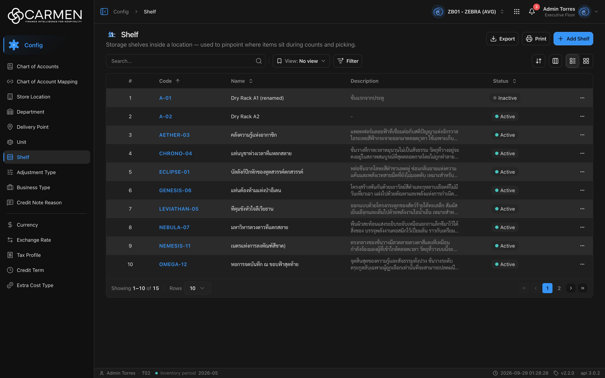

---
**Doc ID:** CB-PAGE-018
**Title:** Shelf List
**Domain:** All users
**Route:** /config/shelf
**Status:** Draft
**Created:** 2026-09-29
**Last Updated:** 2026-09-29
**Author:** Claude (จากโค้ด + ภาพหน้าจอจริง)
**Parent Flow:** N/A — master data CRUD ไม่มี workflow
---

## 8.18 Shelf

> หน้ารายการชั้นวางสินค้า (master data ทั้ง BU) — สร้าง/แก้ไขผ่าน dialog CB-MODAL-013 บนหน้าเดียวกัน ลบผ่าน CB-MODAL-014

---

### 8.18.1 Purpose

จัดการชั้นวาง ("Storage shelves inside a location — used to pinpoint where items sit during counts and picking.")
ตาม contract จริงของ backend (`types/shelf.ts`, 2026-08-20) shelf เป็นของกลางทั้ง BU **ไม่ผูกกับ location** แม้คำอธิบายหน้าจะพูดถึง location
ต่างจาก Department / Store Location ตรงที่ไม่มีหน้าฟอร์มแยก — Add และการแก้ไขเปิดเป็น dialog

---

### 8.18.2 Screen Overview

**Access Path:**
- Sidebar → **Config** → **Shelf**
- Direct URL: `/config/shelf`

**Permissions Required:**

| Role | Permission | Scope | Notes |
|------|-----------|-------|-------|
| ทุก role ที่เห็นเมนู | `configuration.location_shelf.view` | BU | leaf ใน `constant/module-list.ts` |
| ผู้เพิ่ม | ⚠ โค้ดเช็ค `configuration.shelf.create` | BU | `shelf-component.tsx:35` ส่ง `permissionPrefix="configuration.shelf"` แต่คีย์จริงใน `PERMISSIONS` คือ `configuration.location_shelf` → **คีย์ผี**: ผู้ใช้ non-admin จะถูกมองว่าไม่มีสิทธิ์ Add เสมอ (ปุ่มจาง + Permission Denied) |
| ผู้แก้ไข | ⚠ โค้ดเช็ค `configuration.shelf.update` | BU | เหตุเดียวกัน → dialog แก้ไขของ non-admin จะเปิดเป็น **readOnly** เสมอ (ปุ่ม Close แทน Cancel/Save) |
| ผู้ลบ | `configuration.location_shelf.delete` | BU | ตัวลบใช้ prefix ที่ derive จาก route (`useDeleteGate` — `useShelfTable` ไม่ได้ส่ง prefix ต่อ) จึงเช็คคีย์ถูกต้อง |
| Admin (god mode) | — | All | bypass ทั้งหมด จึงไม่เห็นปัญหาคีย์ผีข้างบน |
| License | `configuration.location_shelf` (ระบุ `licenseFeature` ตรง ๆ) | BU | สัญญาหมดอายุ → Add disabled, dialog แก้ไข readOnly, Delete disabled + tooltip |

---

### 8.18.3 Screen Layout



```
[Breadcrumb: Config > Shelf]
─────────────────────────────────────────────────────────────────────────────
[▤] Shelf                                            [Export] [Print] [+ Add Shelf]
Storage shelves inside a location — used to pinpoint where items sit ...
─────────────────────────────────────────────────────────────────────────────
[Search...   🔍] | [🔖 View: No view ▾] [Filter]              [⇅] [▥] [☰|▦]
─────────────────────────────────────────────────────────────────────────────
 ☐ | # | Code ↑   | Name                 | Description            | Status ⇕   | ⋯
 ☐ | 1 | A-01     | Dry Rack A1 (renamed)| ชั้นแรกจากประตู          | ● Inactive | ⋯
 ☐ | 2 | A-02     | Dry Rack A2          | -                      | ● Active   | ⋯
 ...
─────────────────────────────────────────────────────────────────────────────
Showing 1–10 of 15 | Rows [10 ▾]                                [«] [‹] [1] 2 [›] [»]
```

---

### 8.18.4 Header Information

| Field | Mandatory | Description | Business Logic / Remark |
|-------|-----------|-------------|--------------------------|
| Title | — | "Shelf" | `config.shelf.title` |
| Description | — | "Storage shelves inside a location — used to pinpoint where items sit during counts and picking." | `config.shelf.desc` |
| Search | N | free text | ส่ง `search=` เมื่อ Enter / คลิกไอคอน / ล้าง |
| View | N | Saved view (`pageKey = "shelf"`) | — |
| Filter → Status | N | Active / Inactive | `is_active|bool:true` / `is_active|bool:false` |

**Read-only fields:** list อ่านอย่างเดียว

---

### 8.18.5 Summary Information

N/A

---

### 8.18.6 Detail / Grid Information

| Column | Mandatory | Description | Business Logic / Remark |
|--------|-----------|-------------|--------------------------|
| ☐ | — | เลือกแถว | ไม่มี bulk action |
| # | — | ลำดับ | — |
| Code | — | รหัสชั้นวาง | Sortable (**default `code:asc`** — ลูกศร ↑ ในภาพ); เป็นลิงก์ เปิด CB-MODAL-013 โหมดแก้ไข |
| Name | — | ชื่อชั้นวาง | Sortable; **ไม่ใช่ลิงก์** (ต่างจากหน้าอื่นที่ Name คลิกได้) |
| Description | — | คำอธิบาย | ไม่ sortable; ตัดที่ 2 บรรทัดพร้อม "…", hover ดูข้อความเต็ม (title); ว่าง "-" |
| Status | — | active/inactive | Sortable |
| Created / Updated | — | audit | ซ่อนตั้งต้น; Sortable |
| ⋯ | — | เมนูแถว | มีแค่ **Delete** (ไม่มี Activity — shelf ยังไม่อยู่ใน activity-registry ของ backend) |

> `Sequence` (`sequence_no`) ไม่มีคอลัมน์ในตาราง — แก้ได้ใน dialog เท่านั้น

**Grid Actions:**

| Button | Description | Business Logic |
|--------|-------------|----------------|
| คลิก Code | แก้ไขชั้นวาง | เปิด CB-MODAL-013 พร้อมข้อมูลแถว (readOnly ถ้าไม่มีสิทธิ์/license หมด) |
| ⋯ → Delete | ลบ | เปิด CB-MODAL-014 — "Delete Shelf" / `Are you sure you want to delete shelf "{name}"? This action cannot be undone.` |

---

### 8.18.7 Action Buttons

| Button | Color / Type | Description | Business Logic / Validation |
|--------|-------------|-------------|------------------------------|
| Export | Secondary (White) | Excel แถวที่โหลดอยู่ | Code, Name, Description, Status; ว่าง → "No data to export" |
| Print | Secondary (White) | `window.print()` | — |
| + Add Shelf | Primary (Blue) | เปิด CB-MODAL-013 โหมด Add | ไม่ navigate; permission check ใช้คีย์ `configuration.shelf.create` (ดู 8.18.2) |
| Sort / Columns / List-Grid | Secondary icon | เครื่องมือตาราง | desktop |

---

### 8.18.8 Document Status

| Status | Badge Colour | Description |
|--------|-------------|-------------|
| active | เขียว-teal ("● Active") | `is_active = true` |
| inactive | เทา ("● Inactive") | `is_active = false` |

**Status Transition Rules:**

| From Status | Action | To Status | Who Can Perform |
|-------------|--------|-----------|-----------------|
| active | CB-MODAL-013 ปิดสวิตช์ Active → Save | inactive | ผู้มีสิทธิ์ update (ดูปัญหาคีย์ใน 8.18.2) |
| inactive | เปิดสวิตช์ → Save | active | เช่นเดียวกัน |

---

### 8.18.9 Workflow History (if applicable)

N/A — ไม่มี workflow และยังไม่เปิดเมนู Activity

---

### 8.18.10 Modals Triggered from This Page

| Modal ID | Modal Name | Trigger |
|----------|-----------|---------|
| CB-MODAL-013 | Shelf Dialog (Add / Edit) | ปุ่ม **+ Add Shelf** หรือคลิก Code / เปิดการ์ด |
| CB-MODAL-014 | Delete Confirmation | ⋯ → **Delete** / ปุ่มลบบนการ์ด |
| (ยังไม่มีเอกสาร) | Filter sheet (ListFilter) | ปุ่ม **Filter** |
| (ยังไม่มีเอกสาร) | Save View dialog | Save ใน Filter sheet |
| (ยังไม่มีเอกสาร) | Permission Denied dialog | กด Add/Delete โดยไม่มีสิทธิ์ |

---

### 8.18.11 Navigation

| Action | Destination |
|--------|------------|
| + Add Shelf | → เปิด CB-MODAL-013 (อยู่หน้าเดิม) |
| คลิก Code | → เปิด CB-MODAL-013 โหมด Edit |
| บันทึกใน dialog สำเร็จ | → dialog ปิด, อยู่ CB-PAGE-018, list refetch |
| ⋯ → Delete | → CB-MODAL-014; สำเร็จ → toast "Shelf deleted successfully" อยู่หน้าเดิม |
| Breadcrumb "Config" | → `/config` |

---

### 8.18.12 Pagination (for list screens)

- Rows per page: ตั้งต้น **10**; ตัวเลือก 5 / 10 / 25 / 50 / 100
- Navigation: First, Previous, เลขหน้า, Next, Last
- Default sort: **code, ascending** (`defaultSort="code:asc"`) — คลิกหัวคอลัมน์สลับ asc↔desc ได้ตลอด ไม่มีสถานะ "ไม่เรียง"
- โหมด Grid/มือถือ: infinite scroll

---

### 8.18.13 API Endpoints

| Method | Endpoint | Purpose |
|--------|----------|---------|
| GET | `/api/config/{bu_code}/shelves` | โหลดรายการ |
| POST | `/api/config/{bu_code}/shelves` | สร้าง (CB-MODAL-013) |
| PATCH | `/api/config/{bu_code}/shelves/{id}` | แก้ไข (CB-MODAL-013) + `doc_version` |
| DELETE | `/api/config/{bu_code}/shelves/{id}` | ลบ (CB-MODAL-014) |

**Query parameter syntax (for list endpoints):**
- ตัวอย่าง: `?page=1&perpage=10&sort=code:asc&search=rack&filter=is_active|bool:true`

> คอมเมนต์ใน `hooks/use-shelf.ts` และ `shelf-component.tsx` ยังเขียนว่า "backend ยังไม่มี /shelves — list จะ error" ซึ่ง **ล้าสมัย** — ภาพหน้าจอจริงวันที่ 2026-09-29 โหลดข้อมูลได้ 15 รายการ

---

### 8.18.14 Edge Cases & Error States

| # | Scenario | System Behaviour |
|---|----------|-----------------|
| 1 | Mandatory field left blank | อยู่ใน CB-MODAL-013 ("Code is required" / "Name is required") |
| 2 | Session expired | 401 → refresh + retry; ล้มเหลว → `/login` |
| 3 | ไม่มีผลลัพธ์ | "No data found"; pagination ซ่อน |
| 4 | API error on load | `ErrorState` + "Try again" |
| 5 | Concurrent edit | dialog ส่ง `doc_version` → 409 → toast "Someone else changed this document. Refresh the page and try again."; list เองไม่ตรวจ stale |
| 6 | ผู้ใช้ non-admin ที่มีสิทธิ์ shelf ครบ | จากโค้ด: Add ถูกปฏิเสธและ dialog แก้ไขเป็น readOnly เพราะเช็คคีย์ `configuration.shelf.*` ที่ไม่มีอยู่จริง ขณะที่ Delete ใช้งานได้ (คีย์ถูก) — ความไม่สอดคล้องนี้ admin มองไม่เห็น |
| 7 | License หมดอายุ | Add disabled, dialog readOnly, Delete disabled + tooltip |
| 8 | ลบชั้นวางที่ถูกใช้งาน | backend error → toast กลาง, dialog ค้าง |

---

### 8.18.15 Differences: Create vs. Edit Mode (if applicable)

N/A สำหรับตัวหน้า — ความต่าง Add/Edit อยู่ใน CB-MODAL-013

---

### 8.18.16 Related Documents

| Doc ID | Title | Relationship |
|--------|-------|-------------|
| CB-MODAL-013 | Shelf Dialog | Opened from this page (Add / คลิก Code) |
| CB-MODAL-014 | Delete Confirmation | Opened from this page (row Delete) |
| CB-PAGE-016 | Store Location List | เมนูข้างเคียง (shelf ไม่ผูกกับ location ใน contract ปัจจุบัน) |
